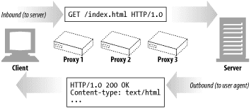

# 1부 HTTP: 웹의 기초

## 3장 HTTP 메시지

> 배울 것을 정리해보자
>
> - 메시지가 어떻게 흘러가는가
> - HTTP 메시지의 셉 부분(시작줄, 헤더, 개체 본문)
> - 요청과 응답 메시지의 차이
> - 요청 메시지가 지원하는 여러 기능들
> - 응답 메시지가 반환하는 여러 상태 코드들
> - 여러 HTTP 헤더들은 무슨 일을 하는가

### 3.1 메시지의 흐름

`인바운드`, `아웃바운드`, `업스트림`, `다운스트림`은 메시지 방향을 의미하는 용어다



1. 메시지는 원 서버 방향을 인바운드로 하여 송신된다
   - HTTP는 인바운드와 아웃바운드라는 용어를 트랜잭션 방향을 표현하기 위해 사용한다
   - 메시지가 원 서버로 향하는 것은 인바운드로 이동하는 것
   - 모든 처리가 끝난 뒤에 미시지가 사용자 에이전트로 돌아오는 것은 아웃바운드로 이동하는 것이다.
2. 다운스트림으로 하르는 메시지
   - HTTP메시지는 강물과 같이 흐른다
   - 모든 메시지는 다운스트림으로 흐른다
   - 메시지의 발송자는 수신자의 업스트림이다

### 3.2 메시지의 각 부분

> HTTP 메시지는 단순한, 데이터의 구조화된 블록이다
>
> 메시지는 `시작줄`, `헤더 블록`, `본문` 이렇게 세 부분으로 이루어진다.

- 시작줄
  - 어떤 메시지인지 서술
  - 그냥 줄 단위로 분리된 아스키 문자열이다
- 헤더 블록
  - 속성을 서술
  - 그냥 줄 단위로 분리된 아스키 문자열이다
- 본문
  - 데이터를 담고 있다
  - 아예 없을 수도 있다
  - 텍스트나 이진 데이터를 포함할 수도 있고 그냥 비어있을 수도 있다.

1. 메시지 문법

   - 모든 HTTP 메시지는 요청 메시지나 응답 메시지로 분류도니다
   - 요청 메시지는 웹 서버에 어떤 동작을 요구한다
   - 응답 메시지는 요청의 결과를 클라이언트에게 돌려준다
   - 요청 메시지의 형식

     ```
       <메서드> <요청 URL> <버전>
       <헤더>

       <엔티티 본문>
     ```

   - 응답 메시지의 형식

     ```
       <버전> <상태 코드> <시우 그잘>
       <헤더>

       <엔티티 본문>
     ```

   - 메서드
     - 클라이언트 측에서 서버가 리소스에 대해 수행해주길 바라는 동작
     - `GET`, `HEAD`, `POST`와 같이 한단어로 되어 있다
   - 요청 URL
     - 요청 대상이 되는 리소스를 지칭하는 완전한 URL 혹은 URL의 경로 구성요소다.
     - 완전한 URL이 아닌 URL의 경로 구성요소라고 해도, 클라이언트가 서버와 직접 대화하고 있고 경로 구성요소가 리소스를 가리키는 절대 경로이기만 하면 대체로 문제가 없다
   - 버전
     - 이 메시지에서 사용 중인 HTTP의 버전이다.
     - 형식은 `HTTP/<메이저>.<마이너>`의 형태이다
     - 메이저, 마이너 모두 정수아디
   - 상태코드
     - 요청 중에 무엇이 일어났는지 설명하는 세 자리의 숫자
   - 사유 구절
     - 숫자로 된 상태 코드의 의미를 사람이 이해할 수 있게 설명해주는 짧은 문구로, 상태 코드 이후부터 줄바꿈 문자열까지가 사유 구절이다
   - 헤더들
     - 이름, 콜론, 선택적인 공백, 값, CRLF가 순서대로 나타나는 0개 이상의 헤더들
     - 이 헤더의 목록은 빈 줄로 끝나 헤더 목록의 끝과 엔터티 본문의 시작을 표시한다
   - 엔티티 본문
     - 임의의 데이터 블록을 포함
     - 모든 메시지가 엔티티 본문을 갖는 것은 안다

2. 시작줄

   - 모든 HTTP 메시지는 시작줄로 시작한다.
   - 요청 메시지의 시작줄은 무엇을 해야 하는지 말해준다.
   - 응답 메시지의 시작줄은 무슨 일이 일어났는지 말해준다.
   - 요청줄
     - 요청 메시지는 서버에게 리소스에 대해 무언가를 해달라고 부탁한다.
     - 어떤 동작이 일어나야 하는지 설명해주는 `메서드` + 동작에 대한 대상일 지칭하는 `요청 URL` + `HTTP 버전`
     - 모든 필드는 공백으로 구분
   - 응답줄
     - 응답 메시지는 수행 결과에 대한 `상태 정보` + `결과 데이터` => 클라이언트에게 전달
     - `HTTP의 버전` + 숫자로 된 `상태 코드` + 수행 상태에 대해 설명해주는 텍스트로 된 `사유 구절`
     - 모든 필드는 공백으로 구분
   - 메서드
     - GET: 서버에서 어떤 문서를 가져온다
     - HEAD: 서버에서 어떤 문서에 대해 헤더만 가져온다
     - POST: 서버가 처리해야 할 데이터를 보낸다
     - PUT: 서버에 요청 메시지의 본문을 저장한다
     - TRACE: 메시지가 프락시를 거쳐 서버에 도달하는 과정을 추적한다
     - OPTIONS: 서버가 어떤 메서드를 수행할 수 있는지 확인한다
     - DELETE: 서버에서 문서를 제거한다
     - 추가적인 커스텀한 메서드도 가능하다
   - 상태 코드
     - 100~199: 정보
     - 200~299: 성공
     - 300~399: 리다이렉션
     - 400~499: 클라이언트 에러
     - 500~599: 서버 에러
   - 사유 구절
     - 응답 시작줄의 마지막 구성요소
     - 상태 코드에 대한 글로 된 설명
   - 버전 번호
     - HTTP의 버전을 말해줌

3. 헤더

   - 시작줄 다음에는 0개 이상의 HTTP 헤더가 온다
   - 일반 헤더: 요청과 응답 양쪽에 모두 나타날 수 있음
   - 요청 헤더: 요청에 대한 부가 정보를 제공
   - 응답 헤더: 응답에 대한 부가 정보를 제공
   - Entity 헤더: 본문 크기와 콘텐츠, 혹은 리소스 그 자체를 서술
   - 확장 헤더: 명세에 정의되지 않은 새로운 헤더

4. 엔터티 본문
   - 세 번째 부분인 선택적인 엔터티 본문
   - 메시지의 화물
   - 디지털 데이터를 실어 나를 수 있다

### 3.3 메서드

- 메서드는 대부분 제한적으로 사용된다.
- 모든 메서드를 구현하지 않았어도 그럴 것이다

1. 안전한 메서드
   - GET, HEAD 메서드를 사용하는 요청으로 서버에 어떤 작용도 없음
     - 작용이 없다는 것은 HTTP요청의 결과로 인해 서버에서 일어나는 일은 아무것도 의미가 없다는 뜻
   - 안전한 메서드가 서버에 작용을 유발하지 않는다는 보장은 없다
     - 개발자에게 달렸다
2. GET
   - 가장 흔히 쓰이는 메서듯버ㅓ에게 리소스를 달라고 요청하기 위해 쓰임
   -
   ```HTTP
    GET /seasonal/index-fall.html HTTP/1.1
    Host: www.joes-hardware.com
    Accept: *
   ```
3. HEAD
   - GET처럼 행동하지만, 서버는 응답으로 헤더만을 돌려준다
   - 엔터티 본문은 결코 반환하지 않는다
   - 리소스를 가져오지 않고도 그에 대해 무엇인가를 알아낼 수 있다.
   - 응답의 상태코드를 통해, 개체가 존재하는지 확인할 수 있다.
   - 헤더를 확인하여 리소스가 변경되었는지 검사할 수 있다.
   -
   ```HTTP
    HEAD /seasonal/index-fall.html HTTP/1.1
    Host: www.joes-hardware.com
    Accept: *
   ```
4. PUT

   - PUT 메서드는 서버에 문서를 쓴다
   - 어떤 발행 시스템은 사용자가 PUT을 이용해 웹페이지를 만들고 웹 서버에 직접 게시할 수 있도록 해준다
   - PUT 메서드의 의미는, 서버가 요청의 본문을 가지고 요청 URL의 이름대로 새 문서를 만들거나, 이미 URL이 존재한다면 본문을 사용해서 교체하는 것이다
   - PUT은 콘텐츠를 변경할 수 있게 해주기 때문에, 많은 웹서버가 PUT을 수행하기 전에 사용자에게 비밀번호를 입력해서 로그인을 하도록 요구한다
   -

   ```HTTP
    PUT /seasonal/index-fall.html HTTP/1.1
    Host: www.joes-hardware.com
    Content-type: text/plain
    Content-length: 34

    Updated product list coming soon!
   ```

5. POST

   - 서버에 입력 데이터를 전송하기 위해 설계됨
   - 채워진 폼에 담긴 데이터는 서버로 전송되며, 서버는 이를 모아서 필요로 하는 곳에 보낸다
   -

   ```HTTP
    POST /seasonal/index-fall.html HTTP/1.1
    Host: www.joes-hardware.com
    Content-type: text/plain
    Content-length: 34

    item=bandsaw 2647
   ```

6. TRACE
   - 목적지 서버에서 루프백 진단을 시작한다
   - 요청 전송의 마지막 단계에 있는 서버는 자신이 받은 요청 메시지를 본문에 넣어 TRACE응답을 되돌려준다.
   - 클라이언트는 자신과 목적지 서버 사이에 있는 모든 HTTP 애플리케이션의 요청/응답 연쇄를 따라가면서 자신이 보낸 메시지가 망가졌거나 수정되었는지, 만약 그렇다면 어떻게 변경되었는지 확인할 수 있다
   - 어떠한 엔터티 본문도 보낼 수 없다
   -
   ```HTTP
    TRACE /seasonal/index-fall.html HTTP/1.1
    Host: www.joes-hardware.com
    Accept: *
   ```
7. OPTIONS
   - 서버에게 특정 리소스에 대해 어떤 메서드가 지원되는지 물어볼 수 있다.
   -
   ```HTTP
    OPTIONS * HTTP/1.1
    Host: www.joes-hardware.com
    Accept: *
   ```
8. DELETE
   - 서버에게 요청 URL로 지정한 리소스를 삭제할 것을 요청한다
   - 삭제가 수행되는 것을 보장하지 못한다
   - 서버가 클라이언트에게 알리지 않고 요청을 무시하는 것도 허용이 된다
   -
   ```HTTP
    DELETE /seasonal/index-fall.html HTTP/1.1
    Host: www.joes-hardware.com
   ```
9. 확장 메서드
   - HTTP는 필요에 따라 확장해도 문제가 없도록 설계되어 있으므로, 새로 기능을 추가해도 과거에 구현된 소프트웨어들의 오동작을 유발하지 않는다
   - 확장 메서드는 명세에 정의되지 않은 메서드다

### 3.4 상태 코드

1. 100-199
   - 정보성 상태 코드
   - HTTP/1.1에서 도입
   - 비교적 새로운 것, 복잡함을 감수할 만한 가치가 있는지에 대해 논란
   - 100-continue
     - 클라이언트 입장
       - expect헤더가 없어야 한다
       - 클라이언트가 엔터티를 보낼 것이라고 생각하게 만들어 서버를 혼란에 빠뜨릴 뿐이다
       - 최적화를 위한 것
       - 서버가 다루거나 사용할 수 없는 큰 엔터티를 서버에게 보내지 않으려는 목적으로만 사용
       - 가만히 기다리기만 해서는 안된다
       - 약간의 타임아웃 후에 클라이언트는 그냥 엔터티를 보내야한다
     - 서버 입장
       - expect 헤더가 포함된 요청을 받는다면 100continue 혹은 에러로 답해줘야 함
     - 프락시
       - 프락시가 다음 홉 서버들에 대한 상태 몇가지와 그들이 지원하는 HTTP 버전을 기억해둔다면 100 continue 응답을 기대한 요청을 더 잘 다룰 수 있다
   - 101 switching protocols
     - 클라이언트가 upgrade 헤더에 나열한 것 중 하나로 서버가 프로토콜을 바꾸었음을 의미한다
2. 200-299
   - 성공 상태 코드
   - 200
     - OK
     - 요청은 정상이고, 엔터티 본문은 요청된 리소스를 포함하고 있다
   - 201
     - Created
     - 서버 개체를 생성하라는 요청을 위한 것
     - 생성된 리소스에 대한 최대한 구체적인 참조가 담긴 Location 헤더와 함께, 그 리소스를 참조할 수 있는 여러 URL을 엔터티 본문에 포함해야 한다
   - 202
     - Accepted
     - 요청은 받아들여졌으나 서버는 아직 그에 대한 어떤 동작도 수행하지 ㅇ낳았다
     - 서버가 요청의 처리를 완료할 것인지에 대한 보장은 `없다`
   - 203
     - Non-Authoritative Information
     - 엔터티 헤더에 들어있는 정보가 원래 서버가 아닌 리소스의 사본에서 왔다
     - 중개자가 리소스의 사본을 갖고 있었지만 로시스에 대한 메타 정보를 검증하지 못한 경우 이런 일이 발생할 수 있다
     - 리소스에 대한 메타 정보를 검증하지 못한 경우 이런일이 발생할 수 있다
     - 필수적이진 않음
   - 204
     - No Content
     - 응답 메시지는 헤더와 상태줄을 포함하지만 엔터티 본문은 포함하지 않는다
     - 주로 웹르라우저를 새 문서로 이동시키지 않고 갱신하고자 할 때 사용
   - 205
     - Reset Content
     - 주로 브라우저를 위해 사용되는 또 하나의 ~~가족~~ 코드.
     - 브라우저에게 현재 페이지에 있는 HTML 폼에 채워진 모든 값을 비우라고 말한다
   - 206
     - Partial Content
     - 부분 혹은 범위 요청이 성공했다
3. 300-399
   - 리다이렉션 상태 코드
   - 클라이언트가 관심있어 하는 리소스에 대해 다른 위치를 사용하라고 말해주거나 그 리소스의 내용 대신 다른 대안 응답을 제공한다
   - 만약 리소스가 옮겨졌다면, 클라이언트에게 리소스가 옮겨졌으며 어디서 찾을 수 있는지 알려주기 위해 리다이렉션 상태 코드와 Location 헤더를 보낼 수 있다
   - 300
     - Multiple Choices
     - 클라이언트가 동시에 여러 리소스를 가리키는 URL을 요청한 경우, 그 리소스의 목록과 함께 반환
     - 사용자는 목록에서 원하는 하나를 선택할 수 있다
   - 301
     - Moved Permanently
     - 요청한 URL이 옮겨졌을 때 사용한다.
     - 응답은 Location 헤더에 현재 리소스가 존재하고 있는 URL을 포함해야 한다
   - 302
     - Found
     - 301과 같음
     - 그러나 클라이언트는 Location 헤더로 주어진 URL을 리소스를 임시로 가리키기 위한 목적으로 사용해야 한다
   - 303
     - See Other
     - 클라이언트에게 리소스를 다른 URL에서 가져와야 한다고 말해주고자 할 떄 쓰인다
     - 새 URL은 응답 메시지의 Location 헤더에 들어있다
     - 이 상태 코드의 주 목적은 POST 요청에 대한 응답으로 클라이언트에게 리소스의 위치를 알려주는 것
   - 304
     - Not Modified
     - 클라이언트는 헤더를 이용해 조건부 요청을 만들 수 있다
   - 305
     - Use Proxy
     - 리소스가 반드시 프락시를 통해서 접근되어야 함을 나타내기 위해 사용한다
     - 프락시의 위치는 Location 헤더를 통해 주어진다.
     - 클라이언트는 이 응답을 통해 리소스에 대한 것이라고만 해석한다
   - 306 사용안함
   - 307
     - Temporary Redirect
     - 301과 비슷
     - Location 헤더로 주어진 URL을 리소스를 ㅇ미시로 가리키기 위한 목적으로 사용해야 한다
4. 400-499
   - 클라이언트 에러 상태 코드
   - 400
     - Bad Request
     - 클라이언트가 잘못된 요청을 보냈다고 말해준다
   - 401
     - Unauthorized
     - 리소스를 얻기 전에 클라이언트에게 스스로를 인증하라고 요구하는 내용
   - 402
     - Payment Required
     - 현재 쓰이지 않는 코드
     - 미래에 사용될 가능성을 위해 준비해둠
   - 403
     - Forbidden
     - 요청이 서버에 의해 거부되었음
     - 서버는 이유를 설명하는 엔터티 본문을 포함할 수 있다
     - 그런데 이유를 보통 숨기고 싶을 떄 사용
   - 404
     - Not Found
     - 못찾음
   - 405
     - Method Not Allowed
     - url에 method는 사용하지 않는다고 알려줌
   - 406
     - Not Acceptable
     - 클라이언트가 받아들일 수 있는 것이 없는 경우
   - 407
     - Proxy Authentication Required
     - 401 과 같음
     - 리소스에 대해 인증을 요구하는 프락시 서버를 위해 사용
   - 408
     - Request Timeout
     - 클라이언트의 요청을 완수하기에 시간이 너무 많이 걸림
   - 409
     - Conflict
     - 요청이 리소스에 대해 일으킬 수 있는 몇몇 충돌을 지칭하기 위해 사용
   - 410
     - Gone
     - 404와 비슷
     - 서버가 한때 그 리소스를 갖고 있었지만 제거됨
   - 411부터는 뭐 그냥 알아두기만 해도 될 듯
5. 500-599
   - 서버 에러 상태 코드
   - 500
     - Internal Server Error
     - 서버가 요청을 처리할 수 없게 만드는 에러를 만났을 때 사용
   - 501
     - Not Implemented
     - 클라이언트가 서버의 능력을 넘은 요청을 했을 때 사용
     - 서버가 지원하지 않는 메서드를 사용했을 떄가 대표적인 예
   - 502
     - Bad Gateway
     - 프락시나 게이트웨이처럼 행동하는 서버가 그 요청 응답 연쇄에 있는 다음 링크로부터 가짜 응답에 맞닥뜨렸을 때 사용한다
   - 503
     - Service Unavailable
     - 현재는 서버가 요청을 처리해 줄 수 없지만 나중에는 가능함을 의미
   - 504
     - Gateway Timeout
     - 408과 비슷
     - 다른 서버에게 요청을 보내고 응답을 기다리다 타임아웃이 발생한 게이트웨이나 프락시에서 온 응답
   - 505
     - HTTP Version Not Supported
     - 서버가 지원할 수 없거나 지원하지 않으려고 하는 버전의 프로토콜로 된 요청을 받았을 때 사용

### 3.5 헤더

> 헤더와 메서드는 클라이언트와 서버가 무엇을 하는지 결정하기 위해 함께 사용된다
>
> 헤더에는 특정 종류의 메시지에만 사용할 수 있는 헤더와, 더 일반 목적으로 사용할 수 있는 헤더, 그리고 응답과 요청 메시지 양쪽 모두에서 정보를 제공하는 헤더가 있다. 크게 5가지로 분류

1. 일반 헤더
   - 일반 헤더는 클라이언트와 서버 양쪽 모두가 사용
   - 어딘가에 메시지를 보내는 다른 애플리케이션들을 위해 다양한 목적으로 사용된다
     - 예를 들어 `Date: Tue, 3 Oct 1974 02:16:00 GMT`
   - 일반 캐시 헤더
     - HTTP/1.0은 매번 원 서버로부터 객체를 가져오는 대신 로컬 복사본으로 캐시할 수 있도록 해주는 최초의 헤더를 도입
2. 요청 헤더
   - 요청 메시지를 위한 헤더로
   - 서버에게 클라이언트가 받고자 하는 데이터의 타입이 무엇인지와 같은 부가 정보를 제공한다
   - 예를 들어 `Accept: */*`
   - Accept 관련 헤더
     - 클라이언트는 Accept관련 헤더들을 이용해 서버에게 자신의 선호와 능력을 알려줄 수 있다
     - 클라이언트가 무엇을 원하고 무엇을 할 수 있는지, 그리고 무엇보다도 원치 않는 것은 무엇인지 알려줄 수 있다
   - 조건부 요청 헤더
     - 때때로, 클라이언트는 요청에 몇ㅁ쳐 제약을 넣기도 한다
     - 조건부 요청 헤더를 사용하면, 클라이언트는 서버에게 요청에 응답하기 전에 먼저 조건이 참인지 확인하게 하는 제약을 포함시킬 수 있다
   - 요청 보안 헤더
     - HTTP는 자체적으로 요청을 위한 간단한 인증요구/응답 체계를 갖고 있다
     - 클라이언트가 어느 정도의 리소스에 접근하기 전에 자신을 인증하게 함으로써 트랜잭션을 약간 더 안전하게 만들고자 한다
   - 프락시 요청 헤더
     - 인터넷에서 프락시가 점점 흔해지면서, 그들의 기능을 돕기 위해 몇몇 헤더들이 정의되어 왔다
3. 응답 헤더
   - 응답 메시지는 클라이언트에게 정보를 제공하기 위한 자신만의 헤더를 갖고 있다
   - 예시
     - server 헤더는 클라이언트에게 Tiki-Hut 서버 1.9 버전과 대화하고 있음을 말해준다
     - `Server: Tiki-Hut/1.0`
   - 협상 헤더
     - 서버에 프랑스어와 독일어올 번역된 HTML문서가 있는 경우와 같이 여러 가지 표현이 가능한 상황이라면, HTTP/1.1은 서버와 클라이언트가 어떤 표현을 택할 것인가에 대한 협상을 할 수 있도록 지원한다
   - 응답 보안 헤더
     - 인증 요구와 관련되어 있다
4. 엔터티 헤더
   - 엔터티 본문에 대한 헤더를 말한다
   - 엔터티 헤더는 엔터티와 그것의 내용물에 대한, 개체의 타입부터 시작해서 주어진 리소스에 대해 요청할 수 있는 유효한 메서드들까지, 광범위한 정보를 제공한다
   - 콘텐츠 헤더
     - 엔터티의 콘텐츠에 대한 구체적인 정보를 제공한다
     - 콘텐츠의 종류, 크기, 기타 콘텐츠를 처리할 때 유용하게 활용될 수 있는 것들이다
   - 엔터티 캐싱 헤더
     - 일반 캐싱 헤더는 언제 어떻게 캐시가 되어야 하는지에 대한 지시자를 제공
     - 엔터티 캐싱 헤더는 엔터티 캐싱에 대한 정보를 제공
5. 확장 헤더
   - 확장 헤더는 애플리케이션 개발자들에 의해 만들어졌지만 아직 승인된 HTTP 명세서에는 추가되지 않은 비표준 헤더
