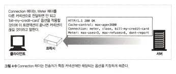
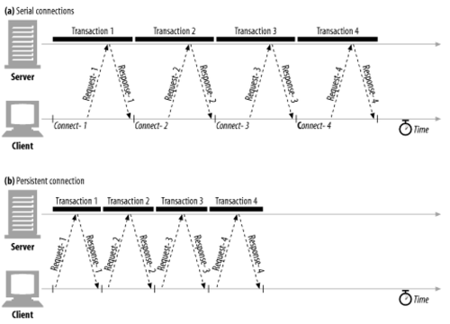
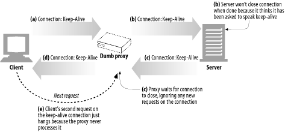
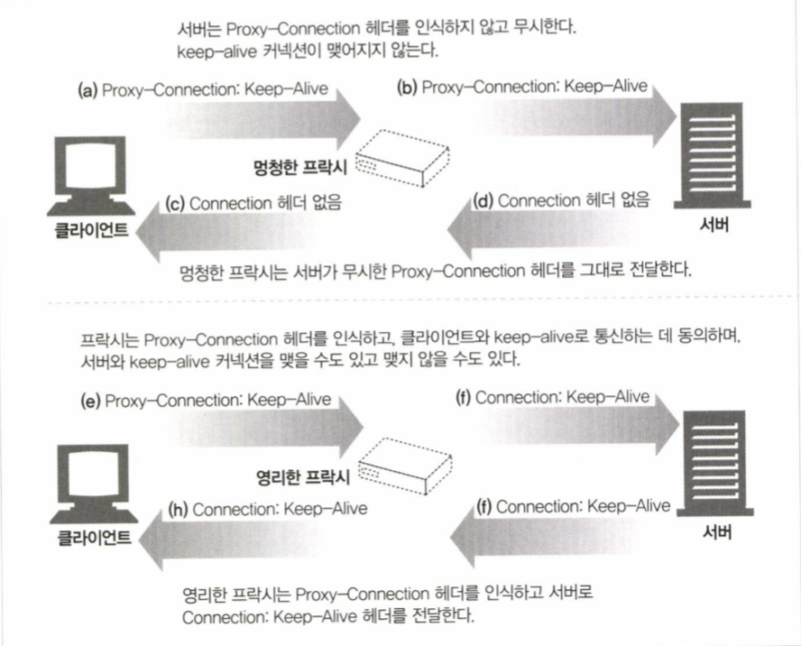
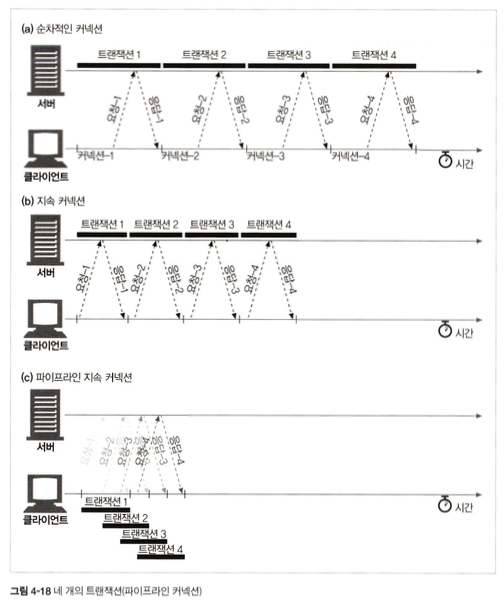

# 1부 HTTP: 웹의 기초

## 4장 커넥션 관리

> HTTP 명세는 HTTP 메시지에 대해서 자세히 설명하고 있지만, HTTP 커넥션과 HTTP 메시지의 흐름에 대한 내용은 충분히 다루지 않고 있따.
>
> HTTP 애플리케이션을 개발하고 있다면 HTTP 커넥션과 그것이 어떻게 사용되는지에 대해 잘 이해하고 있어야 한다.
>
> - HTTP는 어떻게 TCP 커넥션을 사용하는가
> - TCP 커넥션의 지연, 병목, 막힘
> - 병렬 커넥션, keep-alive 커넥션, 커넥션 파이프라인을 활용한 HTTP의 최적화
> - 커넥션 고나리를 위해 따라야 할 규칙들

### 4.1 TCP 커넥션

전 세계 모든 HTTP 통신은, 지구상의 컴퓨터와 네트워크 장비에서 널리 쓰이고 있는 패킷 교환 네트워크 프로토콜들의 계층화된 집합인 TCP/IP 커넥션을 맺을 수 있다. 일단 커넥션이 맺어지면 클라이언트와 서버 컴퓨터 간에 주고받는 메시지들ㅇ느 손실 혹은 손상되거나 순서가 바뀌지 않고 안전하게 전달된다

- URL을 입력받은 브라우저의 행동 단계
  1. 브라우저가 `www.joes-hardware.com`라는 호스트 명을 추출한다
  2. 브라우저가 이 호스트 명에 대한 ip주소를 찾는다
  3. 브라우저가 포트 번호를 얻는다
  4. 브라우저가 ip주소와 포트번호로 TCP 커넥션을 생성
  5. 브라우저가 서버로 HTTP GET 요청 메시지를 보낸다
  6. 브라우저가 서버에서 온 HTTP 응답 메시지를 읽는다
  7. 브라우저가 커넥션을 끊는다

1. 신뢰할 수 있는 데이터 전송 통로인 TCP
   - HTTP 커넥션은 몇몇 사용 규칙을 제외하고는 TCP 커넥션에 불과하다
   - TCP 커넥션은 인터넷을 안정적으로 연결해준다
   - 신속 정확하게 데이터를 보내고자 한다면 TCP의 기초적인 내용을 알아야 한다
   - TCP는 HTTP에게 신뢰할 만한 통신 방식을 제공한다.
   - TCP 커넥션의 한쪽에 있는 바이트들은 반대쪽으로 순서에 맞게 정확히 전달된다.
2. TCP 스트림은 세그먼트로 나뉘어 UP 패킷을 통해 전송된다
   - TCP는 IP 패킷이라고 불리는 작은 조각을 통해 데이터를 전송한다
   - HTTP는 `IP, TCP, HTTP`로 구성된 **프로토콜 스택**에서 최상위 계층이다
   - HTTP에 보안 기능을 더한 HTTPS는 TSL혹은 SSL이라 불리기도 하며 HTTP와 TCP사이에 있는 암호화 계층이다
   - HTTP가 메시지를 전송하고자 할 경우, 현재 연결되어 있는 TCP 커넥션을 통해서 메시지 데이터의 내용을 순서대로 보낸다.
   - TCP는 세그먼트라는 단위로 데이터 스트림을 잘게 나누고, 세그먼트를 IP 패킷라고 불리는 봉투에 담아서 인터넷을 통해 데이터를 전달한다.
   - 각 TCP 세그먼트는 하나의 IP 주소에서 다른 IP 주소로 IP 패킷에 담겨 전달된다.
   - IP 패킷이 가진 것
     - IP 패킷 헤더
     - TCP 세그먼트 헤더
     - TCP 데이터 조각
3. TCP 커넥션 유지하기
   - TCP는 포트 번호를 통해서 여러 개의 커넥션을 유지한다.
   - IP 주소는 해당 컴퓨터에 연결, 포트 번호는 해당 애플리케이션으로 연결
   - TCP는 네 가지 값으로 식별한다
     - `<발산지 IP 주소, 발신지 포트, 수신지 IP 주소, 수신지 포트>`
     - 이 네가지 값으로 유일한 커넥션을 생성한다
4. TCP 소켓 프로그래밍
   - 운영 체제는 TCP 커넥션의 생성과 관련된 여러 기능을 제공한다
   - 소켓 API는 HTTP 프로그래머에게 TCP와 IP의 세부사항ㄷ르을 숨긴다
   - 소켓 API는 유닉스 운영체제용으로 먼저 갭라되었지만, 지금은 소켓 API의 다양한 구현체들 덕분에 대부분의 운영체제와 프로그램 언어에서 이를 사용할 수 있게 되었다
   - 소켓 API를 사용하면, TCP 종단 데이터 구조를 생성하고 원격 서버의 TCP 종단에 그 종단 데이터 구조를 연결하여 데이터 스트림을 읽고 쓸 수 있다.

### 4.2 TCP의 성능에 대한 고려

> TCP 커넥션의 성능에 관련된 주요 고려사항을 집중적으로 다룬다

1. HTTP 트랜잭션 지연
   - 트랜잭션을 처리하는 시간은 TCP 커넥션을 설정하고, 요청을 전송하고, 응답 메시지를 보내는 것에 비해 상당히 짧다는 것을 알 수 있다.
   - HTTP 트랜잭션을 지연시키는 원인은 여러 가지가 있다
     1. 클라이언트가 URI 조회시
        - URI에서 웹서버의 IP 주소와 포트 번호를 알아내야 함
        - 만약 URI에 기술되어 있는 호스트에 방문한 적이 최근에 없다면
        - DNS 이름 분석 인프라를 사용하여 URI에 있는 호스트 명을 IP 주소로 변환하는데 수십 초의 시간이 걸릴 것이다
     2. TCP 회신
        - 클라이언트는 TCP 커넥션 요청을 서버에게 보내고 서버가 커넥션 허가 응답을 회신하기를 기다린다.
        - 커넥션 설정 시간은 새로운 TCP 커넥션에서 항상 발생한다
        - 보통 1~2초, 하지만 트랜잭션 수 자체가 늘어나면 소요시간이 크게 증가
     3. 커넥션이 맺어진 후
        - 커넥션이 맺어지면 클라이언트는 HTTP 요청을 새로 생성된 TCP 파이프를 통해 전송한다.
        - 웹 서버는 데이터가 도착하는 대로 TCP 커넥션에서 요청 메시지를 읽고 처리한다
        - 요청 메시지가 인터넷을 통해 전달되고 서버에 의해서 처리되는 데까지 시간이 소요된다
     4. 웹 서버가 HTTP 응답을 보내는 것 역시 시간이 소요된다
2. 성능 관련 중요 요소
   - TCP 커넥션의 핸드 셰이크 설정
   - 인터넷의 혼잡을 제어하기 위한 tCP의 느린 시작
   - 데이터를 한데 모아 한 번에 전송하기 위한 네이글 알고리즘
   - TCP의 편승(piggyback) 확인응답(acknowledgment)을 위한 확인응답 지연 알고리즘
   - TIME_WAIT지연과 포트 고갈
   - 고성능의 HTTP 소프트웨어를 개발하고 있다면 이제 아래에 나오는 것들을 이해해야 한다
   - 그 정도의 성능 최적화를 할 게 아니라면 이 부분은 건너뛰어도 좋다
3. TCP 커넥션핸드 셰이크 지연
   - 어떤 데이터를 전송하든 새로운 TCP 커넥션을 열 때면, TCP 소프트웨어는 커넥션을 맺기 위한 조건을 맞추기 위해 연속으로 IP 패킷을 교환한다.
   - TCP 커넥션이 핸드셰이크를 하는 순서를 알아보자
     - 클라이언트는 새로운 TCP 커넥션을 생성하기 위해 작은 TCP 패킷(보통 40~60바이트)을 서버에게 보낸다. `SYN`플래그
     - 서버가 그 커넥션을 받으면 몇 가지 커넥션 매개변수를 산출하고, 커넥션 요청이 받아들여졌음을 의미하는 `SYN` + `ACK` 플래그를 포함한 TCP 패킷을 클라이언트에게 보낸다
     - 마지막으로 클라이언트는 커넥션이 잘 맺어졌음을 알리기 위해서 서버에게 다시 확인 응답을 보낸다. 오늘날의 TCP는 클라이언트가 이 확인응답 패킷과 함께 데이터를 보낼 수 있다
   - HTTP 프로그래머는 이 패킷들을 보지 못한다
   - HTTP 프로그래머가 보는 것은 새로운 TCP 커넥션이 생성될 대 발생하는 지연이 전부다
   - 과정을 보면 알겠지만 크기가 작은 HTTP 트랜잭션의 50퍼센트 이상이 TCP를 구성하는 데 쓰인다
4. 확인응답 지연
   - 인터넷 자체가 패킷 전송을 완벽히 보장하지는 않기 때문에, TCP는 성공적인 데이터 전송을 보장하기 위해서 자체적인 확인 체계를 가진다
   - 확인응답은 그 크기가 작기 때문에, TCP는 같은 방향으로 송출되는 데이터 패킷에 확인응답을 `편승(piggyback)`시킨다
   - 안타깝게도 요청과 응답 두 가지 형식으로만 이루어지는 HTTP 동작 방식은, 확인 응답이 송출 데이터 패킷에 편승할 기회를 감소시킨다. 막상 편승할 패킷을 찾으려고 하면 해당 방향으로 송출될 패킷이 많지 않기 때문에, 확인응답 지연 알고리즘으로 인한 지연이 자주 발생한다
5. TCP 느린 시작
   - TCP의 데이터 전송 속도는 TCP 커넥션이 만들어진 지 얼마나 지났는지에 따라 달라질 수 있다.
   - TCP 커넥션은 시간이 지나면서 자체적으로 `튜닝`되어서, 처음에는 커넥션의 최대 속도를 제한하고 데이터가 성공적으로 전송됨에 따라서 속도 제한을 높여나간다.
   - TCP 느린시작은 TCP가 한 번에 전송할 수 있는 패킷 수를 제한한다. 패킷이 성공적으로 전달되는 각 시점에 송신자는 추가로 2개의 패킷을 더 전송할 수 있는 권한을 얻는다
6. 네이글 알고리즘과 TCP_NODELAY
   - 애플리케이션이 어떤 크기의 데이터든지 TCP 스택으로 전송할 수 있도록, TCP는 데이터 스트림 인터페이스를 제공한다. 하지만 각 TCP 세그먼트는 40바이트 상당의 플래그와 헤더를 포함하여 전송하기 때문에, TCP가 작은 크기의 데이터를 포함한 많은 수의 패킷을 전송한다면 네트워크 성능은 크게 떨어진다
   - 네이글 알고리즘
     - 존 네이글의 이름을 따서 만들어짐
     - 네트워크 효율을 위해서 패킷을 전송하기 전에 많은 양의 TCP 데이터를 한 개의 덩어리로 합치니다.
     - 이 알고리즘은 RFC896에 설명되어 있다
     - 세그먼트가 최대 크기가 되지 않으면 전송을 하지 않는다.
     - 다만 모든 패킷이 확인응답을 받았을 경우에는 최대 크기보다 작은 패킷의 전송을 허락한다
     - 다른 패킷들이 아직 전송 중이면 데이터는 버퍼에 저장된다
     - HTTP 성능관련해 여러 문제를 일으킨다
       - 크기가 작은 HTTP 메시지는 패킷을 채우지 못하기 때문에, 앞으로 생길지 생기지 않을지모르는 추가적인 데이터를 기다리며 지연됨
       - 확인응답 지연과 네이글 알고리즘이 같이 쓰일 경우 형편없이 동작한다.
   - 성능 향상을 위해서 HTTP 스택에 TCP_NODELAY 파라미터 값을 설정하여 네이글 알고리즘을 비활성화하기도 한다
7. TIME_WAIT의 ㄴ적과 포트 고갈
   - TIME_WAIT 포트 고갈은 성능 측정 시에 심각한 성능 저하를 발생시키지만, 보통 실제 상황에서는 문제를 발생시키지 않는다. 하지만 성능 측정을 하는 사람이라면, 결국에는 이 문제에 봉착하게 될 것이고 생각하지도 못했던 성능상의 문제가 생긴 것으로 오해할 수 있으니 특별히 조심해야 한다.
   - TCP 커넥션의 종단에서 TCP 커넥션을 끊으면, 종단에서는 커넥션의 IP 주소와 포트 번호를 메모리의 작은 제어영역에 기록해 놓는다.

### 4.3 HTTP 커넥션 관리

> 커넥션을 생성하고 최적화 하는 HTTP 기술을 설명할 것이다.

1. 흔히 잘못 이해하는 Connection 헤더
   - HTTP는 클라이언트와 서버 사이에 프락시 서버, 캐시 서버 등과 같은 중개 서버가 놓이는 것을 허락한다.
   - 어떤 경우에는, 두 개의 인접한 HTTP 애플리케이션이 현재 맺고 있는 커넥션에만 적용될 옵션을 지정해야 할 때가 있다. HTTP Connection 헤더 필드는 커넥션 토큰을 쉼표로 구분하여 가지고 있으며, 그 값들은 다른 커넥션에 전달되지 않는다
   - Connection 헤더에는 다음 세가지 종류의 토큰이 전달될 수 있기 때문에 다소 혼란스러울 수 있다.
     - HTTP 헤더 필드 명은, 이 커넥션에만 해당되는 헤더들을 나열한다
     - 임시적인 토큰 값은, 커넥션에 대한 비표준 옵션을 의미한다
     - close 값은, 커넥션이 작업이 완료되면 종료되어야 함을 의미한다
   - 위 필드들은 현재 커넥션만을 위한 정보이므로 **다음 커넥션에 전달하면 안된다**
   - Connection 헤더에는 홉별(`hop-by-hop`) 헤더 명을 기술하는데, 이것을 `헤더 보호하기`라 한다
   - 
2. 순차적인 트랜잭션 처리에 의한 지연
   - 커넥션 고나리가 제대로 이루어지지 않으면 TCP 성능이 매우 안 좋아질 수 있다.
   - 예를 들어 3개의 이미지가 있는 웹페이지가 있다고 해보자
     - 이 페이지를 보여주려면 네 개의 HTTP 트랜잭션이 있어야 한다.
     - 순차적인 처리로 인한 지연에는 **물리적인 지연 + 하나의 이미지를 내려받고 있는 중에는 웹페이지의 변화가 없는 문제**
     - 동시에 로드 되어야 사용성이 올라간다
     - 객체를 화면에 배치하려면 객체의 크기를 알아야 하기 때문에, 모든 객체를 내려받기 전까지는 텅 빈 화면이 나온다
   - 성능을 향상시킬 수 있는 최신 기술
     - 병렬 커넥션
     - 지속 커넥션
     - 파이프라인 커넥션
     - 다중 커넥션

### 4.4 병렬 커넥션

> 브라우저는 HTML 페이지에 이어 첫 번째 첨부된 객체, 두번째 첨부된 객체를 하나씩 내려받는 식으로 웹페이지를 보여줄 수 있다.
>
> 그리고 이런 방식은 느리기 때문에 HTTP는 클라이언트가 여러 개의 커넥션을 맺을으로써 여러 개의 HTTP 트랜잭션을 병렬로 처리할 수 있게 한다.

1. 병렬 커넥션은 페이지를 더 빠르게 내려 받는다
   - 단일 커넥션의 대역폭 제한과 커넥션이 동작하지 않고 있는 시간을 활용하자
   - HTML 페이지를 먼저 내려받고 남은 여러 개의 트랜잭션이 각각 별도의 커넥션에서 동시에 처리하게 만든다
   - 이미지들을 병렬로 내려받아 커넥션 지연이 겹쳐짐으로써 총 지연시간이 줄어든다
2. 병렬 커넥션이 항상 더 빠르지는 않다
   - 병렬 커넥션은 일반적으로 더 빠르기 ㄴ하다
   - 클라이언트의 네트워크 대역폭이 좁을 때는 대부분 시간을 데이터를 전송하는데만 쓸 것이다.
   - 여러 개의 객체를 병렬로 내려받는 경우, 이 제한된 대역폭 내에서 각 객체를 전송받는 것은 느리기 때문에 성능상의 장점은 거의 없어진다
   - 다수의 커넥션은 메모리를 많이 소모하고 자체적인 성능 문제를 발생시킨다
   - 그리고 사람이 접속하면 그만큼 배로 서버입장에서는 커넥션이 늘어나니 서버 성능에도 문제가 생길 수 있다
   - 브라우저는 그래서 적은수의 병렬 커넥션만 허용한다
3. 병렬 커넥션은 더 빠르게 `느껴질 수` 있다
   - 병렬 커넥션이 페이지를 항상 더 빠르게 로드하지는 않는다.
   - 화면을 보는 입장에서는 한번에 보여지기에 더 빠르다고 느낄 수도 있다.

### 4.5 지속 커넥션

> 웹 클라이언트는 보통 같은 사이트에 여러 개의 커넥션을 맺는다. 따라서 서버에 HTTP 요청을 하기 시작한 애플리케이션은 웹페이지 내의 이미지 등을 가져오기 위해서 그 서버에 또 요청하게 될 것이다. 이 속성을 사이트 지역성(site locality)라 부른다.
>
> 따라서 HTTP/1.1을 지원하는 기기는 처라기 완료된 후에도 TCP 커넥션을 유지하여 앞으로 있을 HTTP 요청에 재사용할 수 있다. 처리가 완료된 후에도 계속 연결된 상태로 있는 TCP커넥션을 `지속 커넥션`이라 부른다.

1. 지속 커넥션 vs 병렬 커넥션
   - 병렬 커넥션은 하위와 같은 단점이 있다
     - 각 트랜잭션마다 새로운 커넥션을 맺고 끊기 때문에 시간과 대역폭이 소요된다
     - 각각의 새로운 커넥션은 TCP 느린 시작 때문에 성능이 떨어진다
     - 실제로 연결할 수 있는 병렬 커넥션의 수에는 제한이 있다
   - 지속 커넥션은 병렬에 비해 몇 장점이 있다
     - 커넥션을 맺기 위한 사전 작업과 지연을 줄인다
     - 튜닝된 커넥션을 유지하며
     - 커넥션의 수를 줄인다
   - 그러나 당연히 단점도 있다
     - 잘못관리할 경우, 연결된 상태로 있는 수많은 커넥션이 쌓인다
     - 이것은 로컬의 리소스와 원격의 클라, 서버 리소스등 다양한 자원을 소모할 것이다
   - 그러니 둘을 병행하자
2. HTTP/1.0+의 Keep-Alive 커넥션
   - 지속 커넥션은 상호 운용과 관련도니 설계에 문제가 있었지만,
   - 아직 많은 클라이언트와 서버는 초기 keep-alive 커넥션을 사용하고 있다
   - 설계에 있는 문제는 HTTP/1.1에서 수정은 되었다
   - 
3. Keep-Alive 동작
   - 사용하지 않기로 결정되고 1.1 명세에서 빠졌다
   - 하지만 널리 사용되고 있다....
   - 커넥션을 유지하기 위해서는 헤더에 `Connection:Keep-Alive`가 포함되어야 한다.
4. Keep-Alive 옵션
   - 헤더는 커넥션을 유지하기 바라는 요청일 뿐이다
   - 서버는 무조건 응할 필요는 없다
   - 그래서 서버와 대화를 위한 옵션들이 있다
     - timeout파라미터는 Keep-Alive 응답헤더를 통해 보낸다. 커넥션으 얼마간 유지될 것인지를 의미한다
     - max 파라미터는 Keep-Alive 응답 헤더를 통해 보낸다. 이는 커넥션이 몇 개의 HTTP 트랜잭션을 처리할 때까지 유지될 것인지를 의미한다.
     - Keep-Alive 헤더는 진단이나 디버깅을 주목적으로 하는, 처리되지는 않는 임의 속성들을 지원하기도 한다
5. Keep-Alive 커넥션 제한과 규칙
   - HTTP/1.0에서 기본으로 사용되지는 않는다. 요청`Connection:Keep-Alive`헤더가 필요하다
   - 커넥션을 계속 유지하려면 `Connection:Keep-Alive`헤더를 계쏙 포함해야 한다
   - 클라이언트는 `Connection:Keep-Alive` 웅답 헤더가 없는 것을 보고 서버가 응답 후에 커넥션을 끊을 것임을 알 수 있다
   - 엔터티 본문의 길이를 알 수 있어야 커넥션을 유지할 수 있다.
   - 프락시와 게이트웨이는 Connection 헤더의 규칙을 철저히 지켜야 한다.
   - 정석대로라면, keep-alive커넥션은 Connection 헤더를 인식하지 못하는 프락시 서버와는 맺어지면 안 된다.
   - 기술적으로는 HTTP/1.0을 따르는 기기로부터 받는 모든 Connection 헤더는 무시해야한다. (기술적으로는)
   - 클라이언트는, 응답 전체를 모두 받기 전에 커넥션이 끊어졌을 경우, 별다른 문제가 없으면 요청을 다시 보낼 수 있게 준비되어 있어야 한다. 그렇지 않으면 요청이 반복될 경우 문제가 생길 수 있다
6. Keep-Alive와 멍청한 프락시
   - `Connection:Keep-Alive`헤더가 있으면, 클라이언트가 현재 연결하고 있는 TCP 커넥션을 끊지 않고 계속 유지하는 것은 멍청한 상황이다.
   - `Connection:Keep-Alive`의 무조건 전달
     - 특히 문제는 프락시에서 시작한다.
     - 이 헤더를 이해못하고 다음 프락시로 전달한다
     - 그럼 그림과 같은 문제가 일어날 수 있다.
     - 
7. Proxy-Connection 살펴보기
   - 
8. HTTP/1.1의 지속 커넥션
   - HTTP/1.1은 keep-alive 커넥션을 지원하지 않는다
   - 설계가 더 개선된 지속 커넥션을 지원한다.
   - 지속 커넥션은 기본으로 활성화 되어 있다.
   - 별도 설정이 없으면 모든 커넥션을 지속 커넥션 취급한다.
   - 커넥션을 끊으려면 헤더에 `Connection: close`를 명시해야한다
   - 하지만 이게 없더라도 끊을 수 있으므로 `Connection: close`가 없다고 영원히 유지하겠다는 것은 아니다
9. 지속 커넥션의 제한과 규칙
   - 클라이언트가 요청에 `Connection: close` 헤더를 포함해 보냈으면, 클라이언트는 그 커넥션으로 추가적인 요청을 보낼 수 없다
   - 클라이언트가 해당 커넥션으로 추가적인 요청을 보내지 ㅇ낳을 것이라면, 마지막 요청에 `Connection: close` 헤더를 보내야 한다
   - 커넥션에 있는 모든 메시지가 자신의 길이 정보를 정확히 가지고 있을 때에만 커넥션을 지속시킬 수 있다.
   - HTTP/1.1 프락시는 클라이언트와 서버 각각에 대해 별도의 지속 커넥션을 맺고 관리해야한다.
   - 프락시 서버는 클라이언트가 커넥션 관련 기능에 대한 클라이언트의 지원 범위를 알고 있지 않은 한 지속 커넥션을 맺으면 안 된다. (현실적으로 지키긴 어렵긴 하다)
   - 중간에 끊어지면 복구할 수 있어야 한다.
   - 서버의 과부화를 방지하기 위해 넉넉잡아 두개까지만 유지해야한다. 즉, N명이 접근하면 최대 2N개의 커넥션이 유지된다.

### 4.6 파이프라인 커넥션

파이프라인 커넥션은 아래와 같은 제약사항이 있다.

- HTTP 클라이언트는 커넥션이 지속 커넥션인지 확인하기 전까지는 파이프라인을 이어서는 안된다
- HTTP 응답은 요청 순서와 같게 와야 한다. HTTP 메시지는 순번이 매겨져 있지 않아서 응답이 순서 없이 오면 순서에 맞게 정렬시킬 방법이 없다.
- HTTP 클라이언트는 커넥션이 언제 끊어지더라도, 완료되지 ㅇ낳은 요청이 파이프라인에 있으면 언제든 다시 요청을 보낼 준비가 되어 있어야 한다. 클라이언트가 지속 커넥션을 맺고 나서 바로 10개의 요청을 보낸다고 하더라도 서버는 5개의 요청만 처리하고 커넥션을 임의로 끊을 수 있다. 남은 5개의 요청은 실패할 것이고 클라이언트는 예상치 못하게 끊긴 커넥션을 다시 맺고 요청을 보낼 수 있어야 ㅎ나다.
- HTTP 클라이언트는 POST 요청같이 반복해서 보낼 경우 문제가 생기는 요청은 파이프라인을 통해 보내면 안 된다. 에러가 발생하면 파이프라인을 통한 요청 중에 어떤 것들이 서버에서 처리되었는지 클라이언트가 알 방법이 없다. POST와 같은 비멱등 요청을 재차 보내면 문제가 생길 수 있기 때문에, 문제가 있는 상황에서 그런 위험한 메서드로 요청을 보내서는 안된다

