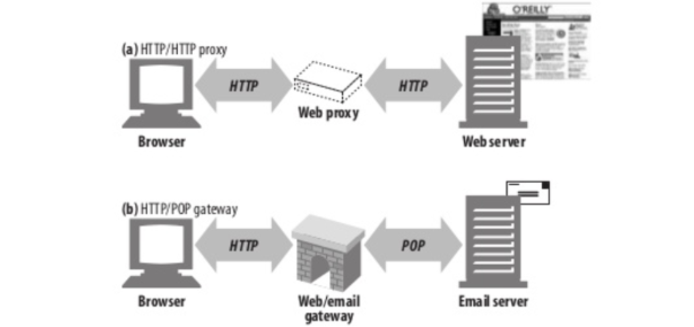
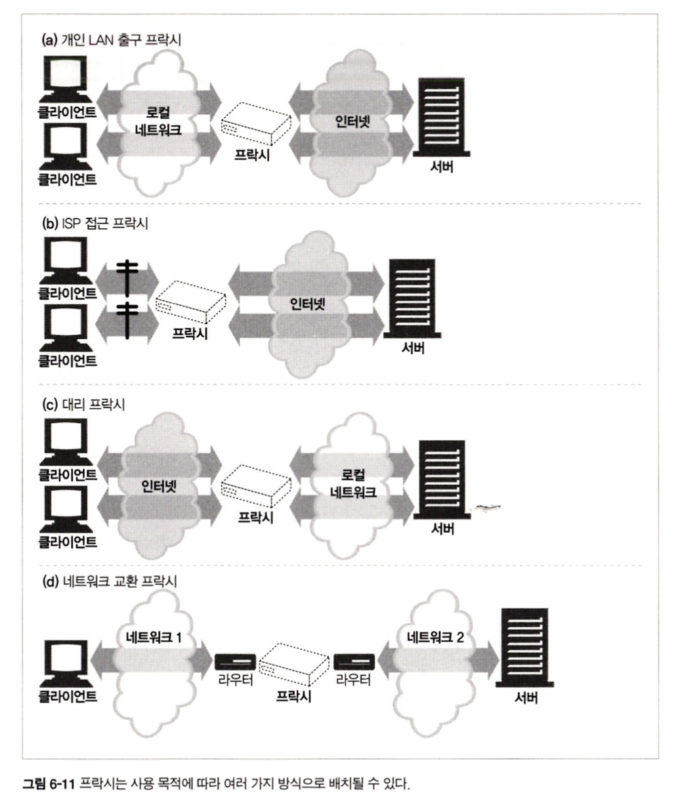
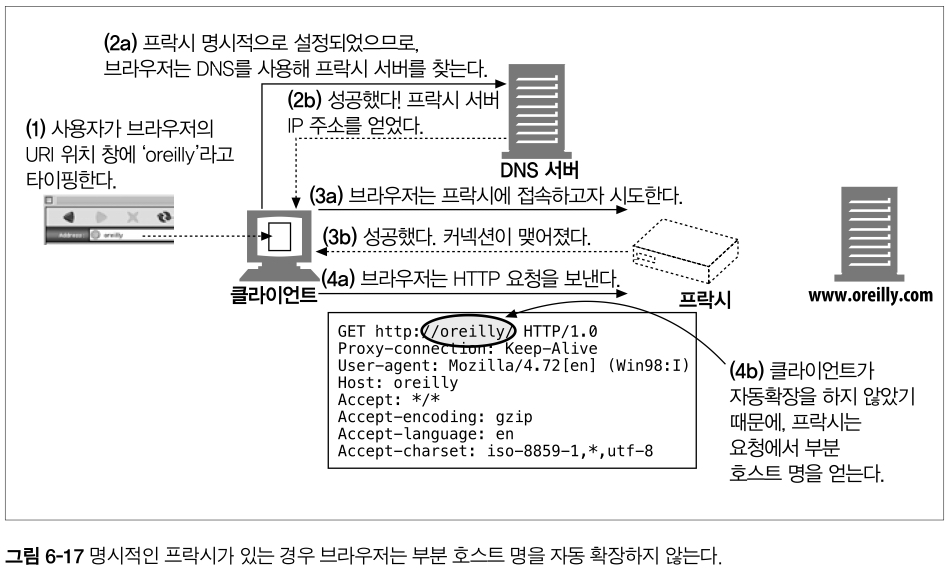
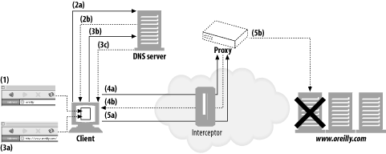

# 2부 HTTP 아키텍처

## 6장 프락시

> 웹 프락시 서버는 중개자다. 프락시는 클라이언트와 서버 사이에 위치하여 그들 사이의 HTTP 메시지를 정리하는 중개인처럼 동작한다.
>
> 다룰 내용을 살펴보자
>
> - HTTP 프락시와 웹 게이트웨이를 비교하고 HTTP 프락시가 어떻게 배치되는지 그림으로 보여주면서 설명한다.
> - 몇 가지 유용한 활용방법을 보여준다
> - 프락시가 실제 네트워크에 어떻게 배치되어 있는지 그리고 트래픽이 어떻게 프락시 서버로 가게 되는지 설명한다
> - 브라우저에서 프락시를 사용하려면 어떻게 설정해야 하는지 보여준다.
> - HTTP 프락시 요청이 서버 요청과 어떻게 다른지, 그리고 프락시가 어떻게 브라우저의 동작을 미묘하게 바꾸는지 보여준다.
> - 일련의 프락시 서버들을 통과하는 메시지의 경로를, Via 헤더와 TRACE 메서드를 이용해 기록하는 방법을 설명한다.
> - 프락시에 기반한 HTP 접근제어를 설명한다.
> - 어떻게 프락시가 클라이언트와 서버 사이에서 각각의 다른 기능과 버전 들을 지원하면서 상호작용 할 수 있는지 설명한다.

### 6.1 웹 중개자

> 웹 프락시 서버는 클라이언트의 입장에서 틀내잭션을 수행하는 중개인이다.

`웹 프락시가 없다면`, 클라이언트는HTTP 서버와 직접 이야기한다. `웹 프락시가 있다면`, 클라이언트는 HTTP 서버와 이야기하는 대신, 자신의 입장에서 서버와 대화해주는 프락시와 이야기한다. 트랜잭션을 완료하는 것이 `클라이언트라는 점은 변하지 않지만`, 프락시 서버가 제공하는 좋은 서비스를 이용하게 된다.

HTTP 프락시 서버는 웹 서버이기도 하고 웹 클라이언트이기도 하다. 프락시는 HTTP 클라이언트의 요청을 받게 되므로, 반드시 웹 서버처럼 요청과 커넥션을 적절히 다루고 응답을 돌려줘야 한다. 동시에 프락시는 요청을 서버로 보내기도 하므로, 요청을 보내고 응답을 받는 올바른 HTTP 클라이언트처럼 동작해야 한다. 만약 직접 HTTP 프락시를 만든다면, HTTP 클라이언트와 HTTP 서버의 양쪽 규칙 모두를 주의 깊게 따라야 한다.

1. 개인 프락시와 공유 프락시
   - 프락시 서버는 하나의 클라이언트가 독점적으로 사용할 수도, 여러 클라이언트가 공유할 수도 있다
   - 공용 프락시
     - 공용이며 공유된 프락시
     - 중앙 집중형 프락시를 관리하는 게 더 비용효율이 높고 쉽다
     - 여러 사용자들의 공통된 요청에서 이득을 취할 수 있어서 유리하다
   - 개인 프락시
     - 어떤 브라우저 보조 제품들은 몇ㅁ쳐 ISP 서비스와 마찬가지로 브라우저의 기능을 확장하거나 성능을 개선하거나 무료 ISP 서비스를 위한 광고를 운영하기 위해 작은 프락시를 사용자의 컴퓨터에서 직접서비스한다
2. 프락시 대 게이트웨이
   - 프락시 == 같은 프로토콜을 사용하는 둘 이상의 애플리케이션을 연결
   - 게이트웨이 == 서버 다른 프로토콜을 사용하는 둘 이상을 연결
   - 
   - 실질적으로는 차이점이 모호하다

### 6.2 왜 프락시를 사용하는가?

> 프락시 서버는 실용적이고 유용한 것이라면 무슨 일이든 한다.

- 어린이 필터
  - 프락시에서 요청에 대한 응답을 필터링 할 수 있다
- 문서 접근 제어자
  - 중앙 프록시 서벙에서 접근 젱어가 가능하다
  - 예를 들어
    - ㅋ르라이언트 1에게 제약 ㅇ없이 서버의 뉴스 페이지에 접근할 수 있도록 허가
    - 클라이언트 2에게 제약없이 인터넷 콘텐츠에 접근할 수 있는 권한을 준다.
    - 클라이언트 3이 서버 B에 접근하기 전엥 먼저 비밀번호를 요구한다
- 보안 방화벽
  - 네트워크 보안 엔지니어는 종종 보안을 강화하기 위해 프락시 서벌르 사용한다.
- 웹 캐시
  - 프락시 캐시는 인기 있는 문서의 로컬 사본을 관리하고 해당 문서에 대한 요청이 오면 빠르게 제공하영, 느리고 비싼 인터넷 커뮤니케이션을 줄인다
  - 즉 몇 클라이언트는 프락시에 있는 캐시로 접근하고 몇 클라이언트는 바로 원서버에 접근하는 방식을 취할 수 있다
    - 킹플릭스
- 대리 프락시
  - 어떤 프락시들은 웹 서버인 것처럼 위장한다.
  - 대릭 혹은 리버스 프락시로 불리는 이들은 진짜 웹 서버 요청을 받지만 웹 서버와는 달리 요청 받은 콘텐츠의 위치를 찾아내기 위해 다른 서버와 커뮤니케이션을 시작한다.
  - 대리 프락시는 공용 콘텐츠에 대한 느린 웹 서버의 성능을 개선하기 위해 사용될 수 있다.
- 콘텐츠 라우터
  - 프락시 서버는 인터넷 트래픽 조건과 콘텐츠의 종류에 따라 요청을 특정 웹 서버로 유도하는 콘텐츠 라우터로 동작할 수 있다.
  - 콘텐츠 라우터는 또한 사용자들에게 제공할 여러 서비스를 구현하는데 상요할 수 있다.
- 트랜스코더
  - 프락시 서버는 콘텐츠를 클라이언트에게 전달하기 전에 본문 포맷을 수정할 수 있다.
  - 이와 같이 데이터의 표현 방식을 자연스럽게 변환하는 것을 트랜스코딩이라고 부른다.
- 익명화 프락시
  - 익명화 프락시는 HTTP 메시지에서 신원을 식별할 수 있는 특성들을 적극적으로 제거함으로써 개인정보보호와 익명성 보장에 기여

### 6.3 프락시는 어디에 있는가?

> 프락시가 어디에 있고 언제 네트워크 아키텍처 상에 배치되는지 이야기해보자
>
> 어떻게 프락시가 네트워크에 배치되는가
>
> 어떻게 프락시의 연쇄가 계층을 이루는가
>
> 어떻게 트래픽이 올바르게 프락시를 찾아가는가

1. 프락시 서버 배치
   - 어떻게 사용할지에 따라서 프락시는 어디에든 배치할 수 있다.
   - 
   - 출구 프락시
     - 로컬 네트워크와 더 큰 인터넷 사이를 오가는 트래픽을 제어하기 위해 프락시를 로컬 네트워크의 출구에 박아 넣을 수 있다.
     - 예시
       - 악의 적인 공격을 막는 방화벽 제공
       - 인터넷 요금을 절약하고 인터넷 트래픽의 성능을 개선하기 위해 회사에서 출구
       - 부적절한 콘텐츠를 브라우징 하는 것을 막기
   - 대리 프락시
     - 프락시는 종종 대리 프락시(리버스 프락시라고도 부름)로 사용된다
     - 대리 프락시는 네트워크의 가장 끝에 있는 웹 서버들의 바로 앞에 위치하여 웹 서버로 향하는 모든 요청을 처리하고 필요할 때만 웹 서버에게 자원을 요청할 수 있다
     - 예시
       - 보안 기능 추가
       - 빠른 웹 서버 캐시를 느린 웹서버 앞에 두어 성능 개선
     - 일반적으로 웹 서버의 이름과 IP 주소로 스스로를 가장하기 때문에, 모든 요청은 서버가 아닌 이 프락시로 가게된다
   - 네트워크 교환 프락시
     - 캐시를 이용해 인터넷 교차로의 혼잡을 완화하고 트래픽 흐름을 가심하기 위해,
     - 충분한 처리 능력을 갖춘 프락시가 네트워크 사이의 인터넷 피어링 교환 지점들에 놓일 수 있다.
2. 프락시 계층
   - 프락시 계층이라고 불리는 연쇄를 구성할 수 있다.
   - 프락시 계층에서, 메시지는 최종적으로 원 서버에 도착할 때까지 프락시와 프락시를 거쳐 이동한다
   - 프락시 계층에서 프락시 서벋르은 부모와 자식의 관곌르 갖는다.
   - 다음번 인바운드 프락시(서버에 가까운 쪽)를 부모라고 부르고 다음번 아웃바운드 프락시(클라이언트 가까운 쪽)는 자식이라고 부른다
   - 프락시 계층 콘텐츠 라우팅
     - 프락시 계층은 정적이다. 아래 상태를 예시로 보자
     - 클라이언트 <=> 프락시1 <=> 프락시2 <=> 프락시3 <=> 원서버
     - 프락시 1은 언제나 메시지를 프락시 2로 보내고
     - 프락시 2는 언제나 메시지를 프락시 3로 보낸다
     - 하지만 그렇다고 `계층이 반드시 정적이어야 하는 것은 아니다.`
     - 여러 가지 판단 근거에 의해 메시지를 다양하고 유동적인 프락시 서버와 원 서버들의 집합에게 보낼 수 있다
     - 예를 보자
       - 부하 균형
         - 자식 프락시는 부하를 분산하기 위해 현재 부모들의 작업량 수준에 근거하여 부모 프락시를 고른다
       - 지리적 인접성에 근거한 라우팅
         - 자식 프락시는 원 서버의 지역을 담당하는 부모를 선택할 수도 있다
       - 프로토콜/타입 라우팅
         - 어떤 자식 프락시는 `URI`에 근거하여 다른 부모나 원 서버로 라우팅 할 수 있다.
         - 어떤 특정 종류의 URI를 갖고 있는 요청의 겨우, 특별한 프락시 서버로 보내져 특별한 프로토콜로 처리될 수도 있다
       - 유료 서비스 가입자를 위한 라우팅
         - 웹 서비스 운영자가 빠른 서비스를 위해 추가금을 지불했다면, 그들의 URI는 대형 캐시나 성능 개선을 위한 압축 엔진으로 라우팅 될 수 있다
3. 어떻게 프락시가 트래픽을 처리하는가
   - 클라이언트는 보통 웹 서버와 직접 대화하기 때문에, 우리는 먼저 어떻게 HTTP 트래픽이 프락시로 향하는 길을 찾아내는지 설명할 필요가 있다.
   - 클라이언트 트래픽이 프락시로 가도록 만드는 방법. 네가지 를 보자
   - 클라이언트를 수정한다
     - 많은 웹 클라이언트들은 수동 혹은 자동 프락시 설정을 지원한다.
     - 만약 클라이언트가 프락시를 사용하도록 설정되어 있다면, 클라이언트는 HTTP 요청을 바로 그리고 의도적으로 원 서버가 아닌 프락시로 보낸다.
   - 네트워크를 수정한다
     - 클라이언트는 알지도 못하고 간섭도 할 수 없는 상태에서, 네트워크 인프라를 가로채서 웹 트래픽을 프락시로 가도록 조정하는 몇 가지 기법이 있다.
     - 이 가로챔은 일반적으로 HTTP 트래픽을 지켜보고 가로채어 클라이언트 모르게 트래픽ㅇ을 프락시로 보내느 스위칭 장치와 라우팅 장치를 필요로 한다
     - 이거을 인터셉트 프락시라 부른다
   - DNS 이름 공간을 수정한다
     - 웹 서버 앞에 위치하는 프락시 서버인 대리 프락시는 웹 서버의 이름과 IP 주소를 자신이 직접 사용한다.
     - 그래서 모든 요청은 서버 대신 대리 프락시로 간다
     - 이는 DNS 이름 테이블을 수동으로 편집하거나 사용할 적절한 프락시나 서버를 계산해주는 특별한 동적 DNS 서버를 이용해서 조정될 수 있다
     - 몇몇 설치본에서는, 실제 서버의 IP 주소를 자신이 직접 사용한다.
     - 그래서 모든 요청은 서버 대신 대리 프락시로 간다
     - 이는 DNS 이름 테이블을 수동으로 편집하거나 사용할 적절한 프락시나 서버를 계산해주는 특별한 동적 DNS 서버를 이용해서 조정될 수 있다
   - 웹 서버를 수정한다
     - 몇몇 웹 서버는 HTTP 리다이렉션 명령(305 응답 코드)을 클라이언트에게 돌려줌으로써 클라이언트의 요청을 프락시로 리다이렉트 하도록 설정할 수 있다. 리당이렉트를 받는 즉시 클라이언트는 프락시와의 트랜잭션을 시작한다.

### 6.4 클라이언트 프락시 설정

> 모든 현대적인 브라우저는 프락시를 사용할 수 있도록 설정할 수 있다. 사실 많은 브라우저가 프락시를 설정하는 여러 가지 방법을 제공한다.

1. 수동설정
   - 프락시를 사용하겠다고 명시적으로 설정한다.
   - 많은 웹 클라이언트가 프락시를 수동으로 설정할 수 있도록 하고 있다.
     - 크롬과 익스플로러 등 다양한 브라우저가 다 간편하게 설정할 수 있도록 제공중
   - 단순하지만 유연하진 못하다
2. 브라우저 기본 설정
   - 브라우저 벤더나 배포자는 브라우저(혹은 다른 웹 클라이언트)를 소비자에게 전달하기 전에 프락시를 미리 설정해 놓을 수 있다.
3. 프락시 자동 설정
   - 자바스크립트 프락시 자동 설정 파일에 대한 URI를 제공할 수 있다. 클라이언트는 프락시를 써야 하는지, 만약 그렇다면 어떤 프락시 서버를 써야 하는지 판단하기 위해 그 자바스크립트 파일을 가져와서 실행한다.
   - 프락시 자동 설정(PAC) 파일은 프락시 설정에 대한 보다 동적인 해결책
   - 문서에 접근할 때마다, 자바스크립트 함수가 적절한 프락시 서버를 선택한다
   - 사용하려면
     - PAC파일의 URI를 브라우저에 설정해줘야 한다
     - 각 PAC 파일을 반드시 URI에 접근할 떄 사용할 적절하 ㄴ프락시 서버를 계산해주는 FindProxyForUrl라는 함수를 정의해야한다
4. WPAD 프락시 발견
   - 대부분의 브라우저는 자동설정 파일을 다운받을 수 있는 '설정 서버'를 자동으로 찾아주는, 웹 프락시 자동발견 프로토콜(Web Proxy Autodiscovery Protocol, WPAD)을 제공한다
   - 알맞는 PAC 파일을 자동으로 찾아주는 알고리즘
     - PAC URI를 찾기 위해 WPAD를 사용한다
     - 주어진 URI에서 PAC 파일을 가져온다
     - 프락시 서버를 알아내기 위해 PAC 파일을 실행한다
     - 알아낸 프락시 서버를 이용해서 요청을 처리한다.
   - WPAD는 올바른 PAC 파일을 알아내기 위해 리소스 발견 기법을 사용한다
     - 동적 호스트 발견 규약 DHCP
     - 서비스 위치 규약 SLP
     - DNS 잘알려진 호스트 명
     - DNS SRV 레코드
     - DNS TXT 레코드 안의 서비스 URI

### 6.5 프락시 요청의 미묘한 특징들

> - 프락시 요청의 URI는 서버 요청과 어떻게 다른가
> - 인터셉트 프락시와 리버스 프락시는 어떻게 서버 호스트 정보를 알아내기 어렵게 만드는가
> - URI 수정에 대한 규치
> - 프락시는 브라우저의 똑똑한 URI 자동완성이나 호스트 명 확장 기능에 어떻게 영향을 주는가

1. 프락시 URI는 서버 URI와 다르다
   - 웹 서버와 웹 프락시 메시비의 문법은 서로 같다
     - 예외가 있다 클라이언트가 프락시 대신 서버로 요청을 보내면 요청의 URI가 달라진다
     - 왜 다를까?
       - 원래 HTTP 설계에서, 클라이언트는 단일한 서버와 직접 대화했다.
         - 상남자는 가상호스팅따위 없고 프락시에 대한 대비도 안한다
       - 단일 서버는 자신의 호스트명과 포트번호를 알고 있으므로, 클라이언트는 불필요한 정보 발송을 피하기 위해 스킴과 호스트가 없는 부분 URI만 보냈다
     - 그런데 프락시가 부상해버렸다
       - 부분 URI는 여기서 문제가 되었다
       - 프락시는 목적지 서버와 커넥션을 맺어야 한다.
         - 그러니 그 서버의 이름을 알 필요가 있다
         - 그리고 프락시 기반 게이트웨이는 FTP 리소스나 혹은 그 외의 스킴과 연결하기 위해 URI의 스킴을 알 필요가 있었다.
         - 결국 서버로는 부분 URI를 프락시로는 완전한 URI를 보낼 필요가 생겼다
2. 가상 호스팅에서 일어나는 문제
   - 프락시의 `스킴,호스트,포트번호 누락` 문제는 가상으로 호스팅 되는 웹 서버가 직면한 것과 같은 문제다
   - 가상으로 호스팅 되는 웹 서버는 여러 웹 사이트가 같은 물리적 웹 서버를 공유한다.
   - 명시적인 프락시는 요청 메시지가 완전한 URI를 갖도록 하게 했고
   - 가상으로 호스팅 되는 웹 서버는 호스트와 포트에 대한 정보가 담겨 있는 Host 헤더를 요구한다
3. 인터셉트 프락시는 부분 URI를 받는다
   - 클라이언트가 HTTP를 올바르게 구현했다면, 그들은 명시적으로 설정된 프락시에게는 완전한 URI를 보낼 것이다.
   - 이것으로 문제의 일부분은 해결되지만, 여전히 남은 문제가 있다.
     - 클라이언트는 자신이 프락시와 대화하고 있음을 항상 알고 있는 것은 아니다.
       - 왜냐하면 몇몇 프락시는 믈라이언트에게는 보이지 않을 수 있기 때문
     - 클라이언트가 프락시를 사용한다고 설정되어 있지 않더라도, 클라이언트의 트래픽은 여전히 대리 프락시나 인터셉트 프락시를 지날 수 있다.
     - 두 가지 경우 모두, 클라이언트는 자신이 웹 서버와 대화하고 있다고 생각하고 완전한 URI를 보내지 않을 것이다
       - 대리 프락시는 앞에서 설명한 바와 같이 원 서버의 호스트 명과 아이피 주소를 사용해 원 서버를 대신하는 서버다
       - 인터셉트 프락시는 네트워크 흐름에서 클라이언트에서 서버로 가는 트래픽을 가로채 캐시된 응답을 돌려주는 등의 일을 하는 프락시 서버다. 인터셉트 프락시는 클라이언트에서 서버로 가는 트래픽을 가로채기 때문에, 웹 서버로 보내는 부분 URI를 얻게 될 것이다.
4. 프락시는 프락시 요청과 서버 요청을 모두 다룰 수 있다
   - 트래픽이 프락시 서버로 리다이렉트 될 수 있는 여러 가지 방법이 존재하기 때문에, 다목적 프락시 서버는 요청 메시지의 완전한 URI와 부분 URI를 모두 지원해야 한다.
   - 프락시는 명시적인 프락시 요청에 대해서는 완전하 ㄴURI를 사용하고 아니면 부분 URI를 사용해야 하며 Host 헤더를 사용해야 한다
   - 규칙을 보자
     - 완전한 UIR가 주어졌다면, 프락시는 그것을 사용해야 한다.
     - 부분 URI가 주어졌고 Host 헤더가 있다면, Host 헤더를 이용해 원 서버의 이름과 포트 번호를 알아내야 한다.
     - 부분 URI가 주어졌으나 Host 헤더가 없다면, 다음의 방법으로 원 서버를 알아내야 한다.
       - 프락시가 원 서버를 대신하는 대리 프락시라면, 프락시에 실제 서버의 주소와 포트 번호가 설정되어 있을 수 있다
       - 이전에 어떤 인터셉트 프락시가 가로챘던 트래픽을 받았고, 그 인터셉트 프락시가 원 IP 주소와 포트 번호를 사용할 수 있도록 해두었다면, 그 IP 주소와 포트번호를 사용할 수 있다
       - 모두 실패했다면, 프락시는 원 서버를 알아낼 수 있는 충분한 정보를 갖고 있지 못한 것이므로 반드시 에러 메시지를 반환해야 한다.
5. 전송 중 URI 변경
   - 프락시 서버는 요청 URI의 변경에 매우 신경을 써야 한다.
   - 무해해 보이는 사소한 URI 변경이라도 다운스틺 서버와 상호운용성 문제를 일으킬 수 있다
   - 특히 몇몇 프락시는 URI를 다음 홉으로 보내기 전에 표준 형식으로 정규화 하는 것으로 알려져 있다
   - URI에서 기본 HTTP 포트를 명시적으로 `:80`로 변경하는 것이나 잘못 사용한 예약된 글자를 올바르게 이스케이프하여 교체하는 것과 같은 무해해 보이는 변형이라 할지라도, 상호운용성 문제를 일으킬 수 있다.
   - 일반적으로 프락시 서버는 가능한 한 관대하도록 애써야 한다.
   - 그들은 프로토콜을 엄격하게 준수하도록 강제하는 프로토콜 경찰처럼 되려고 해서는 안된다.
   - 이는 기존에 잘 동작하던 기능들을 심각하게 망가뜨리는 결과를 수반할 수 있기 때문이다.
6. URI 클라이언트 자동확장과 호스트 명 분석
   - 브라우저는 프락시의 존재 여부에 따라 요청 URI를 다르게 분석한다. 프락시가 없다면 사용자가 타이핑한 URI를 가지고 그에 대응하는 IP 주소를 찾는다. 만약 호스트명이 발견되면 그에 대응하는 IP 주소들을 연결에 성공할 때까지 시도해본다
   - 그러나 호스트가 발견되지 않는다면, 많은 브라우저들은 사용자가 호스트 명의 짧은 약어를 타이핑한 것으로 보고 자동화된 호스트 명의 확장을 제공하고자 다음과 같은 몇가지 시도를 한다
     - 일반적인 웹사이트 이름의 가운데 부분만 입력했다면 `www`나 `.com`을 자동으로 붙일 수도 있다
     - 심지어 몇 브라우저는 해석할 수 없느 ㄴURI를 서드파티 사이트로 넘기기도 하는데, 이 사이트는 오타 교정을 시도하고 사용작 의도했을 URI를 제시한다
     - DNS는 사용자가 호스트 명의 앞부분만 입력하면 자동으로 도메인을 검색하도록 설정되어 있다.
7. 프락시 없는 URI 분석
   - 
8. 명시적인 프락시를 사용할 때의 URI 분석
   - 
9. 인터셉트 프락시를 이용한 URI 분석
   - 
   - 단계 1에서 사용자는 브라우저의 URI. 위치 창에 oreilly라고 타이핑
   - 2a에서 브라우저는 호스트 oreilly를 dns를 통해 찾아보지만, 단계 2b에서 dns서버는 실패하고 그 호스트는 알 수 없다고 응답
   - 3a에서 oreilly를 www.oreilly.com으로 변환하는 자동 확장을 사용. 3b에서 브라우저는 dns를 통해 해당 호스트를 찾아보고 3c에서 dns서버는 성공하고 ip주소를 브라우저에게 반환
   - 4a에서 클라이언트는 이미 성공적으로 호스트 명을 분석하였고 ip주소의 목록을 갖고 있다. 일반적으로 클라이언트는 성공할 때까지 모든 ip 주소에 대해 접속을 시도하지만, 어떤 ip 주소들은 죽은 것일 수 있다. 그러나 인터셉트 프락시와 함께라면, 첫번째 접속 시도는 원서버가 아닌 프락시 서버에 의해 종료된다. 클라이언트는 성공적으로 웹 서버와 대화했다고 믿지만, 웹 서버는 살아있지도 않을 것이다.
   - 프락시가 최종적으로 진짜 원 서버와 상호자굥ㅇ할 준비가 되었을 때(5b), 프락시는 그 ip 주소가 실제로는 다운된 서버를 가리키고 있음을 알게 될 것이다. 브라우저에서 제공하는 것과 동등한 수준의 장애 허용을 제공하기 위해서, 프락시는 호스트 헤더에 들어있는 호스트 명을 다시 분석하든 아니면 ip 주소에 대한 역방향 dns 룩업을 해서든 다른 ip 주소를 시도해야 한다.

### 6.6 메시지 추적

> 오늘날, 웹 요청이 ㅋ르라이언트에서 서버로 향하는 도중에 둘 ㅇ이상의 프락시를 지나게 되는 것은 드문 일이 아니다.
>
> 예를 들어, 보안과 비용 절감을 위해 캐시 프락시 서버를 사용하며, isp들이 성능ㅇ 개선과 기능 구현ㅇ을 ㅟ해 프락시 캐시를 사용한다.

1. via 헤더
   - via 헤더 필드는 메시지가 지나는 각 중간 노드의 정보를 나열한다.
   - 메시지가 또 다른 노드를 지날 때마다, 중간 노드는 Via 목록의 끝에 반드시 추가되엉야 한다.
   - `Via: 1.1 proxy-62.irenes-isp.net, 1.0 cache.joes-hardware.com`
     - 위 Via 문자열은 메시지가 두 개의 프락시를 지나갔음을 말해준다.
   - Via 헤더 필드는 메시지의 전달을 추적하고, 메시지 루프를 진단하고, 요청을 보내고 그에 대한 응답을 돌려주는 과정에 관여하는 모든 메시지 발송자들의 프로토콜을 다루는 능력을 알아보기 위해 사용된다
   - 라우팅 루프를 탐지하기 위해 Via 헤더를 사용할 수 있다.
   - 문법
     - Via 헤더 필드는 쉼표로 구분된 경유지의 목록이다.
     - 구조는 아래와 같다
       - Via = 'Via' ':' (waypoint) [',' (waypoint) ...]
         - waypoint = (received-protocol received-by [comment])
           - received-protocol = [protocol-name '/'] protocol-version
           - received-by = (host [':' port]) | pseudonym
     - 각 via waypoint는 프로토콜 이름(선택. 기본은 HTTP), 프로토콜 버전(필수), 노드 ㅇ이름(필수), (코멘트)의 최대 4개 구성이다
       - 프로토콜 이름
         - 중개자가 받은 프로토콜
         - 만약 프로토콜이 HTTP라면 프로토콜 이름은 없어도 도니다.
         - 한편, 프로토콜 이름은 버전 앞에 '/'로 구분되어 붙는다.
         - 비 HTTP 프로토콜은 게이트웨이가 다른 프로토콜(HTTPS, FTP 등)을 ㅇ위해 HTTP 요청에 접속할 때 발생할 수 있다
       - 프로토콜 버전
         - 수신한 메시지의 버전.
         - 버전의 포맷은 프로토콜에 달려있다.
         - HTTP의 경ㅇ우, 표준 버전 번호(1.0, 1.1 등)가 사용된다
       - 노드 이름
         - 중개자의 호스트와 포트 번호(선택)
         - 몇몇 조직은 정보 보호를 이유로 진ㅉ나 호스트 명을 밝히고 싶어 하지 않을 수 있는데, 그러한 경우 가명으로 대체할 수 있다
       - 노드 코멘트
         - 중개자 노드를 서술하는 선택적인 코멘트
         - 벤더나 버전 정보를 여기에 포함시키는 것은 한함
         - 몇몇 프락시 서버는 장치에서 일어난 이벤트에 대한 진단 정보를 포함하는 데도 코멘트 필드를 사용한다
     - Via 요청과 응답 경로
       - 요청 메시지와 응답 메시지 모두 프락시를 지나므로 둘 모두 Via 헤더를 가진다.
       - 요청과 응답은 보통 같은 TCP 커넥션을 오가므로, 응답 메시지는 요청과 같은 경로를 되돌아간다. 만약 요청 메시지가 프락시 A, B, C를 지나간다면, 그에 대한 응답 메시지는 거꾸로 C, B, A를 지나간다
     - Via와 게이트 웨이
       - 몇몇 프락시는 서버에게 비 HTTP 프로토콜을 사용할 수 있는 게이트웨이 기능을 제공한다.
       - Via 헤더는 이러한 프로토콜 변환을 기록하므로 HTTP 애플리케이션은 프락시 연쇄에서 프로토콜 능력과 변환이 있었는지를 알아챌 수 있다
     - Server 헤더와 Via 헤더
       - server응답 헤더 필드는 원 서버에 의해 사용되는 소프트웨어를 알려준다.
       - 예시) `Server: Apache/1.3.14 (Unix) PHP/4.0.4 \n Server: Netscape-Enterprise/4.1 \n Server: Microsoft-IIS/5.0`
       - 응답 메시지가 프락시를 통과할 때, 프락시는 Server 헤더를 수정해서는 안된다.
       - Server헤더는 원서버를 위해 존재한다.
       - 대신 프락시는 Via 항목을 추가해야 한다.
     - Via가 개인정보 보호와 보안에 미치는 영향
       - Via 문자열 안에 정확한 호스트 명이 들어가기를 원하지 않는 몇 가지 경우가 있다
         - 보통 명시적으로 이 동작이 켜져 있지 ㅇ낳은 이상, 프락시 서버가 네트워크 방화벽의 일부인 경우 프락시는 방화벽 뒤에 숨어있는 호스트의 이름과 포트를 전달해서는 안된다.
         - 방화벽 뒤의 네트워크 아키텍처에 대한 정보가 악의적인 집단에 의해 이용될 수 있기 때문이다
       - 만약 Via 노드 이름 전달이 가능하지 않다면,
         - 보안 경계선의 일부분인 프락시는 호스트 명을 그 호스트에 대한 적당한 가명으로 교체해야한다
         - 하지만 이로 인해 실제 이름을 알기 어렵게 되었다고 하더라도, 일반적으로 프락시는 각 프락시 서버에 대한 Via 경유지 항목을 유지하려고 노력해야 한다.
       - 내부 네트워크 아키텍처의 설계와 토폴로지를 알아내기 어렵게 하기 위한 아주 강력한 보안 요구사항을 갖고 있는 조직들을 위해
         - 프락시는 정렬된 일련의 Via경유지 항목들을 하나로 합칠 수 있다
2. TRACE 메서드
   - 프락시 서버는 메시지가 전달될 때 메시지를 바꿀 수 있다.
   - 헤더가 추가되거나, 변경되거나, 삭제될 수 있으며, 본문이 다른 형식으로 변환될 수 있다.
   - 프락시가 점점 복잡해지고 더 많은 벤더가 프락시 제품을 배치하면서, 상호운용성 문제가 증가한다.
   - 프락시 네트워크를 쉽게 진단하기 위해, 우리는 HTTP 프락시 네트워크를 통해 홉에서 홉으로 전달될 때마다 메시지의 내용이 어떻게 변하는지 편리하게 관찰할 방법이 필요하다.
   - HTTP/1.1의 TRACE 메서드는 요청 메시지를 프락시의 연쇄를 따라가면서 어떤 프락시를 지나가고 어떻게 각 프락시가 요청 메시지를 수정하는지 관찰/추적할 수 있도록 해준다.
   - TRACE 요청이 목적지 서버에 도착했을 떄, 서버는 전체 요청 메시지를 HTTP 응답 메시지의 본문에 포함시켜 송신자에게 그대로 돌려보낸다.
   - Max-Forwards
     - 일반적으로 TRACE 메시지는 중간에 프락시들이 몇 개나 있든 신경 쓰지 않고 목적지 서버로의 모든 경로를 여행한다.
     - TRACE와 OPTIONS 요청의 프락시 홉 개수를 제한하기 위해 Max-Forwards 헤더를 사용할 수 있는데, 이는 전달되는 메시지가 무한루프에 빠지지 않는지 프락시 연쇄를 테스트하거나 연쇄 중간의 특정 프락시 서버들의 효과를 체크할 떄 유용하다

### 6.7 프락시 인증

- 프락시는 접근 제어 장치로서 제공될 수 있다.
- HTTP는 사용자가 유효한 접근 권한 자격을 프락시에 제출하지 않는 한 콘텐츠에 대한 요청을 차단하는 프락시 인증이라는 메커니즘을 정의한다
  - 제한된 콘텐츠에 대한 요청이 프락시 서버에 도착했을 떄, 프락시 서버는 접근 자격을 요구하는 407 proxy authorization required 상태 코드를 어떻게 자격을 제출할 수 있는지 설명해주는 Proxy-Authenticate 헤더 필드와 함께 반환할 수 있다.
  - 클라이언트는 407 응답을 받게 되면, 로컬 데이터베이스를 확인해서든 사용자에게 물어봐서든 요구되는 자격을 수집한다
  - 자격을 획득하면, 클라이언트는 요구되는 자격을 Proxy-Authorization 헤더 필드에 담아서 요청을 다시 보낸다
  - 자격이 유효하다면, 프락시는 원 요청을 연쇄를 따라 통과시킨다. 유효하지 않다면 407 응답을 보낸다
