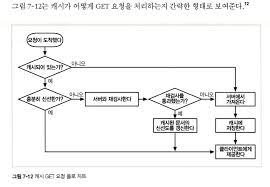

# 2부 HTTP 아키텍처

## 7장 캐시

> 웹 캐시는 자주 쓰이는 문서의 사본을 자동으로 보관하는 HTTP 장치다. 웹 요청이 캐시에 도착했을 때, 캐시된 로컬 사본이 존재한다면, 그 문서는 원 서버가 아니라 그 캐시로부터 제공된다. 캐시는 다음과 같은 혜택을 준다.
>
> - 캐시는 불필요한 데이터 전송을 줄여서, 네트워크 요금으로 인한 비용을 줄여준다.
> - 캐시는 네트워크 병목을 줄여준다. 대역폭을 즐리지 않고도 페이지를 빨리 불러올 수 있게 된다.
> - 캐시는 원 서버에 대한 요청을 줄여준다. 서버는 부하를 줄일 수 있으며 더 빨리 응답할 수 있게 된다.
> - 페이지를 먼 곳에서 불러올수록 시간이 많이 걸리는데, 캐시는 거리로 인한 지연을 줄여준다.
>
> 이 장에서 우리느니 어떻게 캐시가 성능을 개선하고 비용을 줄이는지, 어떻게 그 효과를 측정하는지, 그리고 효과를 극대화하기 위해 캐시를 어디에 위치시켜야 하는지 설명한다. 우리는 또한 어떻게 HTTP가 캐시된 사본을 신선하게 유지하는지, 그리고 어떻게 캐시가 다른 캐시나 서버와 상호작용하는지도 설명할 것이다.

### 7.1 불필요한 데이터 전송

> 복수의 클라이언트가 자주 쓰이는 원 서버 페이지에 접근할 때, 서버는 같은 문서를 클라이언트들에게 각각 한 번씩 전송하게 된다. 똑같은 바이트들이 네트워크를 통해 계속 반복해서 이동한다.
>
> 이 불필요한 데이터 전송은 값비싼 네트워크 대역폭을 잡아먹고, 전송을 느리게 만들며, 웹 서버에 부하를 준다.
>
> 캐시를 이용하면, 첫 번째 서버 응답은 캐시에 보관된다. 캐시된 사본이 뒤이은 요청들에 대한 응답으로 사용될 수 있기 때문에, 원 서버가 중복해서 트래픽을 주고받는 낭비가 줄어들게 된다.

### 7.2 대역폭 병목

> 캐시는 또한 네트워크 병목을 줄여준다.

- 많은 네트워크가 원격 서버보다 로컬 네트워크 클라이언트에 더 넓은 대역폭을 제공한다.
- 클라이언트들이 서버에 접근할 때의 속도는, 그 경로에 있는 가장 느린 네트워크의 속도와 같다
- 만약 클라이언트가 빠른 LAN에 있는 캐시로부터 사본을 가져온다면, 캐싱은 성능을 대폭 개선할 수 있을 것이다

### 7.3 갑작스런 요청 쇄도

> 캐싱은 갑작스런 요청 쇄도에 대처하기 위해 특히 중요하다.

### 7.4 거리로 인한 지연

> 비록 대역폭이 문제가 되지 않더라도, 거리가 문제가 될 수 있다. 모든 네트워크 라우터는 제각각 인터넷 트래픽을 지연시킨다.
>
> 클라이언트와 서버 사이에 라우터가 그다지 많지 않더라도, 빛의 속도 그 자체가 유의미한 지연을 유발한다.

### 7.5 적중과 부적중

> 이와 같이 캐시는 유용하다. 그러나 캐시가 세상 모든 문서의 사본을 저장하지는 않는다.
>
> 캐시에 요청이 도착했을 때, 만약 그에 대응하는 사본이 있다면 그릴 이용해 요청이 처리될 수 있다. 이것을 캐시 적중이라고 부른다. 만약 대응하는 사본이 없다면 그냥 원 서버로 전달되기만 할 뿐이다. 이것을 캐시 부적중이라고 부른다.

1. 재검사
   - 원 서버 콘텐츠는 변경될 수 있기 때문에, 캐시는 반드시 그들이 갖고 있는 사본이 여전히 최신인지 서버를 통해 때때로 점검해야 한다.
   - 이러한 `신선도 검사`를 `HTTP 재검사`라 부른다
   - 효과적인 재검사를 위해, HTTP는 서버로부터 전체 객체를 가져오지 않고도 콘텐츠가 여전히 신선한지 빠르게 검사할 수 있는 특별한 요청을 정의했다.
   - 캐시는 스스로 원한다면 언제든지 사본을 재검사할 수 있다.
   - 그러나 캐시가 문서를 수백만 개씩 갖고 있는 경우가 흔한데 비해 네트워크 대역폭은 부족하기 때문에, 대부분의 캐시는 클라이언트가 사본을 요청하였으며 그 사본이 검사를 할 필요가 있을 정도로 충분히 오래된 경우에만 재검사를 한다.
   - 캐시는 캐시된 사본의 재검사가 필요할 때, 원 서버에 작ㅇ느 재검사 요청을 보낸다.
   - 콘텐츠가 변경되지 않았다면, 서버는 아주 작은 304 Not Modified 응답을 보낸다.
   - 그 사본이 여전히 유효함을 알게 된 캐시는 즉각 사본이 신선하다고 임시로 다시 표시한 뒤 그 사본을 클라이언트에 제공한다.
     - 이를 재검사 적중 혹은 느린 적중이라고 부른다.
     - 이것은 순수 캐시 적중보다 느린데, 원 서버와 검사를 할 필요가 있기 때문이다.
     - 그러나 캐시 부적중보다는 빠른데, 서버로부터 객체 데이터를 받아올 필요가 없기 때문이다.
   - HTTP는 객체를 재확인하기 위한 몇 가지 도구를 제공하는데, 그중에서 가장 많이 쓰이는 것은 If-Modified-Since 헤더다.
   - 서버에게 보내는 GET 요청에 이 헤더를 추가하면 캐시된 시간 이후에 변경된 경우에만 사본을 보내달라는 의미가 된다.
   1. 재검사 적중
      1. 만약 서버 객체가 변경되지 않았다면, 서버는 클라이언트에게 작은 HTTP 304 Not Modified 응답을 보낸다.
   2. 재검사 부적중
      1. 만약 서버 객체가 캐시된 사본과 다르다면, 서버는 콘텐츠 전체와 함께 평범한 HTTP 200 OK 응답을 클라이언트에게 보낸다.
   3. 객체 삭제
      1. 만약 서버 객체가 삭제되었다면, 서버는 404 Not Found 응답을 돌려보내며, 캐시는 사본을 삭제한다.
2. 적중률
   - 캐시가 요청을 처리하는 비율을 캐시 적중률, 혹은 문서 적중률이라고 부르기도 한다.
   - 적중률은 0에서 1까지의 값으로 되어있지만, 흔히 퍼센트로 표현되기도 한다.
   - 0%는 모든 요청이 캐시 부적중(네트워크 너머로 문서를 가져와야 했던 경우)임을, 그리고 100%는 모든 요청이 캐시 적중(캐시에서 사본을 가져온 경우)임을 의미한다.
   - 캐시 관리자는 캐시 적중률이 100%에 근접하게 되는 것을 좋아할 것이다.
   - 실제 적중률은 캐시가 얼마나 큰지, 캐시 사용자들의 관심사가 얼마나 비슷한지, 캐시된 데이터가 얼마나 자주 변경되거나 개인화되는지, 캐시가 어떻게 설정되어 있는지에 달려있다.
   - 적중률은 예측하기 어려운 것으로 악명이 높지만 오늘날 적중률 40%에 달려있다.
   - 다행인 사실은, 보통 크기의 캐시라도 충분한 분량의 자주 쓰이는 문서들을 보관하여 상당히 트래픽을 줄이고 성능을 개선할 수 있다는 점이다
   - 캐시는 유용한 콘텐츠가 캐시 안에 머무르도록 보장하기 위해 노력한다.
3. 바이트 적중률
   - 문서들이 모두 같은 크기인 것은 아니기 때문에 문서 적중률이 모든 것을 말해주지는 않는다.
   - 몇몇 큰 객체는 덜 접근되지만 그 크기 때문에 전체 트래픽에는 더 크게 기여한다
   - 이런 이유로, 어떤 사람들은 바이트 단위 적중률 측정값을 더 선호한다
   - 바이트 단위 적중률은 캐시를 통해 제공된 모든 바이트의 비율을 표현한다.
   - 이 측정값은 트래픽이 절감된 정도를 포착해낸다.
   - 바이트 단위 적중률 100%는 모든 바이트가 캐시에서 왔으며, 어떤 트래픽도 인터넷으로 나가지 않았음을 의미한다.
   - 문서 적중률과 바이트 단위 적중률은 둘 다 캐시 성능에 대한 유용한 지표다.
   - 문서 적중률은 얼마나 많은 웹 트랜잭션을 외부로 내보내지 않았는지 보여준다.
   - 트랜잭션은 고정된 소요 시간을 포함하게 되는데, 이것은 ㅈ옺오 길 수도 있기 때문에, 문서 적중률을 개선하면 전체 대기시간이 줄어든다.
   - 바이트 단위 적중률은 많은 바이트가 인터넷으로 나가지 않았는지 보여준다
4. 적중과 부적중의 구별
   - 불행히도, HTTP는 클라이언트에게 응답이 캐시 적중이었는지 아니면 원 서버 접근인지 말해줄 수 있는 방법을 제공하지 않는다
   - 두 경우 모두 응답 코드는 응답이 본문을 갖고 있음을 의미하는 200 OK가 될 것이다.
   - 어떤 사용 프락시 캐시는 캐시에 무슨 일이 일어났는지 설명하기 위해 Via 헤더에 추가 정보를 붙인다
   - 클라이언트가 응답이 캐시에서 왔는지 알아내는 한 가지 방법은 Date 해ㅔ더를 이용하는 것이다.
   - 응답의 Date 헤더 값을 현재 시각과 비교하여, 응답의 생성일이 더 오래되었다면 클라이언트는 응답이 캐시된 것임을 알아낼 수 있다.
   - 클라이언트가 캐시된 응답을 감지하는 또 다른 방법은, 응답이 얼마나 오래되었는지 말해주는 Age 헤더를 이용하는 것이다.

### 7.6 캐시 토폴로지

> 캐시는 한 명의 사용자에게만 할당될 수도 있고 반대로 수천 명의 사용자들 간에 공유될 수도 있다.
>
> 한 명에게만 할당된 캐시를 개인 전용 캐시라 부른다.
>
> 개인 전용 캐시는 개인만을 위한 캐시이므로, 한 명의 사용자가 자주 찾는 페이지를 담는다.
>
> 공유된 캐시는 고용ㅇ 캐시라고 불린다.
>
> 공용 캐시는 사용자 집단에게 자주 쓰이는 페이지를 담는다.

1. 개인전용캐시
   - 개인 전용 캐시는 많은 에너지나 저장 공간을 필요로 하지 않으므로, 작고 저렴할 수 있다.
   - 웹브라우저는 개인 전용 캐시를 내장하고 있다.
   - 대부분의 브라우저는 자주 쓰이는 문서를 개인용 컴퓨터의 디스크와 메모리에 캐시해 놓고, 사용자가 캐시 사이즈와 설정을 수정할 수 있도록 허용한다.
   - 캐시에 어떤 것들이 들어있는지 확인하기 위해 브라우저 안을 들여다보는 것도 가능하다
     - ie라면, 도구 => 인터넷 옵션 => 검색 기록 => 설정 => 파일 보기
2. 공용 프락시 캐시
   - 공용 캐시는 캐시 프락시 혹은 더 흔히 프락시 캐시라고 불리는 특별한 종류의 공유된 프락시 서버다.
   - 프락시 캐시는 로컬 캐시에서 문서를 제공하거나, 혹은 사용자의 입장에서 서버에 접근한다.
   - 굥용 캐시에는 여러 사용자가 접근하기 때문에, 불필요한 트래픽을 줄일 수 있는 더 많은 기회가 있다.
   - 프락시 캐시는 6장에서 서술된, 프락시를 위한 규칙에 따른다.
   - 수동 프락시를 지정하거나 프락시 자동설정 파일을 설정함으로써 브라우저가 프락시 캐시를 사용하도록 설정할 수 있다.
   - 또한 인터셉트 프락시를 사용함으로써 브라우저의 설정 없이 HTTP 요청이 캐시를 통하도록 강제할 수 있다.
3. 프락시 캐시 계층들
   - 작은 캐시에서 캐시 부적중이 발생했을 때 더 큰 부모 캐시가 그 '걸러 남겨진' 트래픽을 처리하도록 하는 계층을 만드는 방식이 합리적인 경우가 많다
   - 클라이언트 주위에는 작고 저렴한 캐시를 사용하고, 계층 상단에는 많은 사용자들에 의해 공유되는 문서를 유지하기 위해 더 크고 강력한 캐시를 사용하자는 것이다.
4. 캐시망, 콘텐츠 라우팅, 피어링
   - 몇몇 네트워크 아키텍처는 단순한 캐시 계층 대신 복잡한 캐시망을 만든다.
   - 캐시망의 프락시 캐시는 복잡한 방법으로 서로 대화하여, 어떤 부모 캐시와 대화할 것인지, 아니면 요청이 캐시를 완전히 우회해서 원 서버로 바로 가도록 할 것인지에 대한 캐시 커뮤니케이션 결정을 동적으로 내린다
   - 캐시망 안에서의 콘텐츠 라우팅을 위해 설계된 캐시들은 다음에 나열된 일들을 모두 할 수 있을 것이다

### 7.6 캐시 처리단계

> 오늘날 상용 프락시 캐시는 꽤 복잡하다. 매우 고성능이면서도 HTTP와 그 외 다른 기술의 고급 기능을 지원하도록 만들어졌다.
>
> 그러나 몇 군데 미묘한 구석이 있긴 하지만, 웹 캐시의 기본적인 동작은 대개 단순하다.
>
> HTTP GET 메시지 하나를 처리하는 기본적인 캐시 처리 절차는 일곱 단계로 이루어져 있다
>
> 1. 요청받기 - 캐시는 네트워크로부터 도착한 요청 메시지를 읽는다
> 2. 파싱 - 캐시는 메시지를 파싱하여 URL과 헤더들을 추출한다.
> 3. 검색 - 캐시는 로컬 복사본이 있는지 검사하고, 사본이 없다면 사본을 받아온다
> 4. 신선도 검사 - 캐시는 캐시된 사본이 충분히 신선한지 검사하고, 신선하지 않다면 변경사항이 있는지 서버에게 물어본다.
> 5. 응답 생성 - 캐시는 새로운 헤더와 캐시된 본문으로 응답 메시지를 만든다
> 6. 발송 - 캐시는 네트워크를 통해 응답을 클라이언트에게 돌려준다
> 7. 로깅 - 선택적으로, 캐시는 로그파일에 트랜잭션에 대해 서술한 로그 하나를 남긴다

1. 단계 1: 요청받기
   - 캐시는 네트워크 커넥션에서의 활동을 감지하고
   - 들어오는 데이터를 읽어들인다
   - 고성능 캐시는 여러 개의 들어오는 커넥션들로부터 데이터를 동시에 읽어들이고 메시지 전체가 도착하기 전에 트랜잭션 처리를 시작한다
2. 단계 2: 파싱
   - 캐시는 요청 메시지를 여러 부분으로 파싱하여 헤더 부분을 조작하기 쉬운 자료 구조에 담는다
   - 이는 캐싱 소프트웨어가 헤더 필드를 처리하고 조작하기 쉽게 만들어준다
3. 단계 3: 검색
   - 캐시는 URL을 알아내고 그에 해당하는 로컬 사본이 있는지 검사한다
   - 로컬 복사본은 메모리에 저장되어 있을 수도 있고, 아니면 디스크나 심지어 근처의 다른 컴퓨터에 있을 수도 있다
   - 전문적인 수준의 캐시는 객체를 로컬 캐시에서 가져올 수 있는지 판단하기 위해 빠른 알고리즘을 사용한다
   - 만약 문서를 로컬에서 가져올 수 없다면, 캐시는 상황이나 설정에 따라서 그것을 원 서버나 부모 프락시에서 가져오거나 혹은 실패를 반환한다
   - 캐시된 객체는 서버 응답 본문과 원 서버 응답 헤더를 포함하고 있으므로, 캐시 적중 동안 올바른 서버 헤더가 반환될 수 있다.
   - 캐시된 객체는 또한 객체가 얼마나 오랫동안 캐시에 머무르고 있었는지를 알려주는 기록이나 얼마나 자주 사용되었는지 등에 대한 몇몇 메타데이터를 포함한다
4. 단계 4: 신선도 검사
   - HTTP는 캐시가 일정 기간 동안 서버 문서의 사본을 보유할 수 있도록 해준다
   - 이 기간 동안, 문서는 '신선'한 것으로 간주되고 캐시는 서버와의 접촉 없이 이 문서를 제공할 수 있다
   - 그러나 일단 캐시된 사본을 신선도 한계를 넘을 정도로 너무 오래 갖고 있었다면 그 객체는 '신선하지 않은' 것으로 간주되며, 캐시는 그 문서를 제공하기 전에 문서에 어떤 변경이 있었는지 검사하기 위해 서버와 재검사를 해야한다.
   - HTTP의 신선도 검사 규칙은 매우 복잡한데, 캐시 제품들이 지우너하는 많은 수의 설정 옵션과 비 HTTP 신선도 표준과의 상호작용은 상황을 더 복잡하게 만들었다
     - 우리는 이 장 나머지의 대부분을 신선도 계산 설명에 할애할 것이다
5. 단계 5: 응답 생성
   - 우리는 캐시된 응답을 원 서버에서 온 것처럼 보이게 하고 싶기 때문에, 캐시는 캐시된 서버 응답 헤더를 토대로 응답 헤더를 생성한다
   - 이 기저 헤더들은 캐시에 의해 수정되고 늘어난다
   - 캐시는 클라이언트에 맞게 이 헤더를 조정해야 하는 책임이 있다.
     - 클라이언트가 HTTP/1.1 응답을 기대하는 상황에서 서버가 HTTP/1.0 응답을 반환했다면, 캐시는 반드시 헤더를 적절하게 번역해야 한다
   - 캐시는 또한 캐시 신선도 정보를 삽입하며, 또 요청이 프락시 캐시를 거쳐갔음을 알려주기 위해 종종 Via 헤더를 포함시킨다
6. 단계 6: 전송
   - 일단 응답 헤더가 준비되면, 캐시는 응답을 클라이언트에게 돌려준다.
   - 모든 프락시 서버들과 마찬가지로, 프락시 캐시는 클라이언트와의 커넥션을 유지할 필요가 있다
   - 고성능 캐시는 종종 로컬 저장장치와 네트워크 I/O 버퍼 사이에서 문서의 콘텐츠 복사를 피함으로써 데이터를 효과적으로 전송하기 위해 노력한다
7. 단계 7: 로깅
   - 대부분의 캐시는 로그 파일과 캐시 사용에 대한 통계를 유지한다.
   - 각 캐시 트랜잭션이 완료된 후, 캐시는 통계 캐시 적중과 부적중 횟수에 대한 통계를 갱신하고 로그 파일에 요청 종류, URL 그리고 무엇이 일어났는지를 알려주는 항목을 추가한다
   - 가장 많이 쓰이는 캐시 로그 포맷은 스쿼드 로그 포맷과 넷스케이프 확장 공용 로그 포맷이지만
   - 많은 캐시 제품이 커스텀 로그 파일을 허용한다.
8. 캐시 처리 플로 차트
   - 

### 7.8 사본을 신선하게 유지하기

> 캐시된 사본 모두가 서버의 문서와 항상 일치하는 것은 아니다. 결국 문서들은 시간에 따라 변경된다.
>
> 오래된 데이터를 제공하는 캐시는 불필요하다. 캐시된 데이터는 서버의 데이터와 일치하도록 관리되어야 한다.
>
> HTTP는 어떤 캐시가 사본을 갖고 있는지 서버가 기억하지 않더라도, 캐시된 사본이 서버와 충분히 일치하도록 유지할 수 있게 해주는 단순한 메커니즘을 갖고 있다. HTTP는 이 단순한 메커니즘을 문서 만료와 서버 재검사라고 부른다.

1. 문서 만료
   - HTTP는 Cache-Control과 Expires라는 특별한 헤더들을 이요해서 원 서버가 각 문서에 유효기간을 붙일 수 있게 해준다
   - 이 헤더들은 콘텐츠가 얼마나 오랫동안 신선한 상태로 보일 수 있는지 좌우한다.
   - 캐시 문서가 만료되기 전에, 캐시는 필ㅇ요하다면 서버와의 접촉 없이 사본을 제공할 수 ㅇ있다.
     - 물론 캐시되었거나 검사되지 않은 리소스의 제공을 거부하는 헤더가 클라이언트 요청에 들어있지 않아야 한다
   - 그러나 일단 캐시된 문서가 만료되면, 캐시는 반드시 서버와 문서에 변경된 것이 있는지 검사해야 하며, 만약 그렇다면 신선한 사본을 얻어 와야 한다
2. 유효기간과 나이
   - 서버는 응답 본문과 함께 하는, `HTTP/1.0+ Expires`나 `HTTP/1.1 Cache-Control: max-age` 응답 헤더를 이용해서 유효기간을 면시한다
   - `Expires와 Cache-Control: max-age` 헤더는 기본적으로 같은 일을 하지만, 절대 시간은 컴퓨터의 시계가 올바르게 맞추어져 있을 것을 요구한다
     - 오늘이 동부 표준시로 2002년 6월 29일 오전 9시 30분이라고 가정해보자
     - 그리고 죠의 하드웨어 가게는 미국 독립 기념일 할인 판매를 할 준비가 되어 있다.
     - 죠는 특별한 웹페이지를 운영하는 웹 서버에 밀어 넣은 뒤 그 페이지가 2002년 7월 5일 자정에 만료되는 것을 보고 싶다
     - 옛날방식의 `Expires 헤더`를 사용한다면
       - 서버 응답 메시지는 `Expires: Fri, 05 Jul 2002, 05:00:00 GMT` 헤더를 포함한다
     - 새로운 `Cache-Control: max-age 헤더`를 사용한다면
       - 서버 응답 메시지는 `Cache-Control: max-age=484200`을 헤더에 포함할 것이다
     - 여기서 484200은 동부 표준시로 2002년 6월 29일 오전 9시 30분 ~ 2002년 7월 5일 자정 사이 시간이다
3. 서버 재검사
   - 캐시된 문서가 만료되었다는 것은, 그 문서가 원 서버에 현재 존재하는 것과 실제로 다르다는 것을 의미하지는 않으며, 다만 이제 검사할 시간이 되었음을 뜻한다
   - 이 검사를 캐시가 원 서버에게 문서가 변경되었는지의 여부를 물어볼 필요가 있음을 의미하는 '서버 재검사'라고 부른다
     - 재검사 결과 콘텐츠가 변경되었다면, 캐시는 그 문서의 새로운 사본을 가져와 오래된 데이터 대신 저장한 뒤 클라이언트에게도 보내준다.
     - 재검사 결과 콘텐츠가 변경되지 않았다면, 캐시는 새 만료일을 포함한 새 헤더들만 가져와서 캐시 안의 헤더들을 갱신한다.
   - 이것은 괜찮은 시스템이다. 캐시는 문서의 신선도를 매 요청마다 검증할 필요가 없다
   - 문서가 만료되었을 때 한 번만 서버와 재검사하면 된다.
   - 이는 신선하지 않은 콘텐츠는 제공하지 않으면서도, 서버 트래픽을 절약하고 사용자 응답 시간을 개선한다
   - HTTP 프로토콜은 캐시가 다음 중 하나를 반환하는 적절한 행동을 할 것을 요구한다.
     - 충분히 신선한 캐시된 사본
     - 원 서버와 재검사되었기 때문에, 충분히 신선하다고 확신할 수 있는 캐시된 사본
     - 에러 메시지
     - 경고 메시지가 부착된 캐시된 사본
4. 조건부 메서드와의 재검사
   - HTTP의 조건무 메서드는 재검사를 효율적으로 만들어준다.
   - HTTP는 캐시가 서버에게 `조건부 GET`이라는 요청을 보낼 수 있도록 해준다.
   - 이 ㅇ요청은 서버가 갖고 있는 문서가 캐시가 갖고 있는 것과 다른 경우에만 객체 본문을 보내달라고 하는 것이다
   - 이런 식으로, 신선도 검사와 객체를 받아오는 것은 하나의 조건부 GET으로 결합된다.
   - 조건부 GET은 GET 요청 메시지에 특별한 조건부 헤더를 추가함으로써 시작된다.
   - 웹 서버는 조건이 참인 경우에만 객체를 반환한다
   - HTTP는 다섯 가지 조건부 요청 헤더를 정의한다
   - 그 중 둘은 캐시 재검사를 할 떄 가장 유용한 `If-Modified-Since`와 `If-None-Match`이다.
     - If-Modified-Since: `<date>`
       - 만약 문서가 주어진 날짜 이후로 수정되었다면 요청 메서드를 처리한다
       - 이것은 캐시된 버전으로부터 콘텐츠가 변경된 경우에만 콘텐츠를 가져오기 위해 Last-Modified 서버 응답 헤더와 함께 사용된다
     - If-None-Match: `<tags>`
       - 마지막 변경된 날짜를 맞춰보는 대신, 서버는 문서에 대한 일련번호와 같이 동작하는 특별한 태그를 제공할 수 있다.
       - 이 헤더는 캐시된 태그가 서버에 있는 문서의 태그와 다를 때만 요청을 처리한다
5. `If-Modified-Since`: 날짜 재검사
   - 가장 흔히 쓰이는 캐시 재검사 헤더는 `If-Modified-Since`이다.
   - `If-Modified-Since` 재검사 요청ㅇ은 흔히 IMS 요청으로 불린다.
   - IMS 요청은 서버에게 리소스가 특정 날짜 이후로 변경된 경우에만 요청한 본문을 보내달라고 한다
     - 만약 문서가 주어진 날짜 이후에 변경되었다면,
       - `If-Modified-Since` 조건은 참이고, 따라서 GET 요청은 평범하게 성공한다
       - 새 문서가, 새로운 만료 날짜와 그 외 다른 정보들이 담긴 헤더들과 함께 캐시에게 반환된다
     - 만약 문서가 주어진 날짜 이후에 변경되지 않았다면
       - 조건은 거짓이고, 서버는 작은 304 Not Modified 응답 메시지를 클라이언트에게 돌려준다
       - 효율을 위해 본문은 보내지 않는다
       - 응답은 헤더들을 포함하지만, 원래 돌려줘야 할 것에서 갱신이 필요한 것만을 보내준다
   - `If-Modified-Since` 헤더는 서버 응답 헤더의 `Last-Modified` 헤더와 함께 동작한다
   - 원 서버는 제공하는 문서에 최근 변경 일시를 붙인다
   - 캐시가 캐시된 문서를 재검사 하려고 할 떄, 캐시된 사본이 마지막으로 수정된 날짜가 담긴 `If-Modified-Since` 헤더를 포함한다
     - `If-Modified-Since: <캐시된 마지막 수정일>`
   - 만약 콘텐츠가 그동안 변경되었다면
     - 최근 변경 일시는 다를 것이다
     - 그리고 원 서버는 새 문서를 돌려줄 것이다.
     - 그렇지 않다면, 서버는 캐시의 최근 변경 일시가 서버에 있는 문서의 현재 최근 변경 일시와 같음을 발견하고 304 Not Modified 응답을 돌려줄 것이다
   - 몇몇 웹 서버는 `If-Modified-Since`를 실제 날짜 비교로 구현하지 않는다
   - 대신 그들은 IMS날짜와 최근 변경일 간의 문자열 비교를 수행한다.
   - 즉 `이 날짜 이후로 변경되었다면`이 아니라 `정확히 이 날짜에 마지막 변경이 일어난 것이 아니라면`이라는 의미로 동작한다
6. `If-None-Match`: 엔티티 재검사
   - 다음과 같이 최근 변경 일시 재검사가 적절히 행해지기 어려운 상황이 있다
     - 어떤 문서는 일정 시간 간격으로 다시 쓰여지지만 실제로는 같은 데이터를 포함하고 있다. 내용에는 아무런 변화가 없더라도 변경시각은 바뀔 수 있다
     - 어떤 문서들의 변경은 전 세계의 캐시들이 그 데이터를 다시 읽어들이기엔 사소한 것일 수도 있다
     - 어떤 서버들은 그들이 갖고 있는 페이지에 대한 최근 변경 일시를 정확하게 판별할 수 없다
     - 1초보다 작은 간격으로 갱신되는 문서를 제공하는 서버들에게는, 변경일에 대한 1초의 정밀도는 충분하지 ㅇ낳을 수 있다
   - 퍼블리셔가 문서를 변경했을 떄, 그는 문서의 엔터티 태그를 새로운 버전으로 표현할 수 있다
   - 엔터티 태그가 변경되었다면, 캐시는 새 문서의 사본을 얻기(GET) 위해 `If-None-Match` 조건부 헤더를 사용할 수 있다
   - 만약 서버의 엔터티 태그가 변경되었다면, 서버는 200 OK 응답으로 새 콘텐츠를 새 ETag와 함께 반환했을 것이다
   - 캐시가 객체에 대한 여러 개의 사본을 갖고 있는 경우, 그 사실을 서버에게 알리기 위해 하나의 `If-None-Match` 헤더에 여러 개의 엔터티 태그를 포함시킬 수 있다
7. 약한 검사기와 강한 검사기
   - 캐시는 캐시된 버전이 서버가 갖고 있는 것에 대해 최신인지 확인하기 위해 엔터티 태그를 사용한다
   - 이 경우, 엔터티 태그와 최근 변경일시는 둘 다 캐시 검사기다
   - 서버는 때때로 모든 캐시된 사본을 무효화시키지 않고 문서를 살짝 고칠 수 있도록 허용하고 싶은 경우가 있다.
   - HTTP/1.1은, 비록 콘텐츠가 조금 변경되었더라도 '그정도면 같은 것'이라고 서버가 주장할 수 있도록 해주는 `약한 검사기`를 지원한다
   - `강한 검사기`는 콘텐츠가 바뀔 때마다 바뀐다.
   - 약한 검사기는 어느 정도 콘텐츠 변경을 허용하지만, 콘텐츠의 중요한 의미가 변경되면 함께 변경된다.
   - 조건부 특정범위 가져오기 같은 몇몇 동작은 약한 검사기로는 불가능하기 때문에, 서버는 'W/' 접두사로 약한 검사기를 구분한다
     - `ETag: W/"v2.6"`
     - `If-None-Match: W/"v2.6"`
   - 강한 엔터티 태그는 대응하는 엔터티 값이 어떻게 바뀌든 매번 반드시 같이 바뀌어야 한다.
   - 약한 엔터티 태그는 대응하는 엔터티에 유의미한 변경이 있을 때마다 같이 변경되어야 한다
   - 원 서버는 서로 다른 두 엔터티에 대해 강한 엔터티 태그 값을 재활용해서는 안되며, 약한 엔터티 태그 값이라고 할지라도 서로 의미가 다른 두 엔터티에 대해서는 재활용해서는 안 된다는 것에 주의하라
   - 유효기간에 상관없이 캐시 항목은 임의의 긴 기간 동안 계속될 수 있다.
   - 따라서 캐시가 과거의 특정 시점에서 얻은 검사기를 사용해서 캐시 항목을 다시 검사하려 시도하지 않을 것이라는 예상은 틀릴 수 있다
8. 언제 엔터티 태그를 사용하고 언제 `Last-Modified` 일시를 사용하는가
   - HTTP/1.1 클라이언트는 만약 서버가 엔터티 태그를 반환했다면, 반드시 엔터티 태그 검사기를 사용해야 한다
   - 만약 서버가 `Last-Modified` ㄱ밧만을 반환했다면, 클라이언트는 `If-Modified-Since` 검사를 사용할 수 있다.
   - 만약 엔터티 태그와 최근 변경 일시가 모두 사용 가능하다면, HTTP/1.0과 HTTP/1.1 캐시 모두 적절히 응답할 수 있도록 클라이언트는 각각을 위해 두 가지의 재검사 정책을 모두 사용해야 한다
   - HTTP/1.1 원 서버는 실현 불가능하지만 않다면 엔터티 태그 검사기를 보내야 하며, 이점이 있다면 강한 엔터티 태그 대신 약한 엔터티 태그를 보낼 수도 있다.
   - 또한 `Last-Modified` 값을 같이 보내는 것도 선호된다.
   - 만약 HTTP/1.1 캐시나 서버가 `If-Modified-Since`와 엥ㄴ터티 태그 조건부 헤더를 모두 받ㅇ았다면, 요청의 모든 조건부 헤더 필드의 조건에 부합되지 않는 한 304 Not Modified 응답을 반환해서는 안 된다.

### 7.9 캐시 제어

> HTTP는 문서가만료되기 전까지 얼마나 오랫동안 캐시될 수 있게 할 것인지 서버가 설정할 수 있는 여러 가지 방법을 정의한다. 우선순위대로 나열해보면 서버는,
>
> - `Cache-Control: no-store` 헤더를 응답에 첨부할 수 있다.
> - `Cache-Control: no-cache` 헤더를 응답에 첨부할 수 있다
> - `Cache-Control: must-revalidate` 헤더를 응답에 첨부할 수 있다
> - `Cache-Control: max-age` 헤더를 응답에 첨부할 수 있다
> - `Expires 날짜` 헤더를 응답에 첨부할 수 있다.
> - 아무 만료 정보도 주지 않고, 캐시가 스스로 체험적인(휴리스틱) 방법으로 결정하게 할 수 있다

1. no-cache와 no-store 응답헤더
   - HTTP/1.1은 신선도를 관리하기 위해, 객체를 캐시하는 것을 제한하거나 캐시된 객체를 제공하는 여러 가지 방법을 제공한다.
   - no-store, no-cache 헤더는 캐시가 검증되지 않은 캐시된 객체로 응답하는 것을 막는다
   - `no-store`
     - 해당 표시된 응답은 캐시가 그 응답의 사본을 만드는 것을 금지한다
     - 캐시는 보통, 캐시가 아닌 프락시 서버가 그러는 것처럼, 클라이언트에게 `no-store` 응답을 전달하고 나면 객체를 삭제할 것이다
   - `no-cache`
     - 해당 표시된 응답은 사실 로컬 캐시 저장소에 저장될 수 있다.
     - 다만 먼저 서버와 재검사를 하지 않고서는 캐시에서 클라이언트로 제공되 ㄹ수 없을 뿐이다.
     - 이 헤더의 더 나은 이름은 'Do-Not-Serve-From-Cache-Without-Revalidation(재검사 없이 제공하지 마라)'일 것이다
   - `Pragma: no-cache`
     - 해당 헤더는 HTTP/1.0+와의 하위호환성을 위해 HTTP/1.1에 포함되어있다
     - HTTP/1.1 애플리케이션은 `Pragma: no-cache`만 ㅇ리해할 수 있는 HTTP/1.0 애플리케이션에 대응해야 하는 경우가 아니라면 `Cache-Control: no-cache`를 사용해야 한다
2. Max-Age 응답 헤더
   - `Cache-Control: max-age` 헤더는 신선하다고 간주되었던 문서가 서버로부터 온 이후로 흐른 시간이고, 초로 나타낸다
   - 또한 s-maxage 헤더는 max-age처럼 행동하지만 공유된 캐시에만 적용된다
     - s-maxage에 하이픈은 없는걸 주의하자
   - 서버는 최대 나이먹음(maximum aging)을 0으로 설정함으로써, 캐시가 매 접근마다 문서를 캐시하거나 리프레시하지 않도록 요청할 수 있다
3. Expires 응답 헤더
   - 더 이상 사용하지 않기를 권하는(deprecated) Expires 헤더는 초 단위의 시간 대신 실제 만료 날짜를 명시한다.
   - HTTP를 설계한 사람들은, 많은 서버가 동기화되어 있지 않거나 부정확한 시계를 갖고 있기 때문에, 만료를 절대시각 대신 경과된 시간으로 표현하는 것이 낫다고 판단했다.
   - 신선도 수명의 근사값은 만료일과 생성일의 초 단위 시간차를 계산하여 얻을 수 있다
   - 몇몇 서버는 문서를 항상 만료되도록 하기 위해 `Expires: 0` 응답 헤더를 돌려보내지만, 이는 문법 위반이며 몇몇 소프트웨어와 문제를 일으킬 수 있다
   - 이런 값들을 가급적 받아들일 수는 있어야 하나, 생성해서는 안 된다
4. Must-Revalidate 응답 헤더
   - 캐시는 성능을 개선하기 위해 신선하지 않은(만료된) 객체를 제공하도록 설정될 수 있다.
   - 만약 캐시가 만료 정보를 엄격하게 따르길 원한다면, 원 서버는 `Cache-Control: must-revalidate`를 붙일 수 있다
   - 이 응답 헤더는 캐시가 이 객체의 신선하지 않은 사본을 원 서버와의 최초의 재검사 없이는 제공해서는 안 됨을 의미한다
   - 캐시는 자유롭게 신선한 사본을 제공할 수 있다
   - 만약 캐시가 must-revalidate 신선도 검사를 시도했을 떄 원 서버가 사용할 수 없는 상태라면, 캐시는 반드시 504 gateway timeout error를 반환해야 한다
5. 휴리스틱 만료
   - 만약 응답이 `Cache-Control: max-age` 헤더나 `Expires` 헤더 중 어느 것도 포함하지 않고 있다면, 캐시는 경험적인 방법으로(휴리스틱) 최대 나이를 계산할 것이다
   - 어떤 알고리즘이든 사용될 수 있지만, 계산 결과 얻은 최대 나이 값이 24시간보다 크다면, Heuristic Expiration 경고 헤더가 응답 헤더에 추가되어야 한다
   - 우리가 알고 있는 바에 따르면, 이 경고 정보를 사용자가 볼 수 있게 해주는 브라우저는 거의 없다
   - 유명한 휴리스틱 만료 알고리즘의 하나인 LM 인자 알고리즘은
     - 문서가 최근 변경 일시를 포함하고 있다면 사용할 수 있다.
     - LM 인자 알고리즘은 최근 병경 일시를 문서가 얼마나 자주 바뀌는지에 대한 추정에 사용한다
     - 로직
       - 만약 캐시된 문서가 마지막으로 변경된 것이 상당히 예전이라면, 그것은 아마 안정적인 문서일 것이고 갑자기 바뀔 가능성은 별로 크지 않을 것이므로, 캐시에 더 오래 보관하고 있어도 안전하다
       - 만약 캐시도니 문서가 최근에 변경되었다면, 그것은 아마 자주 변경될 것이고, 따라서 우리는 그것을 서버와 재검사하기 전까지 짧은 기간 동안만 캐시해야 하낟
     - 실제 LM 인자 알고리즘은 캐시가 서버와 대화했을 때와 서버가 문서의 최근 변경 일시를 말해줬을 때의 시간차를 계산하고, 이 차의 일부분을 취하여, 이 일부분을 캐시의 신선도 지속기간으로 사용한다
6. 클라이언트 신선도 제약
   - 웹 브라우저는 브라우저나 프락시 캐시의 신선하지 않은 콘텐츠를 강제로 갱신시켜주는 리프레시나 리로드 버튼을 갖고 있다
   - 이 리프레시 버튼은 `Cache-control` 요청 헤더가 추가된 GET 요청을 발생시켜서, 강제로 재검사하거나 서버로부터 콘텐츠를 무조건 가져온다
   - 정확한 리프레시 동작은 각 브라우저나 문서, 중간 캐시 설정에 잘려있다
   - 클라이언트는 `Cache-Control` 요청 헤더를 사용하여 만료 제약을 엄격하게 하거나 느슨하게 할 수 있다
   - 클라이언트는 문서를 최신으로 유지할 필요가 있는 애플리케이션을 위해 Cache-Control 헤더를 사용해 만료를 더 엄격하게 할 수 있다.
   - 한편, 클라이언트 역시 성능, 신뢰성, 비용 개선을 위한 절충안으로 신선도 요구사항을 느슨하게 하고자 할 수 도 있다
7. 주의할 점
   - 문서 만료는 완ㅂ겨한 시스템이 아니다.
   - 만약 퍼블리셔가 잘못해서 유효기간을 까마득한 미래로 설정해버린다면, 만료되기 전까지는 그 문서에 대한 어떤 변경도 캐시에 반영되지 않을 것이다
   - 이런 이유로 많은 퍼블리셔가 유효기간을 길게 잡지 않는다
   - 심지어 퍼블리셔가 아예 유효기간을 사용조차 하지 않아서, 문서가 얼마나 오랫동안 신선할 것인지 캐시가 알기 어렵게 되는 경우도 많다
