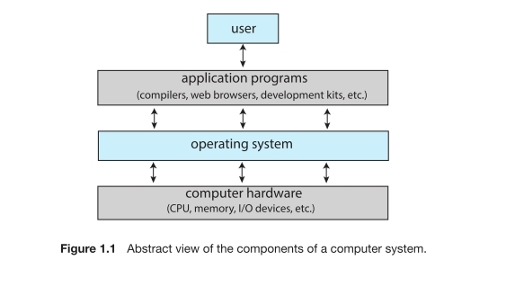

# 1. Introduction

0. operating system? OS란?

   - 컴퓨터의 하드웨어를 매니저 해주는 소프트 웨어 이다.
   - 놀라운 점은 다양한 컴퓨터 환경에서 이것을 해낸 다는 것이다.
   - 차부터  iot까지 어디든지 존재하는 것이 os이다
   - os를 이해하기 위해서는 현대 컴퓨터 환경부터 이해하는 것이 중요하다.
     - 여기서 포함되는 것은 CPU, memory, IO devices 들이다.
   - 운영 체제의 역할은 이 자원들을 프로그램에 할당시켜주는 것이다.

1. OS가 하는 것?

   컴퓨터 시스템은 러프하게 네가지로 나뉠 수가 있다: ***hardware***, ***operating system***, ***application programs***, ***user***

   - hardware

     central processing unit (CPU), memory, input/output (I/O) devices

   - application programs

     워드 프로세서, 스프래드 쉬트, 컴파일러, 웹 브라우저 같은 것들

   1. User view

      user's view은 인터페이스에 의해서 보여진다. 많은 유저들은 랩탑 또는 컴퓨터 모니터 키보드 마우스를 가지고 본다.

      

      점점 증가하는 많은 유저들이 스마트폰이나 태블릿같은 모바일 디바이스로 상호작용을 한다. 이것들이 데스크탑과 랩탑의 컴퓨터 시스템을 대체하기도 했다. 이 장치들은 네트워크와 연결된다.시리와 같은 보이스 input장치와 만나는 것이 요즘 유저들이다.

      임베디드 컴퓨터의 경우 유저들은 어떠한 화면도 안보기도 한다. 그럼에도 거기에는 OS가 있다

   2. System View

      컴퓨터의 시점에서 하드웨어와 친밀하게 감겨있는 프로그램은 os이다. os는 **자원 할당자**이다. 컴퓨터 시스템은 많은 자원을 가지고 있고 그 자원들은 문제를 해결하는데 요구되어진다. cpu 시간, memory 공간, 저장 공간, input/output 장치, 그리고 기타 등등. is는 자원 메니저와 같다. 많은 그리고 가능한 충돌되버린 요구되는 자원들을 마주할 때 os는 결정해야만 한다. 어떻게 특정 프로그램에게 자원을 할당 하고 줄 것인다.

   3. Defining Operating Systems

      os는 많은 역할과 할일이 있다는 것을 우리는 확인했다. 

      다양성에 대해서 설명하기 위해 우리는 컴퓨터의 역사를 봐야할 필요가 있다. ~~하지만 역사는 재미없으니 생략하고 싶다~~ 컴퓨터는 급격하게 진화했다. 컴퓨팅은 완료될 수 있는 것을 결정하는 실험으로부터 시작되었고 군사적(암호 해독, 궤도 구성 등), 정부적(켄서스 계산기) 목적으로 옮겨졌다. 이것들은 초반 컴퓨터들을 진화시켰다 일반적인 목적으로. 1960년대 **무어의 법칙**은 트랜지스터의 밀집도가 1년반마다 두배가 될 것이라고 예측했고 그 예측은 정확했따. 컴퓨터는 엄청난 것을 얻기 시작했고 엄청난 숫자와 다양한 os를 얻기 시작했따.

      그러면 우리는 os를 어떻게 정의해야할까? 일반적으로 우리는 os에 대해 완전히 적정치 않은 정의를 가지고 있다. os는 존재한다 왜냐하면 그들은 사용할 수 있는 컴퓨터 시스템을 만들기 위한 문제를 해결하기 위한 방법이라는 적절한 것을 제공하기 때문이다. 컴퓨터 시스템의 근본적인 목표는 **프로그램을 실행하고 문제를 더 쉽게 해결하기 위해**이다. 

      os에 대해서 제대로 정의를 한 적이 없다. 간단한 관점으로는 이것은 모든 밴더쉽을 포합하고 있다 너가 os라고 부르는 것들에 대해서. 커널이라고 부르는 것들도 os이고 다양하게 정의가 가능할 것이다. 다양한 관점에서 볼 수가 있다.

      우리의 목적에 따라 요약하자면 os는 **항상 실행되는 커널**, **미들웨어 프레임워크들**, **시스탬 프로그램** 들이라고 할 수가 있을 것이다.

