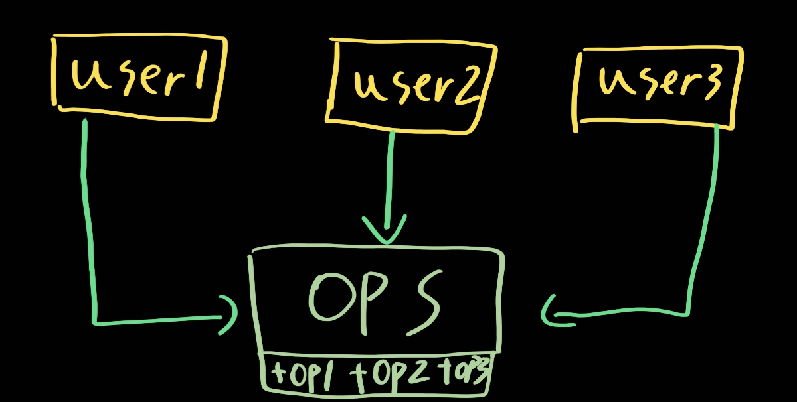
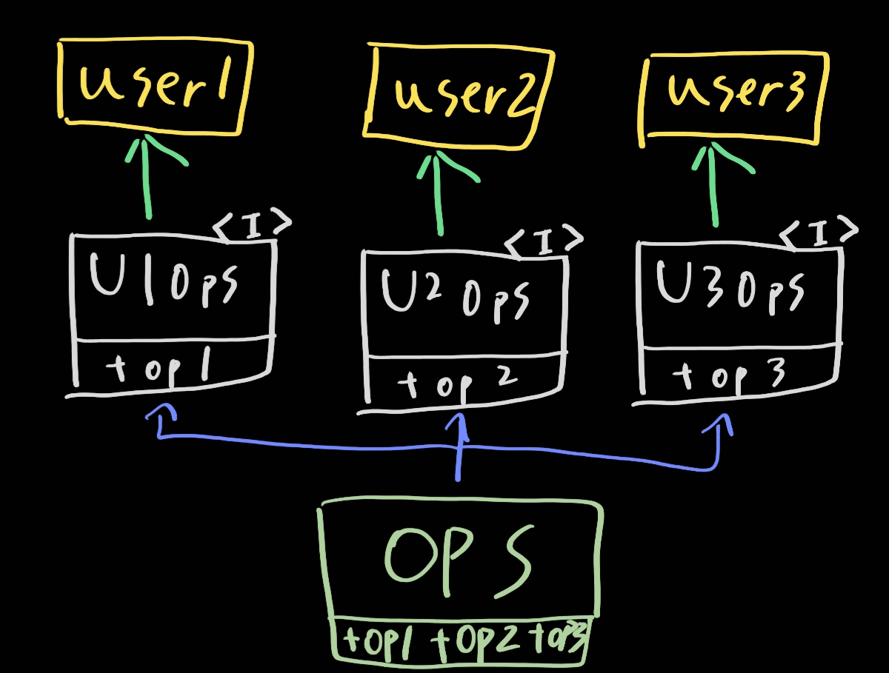

# 10. ISP: 인터페이스 분리 원칙

> 1. ISP와 언어
> 2. ISP와 아키텍처
> 3. 결론

인터페이스 분리 원칙은 아래 그림과 같은 다이어그램에서 그 이름이 유래했다. 

다수의 사용자가 각자 숫자에 해당하는 op를 사용한다고 가정하자. 그리고 ops가 정적 타입 언어로 작성된 클래스라고 해보자. user1은 op2,op3를 이용하지 않는데 소스 코드는 이 두 메서드에 의존한다. 이러한 문제는 수정시에 다양한 에러와 더욱더 많은 수정사항을 낳는다.

이것을 아래 그림과 같이 바꾼다면 해결할 수 있을 것이다.

## 1. ISP와 언어

정적 타입 언어는 사용자가 import, use 또는 include와 같은 타입 선언문을 사용하도록 강제한다. 이처럼 소스 코드에 '포함된' 선언문으로 인해 소스 코드 의존성이 발생하고, 이로 인해 재컴파일 또는 재배포가 강제되는 상황이 무조건 초래한다.

루비나 파있너과 같은 동적 타입 언어에서는 소스 코드에 이러한 선언문이 존재하지 않는다. 대신 런타임에 추론이 발생한다. 따라서 소스 코드 의존성이 아예 없고 재컴파일과 재배포가 필요없다(갓파이썬?) 동적 타입 언어를 사용하면 정적때보다 유연하고 결합도가 낮은 시스템을 쉽게 만들 수가 있다.

사실 이런 이유로 ISP를 아키텍처문제가 아니라 언어 문제로 볼 수도 있다.

## 2. ISP와 아키텍처

ISP의 근본적인 동기를 보자. 잠재되어 있는 더 깊은 우려사항을 볼 수 있다. 필요 이상으로 많은걸 포함하는 모듈에 의존하는 것은 좋지 않다. 재컴파일과 재배포가 필요 이상으로 더 일어난다. 고수준인 아키텍처 수준에서도 마찬가지이다. 의존성을 낮추고 인터페이스를 분리하는 것은 그렇기에 중요하다

## 3. 결론

불필요한 짐을 실은 무언가에 의존함면 예상치 못한 결과가 나올 수 있다. 그것을 조심하고 13장에서 조금 더 자세히 다룰 것이다.