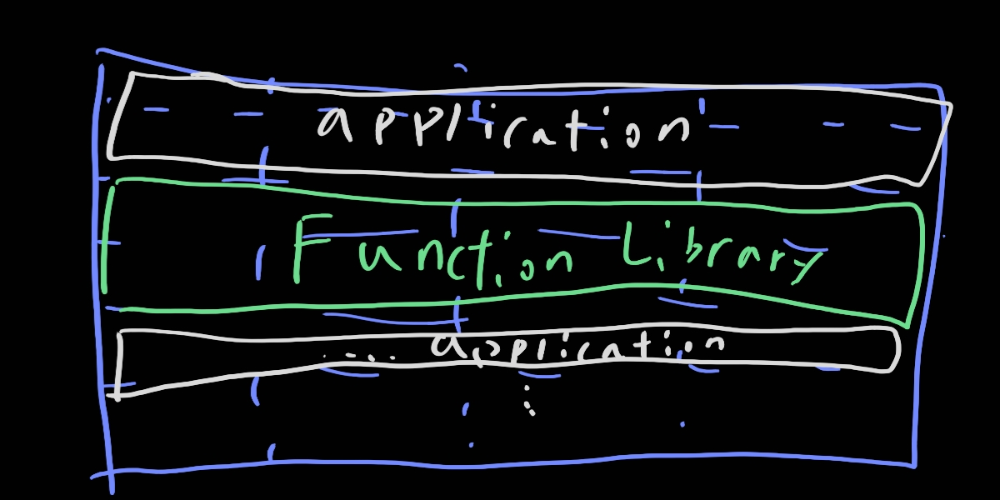

# 12. 컴포넌트

> 1. 컴포넌트의 간략한 역사
> 2. 재배치성
> 3. 링커
> 4. 결론

컴포넌트는 배포 단위다. 배포할 수 있는 가장 작은 단위이다. 컴파일형 언어에서 컴포넌트는 바이너리 파일의 결합체다. 인터프리터형 언어의 경우는 소스 파일의 결합체다.

## 1. 컴포넌트의 간략한 역사

옛 프로그래밍은 메모리에 직접 저장했다. 지금 프로그래밍과는 매우 다를 것이다. 하지만 이럴 경우 대규모 프로그램으로 갈 수록 너무 느려진다. 메모리를 하나씩 배치해야하기 때문이다.

컴파일 시간을 단축시키기 위해 프로그래머는 함수 라이브러리의 소스코드를 애플리케이션 코드로부터 분리했따. 그래서 미리 메모리 영역을 할당하고 거기서 동작할 수 있도록 배치 한다. 즉, 단편화를 진행하는 것이다. 메모리는 아래와 같이 쌓여갈 것이다.

꽤 괜찮은 방식이지만 지속 가능하지는 않다. 계속해서 쌓이게 되면 메모리를 너무 많이 차지하고 넘어갈 것이 뻔하다. 조치가 필요하다

## 2. 재배치성

해결책은 재배치가 가능한 바이너리였다. 아이디어는 지능적인 로더를 이용해서 메모리에 재배치할 수 있는 형태의 바이너리가 생성될 수 있도록 컴파일러를 수정하자는 것이다. 이떄 로더는 재배치 코드가 자리할 위치 정보를 전달받고 로드한 데이터에서 어느 부분을 수정해야 정해진 주소에 로드할 수 있는지 알려주는 플래그가 삽입되었다

프로그래머는 함수 라이브러리를 로드할 위치와 애플리케이션을 로드할 위치를 로더에게 지시할 수 있게 되었다. 이렇게 되어 필요한 함수만 가져올 수 있게 되었다.

컴파일러는 재배치 가능한 바이너리 안의 함수 이르을 메타데이터 형태로 생성하게 수정되었다. 외부 참조로 생성도 하고 외부 정의로 생성도 한다. 그리고 이러한 것들을 링크시킬 수 있도록 링킹 로더가 탄생했다

## 3. 링커

초창기 프로그래머들의 야심도 커져서 프로그램도 커지고 링킹 로더가 초창기인 것도 있었다. 그 둘의 조합은 엄청 느린 링킹 로더를 보여줬고 프로그래머들은 참기 힘든 지경까지 도달했다.

그러다 결국 로드와 링크가 두 단계로 분리 되었다. 느린 부분인 링크 과정을 만들었다. 링커라는 별도의 애플리케이션으로 이 작업을 처리하도록 만들었다. 링커는 재배치 코드를 만든다. 덕분에 로더는 로딩을 빠르게 할 수가 있다. 비록 링커가 느리지만 로딩의 속도가 이것을 커버해주었다.

그리고 프로그램은 점점 커지게 되었다. 로드 시간은 여전히 빨랐지만, 컴파일 - 링크 시간이 병목 구간이었다. 하지만 이 부분은 무어가 해결해주었다. 하드웨어는 말도 안되게 작아지며 빨라졌다. 램은 그만큼 빠르고 로드 시간 뿐만 아니라 링크 시간마저 줄였다.

## 4. 결론

런타임에 플러그인 형태로 결합할 수 있는 동적 링크 파일이 이 책에서 말하는 소프트웨어 컴포넌트에 해당한다.