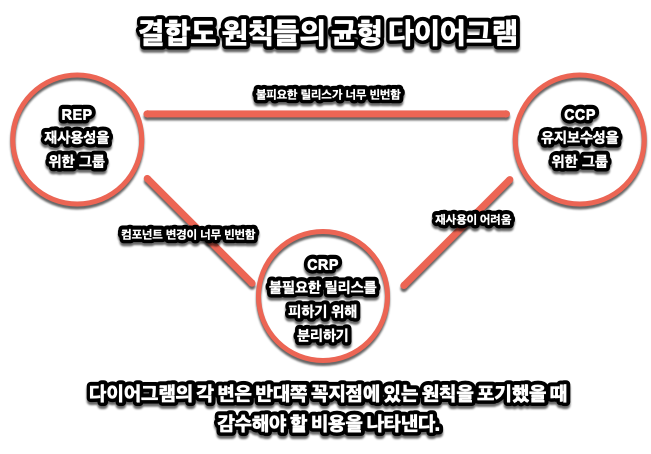

# 13. 컴포넌트 응집도

> 1. REP: 재사용/릴리스 등가 원칙
> 2. CCP: 공통 폐쇄 원칙
> 3. CRP: 공통 재사용 원칙
> 4. 컴포넌트 응집도에 대한 균형 다이어그램
> 5. 결론

다음 세가지 규칙을 가지고 어떤 클래스에 어느 컴포넌트를 포함시킬지 생각하라

- REP: 재사용/릴리스 등가 원칙
- CCP: 공통 폐쇄 원칙
- CRP: 공통 재사용 원칙

## 1. REP: 재사용/릴리스 등가 원칙

> 재사용 단위는 릴리스 단위와 같다.

우리는 재사용의 시대에 살고 있다. 객체 지향 모델의 오랜 약속 중 하나가 실현된 것이다. 돌이켜 보면 이것은 매우 당연하다. 컴포넌트가 추적 관리되지 않거나 번호가 부여되지 않으면 재사용하고 싶어도 못하고 할 수도 없을 것이다.

새로운 릴리스가 나온다는 소식을 접하면, 개발자는 새 릴리스의 변경 사항을 살펴보고 기존 버전을 계속 쓸지 여부를 결정할 것이다. 이 원칙을 소프트웨어 설계와 아키텍처 관점에서 보자. 컴포넌트는 응집성 높은 클래스와 모듈들로 구성시켜야 한다는 소리이다. 컴포넌트를 구성하는 모든 모듈은 서로 공유하는 중요한 테마나 목적이 있어야 한다.

컴포넌트로 묶인 클래스와 모듈은 반드시 함께 릴리스할 수 있어야 한다. 하나의 컴포넌트 안의 것들은 버전 번호가 같아야 하고 동일한 릴리스로 추저고간리되어야 한다. 제작자나 사용자 입장에서나 둘 다 이치에 맞는 이야기이다.

하지만 뭔가 약한 조언이다. 이 조언만으로는 클래스와 모듈을 단일 컴포넌트로 묶는 방법을 제대로 설명하기 힘들다. 그래도 이 원칙은 중요하다. 이 규칙이 어겨지는 것은 눈에 잘 띄기 때문이다. 그리고 이 약한 조언을 커버 쳐주는 것이 뒤따라 오는 규칙들이다

## 2. CCP: 공통 폐쇄 원칙

> 동일한 이유로 동일한 시점에 변경되는 클래스를 같은 컴포넌트로 묶어라. 서로 다른 시점에 다른 이유로 변경되는 클래스는 다른 컴포넌트로 분리하라.

이 원칙은 SRP(단일 책임 원칙)을 컴포넌트에서 다시 쓴 것이다. 클래스 변경 이유가 여러개 있어서는 안되듯 컴포넌트도 마찬가지인 것이다.

대부분의 애플리케이션에서 유지보수성은 재사용성보다 훨씬 중요하다. 차라리 변경이 단일 컴포넌트에서 모두 발생하는 것이 더 낫다. 그러니 차라리 분산시키지 말고 모두 한곳에 묶을 것을 권한다. 물리적 또는 개념적으로 강하게 결합되어 변경되는 클래스들은 하나의 컴포넌트에 묶어두는 것이 좋다

## 3. CRP: 공통 재사용 원칙

> 컴포넌트 사용자들을 필요하지 않는 것에 의존하게 강요하지 마라

이 원칙은 클래스와 모듈이 어느 컴포넌트에 속하는 것이 좋은지 결정할 때 도움이 된다. 재사용되는 경향이 있는 클래스와 모듈들은 같은 컴포넌트에 포함해야 한다.

개별 클래스가 단독으로 재사용되는 경우는 거의 없다. 대체로 재사용 가능한 클래스는 재사용 모듈의 일부로써 해당 모듈의 다른 클래스와 상호 작용하는 경우가 많다. 이런 클래스들은 동일 컴포넌트에 묶어버리자

간단한 사례는 컨테이너 클래스와 이터레이터 클래스가 있다. 이들 클래스는 서로 강하게 결합되어 있어서 함께 재사용된다. 그러니 같은 컴포넌트에 묶는 것이 맞다.

## 4. 컴포넌트 응집도에 대한 균형 다이어그램

위 세가지를 기억하고 아래 그림으로 균형을 생각해보자. 각 변은 반대쪽 꼭지점에 있는 원칙을 포기했을 때 감수해야 할 비용이다.

적당한 밸런싱을 가지고 이 삼각형을 생각하자. 팀은 언제나 변하고 중요도는 변할 수가 있다. 그리고 그때 그때 맞춰야 하는 것이다.

## 5. 결론 

시간 흐름에 따라 균형이 깨질 수도 있다. 시간에 따라 프로젝트의 초점이 달라질 가능성이 높기 때문이다. 그리고 그 때마다 어디에 중점을 두고 설계를 할 것인지 분명히 해둬야 한다.