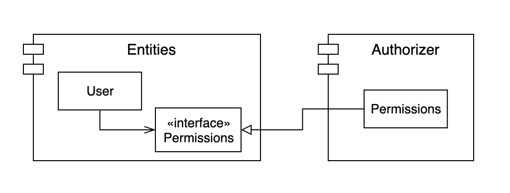
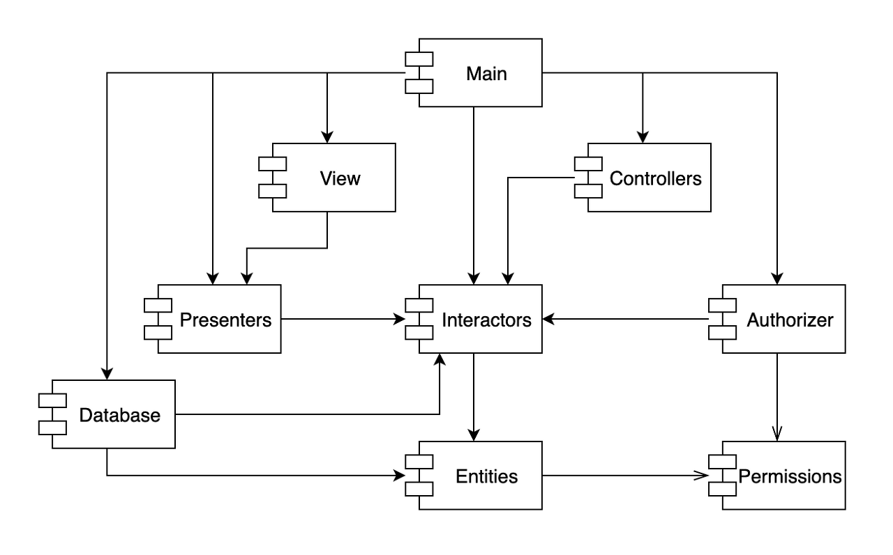
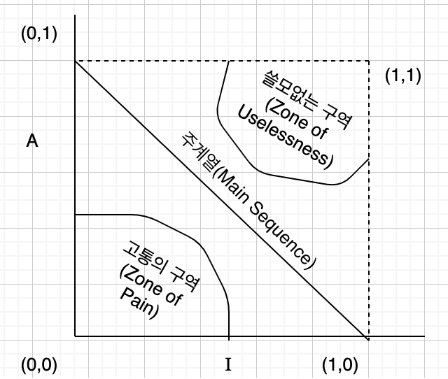

# 14. 컴포넌트 결합

> 1. ADP: 의존성 비순환 원칙
> 2. 하향식(top-down) 설계
> 3. SDP: 안정된 의존성 원칙
> 4. SAP: 안정된 추상화 원칙
> 5. 결론

## 1. ADP: 의존성 비순환 원칙

> 컴포넌트 의존성 그래프에 순환(cycle)이 있어서는 안된다.

무언가 작동하게 만들고 나서 다음날 안돌아가는 코드를 본 적이 있는가? 왜 작동하지 않았을까? 당신보다 더 늦게까지 일한 누군가가 무언가를 수정했기 때문이다.

이 상황은 많은 개발자가 동일한 소스 파일을 수정하는 환경에서 발생한다. 규모가 클 수록 이 상황은 악몽 그 자체가 된다. 이 상황의 해결책으로 두 가지 방법이 발전되어 왔다. 첫 해결책은 '주 단위 빌드'이며, 두번째 해결책은 '의존성 비순환 원칙'이다.

- 주 단위 빌드

  중간 규모정도의 프로젝트에서 흔히 사용된다. 일주일의 첫 4일 동안은 서로 신경쓰지 않고 작업하며, 그런 후 금요일이 되면 변경된 코드를 모두 통합하여 시스템을 빌드한다.

  4일을 고립된 개발자로 지내개해준다는 장점이 있지만 막날에 업보를 치러야 한다는 단점이 있고 이러한 단점은 이것이 큰 규모에서는 도입이 힘들다. 프로젝트가 크다면 하루만에 이 상황을 해결하는 것은 불가능하기 때문이다.

  팀의 빠른 피드백이 가능하다는 장점이 있지만 규모가 커지면 빌드에 시간을 많이 쓰게 되고 빠른 피드백이라는 장점을 감추게 되니 조심해야 한다

- 순환 의존성 제거하기

  릴리스 가능한 컴포넌트 단위로 분리하는 것이다. 이를 통해 컴포넌트는 개별 개발자 또는 단일 개발팀이 책임질 수 있는 작업 단위가 된다. 개발자는 해당 컴포넌트가 동작하도록 만든 후, 해당 컴포넌트를 릴리스하여 다른 개발자가 사용할 수 있도록 만든다. 담당 개발자는 이 컴포넌트에 릴리스 번호를 부여하고, 다른 팀에서 사용할 수 있는 디렉터리로 이동시킨다. 그 다음 자신만의 공간에서 컴포넌트를 지속적으로 수정하면 된다.

  이 같은 작업 절차는 단순하며 합리적이어서 널리 사용되는 방식이다. 하지만 이 절차가 성공적으로 동작하려면 컴포넌트 사이의 의존성 구조를 반드시 관리해야 한다. 순환이 존재하면 안된다.

  컴포넌트 다이어그램을 그려서 구조를 살펴보면서 이러한 순환이 있는지 없는지 항상 체크하는 것이 좋을 것이다. 

- 순환이 컴포넌트에 미치는 영향

  

  위와같이 순환 구조가 있다고 해보자. 이 순환은 바로 문제를 일으킨다. 예를 들어 Database 컴포넌트를 만드는 개발자는 컴포넌트를 릴리스하려면 Entities컴포넌트와 반드시 호환되어 햔다. Entities는 Authorizer와도 호환되어야 하고 Authorizer은 Interactors와도 호환되어야 한다. Database입장에서는 Entities와 Authoirzer, Interactors가 결합되있는 커다란 컴포넌트에 의존하고 있는 상황처럼 보인다.

  위 결과로 각 해당하는 개발자들은 서로 얽매이게 될 것이다. 간단한 단위테스트에서도 저 커다란 결합컴포넌트를 빌드를 해야하고 다양한 문제점이 많이 생긴다. 거기다 빌드 순서도 파악하기 힘들어진다.

- 순환 끊기

  두가지 주요 메커니즘이 있다.

  1. 의존성 역전 원칙을 적용한다. 예를 들어 User가 필요로 하는 메서드를 제공하는 인터페이스가 있다고 하자. 그 인터페이스를 Entities 내부에 위치시키고 Authorizer는 이 인터페이스를 상속받는다. 이렇게 하면 Entities와 Authorizer 사이의 의존성을 역전시킬 수가 있다. 그리고 이를 통해 순환이 끊어진다.

     

  2. Entities와 Authorizer가 모두 의존하는 새 컴포넌트를 만들자. 그러면 의존성 순환이 끊기게 될 것이다

     

- 흐트러짐

  두번째 해결책의 시사하는 바는 요구사항이 변경되면 컴포넌트 구조도 변경시킬 수 있다는 사실이다. 의외로 이런 상황은 자주 볼 수도 있다. 의존성 구조는 서서히 흐트러지며 또 성장하기 때문이다. 따라서 의존성 구조에 순환이 발생하는지를 항상 관찰해야 한다. 순환이 발생하면 어떤 식으로든 끊어야만 한다

## 2. 하향식 설계

우리는 새로운 결론에 다다를 것이다. 즉, 컴포넌트 구조는 하향식으로 설계가 불가능 하다는 것이다. 컴포넌트는 시스템에서 가장 먼저 설계할 수 있는 대상이 아니며, 시스템과 성장하고 변경될 때 같이 변경된다.

그리고 우리는 계속해서 컴포넌트가 쌓임에 따라 단일 책임 원칙과 공통 폐쇄 원칙에 관심이 생긴다. 의존성 구조와 관련된 최우선 관심사는 변동성을 격리하는 일이다. 우리는 변덕스러운 이유로 자주 변경되는 컴포넌트로 인해, 그렇지 않았다면 안정적이었을 컴포넌트가 영향받는 일을 원치 않는다. 컴포넌트 의존성 그래프는 자주 변경되는 컴포넌트로부터 안정적이며 가치가 높은 컴포넌트를 보호하려는 아키텍트가 만들고 가다듬게 된다.

애플리케이션이 성장하면서 우리도 재사용가능한 요소를 만드는데에 관심을 기울여야 한다. 컴포넌트를 조합하는 과정에서 공통 재사용 원칙(CRP)이 영향을 미치며 결국 순환이 발생하면 ADP가 적용되고 그래프는 다시 흐트러지고 성장할 것이다.

## 3. SDP: 안정된 의존성 원칙

> 안정성의 방향으로(더 안정된 쪽에) 의존하라

설계는 정적일 수 없다. 변경은 불가피 할 것이다.  공통 폐쇄 원칙을 준수함으로써, 컴포넌트가 다른 유형의 변경에는 영향받지 않으면서도 특정 유형의 변경에만 민감하게 만들 수 잇다. 일부는 변동성을 지니도록 설계할 수 밖에 없고 예상해야만 한다.

의존성을 매달아 버리면 당신의 모듈도 변경하기 어려워진다는 것을 항상 기억하자. 의존성 원칙을 준수하도록 하자.

- 안정성

  무언가가 안정적이다는 어떻게 정의할 수 있을까? 우리는 변경의 어려움이 컴포넌트에 의존하게 만드는 것에서 비롯된다는 것을 알고 있다. 즉, 컴포넌트가 의존을 받게되면 받게될 수록 안정성이 높다고 할 수가 있고 반대로 컴포넌트가 의존을 하면 할 수록 안정성이 낮다고 할 수가 있다

- 안정성 지표

  측정할 수가 있을까? 아래와 같이 계산할 수는 있다

  - Fan-in: 안으로 들어오는 의존성. 컴포넌트 내부의 클래스에 의존하는 컴포넌트 외부의 클래스 개수
  - Fan-out: 바깥으로 나가는 의존성. 컴포넌트 외부의 클래스에 의존하는 컴포넌트 내부의 클래스 갯수
  - I(불안정성): I = Fan-out / (Fan-in + Fan-out). 0 에 가까울 수록 안정적이고 1에 가까울 수록 불안정하다고 할 수가 있다.

  C++에서는 이런 의존성이 `#include`문을 이용해서 표현되고 자바는 import구문과 완전한 클래스 이름의 개수를 세어서 계산이 가능하다.

- 모든 컴포넌트가 안정적이어야 하는 것은 아니다.

  모든 컴포넌트가 최고로 안정적인 시스템이라면 변경이 불가능하다. 좋지 않은 상황이다. 유지보수란 것이 왜 있겠는가? 그리고 사실 거의 불가능한 설계이다. 우리가 변경하기 쉽도록 설계한 컴포넌트를 과도하게 안정적이게 만든다면 우리는 해당 컴포넌트를 변경시키는데에 매우 큰 어려움을 느끼게 될 것이다.

  DIP를 도입하여 그러한 문제를 해결할 수도 있다. 대신 의존할 컴포넌트(인터페이스만을 포함한)를 하나 만들고 우리가 변경하기 쉽게 만든 컴포넌트도 해당 컴포넌트를 의존하게 한다면 제작하기 편해진다

- 추상 컴포넌트

  오로지 인터페이스만을 포함하는 컴포넌트를 생성하는 방식이 이상할 수도 있다. 근데 의외로 정말 많이 쓴다. 정적언어에서는 익숙한 형태이다

## 4. SAP: 안정된 추상화 원칙

> 컴포넌트는 안정된 정도만큼만 추상화되어야 한다.

- 고수준 정책을 어디에 위치시켜야 하는가?

  시스템에는 자주 변경해서는 절대로 안 되는 소프트웨어도 있다. 고수준 아키텍처나 정책 결정과 관련된 소프트웨어가 그 예다. 고수준 정책을 캡슐화하는 소프트웨어는 반드시 안정된 컴포넌트에 위치해야한다.

  하지만 고수준 정책을 안정된 컴포넌트에 위치시키면, 그 정책을 포함하는 소스 코드는 수정이 어렵다. 이러한 결과로 시스템의 유연성을 잃는다. 안정적이면서 유연한 상태를 만들 수가 있을까? 개방 폐쇄 원칙(OCP)에서 찾을 수 있다. OCP에서는 클래스를 수정하지 않고도 확장이 충분히 가능할 정도로 클래스르르 유연하게 만든다. 어떤 클래스가 이 원칙을 준수하는가? 추상 클래스다

- 안정된 추상화 원칙

  위 원칙은 안정성과 추상화 정도 사이의 관계를 정의한다. 이 원칙은 한편으로는 안정된 컴포넌트는 추상 컴포넌트여야 하며, 이를 통해 안정성이 컴포넌트를 확장하는 일을 방해해서는 안된다고 말한다. 반대로 불안정한 컴포넌트는 구체 컴포넌트여야 한다.

  따라서 안정적인 컴포넌트라면 반드시 인터페이스와 추상 클래스로 구성시켜 쉽게 확장할 수 있게 해야한다.

  SAP와 SDP를 결합하면 DIP와 마찬가지이다. 하지만 DIP는 클래스에 대한 원칙이며, 클래스의 경우 중간은 없다.

- 추상화 정도 측정하기

  - Nc: 컴포넌트의 클래스 개수
  - Na: 컴포넌트의 추상 클래스와 인터페이스의 개수
  - A: 추상화 정도. A = Na / Nc

  0이면 컴포넌트에 추상 클래스가 하나도 없다는 뜻, 1이면 추상클래스만 존재한다는 뜻이다

- 주계열

  안정성과 추상화 정도 사이의 관계를 정의할 때다. 컴포넌트는 안정화 정도와 추상화 정도가 다양하다. 하지만 크게 구역을 나눠서 그림으로 표현한다면 아래 그림과 같다.

  

- 고통의 구역

  이 컴포넌트는 매우 안정적이며 구체적이다. 이러한 컴포넌트는 바람직하지 못하다. 추상적이지 않아 확장이 힘들고 안정적이어서 변경도 어렵다. 이 근처에 두지 않는 것이 최적이다. 그런데 일부 소프트웨어 엔티티는 고통의 구역에 위치하기도 한다. 데이터베이스 스키마가 한 예다.

  변동성이 없는 컴포넌트는 여기에 위치해도 해롭지는 않다. 변동될 가능성이 없기 때문이다. 즉, 변동의 가능성이 있는 컴포넌트가 여기 위치에 해당한다면 매우 골치아프다는 소리고 조심스럽게 제어해야 한다

- 쓸모없는 구역

  여기도 썩 바람직하진 않다. 최고로 추상적이지만 누구도 의존하지 않기 때문이다. 즉, 쓸모가 정말 없다.

- 배제 구역 벗어나기.

  따라서 주계열 라인에 있는 것이 꽤 바람직하다고 생각된다. 안정성에 비해 과하게 추상적이지도 추상화 정도에 비해 과도하게 불안정하지도 않기 때문이다. 

  그리고 우리가 뛰어난 아키텍트라면 여기에 컴포넌트들이 위치할 수 있도록 하는 것이 좋다

- 주계열과의 거리

  여기에서 세번째 지표가 도출된다. 주계열 바로 위에, 또는 가까이 있는 것이 바람직하다면, 이 이상적인 상태로부터 컴포넌트가 얼마나 떨어져 있는지이다

  - D: 거리. `D=|A + I - 1|` 0이면 주계열 바로 위에 위치한다는 뜻이고, 1이면 주계열과 멀다는 의미이다.

  우리는 이 값을 이용해 컴포넌트를 재검토할 수가 있다. 통계적으로 분석하는 일또한 가능해진다.

  이 지표의 또다른 활용방안은 릴리스에 따른 분석이다. 버전별로 주계열에서 벗어나는 상황인지 아닌지 파악이 가능해진다

## 5. 결론

지표는 신이 아니지만 언제나 참고할 만하고 우리는 이것을 기초로 파악하는 것도 가능하다

