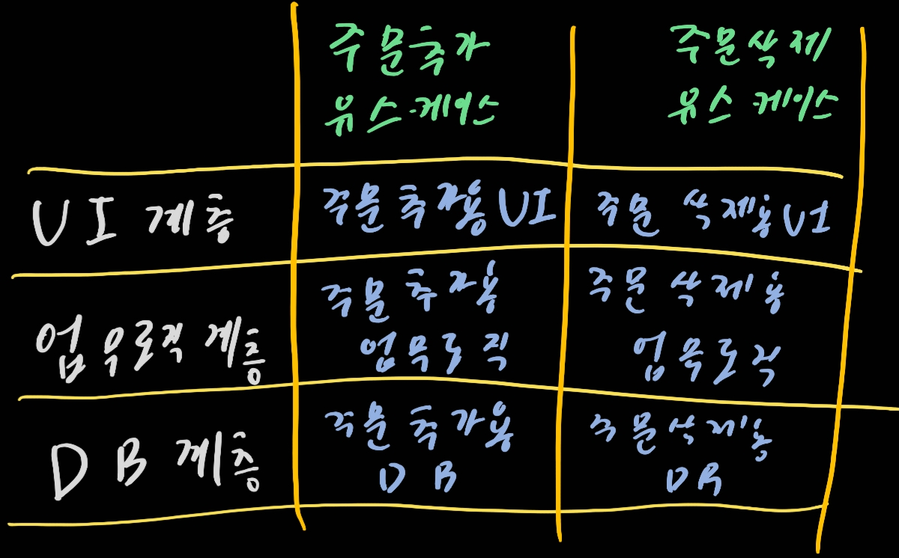

# 16. 독립성

> 1. 유스케이스
> 2. 운영
> 3. 개발
> 4. 배포
> 5. 선택사항 열어놓기
> 6. 계층 결합 분리
> 7. 유스케이스 결합 분리
> 8. 결합 분리 모드
> 9. 개발 독립성
> 10. 배포 독립성
> 11. 중복
> 12. 결합 분리 모드(다시)
> 13. 결론

좋은 아키텍처는 이것들을 지원해야 한다

- 시스템의 유스케이스
- 시스템의 운영
- 시스템의 개발
- 시스템의 배포

## 1. 유스케이스

아키텍처는 시스템의 의도를 지원해야 한다는 뜻이다. 만약 시스템이 장바구니 애플리케이션이라면, 이 아키텍처는 장바구니와 관련된 유스케이스를 지원해야 한다. 실제로 아키텍트의 최우선 관ㅅ미사는 유스케이스이며, 아키텍처에서도 유스케이스가 최우선이다. 아키텍처는 반드시 유스케이스를 지원해야 한다.

그러나 아키텍처는 시스템의 행위에 그다지 큰 영향을 주지 않는다. 그렇지만 영향력이 전부가 아니다. 좋은 아키텍처는 행위를 지원하기 위해 할 수 있는 일 중에서 가장 중요한 사항은 행위를 명확히 하고 외부로 드러내며, 시스템이 지닌 의도를 아키텍처 수준에서 알아볼 수 있게 만드는 것이다.

해당 내용은 21장에서 조금 더 명확하게 설명할 수 있도록 한다

## 2. 운영

아키텍처는 실질적이고 덜 피상적인 역할이다. 시스템이 초당 100000명의 고객을 처리한다면 아키텍처는 이 요구와 관련된 각 유스케이스에 걸맞은 처리량과 응답시간을 보장해야 한다. 시스템이 뭔가를 한다면 아키텍처는 이것이 가능할 수 있도록 구조화해야한다

이러한 형태를 지원한다는 말은 시스템에 따라 다양한 의미를 지닌다. 어떤 시스템은 어떠한 아키텍처 저 시스템은 저런 아키텍처. 다양하게 보일 것이다

이상하게 보일 수도 있지만, 이러한 결정은 뛰어난 아키텍트라면 열어두어야 하는 선택사항 중의 하나다. 만약 시스템이 단일체로 작성되어 모노리틱 구조를 갖는다면, 다중 프로세스, 다중 스레드, 또는 마이크로서비스 형태가 필요해질 때 개성하기 어렵다. 반대로 아키텍처에서 컴포넌트를 적절히 격리하고 유지하고 통신 방식을 제한하지 않는다면, 요구사항이 바뀌어도 적절하게 잘 작동할 것이다.

## 3. 개발

아키텍처는 개발환경을 지원하는 데 있어 핵심적인 역할을 수행한다.

> 시스템을 설계하는 조직이라면 어디든지 그 조직의 의사소통 구조와 동일한 구조의 설계를 만들어 낼 것이다.

관심사가 다양한 조직에서 개발해야한다면, 각 팀이 독립적으로 행동하기 편한 아키텍처로 서로 방해받지 않게 해야한다.

## 4. 배포

아키텍처는 배포 용이성을 결정하는 데 중요한 역할을 한다. 목표는 '즉각적인 배포' immediate deployment다. 좋은 아키텍처는 꼭 필요한 디렉터리나 파일을 수작업으로 생성하게 내버려 두지 않는다. 그리고 이러한 시스템을 만들려면 컴포넌트 단위로 적절하게 분할하고 격리시켜야 한다.

## 5. 선택사항 열어놓기

좋은 아키텍처는 각 관심사를 모두 만족시킨다. 말은 쉽다! ~~야발~~

현실에서는 컴포넌트 구조와 관련된 관심사들 사이에서 균형을 잡기가 정말 어렵다. 대부분 모든 유스케이스를 알 수도 없고 운영하는 데 따르는 제약사항, 팀 구조, 배포 요구사항조차 모르기 때문이다. 알고 있어도 생명주기의 단계를 하나씩 거쳐감에 따라 변한다! 현실은 모든것이 시시각각변한다. welcome to the real world

하지만 이런 변화 에서도 사라지지 않는 것이 있다. 몇몇 아키텍처 원칙은 구현하는 비용이 비교적 비싸지 않으며, 관심사들 사이에서 균형을 잡는 데 도움이 된다. 균형의 목표점을 명확히 그리기에도 도움이 된다.

## 6. 계층 결합 분리

모든 유스케이스를 지원하고 싶지만 유스케이스 전부를 알 수 없다. 하짐나 기본적인 의도는 분명히 알고 있다. 아키텍트는 단일 책임 원칙과 공통 폐쇄 원칙을 적용하여, 그 의도의 맥락에 따라서 다른 이유로 변경되는 것들은 분리하고, 동일한 이유로 변경되는 것들은 묶는다.

서로 다른 이유로 변경되는 것은 무엇일까? 하지만 분명한 것들은 있다. 예를 들어 사용자 인터페이스가 변경되는 이유는 업무 규칙과 관련이 없을 것이다. 그리고 우리는 이 두가지가 독립적이니 각자 유스케이스를 만들어야한다는 것을 당연히 알 수 있다. 둘을 엮어서 유스케이스를 만들 필요는 없다

업무 규칙은 그 자체가 애플리케이션과 밀접한 관련이 있거나, 혹은 더 범용적일 수도 있다.데이터베이스, 쿼리 언어, 스키마조차도 기술적인 세부사항이며, 업무 규칙이나 UI와는 관련이 1도 없다. 즉, 우리는 이들을 시스템의 나머지 부분으로부터 분리하여 독립적으로 변경할 수 있도록 해야만 한다.

## 7. 유스케이스 결합 분리

서로 다른 이유로 변경되는 것은 또 무엇이 있을까? 유스케이스 그 자체이다. 주문 입력 시스템에서 주문을 추가하는 유스케이스는 주문을 삭제하는 유스케이스와 다르다. 유스케이스는 시스템을 분할하는 매우 자연스러운 방법이다. 이와 동시에 유스케이스는 시스템의 수평적인 계층을 가로지르도록 자른, 수직으로 좁다란 조각이기도 하다. 우리는 시스템을 수평적 계층으로 분할하면서 동시에 해당 계층을 가로지르는, 얇은 수직적인 유스케스로 시스템을 분할할 수 있다.

이와 같이 결합을 분리하려면 주문 추가 유스케이스의 UI와 주문 삭제 유스케이스의 UI를 분리해야 한다. 업무 규칙과 DB부분도 마찬가지이다. 이런 식으로 맨 아래 계측까지 수직으로 내려가며 유스케이스들이 각 계층에서 서로 겹치지 않게 한다.

유스케이스도 잘 독립적으로 진행해야하는 것이다

## 8. 결합 분리 모드

유스케이스에서 서로 다른 관점이 분리되었다면, 높은 처리량을 보장해야 하는 유스케이스와 낮은 처리량으로도 충분한 유스케이스는 이미 분리되어 있을 것이다. UI와 데이터베이스가 업무 규칙과 분리되어 있다면, UI와 데이터베이스는 업무 규칙과는 다른 서버에서 실행될 수 있다. 높은 대역폭을 요구하는 유스케이스는 여러 서버로 복제하여 실행할 수 있다.

유스케이스를 위해 수행하는 결합 분리는 운영에도 도움이 된다. 하지만 운영 측면에서 이점을 살리기 위해서 결합을 분리할 때 적절한 모드를 선택해야 한다. 작동이 되어도 이상한 상황을 만들어서는 안된다. 분리된 컴포넌트들은 반드시 독립적인 서비스가 되어야하고, 네트워크를 통해 서로 통신해야 한다.

이러한 컴포넌트를 서비스 또는 마이크로서비스라고 한다. 구분하기에는 모호하다. 서비스에 기반한 아키텍처를 서비스 지향 아키텍처라고 부르기도 한다. 다양한 용어가 나오지만 핵심은 `우리는 때떄로 컴포넌트를 서비스 수준까지도 분리해야 한다` 이것이 중요한 핵심이다.

그리고 좋은 아키텍처는 선택권을 열어둔다

## 9. 개발 독립성

컴포넌트가 완전히 분리되면 팀 사이의 간섭은 줄어든다. 업무 규칙이 UI를 알지 못하면 UI에 중점을 둔 팀은 업무 규칙에 중점을 둔 팀에 그다지 영향을 줄 수 없다. 유스케이스 자체도 서로 결합이 분리되면 좋을 것이다.

## 10. 배포 독립성

유스케이스와 계층의 결합이 분리되어 있다면 배포 측면에서도 고도의 유연성을 얻을 수가 있다. 실제로 제대로 분리했다면 운영 중인 시스템에서도 계층과 유스케이스를 교체할 수 있다.

## 11. 중복

중복에 대한 공포로 함정에 빠지곤 한다. 중복은 일반적으로 나쁜 것이다. 하지만 중복에도 여러 종류가 있다.

예를 들어 두 유스케이스의 화면 구조가 비슷하다. 우리는 통합하고 싶은 유혹을 느낄 수가 있다. 그렇다면 우리는 이것을 진행해야하나? 진짜 중복인가? 아니면 우발적으로 일어난 중복인가?

우발적 중복일 가능성이 크다. 진행이 되면서 둘은 서로 다른 형태를 띄우게 될 것이다. 즉, 통합을 하지 않는 것이 정답이었다. 우리는 신중하게 진행해야 한다. 유스케이스를 수직으로 분리할 때 이러한 문제를 자주 마주치지만 어떠한 중복인지 제대로 확인을 해야한다.

마찬가지로 계층을 수평으로 분리하는 경우, 특정 데이터베이스 레코드의 데이터 구조가 특정 화면의 데이터 구조와 비슷하다는 점을 발견할 수도 있다. 그리고 이경우에도 동일한 뷰를 이용해 화면에 보이고 싶을 수도 있는 유혹을 받을 것이다. 조심해라! 우발적 중복인지 아니면 진짜 중복인지 한번더 체크를 하라

## 12. 결합 분리 모드 (다시)

그렇다면 우리는 다시 결합 분리 모드로 돌아가보자. 계층과 유스케이스의 결합을 분리하는 방법은 다양하다. 소스 코드 수준에서 분리할 수도 있으며, 배포 수준에서도, 실행 단위 수준에서도 분리할 수 있다.

- 소스 수준 분리 모드: 소스 코드 모듈 사이의 의존성을 제어할 수 있다. 이로 인해 다른 모듈이 변경이 되어도 재 컴파일 하지 않도록 할 수가 있다. 서로 통신할 때는 간단한 함수 호출을 사용한다.
- 배포 수준 분리 모드: 파일들, 라이브러리와 같이 배포 가능한 단위들 사이의 의존성을 제어할 수 있다. 이를 통해 한 모듈의 소스 코드가 변하더라도 다른 모듈을 재빌드하거나 재배포하지 않도록 만들 수 있다.
- 서비스 수준 분리 모드: 의존하는 수준을 데이터 구조 단위까지 낮출 수 있고, 순전히 네트워크 패킷을 통해서만 통신하도록 만들 수 있다.

어떤 모드가 좋을까? 초기 단계에서는 알기 어렵다. 프로젝트가 성정하면서 우리는 최적인 모드를 알 수가 있고 달라질 수도 있다.

한 가지 해결책은 단순히 서비스 수준에서의 분리를 기본 정책으로 삼는 것이다. 이 방식은 비용이 많이 드록, 결합이 큰 단위에서 분리된다는 문제가 있다. 충분히 작은 단위에서 분리될 가능성은 거의 없다. 다른 문제점은 시스템 자원 측면에서도 비용이 많이 든다. 하지만 후자의 부분은 전자에 비하면 비싸진 않다

서비스화될 가능성이 있다면 컴포넌트 결합을 분리하되 서비스가 되기 직전에 멈추는 방식을 저자는 선호한다. 그러고는 컴포넌트들을 가능한 한 오랫동안 동일한 주소 공간에 남겨둔다. 이를 통해 서비스에 대한 선택권을 열어 둘 수 있다.

좋은 아키텍처는 시스템이 모노리틱 구조로 태어나서 단일 파일로 배포되더라도, 이후에는 독립적으로 배포 간으한 단위들의 집합으로 성장하고, 또 독립적인 서비스나 마이크로서비스 수준까지 성장할 수 있도록 만들어져야 한다. 또한 좋은 아키텍처라면 상황이 바뀌어도 거꾸로 돌려 원래 형태인 모노리틱 구조로 되돌릴 수 있어야 한다.

## 13. 결론

물론 까다롭다. 하지만 결합 분리 모드는 시간ㅇ니 지나면서 바뀌기 쉬우며, 뛰어난 아키텍트라면 변경을 예측하여 큰 무리 없이 반영할 수 있도록 만들어야 한다는 점이다.
