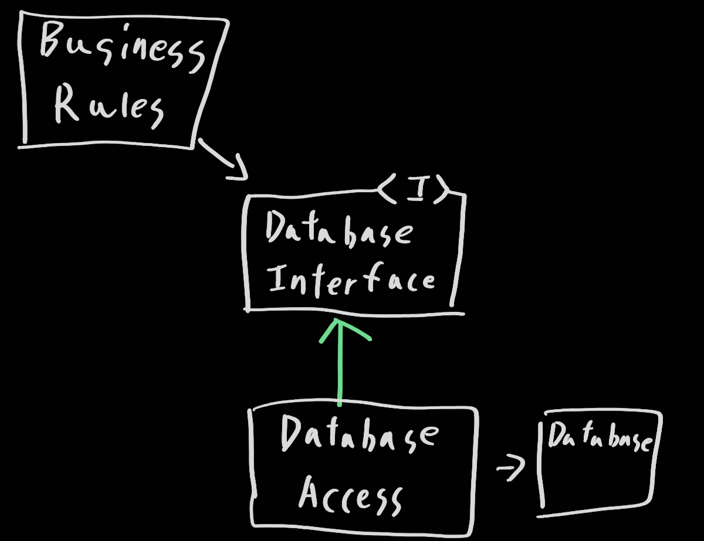
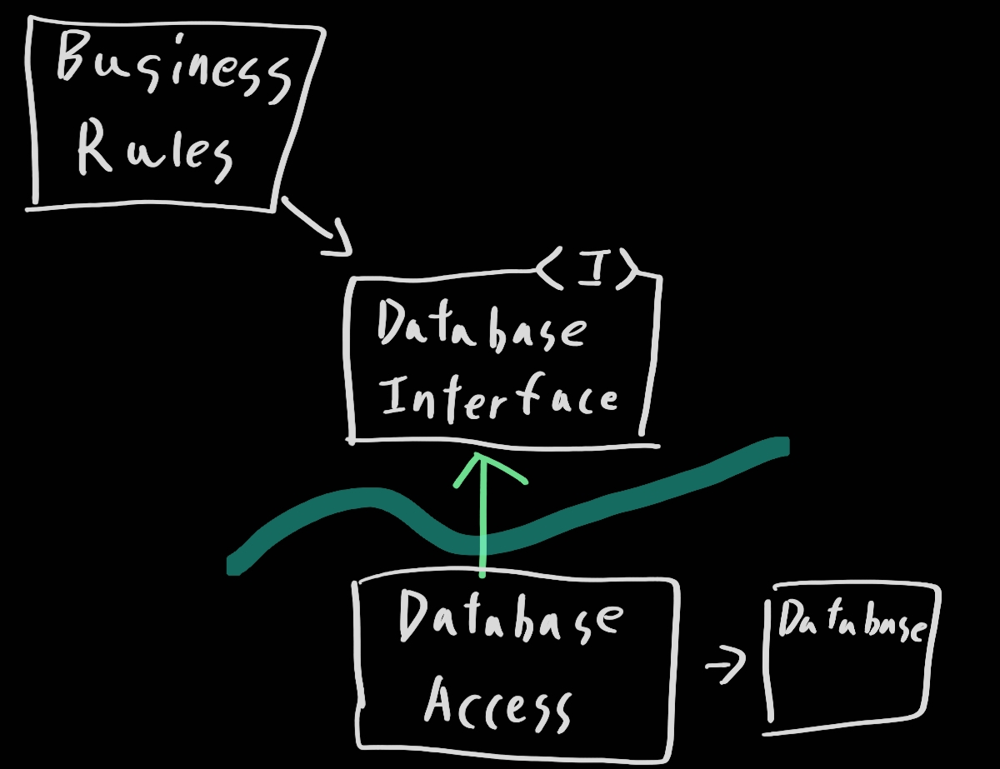
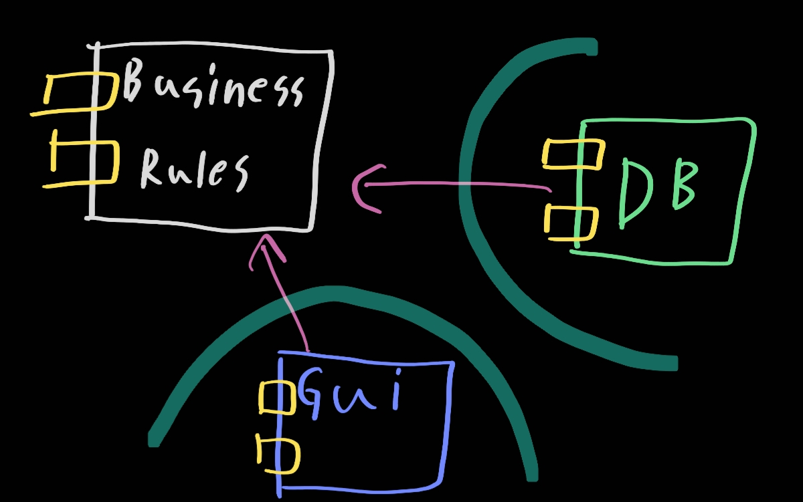

# 17. 경계: 선 긋기

> 1. 두 가지 슬픈 이야기
> 2. FitNesse
> 3. 어떻게 선을 그을까? 그리고 언제 그을까?
> 4. 입력과 출력은?
> 5. 플러그인 아키텍처
> 6. 플러그인에 대한 논의
> 7. 결론

소프트웨어 아키텍처는 선을 긋는 기술이며, 나는 이러한 선을 경계라고 부른다. 경계는 아래와 같은 일을 한다

- 소프트웨어 요소를 서로 분리
- 경계를 중심으로 양쪽의 요소는 서로 알지 못하도록 막는다

이 경계는 초기에 또는 아주 나중에 그어지기도 한다. 그러니 핵심을 오염시키지 못하게 만드는 것으로 생각해야 한다. 그래야 필요시 경계를 그을 수가 있다. **아키텍트의 목표는 필요한 시스템을 만들고 유지하는 데 드는 인적 자원을 최소화하는 것이라는 사실을 상기하자.** 그리고 이 효율성의 중심에는 경계와 결합이 있다. 

어떤 종류의 결정이 결정인가? 시스템의 업무 요구사항, 즉 유스케이스와 아무런 관련이 없는 결정이다. 좋은 시스템 아키텍처란 이러한 결정이 부수적이며, 결정을 연기할 수 있는 아키텍처다.

## 1. 두가지 슬픈 이야기

어떤 회사의 슬픈 이야기를 들어보자.결정은 필요할 때 해야한다. 너무 이르면 위험이 따른다는 충고를 위함이다. 이 회사의 프로젝트는 데스크톱 GUI 애플리케이션으로 성장할 정도로 대중적이며 큰 성공을 거뒀다. 그러나 시대의 흐름에 따라 웹이 대세가 되었고 모두가 웹 솔루션을 확보해야만 했다. 이 회사도 마찬가지이다.

고객들도 웹 기반 버전을 요구했으며 이를 위해 젋은 자바 프로그래머를 다수 고용했고, 자사 제품을 웹 버전으로 변환하는 프로젝트를 시작했다. 그들은 서버 팜이 춤추는 이상을 꿈꾸었다. 그리고 이에 대한 구성을 gui 서버, 미들웨어 서버, 데이터베이스 서버 로 생각했다.

모든 도메인 객체가 세 가지 인스턴스를 가져야 한다는 결정까지 했다. 그리고 이것은 너무 일렀다. 각 인스턴스가 gui, 미들웨어, 데이터베이스 용으로 쓰는 것은 맞긴 하지만 만약에 필요한 인스턴스가 추가된다면? 그렇다면 각 통신을 위한 작업이 계속해서 더 추가 될 것이다. 간단한 일 하나를 위해 모든 인스턴스에 메시지 수신 송신도 달고 직렬화 등 다양한 행위를 진행해야한다.

당연하게도 개발과정동안 서버 팜을 확보할 수 없었다. 오히려 세 개의 실행 파일 모두 단일 장비에서, 세 개의 서로 다른 프로세스로 실행했다. 이러한 방식으로 개발을 계속 진행했다. 그리고 슬프게도 그들은 자신들의 아키텍처가 옳다고 확신했으며 단일 장비로 실행하고 있음에도, 이 모든 작업을 단일머신에서 실행시키는 작업을 진행했다. 즉, 서버팜에서 굴러갈 것이라는 굳은 의지를 가지고 단일 머신에서 개발을 진행했다.

그리고 슬프며 역설적이게도 그들은 서버 팜을 필요로 하는 시스템을 한 번도 판매하지 못했다. 배포했던 시스템은 모두 단일 서버였다. 그러나 이것은 다른 나라 이야기가 아니다. 이런 장면은 수없이 목격이 가능하다. 더한 운명을 맞은 다른 회사도 있다.

이 회사는 엔터프라이즈금의 서비스 지향 아키텍처가 필요하다는 사실을 재빠르게 파악했다. 그는 업무와 관련된 서로 다른 모든 '객체'들로 구성된 거대한 도메인 모델을 생성했고, 이들 도메인 객체를 관리하기 위한 서비스들의 묶음을 설계했으며, 모든 개발자를 지옥의 길로 밀어 넣었다. 그리고 모든 데이터가 엮이게 되면서 문제가 생기기 시작하고 수정에 대한 모든것을 재배포 해야한다. 이쯤되면 오히려 지옥이 더 좋아보이기 시작한다.

## 2. FitNesse

초기에 내린 결정은 아래와 같다

- jar 파일을 둘 이상 다운로드 하도록 만들지 말 것 - 다운로드 후 바로 실행
  - 이 원칙은 이후 결정에 영향을 주었다
- 우리만의 웹 서버를 직접 작성하자는 것
  - 기본 뼈대만 갖춘 웹 서버는 단순한 단일 소프트웨어이기에 구현이 간단할 뿐만 아니라, 어떤 웹 프레임워크를 사용할지에 대한 결정을 훨씬 나중으로 연기할 수 있도록 해주었기 때문이다.
- 데이터베이스에 대해 고민하지 말자
  - 어떤 데이터베이스를 사용하더라도 상관없는 형태로 설계함으로써 의도적으로 데이터베이스 대한 결정을 미루었다.
  - 우리는 모든 데이터 접근 영역과 데이터 저장소 영역 사이에 인터페이스를 추가하는 간단한 설계 방식을 사용했다.

WikiPage라는 인터페이스를 두었다. 그리고 이들 메서드를 단순히 스텁으로 만들었다. 그리고 데이터 접근에 필요한 것은 WikiPage의 파생 클래스인 InMemoryPage라는 이름으로 새롭게 만들었다. 위키 포맷으로 만들며 각자 동작하도록 만들었다.

영속성을 구현해야 하는 시점에서 MySQL을 다시 한번 고민했지만, 단기적으로는 필요하지 않다는 결정을 내렸다. 해시 테이블을 플랫 파일에 저장하도록 구현하는 일은 정말이지 쉬운 일이었기 때문이었다. 그래서 **FileSystemWikiPage**를 구현했다.

그리고 석 달 후에 위 방법이 적합하다는 것을 깨달았다. 굳이 MySQL을 쓰지 않아도 된다는 결론을 깨달았고 MySQL은 파기했다. 추후에 친구가 추가해주긴 했지만 굳이 사용은 하지 않아서 이 선택사항을 없앴다. 

## 3. 어떻게 선을 그을까? 그리고 언제 그을까?

관련이 있는 것과 없는 것 사이에 선을 긋는다. 예를 들어 GUI는 업무 규칙과는 관련 없기 때문에, 이 둘 사이에는 반드시 선이 있어야 하고 데이터베이스와 GUI 사이에 관련이 없어서 선이 있어야 한다.

지금 구조를 살피면 위와 같을 것이다. 이 도표에서 클래스와 인터페이스는 상징적이다. 실제 애플리케이션에서는 업무 규칙과 관련된 수많은 클래스들, 데이터베이스 인터페이스와 관련된 수많은 클래스들, 그리고 데이터베이스 접근을 구현한 수 많은 구현체가 존재한다. 그렇더라도 이 모두는 이 패턴을 거의 동일하게 따른다. 그럼 경계선을 어디에 그어야 하는가?

DatabaseAccess에서 출발하는 두 화살표에 주목해보자. 이 상황에서 DatabaseAccess의 존재를 아는 클래스는 없게 된다! 조금 물러서서 보자. 경계선 위쪽을 비지니스 룰, 아래쪽을 Database로 본다면 데이터 베이스는 비지니스룰을 알지만 반대는 아니다.

## 4. 입력과 출력은?

고객뿐만 아니라 개발자도 시스템이 무엇인지에 대해 혼란스러워 할 때가 있다. GUI를 보고 시스템이라고 작각하기도 한다. 하지만 기억해라 입력과 출력은 중요하지 않다는 사실이다.

어쩌면 이 원칙은 처음에는 이해하기 힘들다. 우리는 시스템의 행위를 입출력이 지닌 행위적 측면에서 생각하는 경향이 있다. 비디오 게임을 생각하면 경험은 인터페이스에 의해 좌우된다. 그런데 우리는 인터페이스 뒤에는 인터페이스를 조작하는 모델이 존재한다는 사실을 잊어버린다. 더 중요한 사실은 모델은 인터페이스를 전혀 필요로 하지 않는다는 점이다!

따라서 이번에도 마찬가지로 GUI와 BusinessRules 컴포넌트가 경계선에 의해 분할된다는 사실을 볼 수 있다. 화살표는 어느 컴포넌트가 어떤 컴포넌트를 알고 있는지를, 그래서 어느 컴포넌트가 어느 컴포넌트를 신경 쓰는지를 보여준다.

## 5. 플러그인 아키텍처

우리는 입력과 출력은 비지니스 룰을 알고 비지니스 룰은 입출력을 몰라야 하는 것을 알았다. 그렇다면 DB와 같이 구조를 본다면 아래 그림과 같을 것이다.

이 상태에 있다면 매우 이점이 크다. GUI에 대해서 선택할 또는 확장할 가능성도 많아지며 DB또한 어떠한 기술을 선택할지 미룰 수가 있다. 물론 이러한 교체 작업은 사소한 일은 아닐 것이다. 시스템의 초기 배포본이 웹 기반이었다면 클라이언트-서버 UI용 플러그인을 작성하는 것은 쉽지 않은 일이 될 수 있따. 업무 규칙과 이 새로운 UI 간의 통신 일부는 재작업해야 할 가능성이 높다. 그렇다 하더라도 플러그인 구조를 가정한 채 시작함으로써, 최소하 ㄴ우리는 이러한 변경 작업을 현실성 있도록 만들었따.

## 6. 플러그인에 대한 논의

결국 이것도 단일 책임 원칙에 해당한다. 시스템을 플러그인 아키텍처로 배치함으로써 변경이 전파될 수 없는 방화벽을 생성하며 경계는 변경의 축이 있는 지점에 그어진다. GUI는 업무 규칙과는 다른 시점에 다른 속도로 변경되므로, 둘 사이에는 반드시 경계가 필요하다. 업무 규칙은 의존성 주입 프레임워크와는 다른 시점에 그리고 다른 이유로 변경되므로, 둘 사이에도 반드시 경계가 필요하다.

## 7. 결론

소프트웨어 아키텍처에서 경계선을 그리려면 먼저 시스템을 컴포넌트 단위로 분할해야 한다. 일부 컴포넌트는 핵심 업무 규칙에 해당한다. 나머지 컴포넌트는 플러그인으로, 핵심 업무와는 직접적인 관련이 없지만 필수 기능을 포함한다. 그런 다음 컴포넌트 사이의 화살표가 특정 방향, 즉 핵심 업무를 향하도록 이들 컴포넌트의 소스를 배치한다.

이는 의존성 역전 원칙과 안정된 추상화 원칙을 응용한 것임을 눈치챌 수 있어야 한다. 의존성 화살표는 저수준 세부사항에서 고수준의 추상화를 향하도록 배치된다.