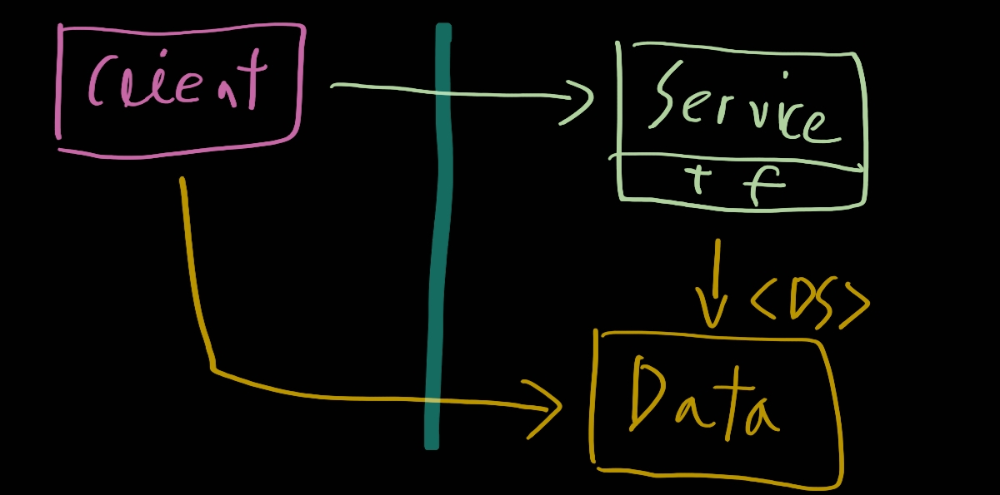
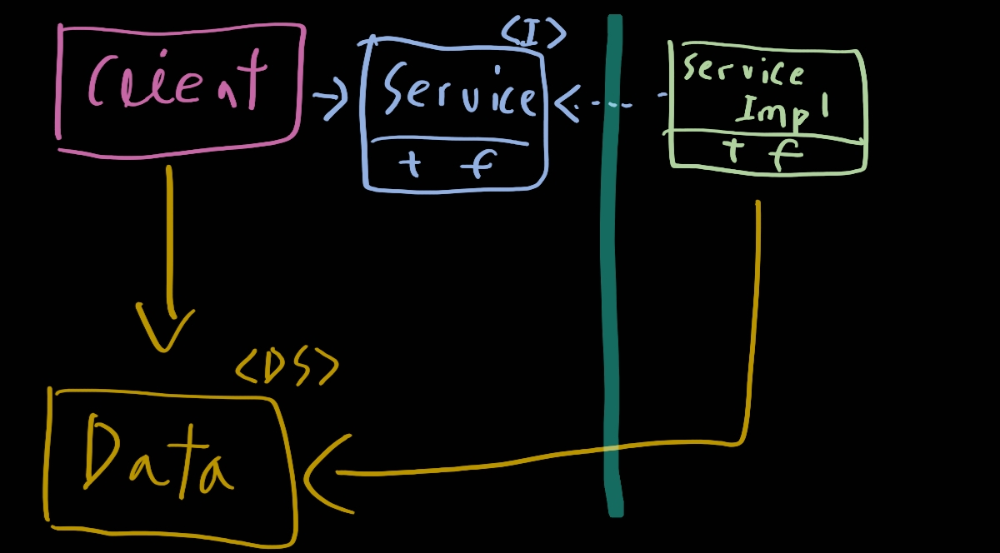

# 18. 경계 해부학

> 1. 경계 횡단하기
> 2. 두려운 단일체
> 3. 배포형 컴포넌트
> 4. 스레드
> 5. 로컬 프로세스
> 6. 서비스
> 7. 결론

경계는 다양한 형태로 나타난다. 그러한 형태 중 흔한 것들을 살펴보자.

## 1. 경계 횡단하기

'런타임에 경계를 횡단한다'함은 그저 경계 한쪽에 있는 기능에서 반대편 기능을 호출하여 데이터를 전달하는 일에 불과하다. 적절한 위치에서 경계를 횡단하게 하는 비결은 소스 코드 의존성 관리에 있다.

왜 소스코드인가? 왜냐하면 소스 코드 모듈 하나가 변경되면, 이에 의존하는 다른 소스 코드 모듈도 변경하거나, 다시 컴파일해서 새로 배포해야 할 지도 모르기 때문이다. 경계는 이러한 변경이 전파되는 것을 막는 방화벽을 구축하고 관리하는 수단으로써 존재한다.

## 2. 두려운 단일체

아키텍처 경계 중에서 가장 단순하며 가장 흔한 형태는 물리적으로 엄격하게 구분되지 않는 형태다. 이 형태에서는 함수와 데이터가 단일 프로세서에서 같은 주소 공간을 공유하며 그저 나름의 규칙에 따라 분리되어 있을 뿐이다. 이전 장에서 나는 이를 소스 수준 분리 모드라고 불렀다.

배포 관점에서 보면 이는 소위 단일체(monolith)라고 불리는 단일 실행 파일에 지나지 않는다. 이처럼 배포 관점에서 볼 때 단일체는 경계가 드러나지 않는다. 그렇다고 단일체에 경계가 없다거나 무의미하다는 소리가 아니다. 최종적으로는 정적으로 링크된 단일 실행 파일을 만들더라도, 그 안에 포함된 다양한 컴포넌트를 개발하고 바이너리로 만드는 과정을 독립적으로 수행할 수 있게 하는 일은 대단히 가치 있는 일이다.

이러한 아키텍처는 거의 모든 경우에 특정한 동적 다향성에 의존하여 내부 의존성을 관리한다. 바로 이 때문에 최근 수십 년 동안 객체 지향 개발이 아주 중요한 패러다임이 될 수 있었다. 객체 지향이 없었다면, 또는 다형성에 해당하는 메커니즘이 없었다면, 아키텍트는 결합도를 적절히 분리하기 위해 함수를 가리키는 포인터라는 위험한 옛 관행에 기대야만 했을 것이다. **함수 포인터를 과도하게 사용하는 방식은 위험하다**. 그래서 컴포넌트를 분리하려는 어떤 종류의 시도도 결국 포기했을 것이다.

이러한 상황에서 자주 보이는 단순한 형태는 저수준 클라이언트에서 고수준 서비스로 향하는 함수 호출이다. 이 경우 런타임 의존성과 컴파일타임 의존성은 몸두 같은 방향, 즉 저수준 => 고수준으로 된다.

위 그림을 보자. 제어흐름은 왼쪽에서 오른쪽으로 경계를 횡단한다. client가 service내의 f()함수를 호출하고 이때 client는 data 인스턴스를 전달. `<DS> == 단순히 데이터 구조임을 표시`. Data는 함수의 인자로 전달할 수도 더 정교한 다른 기법을 통해 전달할 수도 있다. 주목할 점은 경계에서 호출되는 쪽에 Data에 대한 정의가 위치한다.

고수준 클라가 저수준 서비스를 호출하면 동적 다형성 사용 => 제어 흐름과는 반대 방향의 의존성 역전 발생 => 런타임 의존성과 컴파일타임 의존성이 반대가 된다.

위 그림을 보자. 전 그림과는 반대로 흐른다. 주목할 점은 의존성은 오른쪽에서 왼쪽으로 향한다. 즉, 고수준 컴포넌트로 향하게 된다. 또한 데이터 구조의 정의가 호출하는 족에 위치한다는 점도 주목하자.

이처럼 규칙적인 방식으로 구조를 분리하면 프로젝트를 개발, 테스트, 배포하는 작업에 큰 도움이 된다. 팀들은 서로의 영역에 침범하지 않은 채 자신만의 컴포넌트를 독립적으로 작업이 가능해진다.

## 3. 배포형 컴포넌트

아키텍처의 경계가 물리적으로 드러날 수도 있는데 그중 가장 단순한 형태는 동적 링크 라이브러리다. 컴포넌트를 이런 형태로 배포하면 따로 컴파일 하지 않고 곧바로 사용할 수 있다. 대신 컴포넌트는 바이너리와 같이 배포 가능한 형태로 전달해야하며 이는 배포 수준 결합 분리 모드에 해당한다. 

이러한 배포 과정에서만 차이가 날 뿐, 배포 수준의 컴포넌트는 단일체와 동일하다. 일반적으로 모든 함수가 동일한 프로세서와 주소 공간에 위치하며, 컴포넌트를 분리하거나 컴포넌트 간 의존성을 관리하는 전략도 단일체와 동일하다.

## 4. 스레드

단일체와 배포형 컴포넌트는 모두 스레드를 활용할 수 있따. 스레드는 아키텍처 경계도 아니며 배포 단위도 아니다. 이보다 스레드는 실행 계회과 순서를 체계화하는 방법에 가깝다. 모든 스레드가 단 하나의 컴포넌트에 포함ㅁ될 수도 있고, 많은 컴포넌트에 걸쳐 분산될 수도 있따.

## 5. 로컬 프로세스

훨씬 강한 물리적 형태를 띠는 아키텍처 경계로는 로컬 프로세스가 있다. 로컬 프로세스는 주로 명령행이나 그와 유사한 시스템 호출을 통해 생성된다. 종종 공유 메모리 파티션을 사용하기도 하지만, 일반적으로는 메모리 보호를 통해 프로세스들이 멤모리를 공유하지 못하게 한다.

소켓, 메일박스, 메시지 큐와 같이 운영체제에서 제공하는 통신 기능을 이용하여 서로 통신한다. 로컬 프로세스는 정적으로 링크된 단일체 or 동적으로 링크된 여러 개의 컴포넌트로 구성될 수 있다. 전자의 경우, 여러 모노리틱 프로세스 같은 컴포넌트들을 가지고 있을 수 있다. 후자의 경우 동적으로 링크된 배포형 컴포넌트들을 서로 공유할 수 있따.

로컬 프로세스 경계를 지나기 위해서는 통신을 이요하며 다양한 방법이 있다. 하지만 프로세스간 통신은 비싼 작업에 속하므로 신중하게 제한하라

## 6. 서비스

물리적인 형태를 띠는 가장 강력한 경계는 바로 서비스다. 서비스는 프로세스로, 일반적으로 명령행 또는 그와 동등한 시스템 호출을 통해 구동된다. 서비스는 자신의 물리적 위치에 구애받지 않는다. 서로 통신하는 두 서비스는 물리적으로 동리한 프로세서나 멀티코어에서 동작할 수도 아닐 수도 있다.

고수준 서비스의 소스 코드에는 저수준 서비스를 특정 짓는 어떤 물리적인 정보도 절대 포함해서는 안된다

## 7.결론

단일체를 제외한 대다수의 시스템은 한 가지 이상의 경계 전략을 사용한다. 즉, 대체로 한 시스템 안에서도 통신이 빈번한 로컬 경계와 지연을 중요하게 고려해야 하는 경계가 혼합되어 있음을 의미한다.