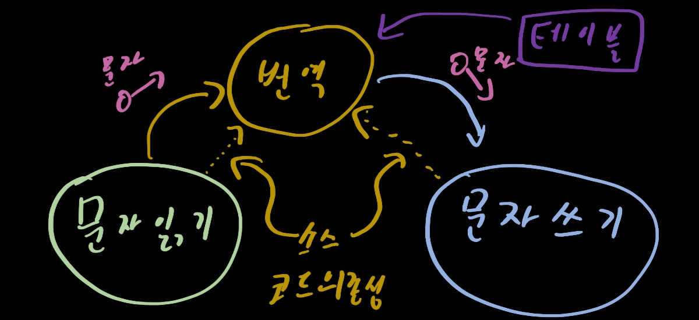

# 19. 정책과 수준

> 1. 수준
> 2. 결론

소프트웨어 시스템은 정책을 기술한 것이다. 입력을 출력으로 변환하는 정책을 상세하게 기술한 설명서가 프로그램이다. 대다수의 주요 시스템에서 하나의 정책은 이 정책을 서술하는 여러 개의 조그만 정책들로 쪼갤 수 있다.

소프트에어 아키텍처를 개발하는 기술에는 이러한 정책을 신중하게 분리하고, 정책이 변경되는 양상에 따라 정책을 재편성하는 일도 포함된다. 동일한 이유로 동일한 시점에 변경되는 정책은 동일한 수준에 위치하며, 동일한 컴포넌트에 속해야 한다. 반대의 상황은 다른 컴포넌트로 분리해야 한다.

방향 을 잘 고려하고 의존성을 import구문으로 이용해야 한다. 좋은 아키텍처라면 각 컴포넌트를 연결할 때 의존성의 방향이 컴포넌트의 수준을 기반으로 연결되도록 만들어야 한다. 즉, 저수준 컴포넌트가 고수준 컴포넌트에 의존하도록 설계해야 한다.

## 1. 수준

> `수준`이란 입력과 출력까지의 거리이다.

입력과 출력 모두로부터 멀리 위치할 수록 정책의 수준이 높다는 것을 의미한다. 아래 그림을 보자

간단한 암호화 프로그램이다. 입력 장치에서 문자를 읽고, 테이블을 참조하여 번역, 그 후 번역된 문자를 출력 장치로 기록한다. 데이터 흐름은 실선으로 의존성은 점선으로 표시했다. 번역 컴포넌트는 이 시스템에서 최고 수준의 컴포넌트인데, 입력과 출력에서 가장 멀리 떨어져 있기 때문이다.

주목할 점은 데이터 흐름과 소스 코드 의존성이 항상 같은 방향을 가리키지는 않는다는 사실이다. 이것이 소프트웨어 아키텍처가 가진 예술 중 하나다. 소스 코드 의존성은 그 수준에 따라 결합되어야 하며, 데이터 흐름을 기준으로 결합되어서는 안 된다. 다른 아키텍처를 한번 살펴보자.

경계 안쪽은 최고 수준의 구성요소가 된다. 그리고 Console Reader와 Console Writer는 클래스로 표현되어 저수준이다. 

모든 소스 코드 의존성의 방향이 고수준 정책을 향할 수 있도록 정책을 분리했다면 변경의 영향도를 줄일 수 있다. 시스템의 최저 수준에서 중요하지 않지만 긴급한 변경이 발생하더라도, 보다 높은 위치의 중요한 수준에 미치는 영향은 거의 없게 된다.

## 2. 결론

이 장에서 설명한 정책에 대한 논의는 SOLID에서 전부 나왔었다. 이 원칙들의 설명을 다시 읽어보며 어떤 이유인지 씹어서 소화시키도록 해보자.