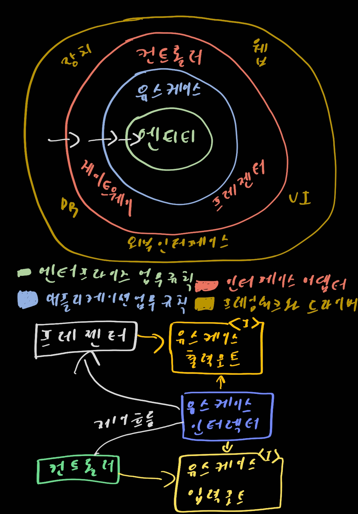
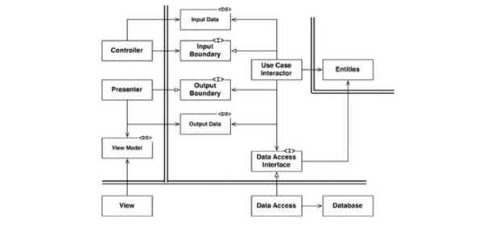

# 22. 클린 아키텍처

> 1. 의존성 규칙
> 2. 전형적인 시나리오
> 3. 결론

- 육각형 아키텍처: 포트와 어댑터라고도 알려져있으며, 앨리스터 코오번이 개발. `테스트 주도 개발로 배우는 객체 지향 설계와 실천`이라는 책에서 차용
- DCI: Data, Context and Interaction
- BCE: Boundary-Control-Entity

이 모든 아키텍처는 약간의 차이가 있지만 본질은 비슷하다. 이들의 목표는 모두 `관심사의 분리`이다. 계층을 분리함으로써 관심사의 분리라는 목표를 달성할 수 있었다. 다음과 같은 특징을 지니도록 해야한다

- 프레임워크 독립성. 아키텍처는 다양한 기능의 라이브러릴르 제공하는 소프트웨어, 즉 프레임워크의 존재 여부에 의존하지 않는다. 이를 통해 이러한 프레임워크를 도구로 사용할 수 있으며, 프레임워크가 지닌 제약사항안으로 시스템을 욱여 넣도록 강제하지 않는다
- 테스트 용이성. 업무 규칙은 UI, 데이터베이스, 웹 서버, 또는 여타 외부 요소가 없이도 테스트할 수 있다.
- UI 독립성. 시스템의 나머지 부분을 변경하지 않고도 UI를 쉽게 변경할 수 있다.
- 데이터베이스 독립성. 업무 규칙은 데이터베이스에 결합되지 않는다
- 모든 외부 에이전시에 대한 독립성.

## 1. 의존성 규칙

위 그림을 보자. 각각의 동심원은 소프트웨어에서 서로 다른 영역을 표현한다. 보통 안으로 들어갈수록 고수준의 소프트웨어가 된다. 바깥쪽 원은 메커니즘이며 안쪽 원은 정책이다.

> 소스 코드 의존성은 반드시 안쪽으로, 고수준의 정책을 향해야 한다.

내부의 원에 속한 요소는 외부의 원에 속한 어떤 것도 알지 못한다. 특히 내부의 원에 속한 코드는 외부의 원에 선언된 어떤 것에 대해서도 그 이름을 언급해서는 안된다. 여기에는 함수, 클래스, 변수, 그리고 소프트웨어 엔티티로 명명되는 모든 것이 포함된다.

- 엔티티

  엔티티는 전사적인 핵심 업무 규칙을 캡슐화한다. 엔티티는 메서드를 가지는 객체이거나 일련의 데이터 구조와 함수의 집합일 수도 있다. 기업의 다양한 애플리케이션에서 엔티티를 재사용할 수만 있따면, 그 형태는 그다지 중요하지 않다.

  전사적이지 않은 단순한 단일 애플리케이션이라면 엔티티는 해당 애플리케이션의 업무 객체가 된다. 이 상황에서 엔티티는 가장 일반적이며 고수준인 규칙을 캡슐화한다. 외부의 무언가가 변경되더라도 엔티티가 변경될 가능성은 지극히 낮다.

- 유스케이스

  유스케이스 계층의 소프트웨어는 애플리케이션에 특화된 업무 규칙을 포함한다. 또한 유스케이스 계층의 소프트웨어는 시스템의 모든 유스케이스를 캡슐화하고 구현한다. 유스케이스는 엔티티로 들어오고 나가는 데이터 흐름을 조정하며, 엔티티가 자신의 핵심 업무 규칙을 사용해서 유스케이스의 목적을 달성하도록 이끈다.

- 인터페이스 어댑터

  여긴 일련의 어댑터들로 구성된 계층이다. 어댑터는 데이터를 유스케이스와 엔티티에게 가장 편리한 형식에서 데이터베이스나 웹 같은 외부 에이전시에게 가장 편리한 형식으로 변환한다. 모델은 그저 데이터 구조 정도에 지나지 않으며, 컨트롤러에서 유스케이스로 전달되고, 다시 유스케이스에서 프레젠터와 뷰로 되돌아간다.

  이 계층은 데이터를 엔티티와 유스케이스에게 가장 편리한 형식에서 영속성용으로 사용 중인 임의의 프레임워크가 이용하기에 가장 편리한 형식으로 변환한다. 이 원 안에 속한 어떤 코드도 데이터베이스에 대해 조금도 알아서는 안 된다. 또한 이 계층에는 데이터를 외부 서비스와 같은 외부적인 형식에서 유스 케이스나 엔티티에서 사용되는 내부적인 형식으로 변환하는 또 다른 어댑터가 필요하다.

- 프레임워크와 드라이버

  그림을 참고해보자. 그림에서 가장 밖깥쪽에 있따. 일반적으로 이 계층에서는 안쪽원과 통신하기 위한 접합 코드 외에는 특별히 더 작성해야 할 코드가 그다지 많지가 않다.

- 원은 네 개여야만 하나?

  이것은 하나의 예시일 뿐이다. 더 많이 필요할 수도 더 적게 필요할 수도 있다. 하지만 꼭 강박적으로 기억해야 하는 것은 의존성이 안쪽으로 향해야 한다는 것이다.

- 경계 횡단하기

  경계를 횡단하는 원 아래쪽 다이어그램을 확인하자. 이 예시에서 컨트롤러와 프레젠터가 다음 계층에 속한 유스케이스와 통신하는 모습을 확인할 수 있다. 그림처럼 에어프름과 의존성의 방향이 명백히 반대여야 하는 경우, 대체로 의존성 역전 원칙을 사용하여 해결한다. 아키텍처 경계를 횡단할 때 언제라도 동일한 기법을 사용할 수 있따. 우리는 동적 다형성을 이용하여 소스 코드 의존성을 제어흐름과는 반대로 만들 수 있고, 이를 통해 제어흐름이 어느 방향으로 흐르더라도 의존성 규칙을 준수할 수 있다.

- 경계를 횡단하는 데이터는 어떤 모습인가.

  경계를 가로지르는 데이터는 흔히 간단한 데이터 구조로 이루어져 있따. 기본저깅ㄴ 구조체나 간단한 데이터 전송 객채 등 원하는 대로 고를 수 있다. 하지만 경계를 가로질러 데이터를 전달할 때, 데이터는 항상 내부의 원에서 사용하기에 가장 편리한 형태를 가져야만 한다.

## 2. 전형적인 시나리오

위 그림에서 의존성의 방향에 주목하라. 모든 의존성은 경계선 안쪽으로 가로지르며, 따라서 의존성 규칙을 준수한다.

## 3. 결론

소프트웨어를 계층으로 분리하고 의존성 규칙을 준수한다면 본질적으로 테스트하기 쉬운 시스템을 만들게 될 것이며, 그에 따른 이점을 누릴 수 있다. 데이터베이스나 웹 프레임워크와 같은 시스템의 외부 요소가 구식이 되더라도, 이들 요소를 야단스럽게 교체할 수 있다.