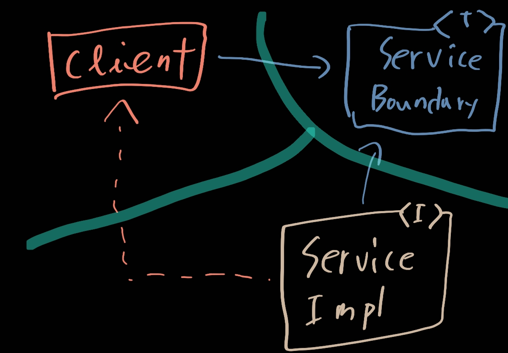
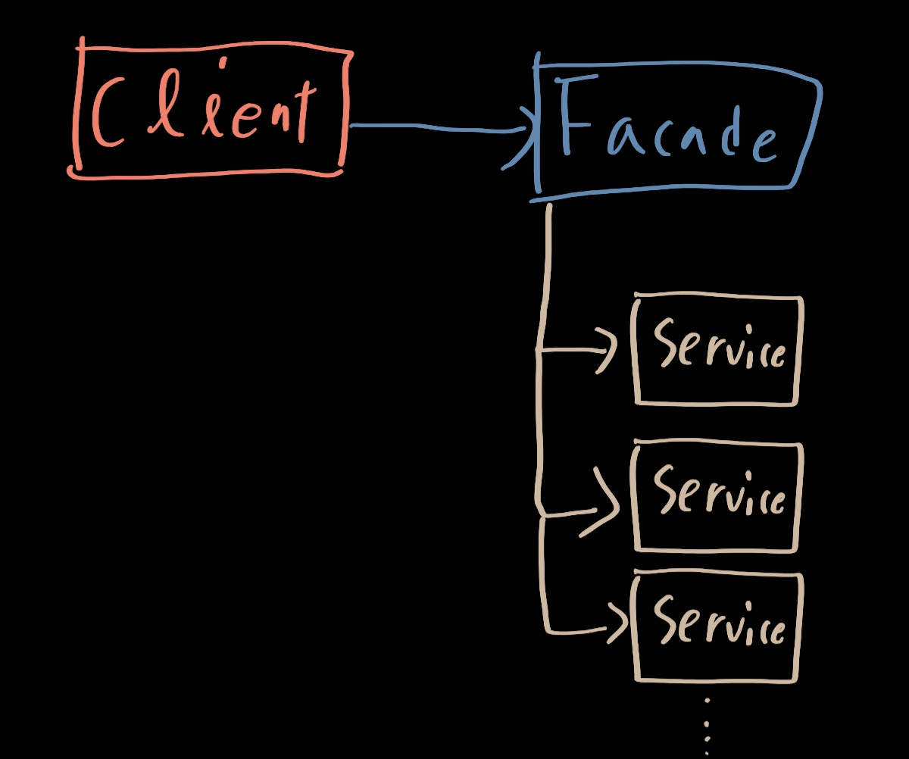

# 24. 부분적 경계

> 1. 마지막 단계를 건너뛰기
> 2. 일차원 경계
> 3. 퍼사드
> 4. 결론

아키텍처 경계를 완벽하게 만드는 데는 비용이 많이 든다. 쌍방향의 다형적 인터페이스, I/O를 위한 데이터 구조를 만들어야 할 뿐만 아니라, 독립적으로 컴파일하고 배포할 수 있는 컴포넌트로 격리하는 데 필요한 모든 의존성을 관리해야 한다.

애자일 커뮤니티에 속한 사람 중 많은 이가 선행적인 설계를 탐탁치 않게 여긴다. YAGNI(You Aren't Going to Need It) 원칙을 위배하기 때문이다. 하지만 아키텍트라면 이 문제를 검토하면서 '그래, 하지만 어쩌면 필요할지도.'라는 생각이 들 수도 있다. 만약 그렇다면 부분적 경계를 구현해볼 수 있다.

## 1. 마지막 단계를 건너뛰기

부분적 경계를 생성하는 방법 중 하나는 독립적으로 컴파일하고 배포할 수 있는 컴포넌트를 만들기 위한 작업을 모두 수행한 후, 단일 컴포넌트에 그대로 모아만 두는 것이다. 쌍방향 인터페이스도 그 컴포넌트에 있고, 입출력 데이터 구조도 거기에 있고 모든 것이 완전히 준비되어 있어야 한다. 하지만 이 모두를 단일 컴포넌트로 컴파일해서 배포한다

아무리 봐도 이 상황이면 부분적 경계를 만들때 완벽한 경계만큼이나 코드량과 사전 설계가 필요해보인다. 하지만 다수의 컴포넌트를 관리하는 작업은 하지 않아도 된다. 추적을 위한 버전 번호도 없고 배포 관리 부담도 없으며 이 차이는 가볍지가 않다.

이는 `FitNesse`를 뒷받침했던 초기 전략이었다. `FitNesse`의 웹 서버 컴포넌트는 위키나 테스트 영역과는 분리되도록 설계되었다. 새로운 웹 기반 애플리케이션을 만들 때 해당 웹 컴포넌트를 재사용할 수도 있다고 생각했기 때문이다.

## 2. 일차원 경계

완벽한 형태의 아키텍처 경계는 양방향으로 격리된 상태를 유지해야 하므로 쌍방향 Boundary 인터페이스를 사용한다. 격리된 상태를 유지하려면 초기 설정할 때나 지속적으로 유지할 때도 비용이 많이 든다. 우후 완벽한 경계로 확장할 수 있도록 아래 그림과 같이 구조를 잡는다

이 방법은 꽤나 전통적인 방식으로 미래에 필요할 아키텍처 경계를 위한 무대를 마련한다는 점은 명백하다. Client로부터 ServiceImpl로부터 격리시키는데 필요한 의존성 역전이 이미 적용되었기 때문이다.

## 3. 퍼사드

이보다 훨씬 더 단순한 경계는 퍼사드 패턴이다. 아래 그림과 같이 의존성 역전까지도 희생시킨다. 경계는 Facade 클래스로만 간단히 정의된다. Facade 클래스에는 모든 서비스 클래스를 메서드 형태로 정의하고, 서비스 호출이 발생하면 해당 서비스 클래스로 호출을 전달한다. 클라이언트는 이들 서비스 클래스에 직접 접근할 수 없다.

client가 이 모든 서비스 클래스에 대해 추이 종속성을 가지게 된 것을 주목하자. 정적 언어였다면 서비스 클래스 중 하나에서 소스 코드가 변경되면 client도 무조건 재컴파일해야 할 것이다. 이러한 구조라면 비밀 통로 또한 정말 쉽게 만들 수 있다는 사실도 충분히 파악할 수 있을 것이다.

## 4. 결론

경계를 부분적으로 구현하는 간단한 방법 3가지를 살펴보았다. 세 전략은 순전히 예로써 제시했다. 각 접근법은 장단점이 각자 존재한다. 어떻게 선택할지는 아키텍트의 역할이다.