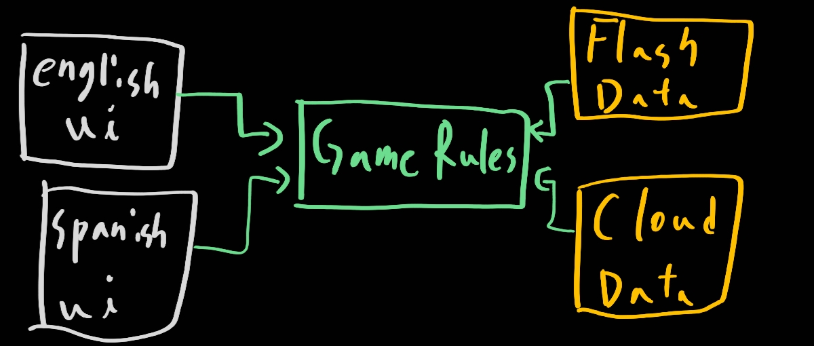
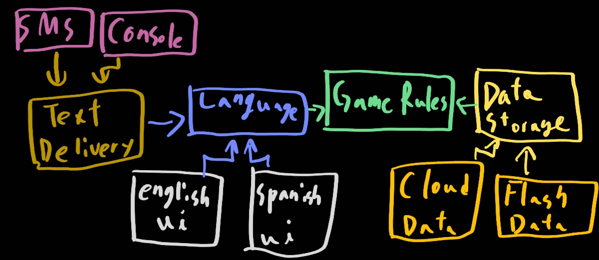
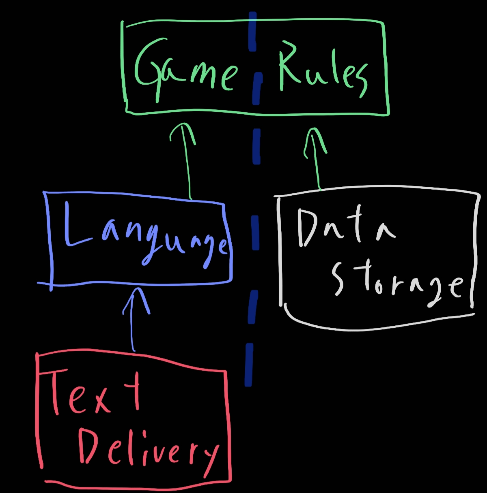
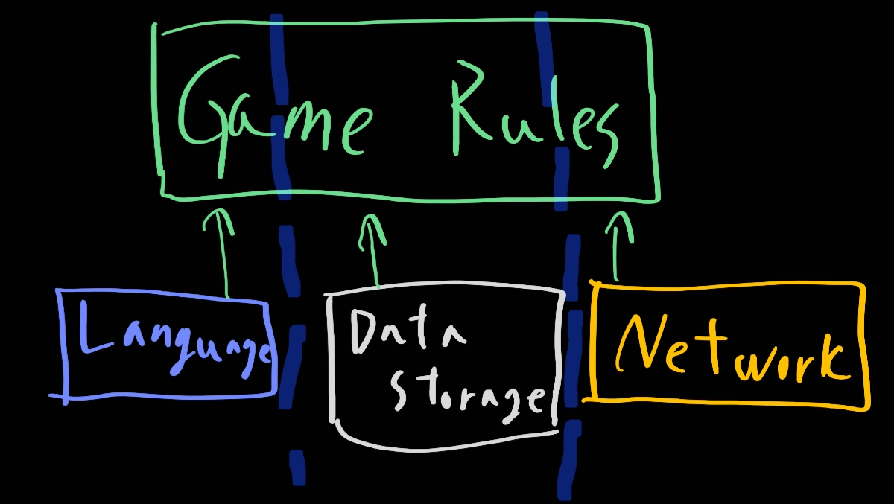

# 25. 계층과 경계

> 1. 움퍼스 사냥 게임
> 2. 클린 아키텍처?
> 3. 흐름 횡단하기
> 4. 흐름 분리하기
> 5. 결론

시스템이 세 가지 컴포넌트로만 구성된다고 생각할 수 있지만 더욱 많다. UI, 업무규칙, 데이터베이스로만 구성되어있는 것이 절대로 아니다. 

## 1. 움퍼스 사냥 게임

 움퍼스 사냥 게임은 텍스트 기반 ui로 진행되는 옛날 게임이다. 텍스트 기반 ui는 그대로 유지하되, 게임 규칙과 UI를 분리해서 우리 제품을 여러 시장에서 다양한 언어로 발매할 수 있게 만든다고 가정해보자. 게임 규칙은 언어 독립적인 API를 사용해서 UI 컴포넌트와 통신할 것이고, UI는 API를 사람이 이해할 수 있는 언어로 변환할 것이다.

위 의존성을 적절히 관리해보자. 그렇다면 어떤 언어가 오든 교체하거나 추가하기 어렵지 않다. 또한 상태를 영속적인 저장소에 유지한다고 가정해보자. 그러면 게임 규칙이 데이터 저장소 컴포넌트와 통신할 때 사용하도록 만든다. 우리는 게임 규칙이 다양한 종류의 데이터 저장소에 대해 알지 않기를 원한다. 그렇다면 의존성을 적절히 유지시키면 될 것이다.

## 2. 클린 아키텍처?

이 변경을 가지고 조금 더 확장해보자. UI에서 언어가 유일한 변경의 축은 아니다. 텍스트로 주고받는 메커니즘도 시스템이 다양하다. 셸창일 수도 텍스트 메시지일 수도 채팅 애플리케이션일 수도 있다. 이러한 기점을 가지고 다이어 그램을 조금 더 확장 해보자.

복잡해진거 같지만 놀라지 마라. `Text Delivery`, `Language`, `Data Storage`는 추상 컴포넌트이다. 그것들을 가르키는게 실제 구현하는 컴포넌트이다.각 추상 컴포넌트들은 비슷한 구조를 발견할 수 있다. 필요한 것만 그때그때 이용할 수 있도록 다형적 Boundary 인터페이스가 되어있다. 그렇다면 우린 여기서 이 구현에 일하는 컴포넌트를 빼고 추상적 컴포넌트만 가지고 다이어 그램을 제작해보자

GameRules는 최상위 수준의 정책을 가지는 컴포넌트라는 것을 알 수 있게 세로로 구조를 그렸다. 정보가 흐르는 방향을 생각해봐라. 좌측 하단에서 TextDelivery컴포넌트로 모든 입력이 전달된다. 이 정보는 Language컴포넌트를 거쳐 GameRules에 도착할 것이다. 그리고 적절한 데이터를 내려보낼 것이다.

이 구성은 위처럼 두가지 부류로 분리하는 것이 효과적이다. 여기에 하나더 ㅊ추가해보자!

## 3. 흐름 횡단하기

네트워크라는 컴포넌트가 들어간다 생각해보자! 그렇다면 흐름은 세가지로 분리가 될 것 같다. 아래와 같이 진행이 될 거 같다. 즉, 우리는 필요할 수록 더 많은 흐름을 계속 분리할 수 있다.

## 4. 흐름 분리하기

생각을 정리하면 상단의 단일 컴포넌트에서 모든 흐름은 만난다고 생각할 수 있다! 이렇게 단순하면 얼마나 좋을까! 하지만 현실은 녹록치 않다.

게임 규칙 중 일부는 지도와 관련된 메커니즘을 처리한다. 이 규칙들은 동굴이 서로 어떻게 연결되고 어떤 물체가 위치한지 알고 있다. 또한 플레이어가 동굴에서 동굴로 이동하는 방법이나, 플레이어가 반드시 처리해얗 하는 사건을 결정하는 방법도 알고 있다.

하지만 이보다 더 높은 수준의 정책도 있다. 플레이어와 관련된 정책도 있을 것이다. 게임의 종료와 관련된 룰도 있을 것이다. 그렇다면 이것이 아키텍처의 경계인가? 유저를 관리하는 것과 움직임을 관리하는 컴포넌트를 분리하는 api는 필요한가? 멀티로 가면 더욱 복잡해질 것이다.

## 5. 결론

이 모든 것이 의미하는 바는 무엇인가? 아키텍처의 경계는 어디에나 존재한다는 사실이다. 그리고 우리는 해당 경계를 언제 필요한지 신중하게 파악해야할 것이다. 그리고 이러한 경계를 제대로 구현하려면 비용이 많이 든다는 것도 이해해야 한다. 어떻게 구분해야 하는가! **YAGNI**를 항상 생각하자. 오버 엔지니어링은 좋지 않다. 오히려 언더 엔지니어링이 더 좋을 것이다. 즉, 우리가 필요할 때 그때 구현해라!