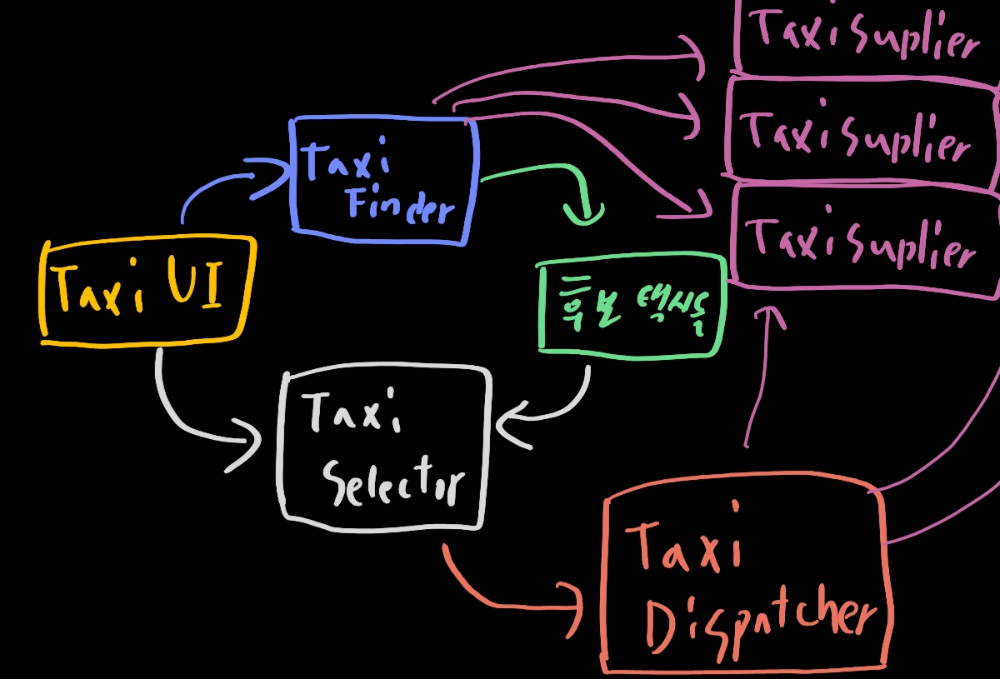
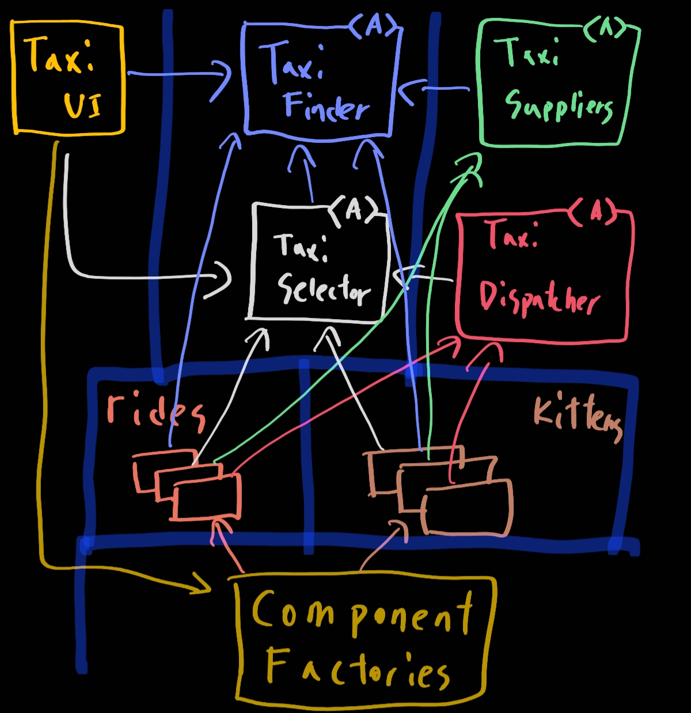
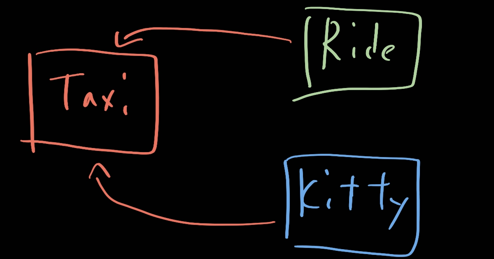

# 27. 크고 작은 모든 서비스들

> 1. 서비스 아키텍처?
> 2. 서비스의 이점?
> 3. 야옹이 문제
> 4. 객체가 구출하다
> 5. 컴포넌트 기반 서비스
> 6. 횡단 관심사
> 7. 결론

서비스 지향 '아키텍처'와 마이크로서비스 '아키텍처'는 최근에 큰 인기를 끌고 있다. 다음과 같다

- 서비스를 사용하면 상호 결합이 철저하게 분리되는 것처럼 보인다. 나중에 보겠지만, 이는 일부만 맞는 말이다
- 서비스를 사용하면 개발과 배포 독립성을 지원하는 것처럼 보인다. 나중에 보겠지만, 이 역시도 일부만 맞는 말이다.

## 1. 서비스 아키텍처?

시스템의 아키텍처는 의존성 규칙을 준수하며 고수준의 정책을 저수준의 세부사항으로부터 분리하는 경계에 의해 정의된다. 단순히 애플리케이션의 행위를 분리할 뿐인 서비스라면 값비싼 함수 호출에 불과하며, 아키텍처 관점에서 꼭 중요하다고 볼 수는 없다.

모든 서비스가 반드시 아키텍처 관점에서 중요해야만 한다는 뜻은 아니다. 하지만 서비스 그 자체로는 아키텍처를 정의하지 않는다. 

함수들의 구성 형태도 이와 비슷하다. 모노리틱 시스템이나 컴포넌트 기반 시스템에서 아키텍처를 정의하는 요소는 바로 의존성 규칙을 따르며 아키텍처 경계를 넘나드는 함수 호출들이다. 반면 시스템의 나머지 많은 함수들은 행위를 서로 분리할 뿐이며, 아키텍처적으로는 전혀 중요하지 않다.

서비스도 이와 마찬가지다. 결국 서비스는 프로세스나 플랫폼 경계를 가로지르는 함수 호출에 지나지 않는다. 아키텍처적으로 중요한 서비스도 있지만, 중요하지 않은 서비스도 존재한다. 이 장에서는 전자의 서비스에 집중을 해보자

## 2. 서비스의 이점?

- 결합 분리의 오류

  시스템을 서비스들로 분리함으로써 얻게 되리라 예상되는 큰 이점 하나는 서비스 사이의 결합이 확실히 분리된다는 점이다. 어쨌든 각 서비스는 서로 다른 프로세스에서, 심지어는 서로 다른 프로세서에서 실행된다. 따라서 서비스는 다른 서비스의 변수에 직접 접근할 수 없다. 그리고 모든 서비스의 인터페이스는 반드시 잘 정의되어 있어야 한다.

  이 말에는 어느 정도 일리가 있지만, 꼭 그런 것만은 아니다. 물론 서비스는 개별 변수 수준에서는 각각 결합이 분리된다. 하지만 프로세서 내의 또는 네트워크 상의 공유 자원 때문에 결합될 가능성이 여전히 존재한다. 더욱이 서로 공유하는 데이터에 의해 이들 서비스는 강력하게 결합되어 버린다.

- 개발 및 배포 독립성의 오류

  서비스를 사용함에 따라서 예측되는 또다른 이점은 전담팀이 서비스를 소유하고 운영한다는 점이다. 그래서 데브옵스 전략의 일환으로 전담팀에서 각 서비스를 작성하고, 유지보수하며, 운영하는 책임을 질 수 있다. 이러한 개발 및 배포 독립성은 확장 가능한 것으로 간주된다. 시스템의 개발, 유지보수, 운영 또한 독립적인 팀 단위로 분할할 수 있다고 여긴다.

  하지만 믿음에도 불구하고 극히 일부만이다. 첫째로, 대규모 엔터프라이즈 시스템은 서비스 기반 시스템 이외에도, 모노리틱 시스템이나 컴포넌트 기반 시스템으로도 구축할 수 있다는 사실은 역사적으로 증명되어 왔다. 따라서 서비스는 확장 가능한 시스템을 구축하는 유일한 선택지가 아니다. 둘째로, '결합 분리의 오류'에 따르면 서비스라고 해서 항상 독립적으로 개발하고, 배포하며, 운영할 수 있는 것은 아니다. 데이터나 행위에서 어느 정도 결합되어 있다면 결합된 정도에 맞게 개발, 배포, 운영을 조정해야만 한다

## 3. 야옹이 문제

예전에 했던 택시 통합 시스템을 다시 가져와보자. 이 시스템은 해당 도시에서 운영되는 많은 택시 업체를 알고있고, 고객은 승차 요청을 할 수 있다는 점을 상기하자. 고객은 승차 시간, 비용, 고급 택시 여부, 운전사 경력 등 다양한 기준에 따라 택시를 선택할 수 있다고 가정하자.

모든 시스템은 마찬가지다. 이 시스템도 그러하다. 무엇이 하고 싶을까? 확장이다! 확장 가능한 시스템을 구축하고 싶었기에, 우리는 수많은 작은 마이크로 서비스를 기반으로 구축하기로 결정했다. 개발팀 직원을 많은 소규모 팀으로 세분화했고, 각 팀이 팀 규모에 맞게 적당한 수의 서비스를 개발하고, 유지보수하며, 운영하는 책임을 지도록 했다. 그림을 한번 살펴보자.

`TaxiUI`서비스는 고객을 담당하며, 고객은 모바일 기기를 이용해서 택시를 호출한다. `TaxiFinder`서비스는 여러 `TaxiSupplier`의 현황을 검토하여 사용자에게 적합한 택시후보들을 선별한다. `TaxiFinder`서비스는 해당 사용자에 할당된 단기 데이터 레코드에 후보택시들의 정보를 저장한다. TaxiSelector 서비스는 사용자가 지정한 비용, 시간, 고급 여부 등의 조건을 기초로 후보 택시 중에서 적합한 택시를 선택한다. 이제 TaxiSelector 서비스가 해당 택시를 TaxiDispatcher 서비스로 전달하면, TaxiDispatcher 서비스는 해당 택시에 배차 지시를 한다.

우리는 이 시스템을 이제 오래 운영했다고 해보자. 개발팀들은 행복하게 새로운 기능들을 개발하면서 동시에 이 모든 서비스를 유지보수하고 운영해왔다. :thumbsup:

그리고 어느날, 마케팅 부서에서 개발팀과 미팅을 한다. 이 미팅에서 마케터들은 도시에 야옹이를 배달하는 서비스를 제공하겠다는 계획을 발표한다. 사용자는 자신의 집이나 사무실로 야옹이를 배달해달라고 주문할 수 있따.

회사는 도시 전역에 야옹이를 태울 다수의 승차 지점을 설정해야 할 것이다. 야옹이 배달 주문이 오면, 근처의 택시가 선택되고, 승차 지점 중 한곳에서 야옹이를 태운 후, 올바른 주소로 야옹이를 배달해야 한다.

택시 업체 한 곳이 이 프로그램에 참여하기로 협의했다. 다른 업체도 뒤따를 것이다. 참여를 거부하는 업체도 분명 있을 것이다.

당연하지만, 어떤 운전자는 고양이 알러지가 있을 수 있기 떄문에, 해당 운전자는 이 서비스에서 제외되어야 한다. 또한 일반 택시 승객 역시 비슷한 알러지를 일으킬 수 있으므로, 배차를 신청한 고객이 알러지가 있다고 밝힌 경우라면 지난 3일 사이에 야옹이를 배달했던 차랼은 피해야 한다.

이걸 할라믄 어딜 수정해야할까? 전부인거 같다. 즉, 이 서비스는 모두 결합되어 있기에 독립적으로 개발하고, 배포하거나, 유지될 수 없다. 총체적 난국이다. 어찌해야할까..... 횡단 관심사가 지닌 문제로 이것은 정말 어렵다.

## 4. 객체가 구출하다

객체 지향저긍로 생각해보자. 위 그림은 그 전략이다. 의존성들이 의존성 규칙을 준수하며 경계를 이루고 있다.

원래 서비스의 로직 중 대다수가 이 객체 모델의 기반 클래스들 내부로 녹아들었다. 하지만 배차에 특화된 로직 부분은 Rides 컴포넌트로 추출되고, 야옹이에 대한 신규 기능은 Kittens 컴포넌트에 들어갔다. 이 두 컴포넌트는 기존 컴포넌트들에 있는 추상 기반 클래스를 템플릿 메서드나 전략 패턴등을 이용해서 오버라이드한다.

두 개의 신규 컴포넌트인 Rides와 Kittens가 의존성 규칙을 준수한다는 점에 다시 한번 주목하자. 또한 이 기능들을 구현하는 클래스들은 UI의 제어하에 팩토리가 생성한다는 점에도 주목하자.

이 전략을 따르더라도 야옹이 기능을 구현하려면 TaxiUI는 어쩔 수 없이 변경해야만 ㅎ나다. 하지만 그 외의 것들은 변경할 필요가 없다. 대신 야옹이 기능을 구현한 새로운 jar파일이나 젬, DLL을 시스템에 추가하고, 런타임에 동적으로 로드하면 된다.

## 5. 컴포넌트 기반 서비스

자 이제 돌아와보자. 서비스에서도 이렇게 할 수 있나요? 당연히 YES다. 서비스가 반드시 소규모 단일체여야 할 이유는 없다. 서비스는 SOLID 원칙대로 설계할 수 있으며 컴포넌트 구조를 갖출 수도 있다. 이를 통해 서비스 내의 기존 컴포넌트들을 변경하지 않고도 새로운 컴포넌트를 추가할 수 있다.

다이어그램을 다시 그려보자. 모든 택시 관련들은 아래 그림처럼 라이드와 키티가 들어간다.(예를 들어 텍시 샐럭터는 라이드 샐랙터와 키티 샐럭터로 구성딘다.) 서비스들의 존재는 이전과 달라진 것이 거의 없지만, 각 서비스의 내부는 자신만의 컴포넌트 설계로 되어 있어서 파생 클래스를 만드는 방식으로 신규 기능을 추가할 수 있다. 파생 클래스들은 각자의 컴포넌트 내부에 놓인다.

## 6. 횡단 관심사

지금까지 배운 것은 아키텍처 경계가 서비스 사이에 있지 않다는 사실이다. 오히려 서비스를 관통하며, 서비스를 컨포넌트 단위로 분할한다. 모든 주요 시스템이 직면하는 횡단 관심사를 처리하려면 서비스 내부는 의존성 규칙도 준수하는 컴포넌트 아키텍처로 설계해야 한다.

## 7. 결론

서비스는 시스템의 확장성과 개발 가능성 측면에서 유용하지만, 그 자체로는 아키텍처적으로 그리 중요한 요소는 아니다. 시스템의 아키텍처는 시스템 내부에 그어진 경계와 경계를 넘나드는 의존성에 의해 정의된다. 시스템의 구성 요소가 통신하고 실행되는 물리적인 메커니즘에 의해 아키텍처가 정의되는 것이 아니다.