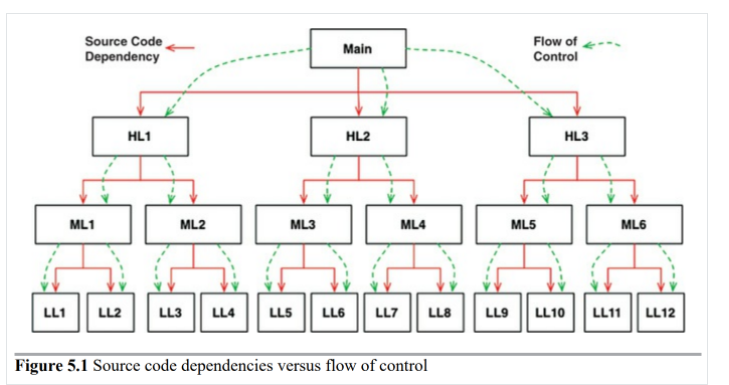
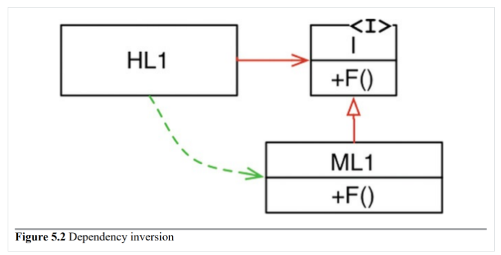

# 5. 객체 지향 프로그래밍

> 1. 캡슐화
> 2. 상속
> 3. 다형성
> 4. 결론

객체 지향 설계 원칙을 이해하고 응용해라 그것이 좋은 아키텍처를 만드는 일에 중요하게 작용한다. 아 중요한 것은 알겠고 그렇다면 OO란 무엇인가?

"데이터와 함수의 조합" 나쁘지 않은 답은 아니지만 만족스럽진 않다. "실제 세계를 모델링하는 새로운 방법" 얼버무리는 수준이다. 본질의 이해에 필요한 것은 `캡슐화`, `상속`, `다형성`` 이 세가지 이다. 하나씩 알아가보자

## 1. 캡슐화

OO를 정의하는 요소 중 하나이다. 캡슐화는 어떠한 언어에서도 가능하다 아래와 같은 간단한 C프로그램을 보자

```c
// point.h
struct Point;
struct Point* makePoint(double x, double y);
double distance (struct Point *p1, struct Point *p2)
```

```c
// point.c
#include "point.h"
#include <stdlib.h>
#include <math.h>

struct Point {
    double x,y;
};

struct Point* makePoint(double x, double y) {
    struct Point* p = malloc(sizeof(struct Point));
    p->x = x;
    p->y = y;
    return p;
}

double distance(struct Point* p1, struct Point* p2) {
    double dx = p1->x - p2->x;
    double dy = p1->y - p2->y;
    
    return sqrt(dx*dx + dy*dy);
}
```

위와 같이 OO가 아닌 언어에서도 충분히 OO를 이룩할 수가 있다. C프로그래머는 항상 이러한 방식을 활용했다.

1. 데이터 구조와 함수를 헤더 파일에 선언
2. 구현 파일에서 이들을 구현

C프로그래머는 이러한 방식을 애용했다. 이후 C++이 등장하고 다양한 OO언어가 등장했다. 하지만 언어가 OO를 강제화하진 않는다. 그러니 우리는 캡슐화를 제대로 이해할 필요가 있고 적절하게 사용해야할 이유가 있는 것이다

## 2. 상속

OO언어들은 상속은 확실히 제공한다. C에서는 상속하기가 정말로 어려웠다 그러한 이유로 C++도 나오고 다양한 언어들이 상속을 쉽게 할 수 있도록 제공한다.

## 3. 다형성

하나의 객체에 다양한 타입이 있을 수 있는 것. 이것도 매우 중요한 것이다. C로도 구현은 가능하다. 그리고 이것이 OO가 지닌 다형성의 근간이 된다. 그리고 OO 언어들은 이 다형성을 만드는데에 크게 도움을 준다.

다형성이 그러면 왜 좋은가? 복사 프로그램 또는 다양한 입출력도구에 대해 변경할 필요가 없다. 소스 코드는 입출력 드라이버의 소스코드에 의존하지 않기 때문이다. 다시 말해 입출력 드라이버가 복사 프로그램의 또다른 플러그인이 된 것이다.

- 의존성 역전

  다형성이 도입되지 않은 프로그램들의 의존성과 제어 흐름은 매우 간단하긴 하다. main노드는 하위 노드들의 코드에 의존성을 가지며 제어흐름을 하는 형태가 될 것이다.

  

  이러한 상태라면 제어흐름은 시스템의 행위에 따라 결정되고 소스코드 의존성은 제어흐름에 따라 결정되는 형식이다. 하지만 다형성을 넣어보자

  

  HL1모듈은 ML1모듈의 F함수를 호출한다. 그리고 소스코드로 볼 때 HL1모듈은 인터페이스를 통해 F함수를 호출한다. 인터페이스에는 런타임이 존재 하지 않는다. 단순히 ML1의 F를 호출할 뿐이다.

  그런데 위 상황은 의존성과 제어 흐름이 반대인 상황이다. 이를 의존성 역전이라고 부르며 아키텍트 관점에서 심오한 의미이다. OO언어가 다형성을 안전하고 편리하게 제공한다는 사실은 소스코드의존성을 어디에서든 역전시킬 수 있다는 소리이다!

  이러한 페러다임으로 우리는 의존성과 제어 흐름 방향이 일치하지 않도록 관리할 수가 있다. 이러면 UI와 코드를 독립적으로 배포할 수 있으며 유저에게 필요한 규칙만 보여줄 수도 있고 우리 의도대로 흐름을 바꿀 수가 있다!

## 4. 결론

OO란 무엇인가? 어려울 수 있다. 하지만 설명할 수 있는 상황이 왔다. OO란 다형성을 이용하여 전체 시스템의 모든 소스 코드 의존성에 대한 절대적인 제어 권한을 획득할 수 있는 능력이다. 독립성을 보장하며 하위 모듈을 독립적으로 개발하고 배포할 수가 있다.

