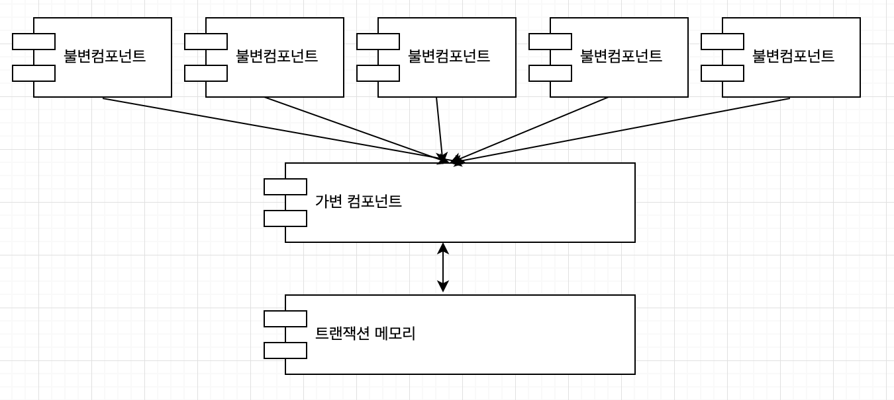

# 6. 함수형 프로그래밍

> 1. 정수를 제곱하기
> 2. 불변성과 아키텍처
> 3. 가변성의 분리
> 4. 이벤트 소싱
> 5. 결론

## 1. 정수를 제곱하기

함수형 언어에서 변수는 변경되지 않는다는 점이 중요하다. 그리고 그것으로 클로저를 제대로 이용하는 것이 함수형 프로그래밍이다.

```java
public class Squint {
    public static void main(String args[]) {
        for (int i=0; i<25; i++) {
            System.out.println(i*i);
        }
    }
}
```

## 2. 불변성과 아키텍처

왜 이런 것을 고려하는가? 단순한 이유다. 경합 조건, 교착상태 조건, 동시 업데이트 문제가 모두 가변 변수로 인해 발생하기 때문이다. 어떠한 변수도 갱신되지 않는다면 이러한 조건들은 문제가 일어나지 않고 락도 일어나지 않을 것이다.

동시성 애플리케이션에서 마주치는 모든 문제인 스레드와 프로세스를 사용하는데에 있어서 가변변수가 없다면 에러가 일어나지 않을것이다!

아키텍트에 관해서 동시성 문제는 언제나 최고의 관심사중 하나이다! 그렇다면 이제 불변성이 실제로 가능한건가? 이 질문에 대해서는 꽤 긍정적이다. 하지만 저장공간이 무한하지 않고 속도가 무한히 빠르지 않다는 것이 현실이다. 가능은 하지만 우리는 타협점을 찾아야 할 것이다

## 3. 가변성의 분리

가변 컴포넌트와 불변 컴포넌트를 분리해야 우리는 불변성과 관련하여 타협할 수가 있다. 

- 불변 컴포넌트에서는 순수하게 함수형 방식으로마나 작업이 처리되어야 하고 
- 불변 컴포넌트에서는 하나 이상의 다른 컴포넌트와 서로 통신을 해야한다. 
- 그리고 트랜젝션 메모리는 불변 컴포넌트와 통신하여 동시 업데이트와 경합 조건으로부터 가변 변수를 보호해야 한다



트랜잭션 메모리는 디스크의 레코드를 다루는 방식으로 메모리의 변수를 처리하며 변수를 보호한다.

## 4. 이벤트 소싱

저장 공간과 처리 능력의 한계는 우리의 시야에서 급격히 사라지고 있다. 이제 프로세서가 초당 수십억 개의 명령을 수행하고 램 용량은 엄청나게 비대해졌으며 이러한 상황에서 필요한 가변 상태는 더 적어졌다.

우리는 계속해서 트랜잭션을 붙여도 된다고 느낀다 하지만 이러한 접근법은 터무니없다. 트랜잭션수와 필요한 컴퓨팅 자원은 시간이 지남에 따라 당연히 증가하고 걷잡을 수 없어질 것이다.

하지만 이 전략이 영원히 동작하도록 만들 필요는 없을 수도 있다. 우리의 애플리케이션의 수명주기 동안만 문제가 없어도 괜찮을 수 있기 때문ㅇ다.

이벤트 소싱에 깔려있는 기본 발상이 이것이다. 상태가 아닌 트랜잭션을 저장하자. 상태가 필요하다면 모든 트랜잭션을 다 처리하자. 요즘 같은 시대에 의외로 통하는 방식이다. CR만 수행하면서 변경과 삭제를 하지 않고 모든 상태를 빠르게 처리해버리는 것이다.

git이 이런 방식이니 말이 안된다는 생각은 하지 말자.

## 5. 결론

지금까지 앞서 다뤘던 세 패러다임은 모두 우리에게서 무언가를 앗아갔다. 하지만 우리가 지금까지 배운것을 외면해서는 안된다. 프로그래밍은 급격히 발전하지 않았으며 우리는 누군가와 같이 일을 하고 있다.

소프트웨어는 순차, 분기, 반복, 참조로 구성된다. 그 이상도 그 이하도 아니다.