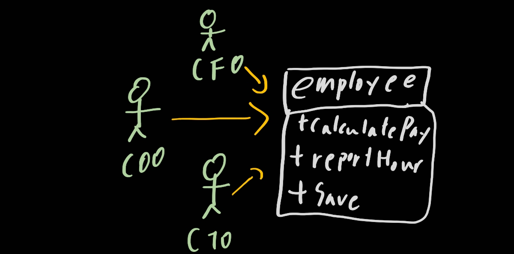

# 7. SRP: 단일 책임 원칙

> 1. 징후 1: 우발적 중복
> 2. 징후 2: 병합
> 3. 해결책
> 4. 결론

좋은 벽돌로 좋은 아키텍처를 이용해서 빌딩을 만든다면 훌륭한 빌딩이 될 것이다. 벽돌이 나빠서도 안되고 아키텍처가 나빠서도 안된다. 즉, 우리는 좋은 벽돌이고 좋은 아키텍처인지 아닌지 정의를 할 수 있어야 한다. 그리고 우리는 이 원칙에 **SOLID**를 생각할 것이다.

SOLID 원칙은 함수와 데이터 구조를 클래스로 배치하는 방법과 결합하는 방법을 설명해줄 것이다. 객체 지향만에 해당되는 것은 아니다. 모든 소프트웨어 구조에 다 적용시킬 수 있다. 그리고 SOLID가 잘 적용이 되어 있다면 아래와 같이 작동이 잘 될 것이다.

- 변경에 유연
- 이해하기 쉬움
- 많은 소프트웨어 시스템에 사용될 수 있는 컴포넌트의 기반

프로그래머는 이들 원칙을 모듈 수준에서 작업할 때 적용할 수 있어야 한다. 즉, 코드보단 조금 상위에서 적용시키며 모듈과 컴포넌트 내부에서 사용되는 소프트웨어 구조를 정의하는데 도움을 줄 것이다.

잘 만들어진 벽돌과 잘 지어진 아키텍철르 이용해야한다는 생각을 계속해서 가져야 한다. 7~11단원까지에서 이것들을 계쏙 설명해주고 고수준의 아키텍처 원칙까지 설명해 줄 것이다.

## SRP

SOLID원칙 중에서 가장 의미가 제대로 전달되지 못하는 것이 이 SRP. 즉, 단일 책임 원칙이다. 이름부터 부적절하긴 하다. 잘못들으면 모듈은 단 하나의 일만 해야한다는 것같이 들리기 때문이다.

햇갈리지 마라. 단 하나의 일만 해야하는 것은 **함수**이다. 모듈이 아니다. SRP의 정의는 보통 아래와 같이 정의 되었다.

> 단일 모듈은 변경의 이유가 하나, 오직 하나뿐이어야 한다.

소프트웨어 시스템은 사용자와 이해관계자를 만족시키기 위해 변경된다. SRP가 말하는 '변경의 이유'란 바로 이들을 말하는 것이다. 즉 이 원칙은 아래와 같이 바꿀 수가 있다

> 하나의 모듈은 하나의, 오직 하나의 집단(액터 actor)에 대해서만 책임져야 한다.

그럼 모듈이란? 단순하게는 소스 파일이다. 단순히 함수와 데이터 구조로 구성된 응집된 집합으로도 생각이 가능하다. 

'응집된'이라는 단어가 SRP를 암시한다. 단일 액터를 책임지는 코드를 함께 묶어주는 힘이 응집성이다.

## 1. 징후 1: 우발적 중복

Employee라는 클래스가 있다고 해보자. 이 클래스는 아래와 같은 구조를 가질 것이다.

!

이 클래스는 SRP를 아래와 같은 이유로 위반한다.

- calculatePay() 메서드는 회계팀에서 기능을 정의하며, CFO 보고를 위해 사용한다
- reportHours() 메서드는 인사팀에서 기능을 정의하고 사용하며, COO 보고를 위해 사용한다.
- save() 메서드는 데이터 관리자가 기능을 정의하고, CTO 보고를 위해 사용한다.

개발자가 이 세 메서드를 Employee라는 단일 클래스에 배치하여 세 액터가 결합되버렸다. 이 결합으로 인해 CFO 팀에서 결정한 조치가 COO팀이 의존하는 무언가에 영향을 줄 수 있다.

예를 들어 아래 그림과 같이 메서드 포함관계가 되어있다고 가정하자

만약 CFO팀에서 초과근무를 제외한 업무시간을 계산하는 방식을 약간 수정하기로 하자. 하지만 인사쪽은 그대로 쓰길 원한다. 그렇다면 우리 프로그래머는 각팀의 원하는 방식으로 calculatePay와 reportHour를 수정할 것이다. 아이고 맙소사! 프로그래머가 regularHour에서 이 두함수를 호출한다는 사실을 몰랐다! 그래서 regularHour가 의도한 값과 다른 것이 나온다! 회사에 엄청난 손실이 오지만 그 누구도 무엇이 문제인지 모르는 상황이 올 것이다

## 2. 징후 2: 병합

소스 파일에 다양하고 많은 메서드를 포함하면 병합이 자주 발생할 것이다. 특히 이들 메서드가 서로 다른 액터를 책임진다면 병합이 발생할 가능성은 확실히 더 높다

예를 들어 DBA가 속한 CTO팀에서 스키마를 수정하고 COO팀에서는 메서드를 수정한다. 그리고 각 팀에서의 개발자는 클래스를 수정할 것이고 안타깝게도 충돌이 일어나며 병합이 되버릴 것이다.

병합에는 위험이 따른다. 굳이 말하지 않아도 될 정도로. 위의 예같은 경우 직접적으로 CTO팀과 COO팀은 곤경에 빠질 것이며 CFO또한 영향이 없지 않을 수가 있다.

## 3. 해결책

생각보다 해결책은 간단하다. 모든 메서드가 각기 다른 클래스로 이동하면 된다.

제일 확실한 방법은 데이터와 메서드를 분리하는 방식이다. 즉, 아무런 메서드가 없는 간단한 데이터 구조인 EmployeeData 클래스를 만들고 세 개의 클래스가 공유하도록 한다. 각 클래스는 자신의 메서드에 반드시 필요한 소스 코드만을 포함한다. 이 세 클래스는 서로 존재를 몰라야 한다. 이러면 '우연한 중복'을 피할 수 있다.

물론 단점또한 있다. 개발자가 세 가지 클래스를 인스턴스화하고 추적해야한다는 게 단점이다. 이러한 난관에서 빠져나오기 위해 퍼사드 패턴(Facade)을 이용한다. [퍼사드 패턴?](https://lktprogrammer.tistory.com/42)

모든 클래스는 반드시 단 하나의 메서드를 가져야 한다는 주장에 근거하여 앞의 해결책에 반대할 수도 있다. 하지만 이 주장은 현실과 다르다. 각 클래스에서 다양한 기능을 구현하는 데 필요한 메서드는 기능 수보다 훨씬 많다. 이들 클래스는 모두 다수의 private 메서드를 포함한다.

이처럼 여러 메서드가 하나의 가족을 이루고, 가족을 포하하는 각 클래스는 하나의 유효버위가 된다.

## 4. 결론

단일 책임 원칙은 메서드와 클래스 수준의 원칙이다. 하지만 이보다 상위의 두 수준에서도 다른 형태로 다시 등장한다. 꼭 기억하고 적용할 수 있도록 노력해보자.

