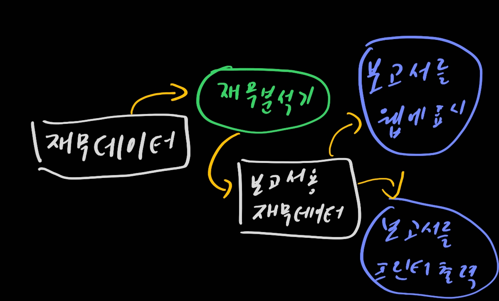
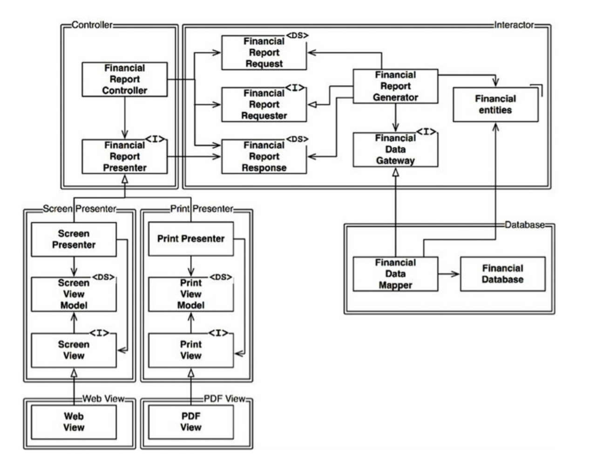

# 8. OCP: 개발-폐쇄 원칙

> 1. 사고 실험
> 2. 방향성 제어
> 3. 정보 은닉
> 4. 결론

개발-폐쇄 원칙. OCP란 무엇인가?

> 소프트웨어 개체는 확장에는 열려 있어야 하고, 변경에는 닫혀 있어야 한다.

다시 말해 소프트웨어 개체의 행위는 확장할 수 있어야 하지만, 이때 개체를 변경해서는 안 된다.

아키텍처를 공부하는 가장 근본적인 이유가 이것이다. 만약 약간의 확장을 하는데 엄청난 수정을 해야한다면 그것은 그 시스템 아키텍처의 실패를 의미한다.

## 1. 사고 실험

재무제표를 웹 페이지로 보여주는 시스템이 있다고 생각해보자. 웹 페이지에 표시되는 데이터는 스크롤할 수 있으며, 음수는 빨간색으로 출력한다.

이번엔 이해관계자가 동일한 정보를 보고서 형태로 변환하여 흑백으로 뽑아달라고 한다. 보고서 양식에 맞춰서 달라고 한다. 이런 경우 새 코드를 작성해야하는데 원래 코드는 얼마나 수정을 해야할까?

이상적인 케이스는 0이다. 어떻게 하면 되는가? 서로 다른 목적으로 변경되는 요소를 적절하게 분리하고(SRP), 이들 요소 사이의 의존성을 체계화(DIP)하면 변경량은 최소화일 것이다. 흐름도는 아래와 같이 진행될 것이다.

여기서 중요한점. 웹에 표시하는 것과 프린터로 출력하는 것이 분리된다는 것이다. 데이터를 가지고 각자 할 일을 하면 되는 것이다!

이러한 목적을 달성하려면 처리 과정을 클래스 단위로 분할하고, 이들 클래스를 컴포넌트 단위로 분리해야한다. 이것을 그림으로 나타낸다면 아래와 같이 진행될 것이다

여기에서 주목할 점은 모든 의존성이 소스 코드 의존성을 나타낸다는 사실이다. 모든 화살표가 단방향임을 봐라. 한쪽에서 다른 것을 호출해도 다른 것에서는 그것을 호출해서는 안된다. 다시 말해 **모든 컴포넌트 관계는 단방향**으로 이루어져야 한다.

## 2. 방향성 제어

만약 위와 같은 설계가 놀랍다면 제대로 다시 볼 수 있도록 하자. 컴포넌트간 의존성이 제대로 되었다는 것을 확실히 인지해라

## 3. 정보 은닉

추이 종속성을 가지게 되면 안된다. 추이 종속성을 가지게 되면 소프트웨어 엔티티는 '잣니이 직접 사용하지 않는 요소에는 절대로 의존해서는 안 된다'는 원칙을 위반하게 된다. 이 원칙은 인터페이스 분리 원칙과 공통 재사용 원칙을 설명할 때 다시 한번 설명한다.

## 4. 결론

OCP는 시스템의 아키텍처를 떠받치는 원동력 중 하나다. OCP의 목표는 시스템을 확장하기 쉬운 동시에 변경으로 인해 시스테이 너무 많은 영향을 받지 않도록 하는 데 있다.