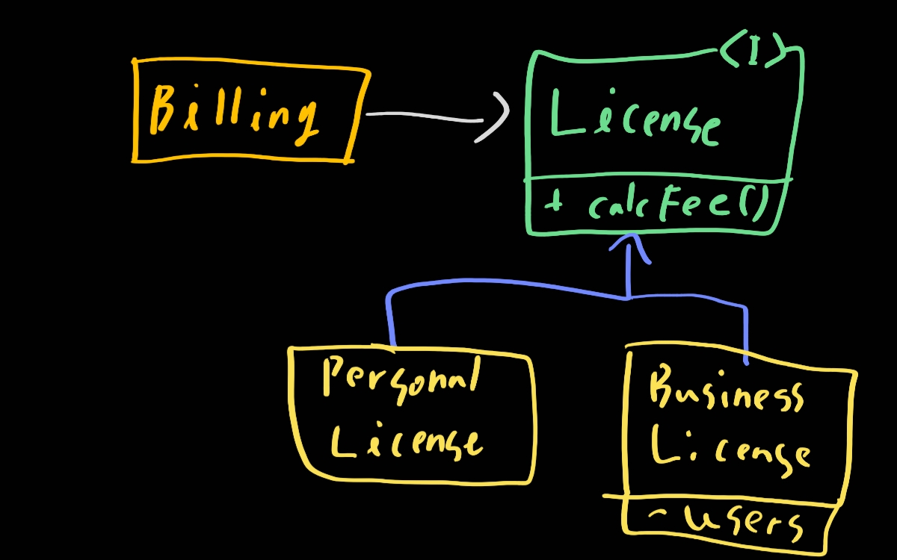
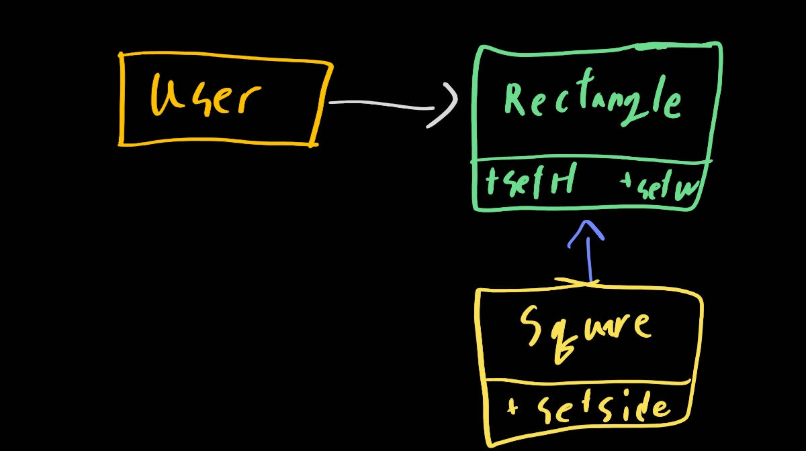

# 9. LSP: 리스코프 치환 원칙

> 1. 상속을 사용하도록 가이드하기
> 2. 정사각형/직사각형 문제
> 3. LSP와 아키텍처
> 4. LSP 위배 사례
> 5. 결론

하위 타입을 아래와 같이 정의해라

> 여기에서 필요한 것은 다음과 같은 치환 원칙이다. S 타입의 객체o1 각각에 대응하는 T타입 객체 o2가 있고, T타입을 이용해서 정의한 모든 프로그램 P에서 o2의 자리에 o1을 치환하더라도 P의 행위가 변하지 않는다면, S는 T의 하위 타입이다.

몇가지 예제를 살펴보자

## 1. 상속을 사용하도록 가이드하기

아래 그림과 같이 License라는 클래스가 있다고 가정하자. 이 클래스는 calcFee()라는 메서드를 가지며, Billing 애플리케이션에서 이 메서드를 호출한다. License에는 PersonalLicense와 BusinessLicense라는 두 가지 '하위 타입'이 존재한다. 이들 두 하위 타입은 서로 다른 알고리즘을 이용해서 라이선스 비용을 계산한다.



이 설계는 LSP를 매우 준수한다. Billing애플리케이션 행위가 License 하위 타입중 무엇을 사용하는지에 전혀 의존하지 않는다! 이들 하위 타입 다 License와 치환할 수가 있다.

## 2. 정사각형/직사각형 문제

LSP를 위반하는 대표 문제는 이것이 있다. 아래 그림을 보자



Square는 Rectangle의 하위 타입으로 적합하지 않다! rectangle은 H와 W가 각각 독립적이지만 Square는 아니기 때문이다. 이런 상황에서 LSP위반을 막기 위한 유일무이한 방법은 Rectangle이 실제로는 Square인지를 검사하는 메커니즘을 User에 추가하는 것이다. 하지만 이렇게 하면 User의 행위가 사용하는 타입에 의존하게 된다. 즉, 결국 서로 치환이 불가능하다.

##  3. LSP와 아키텍처

초창기에 LSP는 상속을 사용하도록 가이드하는 방법 정도로 간주되었지만 지금에 와서는 인터페이스와 구현체에도 적용되는 더 광범위한 설계 원칙으로 변했다.

지금 말하는 인터페이스는 다양하다. 자바스러운 언어라면 인터페이스 하나와 이를 구현하는 여러 개의 클래스, 루비라면 메서드 시그니처를 공유하는 여러 개의 클래스로 구성된다. 또는 REST인터페이스 응답하는 서비스 집단일 수도 있다.

다양한 경우에 LSP를 적용할 수 있따. 잘 정의된 인터페이스와 그 인터페이스의 구현체끼리의 상호 치환 가능성에 기대는 사용자는 많기 때문이다. 와닿지 않을 수 있다. 사실 LSP를 이해하는 가장 최선의 방법은 어겼을 때 무슨 일이 일어나는지 관찰하는 것이다

## 4. LSP 위배 사례

하지만 우리가 직접 위배하진 말고 사례를 한번 알아보자. 다양한 택시 파견 서비스를 통합하는 앱을 만든다. 고객은 택시업체따윈 신경안쓰고 자신이 받을 수 있는 최선의 택시를 선택한다. 고객은 결정하면 시스템은 REST 서비스를 통해 선택된 택시를 고객 위치로 파견한다.

택시 파견 REST서비스의 URI가 운전기사 데이터베이스에 저장되어 있다고 가정하자. 시스템이 알맞은 기사를 선택하고 해당 기사의 레코드로부터 URI를 얻고 그것을 이용해 해당 기사를 고객 위치로 파견한다

밥은 `purplecaab.com/driver/Bob`이라는 uri를 가진다. 그렇다면 호출할때는 아래와 같이 하면 될 것이다.

```
purplecab.com/driver/Bob
	/pickupAddress/24 Maaple St.
	/pickupTime/153
	/destination/ORD
```

이런 식으로 보내면 될 것이다. 그럼 이제 택시업체 ACME에서 프로그래머를 고용했다. 서비스 사양서를 대충 읽고 destination 필드를 dest로 축약해서 사용했다고 치자. 그런데 ACME는 이 지역에서 가장 큰 택시업체이며 ACME 대표의 전처는 우리 회사 대표의 아내가 되었다! 뭔 일이 펼쳐질까? 우리 회사의 아키텍처에서는 어떤 일이 펼쳐질까?

뻔하다. 우리는 이 예외 사항을 처리하는 로직을 추가해야만 할 것이다. ACME 소속 기사를 파견하는 요청은 나머지 업체의 기사를 파견할 때와는 다른 규칙을 이용해 구성해야한다. 간단하게는 if문장을 추가한다.

하지만 실력있는 아키텍트라면 이것은 용납하지 않는다. `"ACME"`라는 스트링이 코드 자체에 있다면 끔찍하다. 그리고 만약 ACME회사가 다른 회사를 인수한다면? 그걸 다 수정할 것인가? 아니면 if에 인수된 회사를 따로 추가할 것인가?

데이터 베이스를 이용하여 설정 정보를 바꿀 수가 있다

| URI      | Dispatch Format                                 |
| -------- | ----------------------------------------------- |
| Acme.com | /pickupAaddress/%s/pickupTime/%s/dest/%s        |
| *.*      | /pickupAaddress/%s/pickupTime/%s/destination/%s |

그리고 이 후에 다양한 복잡한 메커니즘을 추가해야할 것이다.

## 5. 결론

LSP는 아키텍처 수준까지 확장할 수 있고, 반드시 해야만 한다. 치환 가능성을 조금이라도 위배한다면 난리가 난다! 위 같은 에러상황을 꼭 기억하자

