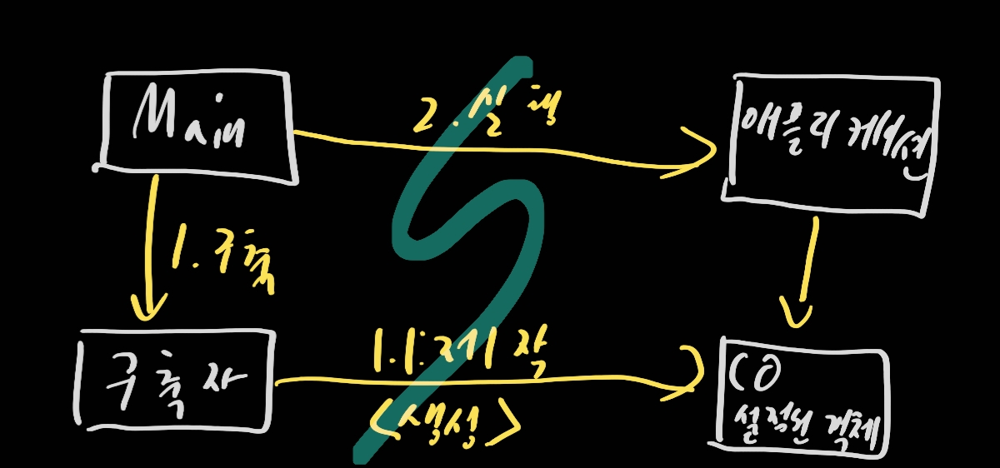
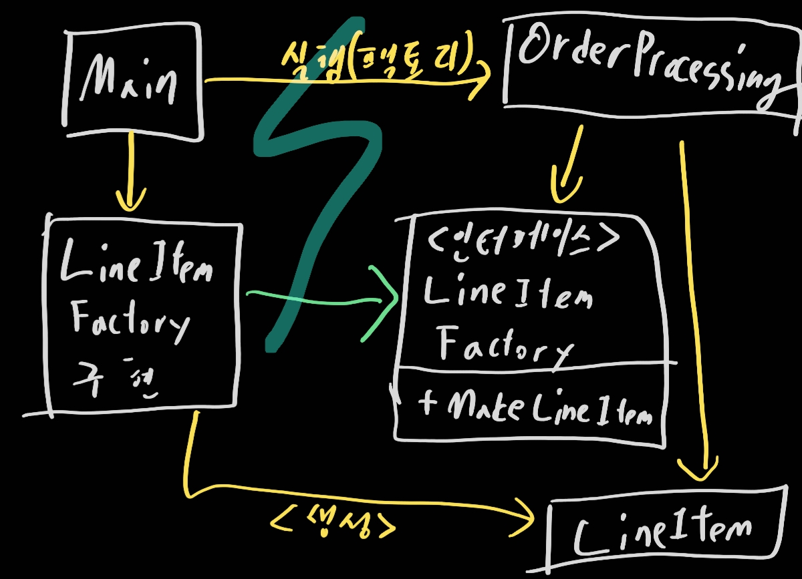

# 11. 시스템

> 1. 도시를 세운다면?
> 2. 시스템 제작과 시스템 사용을 분리하라
> 3. 확장
> 4. 자바 프록시
> 5. 순수 자바 AOP 프레임워크
> 6. AspectJ 관점
> 7. 테스트 주도 시스템 아키텍처 구축
> 8. 의사 결정을 최적화하라
> 9. 명백한 가치가 있을 때 표준을 현명하게 사용하라
> 10. 시스템은 도메인 특화 언어가 필요하다
> 11. 결론

> **"복잡성은 죽음이다. 개발자에게서 생기를 앗아가며, 제품을 계획하고 제작하고 테스트하기 어렵게 만든다."**

## 1. 도시를 세운다면?

우리가 도시를 세운다? 그러면 온갖 세세한 사항을 직접 관리할 수 있는가? 불가능할 것이다. 이미 세워진 도시도 마찬가지다. 하지만 도시는 돌아간다. 왜냐면 각 팀이 존재하고 그 팀이 일을 잘하고 있기 때문이다.

또 다른 이유는 적절한 추사화와 모듈화 때문이다. 큰 그림을 이해하지 못해도 개인과 개인이 관리하는 '고성요소'는 효율적으로 돌아간다. 그리고 소프트웨어도 도시처럼 구성되어 있다.

## 2. 시스템 제작과 시스템 사용을 분리하라

> 소프트웨어 시스템은 (애플리케이션 객체를 제작하고 의존성을 서로 '연결'하는) 준비 과정과 (준비 과정 이후에 이어지는) 런타임 로직을 분리해야 한다.

시작 단계는 모든 애플리케이션이 풀어야 할 관심사(Concern)다. 관심사 분리는 우리 분야에서 가장 오래되고 가장 중요한 설계 기법 중 하나다.

불행히도 많은 앺르리케이션은 관심사사를 분리하지 않는다. 주먹구구식으로 구현할 뿐만 아니라 런타임 로직과 마구 뒤섞인다. 아래가 대표적인 예이다

```java
public Service getService() {
    if (service == null) {
        service = new MyServiceImpl(...); // 모든 상황에 적합한 기본값일까?
    }
    return service;
}
```

이것은 초기화 지연 혹은 계산 지연이라는 기법이다. 장점은 여럿 있다. 필요할 때까지 객체를 생성하지 않으므로 불필요한 부하가 안걸린다. 또한 어떤 경우에도 null 포인터를 반환하지 않는다.

하지만 생성자 인수에 명시적으로 의존한다. 런타임 로직에서 `MyServiceImpl`객체를 전혀 사용하지 않더라도 의존성을 해결하지 않으면 컴파일이 되지 않는다.

테스트에도 문제가 생길 것이다. 테스트 전용 객체를 service 필드에 할당해야하며 이 객체는 다양한 책임이 생길 가능성이 높을 것이다.

또한 `MyServiceImpl`객체도 과연 적절한가? 클래스가 전체 문맥을 알 필요가 있는가? 모든 문맥에 적합하게 제작이 가능한가? 초기화 지연 기법을 한 번정도 사용한다면 별로 심각한 상황은 도래하지 않겠지만 전반적으로 곳곳에 흩어져 있다면 문제가 생길 가능성이 높아진다.

- Main 분리

  

  제어 흐름은 따라가기 쉽다. main 함수에서 필요한 객체를 생성한 후 이를 애플리케이션에 넘긴다. 애플리케이션은 그저 그 객체를 이용할 뿐이다. main과 애플리케이션 사이에 표시된 의존성 화살표의 방향에 주목한다. 즉, 애플리케이션은 main이나 객체가 생성되는 과정을 전혀 모른다!

- 팩토리

  가끔은 객체가 생성되는 시점을 애플리케이션이 결정할 필요도 생긴다. 주문 처리같은 경우가 대표적인 예일 것이다. 그렇다면 의존성을 아래와 같은 ABSTRACT  FACTORY 패턴을 사용해보자

  

  모든 의존성이 main에서 OrderProcessong으로 향한다. 즉, OrderProcessing 애플리케이션은 LineItem이 생성되는 구체적인 방법을 모른다. 그럼에도 인스턴스가 생성되는 시점을 통제하며, 필요하다면 OrderProcessing 애플리케이션에서만 사용하는 생성자 인수도 넘길 수 있다.

- 의존성 주입

  사용과 제작을 분리하는 강력한 메커니즘 하나가 **의존성 주입**이다. 의존성 주입은 제어 역전 기법을 의존성 관리에 적용한 메커니즘이다. 보조 책임을 새로운 객체에게 전적으로 떠넘겨서 단일 책임 원칙을 지키게 하는 방법이다. 의존성 관리 맥락에서 객체는 의존성 자체를 인스턴스로 만드는 책임은 지지 않는다. 대신 이런 책임을 다른 '전담' 메커니즘에 넘겨야만 한다. 초기 설정은 시스템 전체에서 필요하므로 대개 '책임질' 메커니즘으로 'main'루틴이나 특수 컨테이너를 사용한다

  jndi 검색은 의존성 주입을 '부분적으로' 구현한 기능이다.

  ```java
  MyService myService = (MyService)(jndiContext.lookup("NameOfMyService"));
  ```

  호출하는 객체는 실제로 반환되는 객체의 유형을 제어하지 않는다. 대신 호출하는 객체는 의존성을 능동적으로 해결한다.

  진정한 의존성 주입은 한걸음 더 가야한다. 클래스는 완전히 수동적이다. 대신에 의존성을 주입하는 방법으로 설정자 메서드나 생성자 인수를 제공한다. DI 컨테이너는 필요한 객체의 인스턴스를 만든 후 생성자 인수나 설정자 메서드를 사용해 의존성을 설정한다. 실제로 생성되는 객체 유형은 설정 파일에서 지정하거나 특수 생성 모듈에서 코드로 명시한다.

## 3. 확장

군락은 마을로, 마을은 도시로 성장한다. 확장을 하면서 고통을 받을 가능성이 있다. 개발을 하면서도 처음부터 왜 안그랬지라고 고민할 수도 있다. 하지만 '처음부터 올바르게' 따위는 없다. 아래 말을 기억하자

> 소프트웨어 시스템은 물리적인 시스템과 다르다. 관심사를 적절히 분리해 관리한다면 소프트웨어 아키텍처는 점진적으로 발전할 수 있다.

비즈니스 논리가 덩치 큰 컨테이너와 밀접하게 결합되면 독자적인 단위 테스트가 어렵다. TDD가 어려워진다. 그러니 컨테이너를 흉내 내거나 아니면 시간을 낭비해서 테스트를 하고 실제 서버에 배치해야 한다. 객체 지향 프로그래밍이라는 개념을 흔딜면 안된다.

- 횡단 관심사

  관심사를 완벽하게 분리해라. 영속성과 같은 관심사는 애플리케이션의 자연스러운 객체 경계를 넘나드는 경향이 있다. 모든 객체가 전반적으로 동일한 방식으로 이용하게 만들어야 한다.

  원론적으로는 모듈화되고 캡슐화된 방식으로 영속성 방식을 구상할 수 있다.. 하지만 현실적으로는 영속성 방식으로 구현한 코드가 온갖 객체로 흩어진다. 여기서  **횡단 관심사**라는 용어가 나온다. 영속성 프레임워크 또한 모듈화 할 수 있으며 도메인 논리도 모듈화할 수가 있다. 문제는 이 두 영역이 세밀한 단위로 겹친다

  [관점 지향 프로그래밍](https://ko.wikipedia.org/wiki/%EA%B4%80%EC%A0%90_%EC%A7%80%ED%96%A5_%ED%94%84%EB%A1%9C%EA%B7%B8%EB%9E%98%EB%B0%8D) AOP는 횡단 관심사에 대처해 모듈성을 확보하는 일반적인 방법론이다. 관점이라는 모듈 구성 개념은 "특정 관심사를 지원하려면 시스템에서 특정 지점들이 동작하는 방식을 일관성 있게 바꿔야 한다"라고 명시한다. 명시는 간결한 선언이나 프로그래밍 메커니즘으로 수행한다.

  프로그래머는 영속적으로 저장할 객체와 속성을 선언한 후 영속성 책임을 영속성 프레임워크에 위임한다. 이러한 관점 또는 유사한 메커니즘을 쓰는 자바 세 개를 살펴보자

## 4. 자바 프록시

자바 프록시는 단순한 상황에 적합하다. 개별 객체나 클래스에서 메서드 호출을 감싸는 경우가 좋은 예다. 하지만 JDK에서 제공하는 동적 프록시는 인터페이스만 지원한다. 아래 예제를 보자. Bank 애플리케이션에서 JDK프록시를 사용해 영속성을 지원하는 예제다. 계좌 목록을 가져오고 설정하는 메서드만 소개한다

```java
// Bank.java (패키지 이름을 감준다)
import java.util.*;

// 은행 추상화
public interface Bank {
    Collection<Account> getAccounts();
    void setAccounts(Collection<Account> accounts);
}

// BankImpl.java
import java.util.*;

// 추상화를 위한 POJO("Plian Old Java Object") 구현
public class BankImpl implements Bank {
    private List<Account> accounts;

    public Collection<Account> getAccounts() {
        return accounts;
    }
    public void setAccounts(Collection<Account> accounts) {
        this.accounts = new ArrayList<Account>();
        for (Account account: accounts) {
            this.accounts.add(account);
        }
    }
}

// BankProxyHandler.java
import java.lang.reflect.*;
import java.util.*;

// 프록시 api가 필요한 "InvocationHandler"
public class BankProxyHandler implements InvocationHandler {
    private Bank bank;

    public BankProxyHandler (Bank bank) {
        this.bank = bank;
    }

    // InvocationHandler에 정의된 메서드
    public Object invoke(Object proxy, Method method, Object[] args) throws Throwable {
        String methodName = method.getName();
        if (methodName.equals("getAccounts")) {
            bank.setAccounts(getAccountsFromDatabase());
            return bank.getAccounts();
        } else if (methodName.equals("setAccounts")) {
            bank.setAccounts((Collection<Account>) args[0]);
            setAccountsFromDatabase(bank.getAccounts());
            return null;
        } else {
            ...
        }
    }

    // 세부사항은 여기에 이어진다.
    protected Collection<Account> getAccountsFromDatabase() {...}
    protected void setAccountsFromDatabase(Collection<Account> accounts) {...}
}

// 다른 곳에 위치하는 코드
Bank bank = (Bank) Proxy.newProxyInstance(
    Bank.class.getClassLoader(),
    new Class[] {Bank.class},
    new BankProxyHandler(new BankImpl())
);
```

단순한 예제지만 코드가 상당히 많으며 제법 복잡하다. 바이트 조작 라이브러리를 사용하더라도 만만찮게 어렵다. 코드 '양'과 크기는 프록시의 두가지 단점이다. 깨끗한 코드 작성이 어려운 방식이다.

## 5. 순수 자바 AOP 프레임워크

대부분의 프록시 코드는 판박이라 도구로 자동화할 수 있다. 순수 자바 관점을 구현하는 스프링 AOP, JBoss AOP 등과 같은 여러 자바 프레임 워크는 내부적으로 프록시를 사용한다.POJO는 엔터프라이즈 프레임워크에 의존하지 않는다. 따라서 테스트가 개념적으로 더 쉽고 간단하다. 상대적으로 단순하기 때문에 사용자 스토리를 올바로 구현하기 쉽고 미래 스토리에 맞춰 코드를 보수하고 개선하기 편하다.

[이 글을 읽는 것이 더 도움이 될 것이다](https://engkimbs.tistory.com/746)

그리고 이 개념을 도입할 시에 코드가 깨끗해진다. 일부 엔티티 정보는 남아있을 수 있지만 모든 정보가 애너테이션에 속하고 있으므로 코드 자체는 깔끔해진다.

## 6. AspectJ 관점

가장 강력한 도구라고 할 수 있다. 언어 차원에서 관점을 모듈화 구성으로 지원하는 자바 언어 확장이다. 관점을 분리하는 강력하고 풍부한 도구집합을 제공하긴 하지만, 새 도구를 사용하고 새 언어 문법과 사용법을 익혀야 한다는 단점이 있다.

[스프링 aop와 비교하기](https://logical-code.tistory.com/118)

## 7. 테스트 주도 시스템 아키텍처 구축

관점으로 관심사를 분리하는 방식은 그 위력이 막강하다. 코드수준에서 아키텍처 관심사를 분리할 수 있다면, 진정한 **테스트 주도** 아키텍처 구축이 가능해진다. BDUF를 추구할 필요도 없어진다(실제로 이것은 해롭기까지만 하다).

'아주 단순하면서도' 멋지게 분리된 아키텍처로 소프트웨어 프로젝트를 진행해 결과물을 재빨리 출시한 후, 기반 구조를 추가하며 조금씩 확장해 나가도 괜찮다는 말이다. 그렇다고 '아무 방향 없이' 프로젝트에 뛰어들어도 좋다는 소리는 아니다. 프로젝트를 시작할 때는 일반적인 범위, 폭표, 일정은 물론이고 결과로 내놓을 시스템의 일반적인 구조도 생각해야 한다.

> 최선의 시스템 구조는 각기 POJO (또는 다른) 객체로 구현되는 모듈화된 관심사 영역(도메인)으로 구성된다. 이렇게 서로 다른 영역은 해당 영역 코드에 최소한의 영향을 미치는 관점이나 유사한 도구를 사용해 통합한다.이런 구조 역시 코드와 마찬가지로 테스트 주도 기법을 적용할 수 있다.

## 8. 의사 결정을 최적화하라

아주 큰 시스템에서는 한 사람이 모든 결정을 내리기 어렵다. 가장 적합한 사람에게 책임을 맡기면 가장 좋으며 때때로 **가능한 마지막 순간까지 결정을 미루는 방법**이 최선인 경우도 있다.

> 관심사를 모듈로 분리한 POJO 시스템은 기민함을 제공한다. 이런 기민함 덕택에 최신 정보에 기반해 최선의 시점에 최적의 결정을 내리기가 쉬워진다. 또한 결정의 복잡성도 줄어든다.

## 9. 명백한 가치가 있을 때 표준을 현명하게 사용하라

과장되게 표준에 집착하는 경우 고객 가치가 뒷전으로 밀리는 경우도 많다

> 표준을 사용하면 아이디어와 컴포넌트를 재사용하기 쉽고, 적절한 경험을 가진 사람을 구하기 쉬우며, 좋은 아이디어를 캡슐화하기 쉽고, 컴포넌트를 엮기 쉽다. 하지만 때로는 표준을 만드는 시간이 너무 오래 걸려 업계가 기다리지 못한다. 어떤 표준은 원래 표준을 제정한 목적을 잊어버리기도 한다.

## 10. 시스템은 도메인 특화 언어가 필요하다.

필수적인 정보를 명료하고 정확하게 전달해야한다. 우리 소프트웨어 분야에서 DSL이 조명받기 시작했다. 효과적으로 사용한다면 DSL은 추상화 수준을 코드 관용구나 디자인 패턴 이상으로 끌어올린다. 그래서 개발자가 적절한 추상화 수준에서 코드 의도를 표현할 수 있다.

> 도메인 특화 언어를 사용하면 고차원 정책에서 저차원 세부사항에 이르기까지 모든 추상화 수준과 모든 도메인을 POJO로 표현할 수 있다

## 11. 결론

시스템 역시 깨끗해야 한다. 기민성이 떨어지면 생산성이 낮아지고 TDD가 제공하는 장점도 사라진다.

의도를 명확히 표현해야한다는 것을 잊지 말아라.