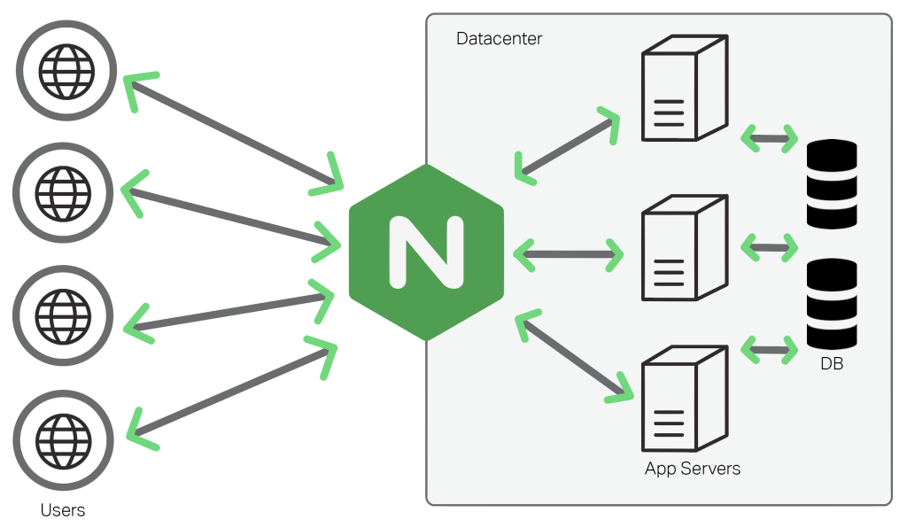

# 디자인 패턴과 프로그래밍 패러다임

1. 디자인 패턴
   1. 싱글톤 패턴
   2. 팩토리 패턴
   3. 전략 패턴
   4. 옵저버 패턴
   5. 프록시 패턴과 프록시 서버
   6. 이터레이터 패턴
   7. 노출 모듈 패턴
   8. MVC 패턴
   9. MVP 패턴
   10. MVVM 패턴
2. 프로그래밍 패러다임
   1. 선언형과 함수형 프로그래밍
   2. 객체지향 프로그래밍
   3. 절차형 프로그래밍
   4. 패러다임의 혼합

## 1. 디자인 패턴

### 1. 싱글톤 패턴


> 싱글톤 패턴(singleton pattern)은 하나의 클래스에 오직 하나의 인스턴스만 가지는 패턴입니다. 보통 데이터베이스 연결 모듈에 많이 사용합니다.
>
> 하나의 인스턴스를 만들어 놓고 해당 인스턴스를 다른 모듈들이 공유하며 사용하기 때문에 인스턴스를 생성할 때 드는 비용이 줄어드는 장점이 있습니다.
>
> 하지만 의존성이 높아지는 단점이 있습니다.

- 싱글톤 패턴의 장점
  - 사용하기 쉽다
  - 굉장히 실용적이긴 하다
- 싱글톤 패턴의 단점
  - 클래스가 단지 하나의 인스턴스만 가지는 단점도 생긴다.
  - 해당 인스턴스에 대한 전역 접근 지점을 제공합니다
  - 싱글톤 패턴은 TDD를 할 때 걸림돌이 된다.
  - TDD를 할 때 단위 테스트를 주로 하는데, 단위 테스트는 테스트가 서로 독립적이어야 하며 테스트를 어떤 순서로든 실행할 수 있어야 합니다.
  - 하지만 싱글톤 패턴은 미리 생성된 하나의 인스턴스를 기반으로 구현하는 패턴이므로 각 테스트마다 '독립적인' 인스턴스를 만들기가 어렵습니다
  - 의존성 주입
    - 결합이 너무 강해진다
    - 이때 의존성 주입을 통해 모듈간의 결합을 느슨하게 만들어야한다
      - 의존성의 종속성이란? `A가 B에 의존성이 있다 === B의 변경사항에 대해 A 또한 변경해야한다`
    - 싱글톤에서 메인 모듈 => 하위 모듈에 의존성을 주고 있는 경우가 많다
      - 여기서 의존성 주입자를 이용한다
      - 의존성 주입자 => 메인 모듈, 의존성 주입자 => 하위 모듈 로 의존성을 주는 주체를 다르게 해야한다
    - 디커플링 된다고도 한다
    - 장점
      - 모듈들의 교체가 쉽다
      - 테스팅과 마이그레이션이 쉬워진다
      - 추상화 레이어를 넣어 구현체를 넣어주기 때문에 의존성 방향이 일관된다
    - 단점
      - 모듈들이 더욱더 분리되므로 클래스 수가 늘어나 복잡성이 증가될 수 있다
      - 런타임 패널티도 생길 가능성이 있다
    - 원칙
      - 상위 모듈은 하위 모듈에서 어떠한 것도 가져오지 않아야하며 둘 다 추상화에 의존해야한다. 이때 추상화는 세부 사항에 의존하지 말아야합니다.
- 자바스크립트의 싱글톤 패턴

  - 자바스크립트에서는 리터럴 `{}` 또는 `new Object`로 객체를 생성하게 되면 다른 어떤 객체와도 같아지지 않아서 쉽게 구현할 수 있다

    ```javascript
    const obj = { a: 27 };
    const obj2 = { a: 27 };
    console.log(obj === obj2); // false

    class Singleton {
      constructor() {
        if (!Singleton.instance) {
          Singleton.instance = this;
        }
        return Singleton.instance;
      }
      getInstance() {
        return this.instance;
      }
    }
    const a = new Singleton();
    const b = new Singleton();
    console.log(a === b); // true
    ```

  - 앞의 코드는 Singleton.instance라는 하나의 인스턴스를 가지는 Singleton 클래스를 구현한 모습입니다.

- 데이터베이스 연결 모듈

  - 앞서 설명한 싱글톤 패턴은 데이터베이스 연결 모듈에 많이 쓰입니다.
    ```javascript
    const URL = "mongodb://localhost:27017/kundolapp";
    const createConnection = (url) => ({ url: url });
    class DB {
      constructor(url) {
        if (!DB.instance) {
          DB.instance = createConnection(url);
        }
        return DB.instance;
      }
      connect() {
        return this.instance;
      }
    }
    const a = new DB(URL);
    const b = new DB(URL);
    console.log(a === b); // true
    ```

- 자바에서의 싱글톤 패턴

  ```java
    class Singleton {
        private static class singleInstanceHolder {
            private static final Singleton INSTANCE = new Singleton();
        }
        public static synchronized Singleton getInstance() {
            return singleInstanceHolder.INSTANCE
        }
    }

    public class HelloWorld {
        public static void main(String[] args) {
            Singleton a = Singleton.getInstance();
            Singleton b = Singleton.getInstance();
            System.out.println(a.hashCode())
            System.out.println(b.hashCode())
            if (a == b) {
                System.out.println(true)
            }
        }
    }
  ```

- 파일을 나눠서 싱글톤으로 적용시키는 예는 아래와 같다

  ```javascript
  // index.js
  import "./redButton";
  import "./blueButton";

  console.log("Click on either of the buttons !");

  // counter.js
  let instance;
  let counter = 0;

  class Counter {
    constructor() {
      if (instance) {
        throw new Error("You can only create one instance!");
      }
      instance = this;
    }

    getInstance() {
      return this;
    }

    getCount() {
      return counter;
    }

    increment() {
      return ++counter;
    }

    decrement() {
      return --counter;
    }
  }

  const singletonCounter = Object.freeze(new Counter());
  export default singletonCounter;

  // redButton.js
  import Counter from "./counter";

  const button = document.getElementById("red");
  button.addEventListener("click", () => {
    Counter.increment();
    console.log("Counter total: ", Counter.getCount());
  });

  // blueButton.js
  import Counter from "./counter";

  const button = document.getElementById("blue");
  button.addEventListener("click", () => {
    Counter.increment();
    console.log("Counter total: ", Counter.getCount());
  });
  ```

  - 이렇게하면 두 버튼은 서로 클릭수를 공유하는 것을 확인가능하다

- 테스팅

  - 테스팅이 힘들지만 트릭키한 방법으로 가능하다.
  - 우리는 새 인스턴스를 매번 만들수 없다
  - 테스팅 이후 리셋해야하기도 하다.
  - 예시 코드

    ```javascript
    // test.js
    import Counter from "../src/counterTest";

    test("incrementing 1 time should be 1", () => {
      Counter.increment();
      expect(Counter.getCount()).toBe(1);
    });

    test("incrementing 3 extra times should be 4", () => {
      Counter.increment();
      Counter.increment();
      Counter.increment();
      expect(Counter.getCount()).toBe(4);
    });

    test("decrementing 1  times should be 3", () => {
      Counter.decrement();
      expect(Counter.getCount()).toBe(3);
    });

    // counterTest.js
    // This file is neccesary so the
    // tests don't fail in the example.
    // It's a duplicate of counter.js

    let instance;
    let counter = 0;

    class Counter {
      constructor() {
        if (instance) {
          throw new Error("Only one instance is allowed!");
        }
        instance = this;
        this.counter = counter;
      }

      getInstance() {
        return this;
      }

      getCount() {
        return counter;
      }

      increment() {
        return ++counter;
      }

      decrement() {
        return --counter;
      }
    }

    const singletonCounter = Object.freeze(new Counter());

    export default singletonCounter;

    // superCounter.js
    import Counter from "./counter";

    export default class SuperCounter {
        constructor() {
            this.count = 0;
        }

        increment() {
            Counter.increment();
            return (this.count += 100);
        }

        decrement() {
            Counter.decrement();
            return (this.count -= 100);
        }
    }

    ```

- 의존성이 명확하지 않다
  - 다른 파일을 import 해오는 방식이 될때 싱글톤인지 아닌지 분명하지 않다
- 전역 동작
  - 싱글톤 인스턴스는 앱의 전체에서 참조할 수 있어야 한다.
  - 만약 전역 변수가 잘못된 판단으로 올바르지 않게 만들어진 경우 잘못된 값으로 덮어쓰여질 수 있으며 이 변수를 참조하는 구현들이 모두 예외를 발생시킬 수 있다
  - 싱글톤 패턴은 일반적으로 앱에 전역 상태를 위해 사용한다는 것을 알자

### 2. 팩토리 패턴


> 팩토리 패턴은 객체를 사용하는 코드에서 객체 생성 부분을 떼어내 추상화한 패턴이자 상속 관계에 있는 두 클래스에서 상위 클래스가 중요한 뼈대를 결정하고, 하위 클래서으ㅔ서 객체 생성에 관한 구체적인 내용을 결정하는 패턴입니다.
>
> 상위 클래스와 하위 클래스가 분리되기 때문에 느슨한 결합을 가지며 상위 클래스에서는 인스턴스 생성 방식에 대해 전혀 알 필요가 없기 때문에 더 많은 유연성을 갖게 됩니다. 로직도 분리되어있어 유지보수성이 증가된다.

- 팩토리 패턴을 도입하기 전에 생길 수 있는 문제
  - 물류 배송 어플을 만들었다 생각해보자
  - 
  - 첫 시작은 아마 물류 배송을 위한 `Truck` 클래스를 만들었을 것이다
  - 그리고 시스템이 커지게 되었고 바다를 건너는 시스템이 필요해지게 되었다
  - 그러면 비슷한 기능이 있는 `Ship` 클래스를 만들면서 전체 코드를 수정해야할 것이다
  - 그리고 매번 뭔가 추가할 때마다 계속 다른 클래스를 만들고 전체 코드를 수정하고 반복해야할 것이다
- 그런 상황을 피하기 위한 솔루션
  - 
  - 물류 자체의 클래스를 만든다
  - 그리고 그거에 따른 하위 클래스인 지상 물류, 바다 물류 그런 로직을 만들고 각 물류 클래스들은 그때 필요한 truck, ship등 필요한 객체를 리턴해줍니다
  - 
  - 
- 즉 기본적으로는 아래와 같은 형식의 구조가 된다
  - 
- 예시 코드

  - ```javascript
    class Latte {
      constructor() {
        this.name = "latte";
      }
    }
    class Espresso {
      constructor() {
        this.name = "espresso";
      }
    }

    class LatteFactory {
      static createCoffee() {
        return new Latte();
      }
    }
    class EspressoFactory {
      static createCoffee() {
        return new Espresso();
      }
    }

    const factoryList = { LatteFactory, EspressoFactory };

    class CoffeeFactory {
      static createCoffee(type) {
        const factory = factoryList[type];
        return factory.createCoffee();
      }
    }

    const main = () => {
      const coffee = CoffeeFactory.createCoffee("LatteFactory");
      console.log(coffee.name); // latte
    };
    ```

  - ```typescript
    /**
          creator 클래스는 product 클래스의 객체를 리턴해주는 기능을 지원하는 팩토리 매서드를 명시해야한다. creator의 서브클래스는 보통 이런 매소드의 구현을 제공한다
          */
    abstract class Creator {
      /**
            creator는 팩토리 매소드의 디폴트 구현을 제공하기도 한다
           */
      public abstract factoryMethod(): Product;

      public someOperation(): string {
        // Product 메소드를 생성하기 위해 팩토리 메소드를 호출한다.
        const product = this.factoryMethod();
        // 그리고 그 product를 사용한다.
        return `Creator: The same creator's code has just worked with ${product.operation()}`;
      }
    }

    /**
          concrete creators는 resulting product의 타입을 변경하기 위해 팩토리 매소드를 오버라이드한다
         */
    class ConcreteCreator1 extends Creator {
      public factoryMethod(): Product {
        return new ConcreteProduct1();
      }
    }
    class ConcreteCreator2 extends Creator {
      public factoryMethod(): Product {
        return new ConcreteProduct2();
      }
    }

    interface Product {
      operation(): string;
    }

    class ConcreteProduct1 implements Product {
      public operation(): string {
        return "{Result of the ConcreteProduct1}";
      }
    }
    class ConcreteProduct2 implements Product {
      public operation(): string {
        return "{Result of the ConcreteProduct2}";
      }
    }

    function clientCode(creator: Creator) {
      // ...
      console.log(
        "Client: I'm not aware of the creator's class, but it still works."
      );
      console.log(creator.someOperation());
      // ...
    }

    console.log("App: Launched with the ConcreteCreator1.");
    clientCode(new ConcreteCreator1());

    console.log("App: Launched with the ConcreteCreator2.");
    clientCode(new ConcreteCreator2());
    ```

- 적용 가능성
  - 팩토리 메서드는 코드가 함께 작동해야하는 객체들의 정확한 유형들과 의존관계들을 모를 때 사용하는게 좋습니다
    - 생성 객체와 실제 동작하는 객체가 분리되어 유지보수에 좋기 때문입니다
  - 라이브러리나 프레임워크의 사용자들에게 내부 컴포넌트를 확장하는 방법을 제공하고 싶을때 사용할 수도 있습니다
  - 매번 재구축하는 대신 재사용하여 시스템 리소스를 절약하고 싶을 때 좋습니다
- 장단점
  - 장점
    - creator와 concrete products의 커플링을 피할 수 있습니다
    - 단일 책임 원칙에 좋습니다
    - Open/Closed 원칙에 좋습니다
  - 단점
    - 패턴 구현을 위해 많은 자식 클래스들을 도입해야해서 코드 자체의 복잡성이 높아질 수 있습니다

### 3. 전략 패턴


> 전략 패턴은 정책 패턴이라고도 하며, 객체의 행위를 바꾸고 싶은 경우 '적접' 수정하지 않고 전략이라고 부르는 '캡슐화한 알고리즘'을 컨텍스트 안에서 바꿔주면서 상호 교체가 가능하게 만드는 패턴입니다.
>
> 우리가 결제할 때 네이버페이, 카카오페이 등 다양한 방법으로 결제하듯이 어떤 아이템을 살 때 LUNACard로 사는 것과 KAKAOCard로 사는 것을 구현한 예제입니다. 결제 방식의 '전략'만 바꿔서 두 가지 방식으로 결제하는 것을 구현했습니다.

- 전략 패턴을 도입하기 전 만날 수 있는 문제

  - 케쥬얼한 여행을 위한 네비게이션 앱을 만들고 싶어졌다.
  - 앱의 가장 필요한 기능은 자동 루트 플래닝 기능이다.
  - 맵에 표시되는 가장 빠른 길을 볼 수 있게 해야한다.
  - 첫 버전은 길위로 가게 하는 것으로 만들어졌다.
  - 차로 여행을 하는 것은 문제가 없게 되었다.
  - 하지만 모두가 차를 이용하는 것은 아니었고 다양한 운동기기에 대한 동작이 필요하게 되었다.
  - 이럴 경우 전략 패턴이 용이할 수가 있다
    - 
    - 
  - 즉, 기본적인 구조에서 그때그때 사용하는 함수만 바꿀 수 있도록 하는 것이다.
  - ```typescript
    /**
     * 클라이언트가 관심가질 인터페이스를 정의.
     */
    class Context {
      private strategy: Strategy;

      /**
       * 일반적으로는 컨스트럭터를 거쳐서 속성이 선언되겠지만, 바뀌기도 한다
       */
      constructor(strategy: Strategy) {
        this.strategy = strategy;
      }

      /**
       * 필요에 의해 전략을 바꿀 수 있어야 한다.
       */
      public setStrategy(strategy: Strategy) {
        this.strategy = strategy;
      }

      /**
       * 공통적인 기능이 존재.
       */
      public doSomeBusinessLogic(): void {
        // ...

        console.log(
          "Context: Sorting data using the strategy (not sure how it'll do it)"
        );
        const result = this.strategy.doAlgorithm(["a", "b", "c", "d", "e"]);
        console.log(result.join(","));

        // ...
      }
    }

    /**
     * 전략에 대한 정의
     */
    interface Strategy {
      doAlgorithm(data: string[]): string[];
    }

    /**
     * 전략들을 정의하자.
     */
    class ConcreteStrategyA implements Strategy {
      public doAlgorithm(data: string[]): string[] {
        return data.sort();
      }
    }

    class ConcreteStrategyB implements Strategy {
      public doAlgorithm(data: string[]): string[] {
        return data.reverse();
      }
    }

    const context = new Context(new ConcreteStrategyA());
    console.log("Client: Strategy is set to normal sorting.");
    context.doSomeBusinessLogic();

    console.log("");

    console.log("Client: Strategy is set to reverse sorting.");
    context.setStrategy(new ConcreteStrategyB());
    context.doSomeBusinessLogic();
    ```

- passport의 전략패턴
  - 전략 패턴을 활용한 라이브러리가 있다.
  - passport는 Node.js에서 인증 모듈을 구현할 때 쓰는 미들웨어 라이브러리로, 여러 가지 '전략'을 기반으로 인증할 수 있게 합니다.
  - 서비스 내의 회원가입된 아이디와 비밀번호를 기반으로 인증하는 LocalStrategy 전략과 페이스북, 네이버 등 다른 서비스를 기반으로 인증하는 OAuth 전략 등을 지원합니다.
- 장점
  - 런타임에 오브젝트 내부에서 알고리즘들을 교환할 수 있습니다
  - 알고리즘을 사용한느 코드에서 알고리즘의 구현 세부 정보들을 고립할 수 있습니다
  - 상속을 합성으로 대체할 수 있습닏
  - 개방/폐쇄 원칙. 곤텍스트를 변경하지 않고도 새로운 전략들을 도입할 수 있습니다
- 단점
  - 알고리즘이 몇 개밖에 되지 않고 거의 변하지 않는다면, 패턴과 함께 사용되는 새로운 클래스들과 인터페이스들로 프로그램을 지나치게 복잡하게 만들 이유가 없다
  - 클라이언트들은 적절한 전략을 선택할 수 있도록 전략 간의 차이점들을 알고 있어야 합니다.

### 4. 옵저버 패턴


> 옵저버 패턴은 주체가 어떤 객체의 상태 변화를 관찰하다가 상태 변화가 있을 때마다 메서드 등을 통해 옵저버 목록에 있는 옵저버들에게 변화를 알려주는 디자인 패턴입니다.

- 주체란?
  - 개체의 상태 변화를 보고 있는 관찰자
- 옵저버란?
  - 이 객체의 상태 변화에 따라 전달되는 메서드를 기반으로 '추가 변화 사항'이 생기는 객체들을 의미한다
- 옵저버 패턴을 쓰기 전에 생길 수 있는 문제
  - Customer와 Store라는 두 객체가 있다고 해보자.
  - Customer는 곧 출시한다고 알려져있는 특정 브랜드(Store)의 상품에 매우 관심이 있다
  - Customer가 모든 매장을 매일 돌아다녀볼 수 도 있다
  - Store가 모든 Customer에게 메일을 보낼 수도 있지만 관심이 없는 Customer에게는 민폐다
  - 이 때 옵저버 패턴이 도움이 될 것이다
    - Subject라 불리는 관심 상태를 가진 객체가 있다고 해보자.
    - 이 객체는 자신의 상태에 대한 변경에 대해 다른 객체에게 알리기도 한다. 이 역할을 하는 객체는 Publisher라고 부를 수 있다
    - 
    - Publisher에게 어떠한 이벤트가 일어날때마다 Subscriber들에게 전달되고 그들의 객체에게 특정 알람 메소드가 전달된다
- 적용할만 한 상황
  - 한 객체의 상태가 바뀔 때 이 상태를 지켜보는 것이 많으면 쓸만합니다
- 대표적인 예시
  - 트위터
    - 어떤 사람(옵저버)가 주체를 팔로우 한다.
    - 주체가 포스팅을 올리게 되면 알림이 팔로워(옵저버)에게 간다
  - MVC 패턴도 옵저버 패턴이라 할 수 있다
    - 주체라고 볼 수 있는 모델에서 변경 사항이 생긴다
    - update() 메서드로 옵저버인 뷰에게 알려준다
    - 이를 기반으로 컨트롤러 등이 작동한다
- 코드 예시

  - JS로 구성해보기

    - ```javascript
      // Observer.js
      class Observable {
        constructor() {
          this.observers = [];
        }

        subscribe(f) {
          this.observers.push(f);
        }

        unsubscribe(f) {
          this.observers = this.observers.filter(
            (subscriber) => subscriber !== f
          );
        }

        notify(data) {
          this.observers.forEach((observer) => observer(data));
        }
      }

      export default new Observable();

      // app.js
      import observable from "./Observable";

      function handleClick() {
        observable.notify("User clicked button!");
      }

      function handleToggle() {
        observable.notify("User toggled switch!");
      }

      function logger(data) {
        console.log(`${Date.now()} ${data}`);
      }

      function toastify(data) {
        toast(data, {
          position: toast.POSITION.BOTTOM_RIGHT,
          closeButton: false,
          autoClose: 2000
        });
      }


      observable.subscribe(logger);
      observable.subscribe(toastify);

      export default function App() {
        return (
          <div className="App">
            <Button variant="contained" onClick={handleClick}>
              Click me!
            </Button>
            <FormControlLabel
              control=<Switch name="" onChange={handleToggle} />
              label="Toggle me!"
            />
            <ToastContainer />
          </div>
        )
      }
      ```

  - javascript와 proxy 객체

    - ```javascript
      // proxy 객체
      const handler = {
        get: function (target, name) {
          return name === "name" ? `${target.a} ${target.b}` : target[name];
        },
      };
      const p = new Proxy({ a: "KUNDOL", b: "IS AUMUMU ZANGIN" }, handler);
      console.log(p.name); // KUNDOL IS AUMUMU ZANGIN

      // 앱 실행
      function createReactiveObject(target, callback) {
        const proxy = new Proxy(target, {
          set(obj, prop, value) {
            if (value !== obj[prop]) {
              const prev = obj[prop];
              obj[prop] = value;
              callback(`${prop}가 [${prev}] >> [${value}] 로 변경되었습니다`);
            }
            return true;
          },
        });

        return proxy;
      }

      const a = { 형규: "솔로" };
      const b = createReactiveObject(a, console.log);
      b.형규 = "솔로";
      b.형규 = "커플";
      // 형규가 [솔로] >> [커플] 로 변경되었습니다
      ```

  - typescript로

    - ```typescript
      /**
       * Subject interface 는 subscribers를 관리하기 위한 methods들을 정의한다
       */
      interface Subject {
        // subject에 observer를 가입시킨다
        attach(observer: Observer): void;

        // subject로부터 observer를 분리시킨다.
        detach(observer: Observer): void;

        // 모든 observer들에게 알린다.
        notify(): void;
      }

      /**
       * 중요한 상태를 가지고 있는 Subject는 observer들에게 변화가 생겼음을 알린다
       */
      class ConcreteSubject implements Subject {
        public state: number;

        /**
         * @type {Observer[]} subscribers들로 이뤄진 리스트. 실제로는 , 좀 더 종합적으로 subscriber들을 포함한다.
         */
        private observers: Observer[] = [];

        /**
         * subscription 관리 methods.
         */
        public attach(observer: Observer): void {
          const isExist = this.observers.includes(observer);
          if (isExist) {
            return console.log("Subject: Observer has been attached already.");
          }

          console.log("Subject: Attached an observer.");
          this.observers.push(observer);
        }

        public detach(observer: Observer): void {
          const observerIndex = this.observers.indexOf(observer);
          if (observerIndex === -1) {
            return console.log("Subject: Nonexistent observer.");
          }

          this.observers.splice(observerIndex, 1);
          console.log("Subject: Detached an observer.");
        }

        public notify(): void {
          console.log("Subject: Notifying observers...");
          for (const observer of this.observers) {
            observer.update(this);
          }
        }

        public someBusinessLogic(): void {
          console.log("\nSubject: I'm doing something important.");
          this.state = Math.floor(Math.random() * (10 + 1));

          console.log(`Subject: My state has just changed to: ${this.state}`);
          this.notify();
        }
      }

      /**
       * Observer interface는 subject를 사용하는 method의 업데이트를 정의해야한다.
       */
      interface Observer {
        // Receive update from subject.
        update(subject: Subject): void;
      }

      class ConcreteObserverA implements Observer {
        public update(subject: Subject): void {
          if (subject instanceof ConcreteSubject && subject.state < 3) {
            console.log("ConcreteObserverA: Reacted to the event.");
          }
        }
      }

      class ConcreteObserverB implements Observer {
        public update(subject: Subject): void {
          if (
            subject instanceof ConcreteSubject &&
            (subject.state === 0 || subject.state >= 2)
          ) {
            console.log("ConcreteObserverB: Reacted to the event.");
          }
        }
      }

      const subject = new ConcreteSubject();

      const observer1 = new ConcreteObserverA();
      subject.attach(observer1);

      const observer2 = new ConcreteObserverB();
      subject.attach(observer2);

      subject.someBusinessLogic();
      subject.someBusinessLogic();

      subject.detach(observer2);

      subject.someBusinessLogic();
      ```

  - Vue.js
    - ```typescript
      function createReactiveObject(
        target: Target,
        isReadonly: boolean,
        baseHandlers: ProxyHandler<any>,
        collectionHandlers: ProxyHandler<any>,
        proxyMap: WeakMap<Target, any>
      ) {
        if (!isObject(target)) {
          if (__DEV__) {
            console.warn(`value cannot be made reactive: ${String(target)}`);
          }
          return target;
        }
        // target is already a Proxy, return it
        // exception: calling readonly() on a reactive object
        if (
          target[ReactiveFlags.RAW] &&
          !(isReadonly && target[ReactiveFlags.IS_REACTIVE])
        ) {
          return target;
        }
        // target already has corresponding Proxy
        const existingProxy = proxyMap.get(target);
        if (existingProxy) {
          return existingProxy;
        }
        // only a whitelist of value types can be observed
        const targetType = getTargetType(target);
        if (targetType === TargetType.INVALID) {
          return target;
        }
        const proxy = new Proxy(
          target,
          targetType === TargetType.COLLECTION
            ? collectionHandlers
            : baseHandlers
        );
        proxyMap.set(target, proxy);
        return proxy;
      }
      ```
    - 위 코드는 실제로 Vue.js 3.0의 옵저버 패턴이 담긴 코드이다
    - proxyMap이라는 프록시 객체를 사용했고, 객체 내부의 get(), set() 메서드를 사용한 것을 볼 수 있습니다.

- 장점
  - 개방/폐쇄 원칙. publisher의 코드 변경없이 subscriber의 클래스만 변경 가능하다
  - 런타임에 객체 간의 관계들을 형성할 수 있습니다
- 단점
  - 구독자들은 무작위로 알림을 받는다

### 5. 프록시 패턴과 프록시 서버


> 프록시 패턴은 대상 객체에 접근하기 전 그 접근에 대한 흐름을 가로체 대상 객체 앞단의 인터페이스 역할을 하는 디자인 패턴입니다

- 프록시 패턴

  - 프록시 패턴과 함께라면 우리는 더 많은 컨트롤을 얻을 수 있다
  - ```typescript
    const person = {
      name: "John Doe",
      age: 42,
      nationality: "American",
    };

    const personProxy = new Proxy(person, {
      get: (obj, prop) => {
        console.log(`The value of ${prop} is ${obj[prop]}`);
      },
      set: (obj, prop, value) => {
        console.log(`Changed ${prop} from ${obj[prop]} to ${value}`);
        obj[prop] = value;
        return true;
      },
    });

    personProxy.name;
    personProxy.age = 43;
    ```

  - ```typescript
    /**
     * Subject 인터페이스는 RealSubject와 Proxy를 표현한다
     * 클라이언트가 이 interface를 사용해 RealSubject와 일을 하면 할 수록
     * real subject대신 proxy를 통과할 수 있다
     */
    interface Subject {
      request(): void;
    }

    /**
     * RealSubject는 코어 비지니스 로직을 포함하고 있다.
     * 보통 RealSubject들은 매우 느리거나 민감할 수 있는 효용성 있는 일에 유능하다
     * Proxy는 이 이러한 문제를 RealSubject의 코드를 바꾸는 대신 해결할 수 있다.
     */
    class RealSubject implements Subject {
      public request(): void {
        console.log("RealSubject: Handling request.");
      }
    }

    /**
     * Proxy는 realSubject에 대한 인터페이스를 가지고 있다
     */
    class Proxy implements Subject {
      private realSubject: RealSubject;

      constructor(realSubject: RealSubject) {
        this.realSubject = realSubject;
      }

      public request(): void {
        if (this.checkAccess()) {
          this.realSubject.request();
          this.logAccess();
        }
      }

      private checkAccess(): boolean {
        // Some real checks should go here.
        console.log("Proxy: Checking access prior to firing a real request.");

        return true;
      }

      private logAccess(): void {
        console.log("Proxy: Logging the time of request.");
      }
    }

    function clientCode(subject: Subject) {
      // ...

      subject.request();

      // ...
    }

    console.log("Client: Executing the client code with a real subject:");
    const realSubject = new RealSubject();
    clientCode(realSubject);

    console.log("");

    console.log("Client: Executing the same client code with a proxy:");
    const proxy = new Proxy(realSubject);
    clientCode(proxy);
    ```

- 프록시 서버
  - 
  - 사용자의 직접적인 서버로의 접근을 차단하고 간접적으로 한 단계를 더 거치므로써 봔서을 덩욱 강화할 수 있습니다.
  - CloudFlare
    - 최고의 프록시 서버중 하나다
    - DDOS 공격 방어
    - HTTPS 구축
  - CORS와 프런트엔드의 프록시 서버
    - 프론트 서버에서 프록시 서버에 요청을 보내 cors를 해결하는 방법도 있다

### 6. 이터레이터 패턴


> 이터레이터 패턴은 이터레이터를 사용하여 컬렉션의 요소들에 접근하는 디자인 패턴입니다.

- js
  - ```javascript
    const mp = new Map();
    mp.set("a", 1);
    mp.set("b", 2);
    mp.set("c", 3);
    const st = new Set();
    st.add(1);
    st.add(2);
    st.add(3);
    for (let a of mp) console.log(a);
    for (let a of st) console.log(a);
    ```
  - 분명히 다른 자료 구조인 set과 map임에도 for a of b라는 이터레이터 프로토콜을 통해 순회하는 것을 볼 수 있습니다.
- ts

  - ```typescript
    interface Iterator<T> {
      // 최신 요소를 return
      current(): T;

      // 최신 요소를 return 해주고 다음 요소로 이동
      next(): T;

      // 최신 요소의 key를 return
      key(): number;

      // 최신 위치가 가능한지 체크
      valid(): boolean;

      // 첫번째 요소로 이터레이터를 되감습니다
      rewind(): void;
    }

    interface Aggregator {
      getIterator(): Iterator<string>;
    }

    class AlphabeticalOrderIterator implements Iterator<string> {
      private collection: WordsCollection;
      private position: number = 0;
      private reverse: boolean = false;

      constructor(collection: WordsCollection, reverse: boolean = false) {
        this.collection = collection;
        this.reverse = reverse;

        if (reverse) {
          this.position = collection.getCount() - 1;
        }
      }

      public rewind() {
        this.position = this.reverse ? this.collection.getCount() - 1 : 0;
      }

      public current(): string {
        return this.collection.getItems()[this.position];
      }

      public key(): number {
        return this.position;
      }

      public next(): string {
        const item = this.collection.getItems()[this.position];
        this.position += this.reverse ? -1 : 1;
        return item;
      }

      public valid(): boolean {
        if (this.reverse) {
          return this.position >= 0;
        }

        return this.position < this.collection.getCount();
      }
    }

    class WordsCollection implements Aggregator {
      private items: string[] = [];

      public getItems(): string[] {
        return this.items;
      }

      public getCount(): number {
        return this.items.length;
      }

      public addItem(item: string): void {
        this.items.push(item);
      }

      public getIterator(): Iterator<string> {
        return new AlphabeticalOrderIterator(this);
      }

      public getReverseIterator(): Iterator<string> {
        return new AlphabeticalOrderIterator(this, true);
      }
    }

    const collection = new WordsCollection();
    collection.addItem("First");
    collection.addItem("Second");
    collection.addItem("Third");

    const iterator = collection.getIterator();

    console.log("Straight traversal:");
    while (iterator.valid()) {
      console.log(iterator.next());
    }

    console.log("");
    console.log("Reverse traversal:");
    const reverseIterator = collection.getReverseIterator();
    while (reverseIterator.valid()) {
      console.log(reverseIterator.next());
    }

    /**
    Straight traversal:
    First
    Second
    Third
    
    Reverse traversal:
    Third
    Second
    First
     */
    ```

### 7. 노출 모듈 패턴

- 노출모듈 패턴은 즉시 실행 함수를 통해 private, public 같은 접근 제어자를 만드는 패턴을 말합니다.
- 자바스크립트는 private나 public 같은 접근 제어자가 존재하지 않고 전역 범위에서 스크립트가 실행됩니다. 그렇기 때문에 노출모듈 패턴을 통해 private와 public 접근 제어자를 구현하기도 합니다.

```javascript
const pukuba = (() => {
  const a = 1;
  const b = () => 2;
  const public = {
    c: 2,
    d: () => 3,
  };
  return public;
})();
console.log(pukuba); // {c:2, d: [Function: d]}
console.log(pukuba.a); // undefined
```

```typescript
const MyModule = (() => {
  // Private variables
  let privateVariable: number = 0;

  // Private method
  const privateMethod = (): void => {
    console.log("Accessed private method");
  };

  // Public method (revealed)
  const incrementPrivateVariable = (): void => {
    privateVariable++;
    console.log(`Private variable incremented to: ${privateVariable}`);
  };

  // Public method (revealed)
  const callPrivateMethod = (): void => {
    console.log("Calling private method...");
    privateMethod();
  };

  // Return an object that reveals only public methods
  return {
    incrementPrivateVariable,
    callPrivateMethod,
  };
})();

// Usage example
MyModule.incrementPrivateVariable(); // Output: "Private variable incremented to: 1"
MyModule.callPrivateMethod(); // Output: "Calling private method..." followed by "Accessed private method"
```

### 8. MVC 패턴

> MVC패턴은 모델(Model), 뷰(View), 컨트롤러(Controller)로 이루어진 디자인 패턴입니다.


애플리케이션의 구성 요소를 세가지 역할로 구분하여 개발 프로세스에서 각각의 구성 요소에마 집중해서 개발할 수 있습니다. 재사용성과 확장성이 용이하다는 장점이 있고, 에플리케이션이 복잡해질수록 모델의 뷰의 관계가 복잡해지는 단점이 있습니다.

- 모델
  - 모델(model)은 애플리케이션의 데이터인 데이터베이스, 상수, 변수 등을 뜻합니다.
  - 예를 들어 사각형 모양의 박스 안에 글자가 들어 있다면, 그 사각형 모양의 박스 위치 정보, 글자 내용, 글자 위치, 글자 포맷(utf-8 등)에 관한 정보를 모두 가지고 있어야 합니다
  - 뷰에서 데이터를 생성하거나 수정하며 컨트롤러를 통해 모델을 생성하건나 갱신합니다.
- 뷰
  - 뷰(View)는 inputbox, checkbox 등 사용자 인터페이스 요소를 나타냅니다. 즉, 모델을 기반으로 사용자가 볼 수 있는 화면을 뜻합니다. 모델이 가지고 있는 정보를 따로 저장하지 않아야 하며 단순히 사각형 모양 등 화면에 표시하는 정보만 가지고 있어야 합니다
  - 또한 변경이 일어나면 컨트롤러에 이를 전달해야 합니다
- 컨트롤러

  - 컨트롤러(Controller)는 하나 이상의 모델과 하나 이상의 뷰를 잇는 다리 역할을 하며 이벤트 등 메인 로직을 담당합니다.
  - 또한, 모델과 뷰의 생명주기도 관리하며, 모델이나 뷰의 변경 통지를 받으며 이를 해석하여 각각의 구성 요소에 해당 내용에 대해 알려줍니다

- MVC 패턴 예
  - 리액트

## 2. 프로그램밍 패러다임

> 프로그래밍 패러다임은 프로그래머에게 프로그래밍의 관점을 갖게 해주는 역할을 하는 개발 방법론입니다.
>
> 예를 들어 객체지향 프로그래밍은 플로그래머들이 프로그래을 상호작용하는 객체들의 집합으로 볼 수 있게 하는 반면에, 함수형 프로그래밍은 상태 값을 지니지 않는 함수 값들의 연속으로 생각할 수 있게 해줍니다

### 1. 선언형과 함수형 프로그래밍

> 선언형 프로그래밍이란 `무엇을` 풀어내는가에 집중하는 패러다임
>
> 함수형 프로그래밍은 `선언형 프로그래밍`의 일종이다.

- 예시
  - 자연수로 이루어진 배열에서 최댓값을 찾는 로직을 짜보자
  - ```javascript
    const ret = [1, 2, 3, 4, 5, 11, 12].reduce(
      (max, num) => (num > max ? num : max),
      0
    );
    console.log(ret); // 12
    ```
  - 앞의 코드에서 reduce()는 `배열`만 받아서 누적한 결괏값을 반환하는 순수 함수이다.
  - 함수형 프로그래밍은 이와 같은 작은 `순수 함수`들을 블록처럼 쌓아 로직을 구현하고 `고차 함수`를 통해 재사용성을 높인 프로그래밍 패러다임입니다.
  - JS는 단순하고 유연한 언어이며, 함수가 일급 객체이기 때문에 객체지향 프로그래밍보다는 함수형 프로그래밍 방식이 선호 됩니다
- 순수함수
  - 출력이 입력에만 의존하는 것을 의미합니다
  - ```javascript
    const pure = (a, b) => {
      return a + b;
    };
    ```
- 고차 함수
  - 고차 함수란 함수가 함수를 값처럼 매개변수로 받아 로직을 생성할 수 있는 것을 말합니다
  - 일급 객체
    - 이때 고차 함수를 쓰기 위해서는 해당 언어가 일급 개체라는 특징을 가져야 하며 그 특징은 다음과 같습니다
    - 면수나 메서드에 함수를 할당할 수 있습니다
    - 함수 안에 함수를 매개변수로 담을 수 있습니다
    - 함수가 함수를 반환할 수 있습니다

### 2. 객체지향 프로그래밍

> 객체지향 프로그래밍은 객체들의 집합으로 프로그램의 상효작용을 표현하며 데이터를 객체로 취급하여 객체 내부에 선언된 메서드를 활용하는 방식을 말합니다.
>
> 설계에 많은 시간이 소요되며 처리속도가 다른 프로그래밍 패러다임에 비해 상대적으로 느립니다

- 예시

  - 자연수로 이루어진 배열에서 최댓값을 찾기
  - ```javascript
    const ret = [1, 2, 3, 4, 5, 11, 12];
    class List {
      constructor(list) {
        this.list = list;
        this.max = list.reduce((max, num) => (num > max ? num : max), 0);
      }
      getMax() {
        return this.max;
      }
    }

    const a = new List(ret);
    console.log(a.getMax());
    ```

  - 특징
    - 추상화, 캡슐화, 상속성, 다형성이라는 특징이 있다
    - 추상화
      - 추상화란 복잡한 시스템으로부터 핵심적인 개념 또는 기능을 간추려내는 것
    - 캡슐화
      - 캡슐화는 객체의 속성과 메서드를 하나로 묶고 일부를 외부에 감추어 은닉하는 것을 말합니다
    - 상속성
      - 상속성으 ㄴ상위 클래스의 특성을 하위 클ㄹ래스가 이어받아서 재사용하거나 추가, 확장하는 것을 말합니다
      - 코드의 재사용 측면, 계층적인 관계 생성, 유지 보수성 측면에서 중요합니다
    - 다형성
      - 다형성은 하나의 메서드나 클래스가 다양한 방법으로 동작하는 것을 말합니다
      - 대표적으로 오버로딩, 오버라이딩이 있다
      - 오버로딩
        - 오버로딩은 같은 이름을 가진ㄴ 메서드를 여러 개 두는 것을 말한다
        - 메서드으이 타입, 매개변수의 유형, 개수 등으로 여러 개를 둘 수 있으며 컴파일 중에 발생ㅇ하는 '정적 다형성'입니다
      - 오버라이딩
        - 오버라이딩은 주로 메서드 오버라이딩을 말하며 상위 클래스로부터 상속받은 메서드를 하ㅟ 클래스가 재정의하는 것을 의미합니다
        - 이는 런타임 중에 발생하는 '동적 다형성'입니다
