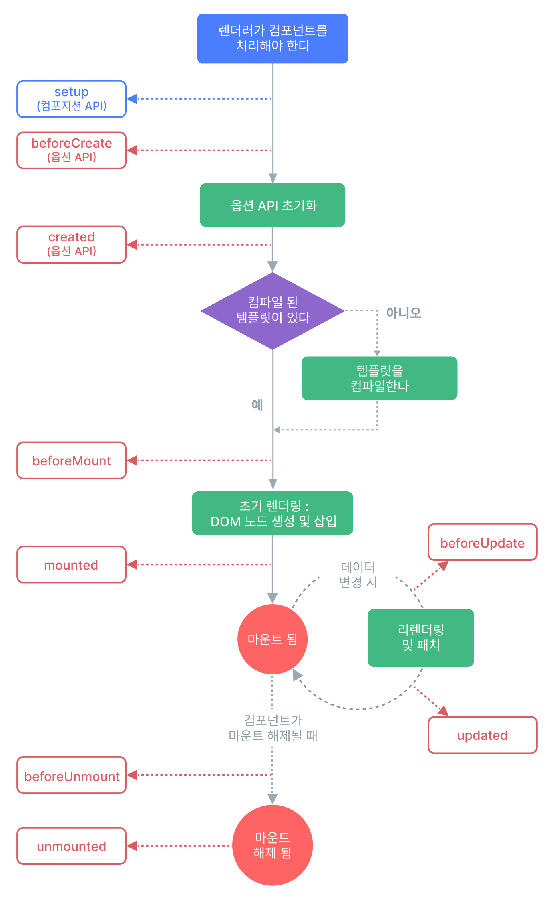

# 02장 리액트 핵심 요소 깊게 살펴보기

> 1. JSX란?
> 2. 가상 DOM과 리액트 파이버
> 3. 클래스 컴포넌트와 함수 컴포넌트
> 4. 렌더리은 어떻게 일어나는가?
> 5. 컴포넌트와 함숭의 무거운 연산을 기억해 두는 메모이제이션

## 1. JSX란?

> 리액트를 배우는 과정에서 가장 먼저 접하는 것은 JSX이다
>
> 허나 JSX는 리액트의 전유물이 아니다
> 리액트에 종속적이지 않다
>
> JSX가 포함된 코드를 아무런 처리 없이 그대로 실행하면 에러가 발생한다. JSX는 자바스크립트 표준이 아닌 페이스북이 임의로 만든 새로운 문법이다.

1. JSX의 정의
   - JSX는 기본적으로 JSXElement, JSXAttributes, JSXChildren, JSXStrings라는 4가지 컴포넌트로 이루어져 있다
   - JSXElement
     - JSX를 구성하는 가장 기본 요소
     - HTML의 Element와 비슷한 역할
     - 다음 요소가 포함되어야 한다
       - JSXOpeningElement: 여는 요소 `<JSX>`
       - JSXClosingElement: 닫는 요소 `</JSX>`
       - JSXSelfClosingElement: 스스로 닫는 요소들 `<JSX />`
       - JSXFragment: 아무런 요소가 없는 형태 `<></>`
     - JSXElementName
       - 요소 이름으로 쓸 수 있는 것을 의미
   - JSXAttributes
     - JSXElement에 부여할 수 있는 속성을 의미한다
   - JSXChildren
     - JSXElement의 자식 값을 나타낸다
   - JSXStrings
     - HTML에서 사용 가능한 문자열은 모두 JSXStrings에서도 가능
2. JSX 예제
   - 뭐 많이 봐왔지...
3. JSX는 어떻게 자바스크립트에서 변환될까?

   - 우선 `@babel/plugin-transform-react-jsx` 플러그인을 알아야 한다.
   - 예시

     ```jsx
     const ComponentA = <A required={true}>Hello World</A>;
     const ComponentB = <>Hello World</>;
     const ComponentC = (
       <div>
         <span>hello world</span>
       </div>
     );

     // @babel/plugin-transform-react-jsx로 변환한 결과
     ("use strict");
     var ComponentA = React.createElement(A, { required: true }, "Hello World");
     var ComponentB = React.createElement(React.Fragment, null, "Hello World");
     var ComponentC = React.createElement(
       "div",
       null,
       React.createElement("span", null, "hell world")
     );

     // 리액트 17, 바벨 7.9.0 이후는 아래와 같다
     ("use strict");

     var _jsxRuntime = require("custom-jsx-library/jsx-runtime");

     var ComponentA =
       (0, _jsxRuntime.jsx, (A, { required: true, children: "Hello World" }));
     var ComponentB =
       (0,
       _jsxRuntime.jsx,
       (_jsxRuntime.Fragment, { children: "Hello World" }));
     var ComponentC =
       (0,
       _jsxRuntime.jsx,
       ("div",
       {
         children: (0, _jsxRuntime.jsx)("span", { children: "hello world" }),
       }));
     ```

## 2. 가상 DOM과 리액트 파이버

> 리액트의 특징 중 가장 많이 언급 되는 것은 실제 DOM이 아니라 가상 DOM을 운영한다는 것이다.
>
> 가상 DOM이란 무엇인지, 실제 DOM에 비해 어떤 이점이 있고 가상 DOM을 다룰 떄 주의점을 알아보자

1. DOM과 브라우저 렌더링 과정
   - 브라우저가 웹 사이트 접근 요청시 화면을 그리는 과정에서 어떤 일이 일어나는가
     1. 브라우저가 사용자가 요청한 주소를 방문해 HTML 파일을 다운로드한다
     2. 브라우저의 렌더링 엔진은 HTML을 파싱해 DOM 노드로 구성된 DOM 트리를 만든다
     3. 2번 과정 중에 CSS파일을 만나면 해당 CSS 파일도 다운로드 한다
     4. CSS도 파싱해 CSSOM을 만든다
     5. ㅂ르ㅏ우저는 2번에서 만든 DOM 노드를 순회한다
        1. 모든 노드를 방문하는 것이 아니고 사용자 눈에 보이는 노드만 방문한다
        2. 즉, display: none과 같이 사용자 화면에 보이지 않는 요소는 방문해 작업하지 않는다
     6. 눈에 보이는 노드를 대상으로 해당 노드에 대한 CSSOM 정보를 찾고 여기서 발견한 CSS 스타일 정보를 이 노드에 적용한다
2. 가상 DOM의 탄생 배경
   - 렌더링하는 과정은 매우 복잡하고 많은 비용이 든다
   - 인터랙션이 다양해지고 작업이 많아질 수록 DOMㅇ을 관리하는 과정에서 부담해야 할 비용이 커진다
   - 가상 DOM은 말 그대로 실제 브라우저의 DOM이 아닌 리액트가 관리하는 가상의 DOM을 의미한다
   - 가상 DOM은 웹 페이지가 표시해야 할 DOM을 일단 메모리에 저장하고 리액트가 실제 변경에 대한 준비가 완료됐을 때 실제 브라우저의 DOM에 반영한다
   - 이렇게 DOM 계산을 브라우저가 아닌 메모리에서 계산하는 과정을 한 번 거치게 된다면 실제로는 여러 번 발생했을 렌더링 과정을 최소화할 수 있고 브라우저와 개발자의 부담을 덜 수 있다
   - 그렇다고 리액트의 이러한 방식이 일반적인 DOM을 관리하는 브라우저보다 빠르진 않다. 웬만한 애플리케이션을 만들 수 있을 정도로 충분히 빠르긴 하다
3. 가상 DOM을 위한 아키텍처 리액트 파이버
   - 리액트 파이버란?
     - 리액트 파이버는 리액트에서 관리하는 평범한 자바스크립트 객체다.
     - 파이버는 파이버 재조정자가 관리하는데, 이는 앞서 이야기한 가상 DOM과 실제 DOM을 비교해 변경 사항을 수집하며, 만약 ㅇ이 둘 사이에 차이가 있으면 변경에 관련된 정보를 가지고 있는 파이버를 기준으로 화면에 랜더링을 요청하는 역할을 한다
     - 리액트 파이버는 다음과 같은 일을 할 수 있다
       - 작업을 작은 단위로 분할하고 쪼갠 다음, 우선순위를 매긴다
       - 이러한 작업을 일시 중지하고 나중에 다시 시작할 수 있다
       - 이전에 했던 작업을 다시 재사용하거나 필요하지 않은 경우에는 폐기할 수 있다
     - 한가지 중요한 점은 이러한 모든 과정이 비동기로 일어난다는 것이다.
     - 파이버는 하나의 작업 단위로 구성돼 있다.
     - 리액트는 이러한 작업 단위를 하나씩 처리하고 `finishedWork()`라는 작업으로 마무리한다. 그리고 이 작업을 커밋해 실제 브라우저 DOM에 가시적인 변경 사항을 만들어 낸다
       - 렌더 단계에서 리액트는 사용자에게 노출되지 않는 모든 비동기 작업을 수행한다. 그리고 이 단계에서 앞서 언급한 파이버의 작업, 우선순위를 지정하거나 중지시키거나 버리는 등의 작업이 일어난다
       - 커밋 단계에서는 앞서 언급한 것처럼 DOM에 실제 변경사항을 반영하기 위한 작업, `commitWork()`가 실행되는데, 이 과정은 앞서와 다르게 동기식으로 일어나고 중단될 수도 없다
     - 파이버는 단순한 자바스크립트 객체로 구성되어있다
     - 파이버의 주요 속성
       - tag: 파이버를 만드는 함수 이름ㅇ인 crateFiberFromElement를 보면 유추할 수 ㅇ있겠지만 파이버는 하나의 element에 하나가 생성되는 1:1 관계를 가지고 있다
       - stateNode: 이 속성에서는 파이버 자체에 대한 참조 정보를 가지고 있으며, 이 참조를 바탕으로 리액트는 파이버와 관련된 상태에 접근한다
       - child, sibling, return: 파이버 간의 관계 개념을 나타내는 속성이다. 리액트 컴포넌트 트리가 형성되는 것과 동일하게 파이버도 트리 형식을 갖게 되는데, 이 트리 형식을 구성하는 데 필요한 정보가 이 속성 내부에 정의된다
       - index: 여러 형제들 사이에서 자신의 ㅟ치가 몇 번쨰인지 숫자로 표현한다.
       - pendingProps: 아직 작업을 미처 처리하지 못한 props
       - memoizedProps: pendingProps를 기준으로 렌더링이 ㅇ완료된 이후에 pendingPRops를 memoizedProps로 저장ㅇ해 관리한다
       - updateQueue: 상태 업데이트, 콜백 함수
       - memoized State: 함수 컴포넌트의 훅 목록이 저장된다.
       - alternate: 리액트 파이버 트리와 이어질 개념. 리액트의 트리는 두 개인데, 이 alternate는 반대편 트리 파이버를 가리킨다
   - 리액트 파이버 트리
     - 리액트 파이버 트리는 두 개가 존재한다.
     - 하나는 현재 모습을 담은 파이버 트리
     - 다른 하나는 작업 중인 상태를 나타내는 workInProgress 트리이다
     - 리액트 파이버의 작업이 끝나면 리액트는 단순히 포인터만 변경해 workInProgress 트리를 현재 트리로 바꿔버린다.
     - 이것을 더블 버퍼링이라고 한다
   - 파이버의 작업 순서
     - 파이버의 노드 생성 흐름
       1. 리액트는 `beginWork()` 함수를 실행해 파이버 작업을 수행하는데, 더 이상 자식이 없는 파이버를 만날 때까지 트리 형식으로 시작된다
       2. 1번에서 작업이 끝난다면 그 다음 `completeWork()` 함수를 실행해 파이버 작업을 완료한다
       3. 형제가 있다면 형제로 넘어간다
       4. 2,3번이 모두 끝났다면 return으로 돌아가 자신의 작업이 완료됐음을 알린다.

## 3. 클래스 컴포넌트와 함수 컴포넌트

> 함수 컴포넌트가 예전에는 상태를 관리 못하는 형ㅇ태로 존재했다.
>
> 함수 컴포넌트에 훅이 등장한 이후 함수 컴포넌트에서 상태나 생ㅇ명주기 메서드 비슷한 작업을 흉내 낼 수 있게 되자 상대적으로 보일러플레이트가 복잡한 클래스 컴포넌트보다 함수 컴포넌트를 더 많이 쓰기 시작했다

1. 클래스 컴포넌트

   - 옛날 코드를 유지보수하기 위해 이해할 필요가 있다

     ```typescript
     import React from "react";

     interface SampleProps {
       required?: boolean;
       text: string;
     }

     interface SampleState {
       count: number;
       isLimited?: boolean;
     }

     class SampleComponent extends React.Component<SampleProps, SampleState> {
       private constructor(props: SampleProps) {
         super(props);
         this.state = {
           count: 0,
           isLimited: false,
         };
       }

       private handleClick = () => {
         const newValue = this.state.count + 1;
         this.setState({ count: newValue, isLimited: newValue >= 10 });
       };

       public render() {
         const {
           props: { required, text },
           state: { count, isLimited },
         } = this;

         return (
           <h2>
             Sample Component
             <div>{required ? "필수" : "필수아님"}</div>
             <div>문자: {text}</div>
             <div>count: {count}</div>
             <button onClick={this.handleClick} disabled={isLimited}>
               증가
             </button>
           </h2>
         );
       }
     }
     ```

   - 클래스 컴포넌트의 생명주기 메서드
     - mount: 컴포넌트가 마운팅되는 시점
     - update: 이미 생성된 컴포넌트의 내용이 변경되는 시점
     - unmount: 컴포넌트가 더 이상 존재하지 않는 시점
     - 위 세가지를 염두에 두고 각 생명주기 메서드를 살피자
     - 
     - 보고가는 vue의 라이프 사이클
       - 
   - 클래스 컴포넌트의 한계
     - 데이터의 흐름을 추적하기 어렵다
     - 애플리케이션 내부 로직의 재사용이 어렵다
     - 기능이 많아질수록 컴포넌트의 크기가 커진다
     - 클래스는 함수에 비해 상대적으로 어렵다
     - 코드 크기를 최적화하기 어렵다
     - 핫 리로딩을 하는 데 상대적으로 불리하다

2. 함수 컴포넌트
   - 자주 봐왔다
3. 함수 컴포넌트 vs 클래스 컴포넌트

   - 생명주기 메서드의 부재
     - 함수 컴포넌트에는 생명주기 메서드가 존재하지 않는다
     - 왜냐하면 함수 컴포넌트는 props를 받아 단순히 리액트를 반환하는 함수이기 때문이다
     - 그래도 `useEffect`가 있기는 하다
   - 함수 컴포넌트와 렌더링된 값

     - 함수 컴포넌트는 렌더링된 값을 고정하고, 클래스 컴포넌트는 그렇지 못하다

       ```typescript
       import React from "react";

       interface Props {
         user: string;
       }

       export function FunctionalComponent(props: Props) {
         const showMessage = () => {
           alert("Hello " + props.user);
         };

         const handleClick = () => {
           setTimeout(showMessage, 3000);
         };

         return <button onClick={handleClick}>Follow</button>;
       }

       export class ClassComponent extends React.Component<Props, {}> {
         private showMessage = () => {
           alert("Hello " + this.props.user);
         };

         private handleClick = () => {
           setTimeout(showMessage, 3000);
         };

         public render() {
           return <button onClick={handleClick}>Follow</button>;
         }
       }
       ```

     - 클릭 한 뒤 3초 이내에 props를 변경한다면?
     - ClassComponent는 3초 뒤에 변경된 props를 기준으로 메시지가 뜨고
     - FunctionalComponent는 클릭했던 시점의 props로 기준해서 뜬다
     - 클래스 컴포넌트는 props의 값을 항상 this로 부터 가져온다. 클래스 컴포넌트의 props는 외부에서 변경되지 않는 이상 불변 값이지만 this가 가리키는 객체, 즉 컴포넌트의 인스턴스의 멤버는 변경 가능한 ㄱ밧이다

   - 클래스 컴포넌트를 공부해야할까?
     - 사라질 계획은 없다
     - 그리고 16까지 오면서 엄청난 수의 클래스 컴포넌트가 있을 것이다

## 4. 렌더링은 어떻게 일어나는가?

> 렌더링 비용을 사용자에게 청구하기에 우리는 렌더링을 최소화할 수 있어야 한다

1. 리액트의 렌더링이란?
   - 렌더링은 브라우저에서도 사용되는 용어이므로 혼동하지 말자
   - 리액트에서의 렌덜이이란 리액트 애플리케이션 트리 안에 있는 모든 컴포넌트들이 현재 자신들이 가지고 있는 props와 state의 값을 기반으로 어떻게 UI를 구성하고 이를 바탕으로 어떤 DOM결과를 브라우저에 제공할 것인지 계산하는 일련의 과정을 의미한다.
2. 리액트의 렌더링이 일어나는 이유
   - 리액트에서 렌더링이 발생하는 시나리오는 다음과 같다
     - 최초 렌더링
     - 리렌더링: 최초 렌더링 이후에 발생한 모든 렌더링
       - 클래스 컴포넌트의 setState가 실행되는 경우: state의 변화는 컴포넌트 상태의 변화를 의미한다. 클래스 컴포넌트에서는 state의 변화를 setState 호출을 통해 수행하므로 리렌더링이 발생한다
       - 클래스 컴포넌트의 forceUpdate가 실행되는 경우: forceUpdate는 강제로 렌더링이 필요하다고 선언한 것으로 간주해 shouldComponentUpdate는 무시하고 건너뛴다
       - 함수 컴포넌트의 useState()의 두 번째 배열 요소인 setter가 실행되는 경우
       - 함수 컴포넌트의 useReducer()의 두번째 요소인 dispatch가 실행되는 경우
       - 컴포넌트의 key props가 변경되는 경우
       - props가 변경되는 경우
       - 부모 컴포넌트가 렌더링될 경우
3. 리액트의 렌더링 프로세스
   - 렌더링 프로세스가 시작되면 리액트는 컴포넌트의 루트에서부터 차근차근 아래쪽으로 내려가면서 업뎅이트가 필요하다고 지정돼 있는 모든 컴포넌트를 찾는다
   - 업데이트가 필요하다고 지정돼 있는 컴포넌트를 발견시 `클래스 컴포넌트는 render(), 함수 컴포넌트는 함수 컴포넌트 자체를 호출한 뒤에, 그 결과물을 저장한다`
4. 렌더와 커밋
   - 렌더 단계
     - 컴포넌트를 렌더링하고 변경 사항을 계싼하는 모든 작업
     - 컴포넌트를 실행해 이 결과와 이전 가상 DOM을 비교하는 과정을 거쳐 변경이 필요한 컴포넌트를 체크하는 단계
     - type, props, key 이 세가지 중 하나라도 변경된 것이 있으면 변경이 필요한 컴포넌트로 체크해 둔다
   - 커밋 단계
     - 렌더 단계의 변경 사항을 실제 DOM에 적용해 사용자에게 보여주는 과정을 말한다
     - 이 단계까 끝나야 비로소 브라우저의 렌더링이 발생
   - 리액트의 렌더링이 일어난다고 무조건 DOM 업데이트가 일어나는 것은 아니다
   - 커밋 단계까지 갈 필요가 없다면 생략된다
5. 일반적인 렌더링 시나리오 살펴보기

   - 예제 코드부터 보고 시작하자

     ```typescript
     import { useState } from "react";

     export default function A() {
       return (
         <div className="App">
           <h1>Hello React!</h1>
           <B />
         </div>
       );
     }

     function B() {
       const [counter, setCounter] = useState(0);

       function handleButtonClick() {
         setCounter((prev) => prev + 1);
       }

       return (
         <>
           <label>
             <C number={counter} />
           </label>
           <button onClick={handleButtonClick}>+</button>
         </>
       );
     }

     function C({ number }) {
       return (
         <div>
           {number} <D />
         </div>
       );
     }

     function D() {
       return <>리액트 재밌다</>;
     }
     ```

   - 다음과 같은 순서로 렌더링이 일어난다
     - B 컴포넌트의 setState가 호출
     - B 컴포넌트의 리렌더링 작업이 렌더링 큐에 들어간다
     - 리액트는 트리 최상단에서부터 렌더링 경로를 검사한다
     - A 컴포넌트는 리렌더링이 필요한 컴포넌트로 표시돼 있지 않으므로 별다른 작업을 하지 않는다
     - 그다음 하위 컴포넌트인 B컴포넌트는 업데이트가 필요하다고 체크돼 있으므로 B를 리렌더링한다
     - 5번 과정에서 B는 C를 반환했다
     - C는 props인 number가 업데이트됐다. 그러므로 업데이트가 필요한 컴포넌트로 체크돼 있고 업데이트한다
     - 7번 과정에서 C는 D를 반환했다
     - D도 마찬가지로 업데이트가 필요한 컴포넌트로 체크되지 ㅇ낳았다. 그러나 C가 렌더링됐으므로 그 자식인 D도 렌더링됐다
   - 허나 D를 memo로 감싼다면 리렌더링되지 않는다!

## 5. 컴포넌트와 함수의 무거운 연산을 기억해 두는 메모이제이션
