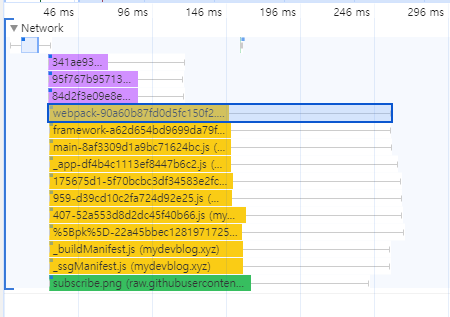
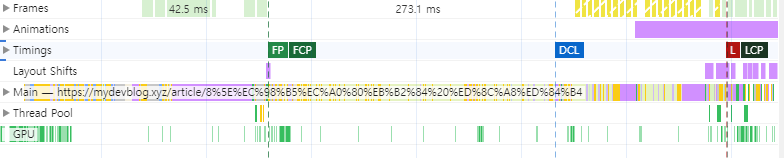
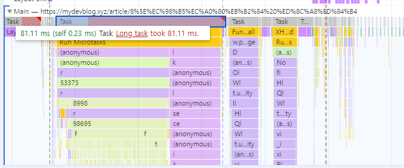

# 13장 웹페이지의 성능을 측정하는 다양한 방법

## 13.4 크롬 개발자 도구

### 13.4.2 성능

> 성능 분석에 사용하기 위해 만들어진 탭.

- 메뉴
  - 성능 탭에서 사용할 수 있는 메뉴를 확인할 수 있다.
  - 원을 선택하면 성능 측정이 시작되며, 다시 누르면 성능 측정이 종료.
  - 새로고침 버튼은 페이지 로드부터 종료시점까지 성능 측정
  - 의도적 스로틀링 및 측정 프로필 저장 및 불러오는 기능이 포함
- 요약
  - 요약 탭에서는 측정 기간의 CPU, 네트워크 요청, 스크린숏, 메모리 점유율 등을 요약해서 볼 수 있다.
  - 말 그대로 요약
    - 자세한 내용은 하단 패널에서 참고 가능
  - 드래그를 통해 시점을 선택할 수 있다.
    - 드래그를 통해 원하는 시점을 선택하면 해당 시점과 관련된 정보만 노출된다
    - 즉, 요걸로 원하는 시점의 정보를 더욱 상세하게 확인 가능
- 네트워크
  - 성능 측정 기간 동안에 발생한 모든 네트워크 요청을 확인할 수 있다.
  - 색에 따라 요청의 종류 판별 가능
    - 파란색: HTML
    - 보라색: CSS
    - 노란색: 자바스크립트
    - 초록색: 이미지
    - 회색: 기타
      - 폰트
      - JSON등
  - 위에 있을 수록 요청이 우선순위가 높은 요청
    - 오니쪽 선은 연결을 시작되기 위한 기간
    - 대표 색상의 막대 그래프 중 색이 더 연한 왼쪽은 요청을 보내고 최초 바이트가 오기까지의 대기 시간
    - 대표 색상의 막대 그래프 중 색이 진한 오른쪽은 콘텐츠를 다운로드하는 데 걸리는 시간
    - 마지막에 거의 안 보이는 오른쪽 선은 메인 스레드의 응답을 기다리는 시간, 이는 네트워크의 소요 시간에 포함되지 않는다
    - 즉, 진한색 영역이 크다면 큰 파일이라 쪼갤 필요가 있다
    - 연한 색 영역이 크다면 다운로드 요청에 대한 응답이 오래 걸린다
    - 
  - 해당 요청을 클릭하면 네트워크 요청에 대한 자세한 내용을 확인할 수 있다
- web vitals
  - 핵심 웹 지표 시점을 확인할 수 있는 영역
  - 그런데 이거 사라지고 timing 탭이 생긴 듯 함
    - 
- 소요 시간과 기본
  - 시간의 흐름에 따라 메인 스레드의 작업은 어떻게 이뤄졌는지, 또 자바스크립트 힙 영역은 어떻게 변화하는지 등을 확인할 수 있다.
  - 
  - 사용법
    - 긴 작업에 대해 알아본다고 가정
    - 먼저 살펴보고 싶은 긴 작업을 선택
    - 걸릴만한 작업을 계속 클릭해보고 코드를 확인한다
      - 웹팩이나 우리와 관련 없는 코드들은 어쩔 수 없으니 우리의 코드만을 찾기 위해 노력하자.
