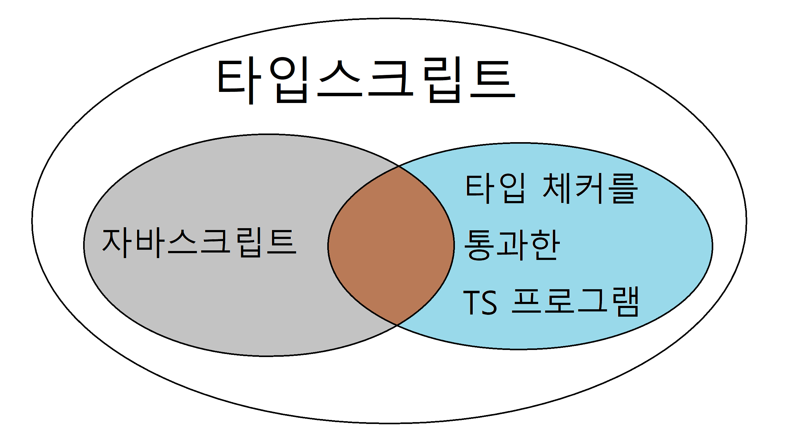

# 1장 타입스크립트 알아보기

> 1. 타입스크립트와 자바스크립트의 관계 이해하기
> 2. 타입스크립트 설정 이해하기
> 3. 코드 생성과 타입이 관계없음을 이해하기
> 4. 구조적 타이핑에 익숙해지기
> 5. any 타입 지양하기

## 아이템 1 타입스크립트와 자바스크립트의 관계 이해하기

> 타입스크립트는 자바스크립트의 상위 집합(**superset**)이다

위와 같은 말을 종종 들어봤을 것인데 무슨 의미일까? 자바스크립트는 문법적으로도 자바스크립트의 상위호환이며 js에서 동작한다면 무조건 ts에서도 동작하지만 반대는 아닌 경우가 있다. 아래와 같은 코드를 보자

```typescript
function greet(who: string) {
  console.log("Hello", who);
}
```

위는 타입스크립트에서 동작하지만 js에서는 `who: string` 요 부분에서 synteaxError가 발생할 것이다. 또다른 케이스를 한번 살펴보자

```typescript
let city = "new york city";
console.log(city.toUppercase());
```

위 코드는 js에서는 `TypeError: city.toUppercase is not a function`을 내지만 ts는 타입체커를 통해 문제점을 찾아낼 것이다. `toUppercase 속성이 'string' 형식에 없습니다.` 이 타입추론도 ts에서는 매우 중요한 점이다. (3장에서 더 살펴볼 예정)

타입 추론은 매우 중요하지만 ts는 객체 형태에서는 타입추론이 바로 되지 않는다. 아래와 같은 코드가 꼭 필요하다.

```typescript
interface State {
  name: string;
  capital: string;
}

const state: State[] = [
  { name: "Alabama", capitol: "Montagomery" },
  { name: "Alabama", capitol: "Montagomery" },
  { name: "Alabama", capitol: "Montagomery" },
  { name: "Alabama", capitol: "Montagomery" },
];

for (const state of states) {
  console.log(state.capital);
}
```

이렇게 타입을 지정해주면 안에 객체를 직접 추가시켜주거나 로직상 추가시켜주려할 때도 타입을 확인해주기 때문에 매우 작업하기 편하다. 이러한 상황을 볼때 타입스크립트는 아래 그림과 같다고 할 수가 있다.



- 요약
  - TS는 JS의 상위 집합이다.
  - TS는 JS 런타임 동작을 모델링하는 타입 시스템을 가지고 있기 때문에 런타임 오류를 발생시키는 코드를 찾아내려고 한다. 하지만 모든 오류를 찾아낼 수 있는 건 아니다
  - TS 타입 시스템은 전반적으로 JS 동작을 모델링한다. 그러나 JS에서는 되지만 TS에서는 허용되지 않는 경우도 있다. 하지만 이것은 문법의 엄격함때문이며 취향의 차이이지 우열을 가릴 문제는 아니다

## 아이템 2 타입스크립트 설정 이해하기

타입스크립트는 `tsconfig.json` 파일을 생성하여 설정을 관리할 수 있도록 하자. 대표적으로 `noImplicitAny`와 `strictNullChecks`를 알아보자.

- noImpicitAny
  - 미리 정의된 타입을 가져야 하는지 여부를 제어한다.
  - ```typescript
    // 아래 코드는 해제되어 있을 때는 유효
    function add(a, b) {
      return a + b;
    }
    // 만약 해제안되어있으면 아래처럼 타입을 명시해줘야 한다
    function add(a: number, b: number) {
      return a + b;
    }
    ```
- strictNullChecks

  - null과 undefined가 모든 타입에서 허용되는지 확인하는 설정
  - ```typescript
    // 해제되어있다면 아래 코드는 정상작동한다.
    const x: number = null;
    // 만약 위 코드가 통과가 되고 싶다면 아래와 같이 명시하자
    const x: number | null = null;
    ```

- 요약
  - TS 컴파일러는 언어의 핵심 요소에 영향을 미치는 몇 가지 설정을 포함하고 있다
  - TS 설정은 커맨드 라인보단 `tsconfig.json`을 사용하자
  - js 프로젝트를 ts로 전환하는 것이 아니면 `noImplicitAny`와 `strictNullChecks`설정을 추천

## 아이템 3 코드 생성과 타입이 관계없음을 이해하기

- TS의 큰 두 가지 역할
  - 최신 TS/JS를 브라우저에서 동작할 수 있도록 구버전의 JS로 트랜스파일
  - 코드의 타입 오류를 체크

위 두가지를 서로 독립적으로 실행한다. 그리고 거꾸로 생각하면 아래와 같은 상황이 일어날 가능성도 높다

### 타입 오류가 있는 코드도 컴파일이 가능합니다

```typescript
let x = "hello";
x = 1234;
```

아마 위 코드는 실행시킬 때 에러가 일어날 것이다. 하지만 빌드는 가능하다! 타입 체크와 컴파일이 동시에 일어나지 않기 때문이다. 만약 이 경우를 피하고 싶다면 `tsconfig.json`에서 [noEmitOnError](https://www.typescriptlang.org/tsconfig#noEmitOnError)에 대해 자세히 알아보자.

### 런타임에는 타입 체크가 불가능합니다.

```typescript
interface Square {
  width: number;
}
interface Rectangle extends Square {
  height: number;
}
type SHAPE = Square | Rectangle;


function calculateArea(shape: SHAPE) {
  if (shape intanceof Rectangle) {
    return shape.width * shape.height
  } else {
    return shape.width * shape.width
  }
}
```

instanceof 체크는 런타임에 일어나지만, Rectangle은 타입이기 때문에 런타임에서 아무런 역할을 못한다. (실제로 TS가 JS로 컴파일되면서 인터페이스, 타입, 타입 구문은 없어진다.) 런타임 에러를 피하려면 아래처럼 함수를 수정해야한다.

```typescript
// 1번 해결법
function calculateArea(shape: SHAPE) {
  if ("height" in shape) {
    return shape.width * shape.height;
  } else {
    return shape.width * shape.width;
  }
}

// 2번 해결법
interface Square {
  kind: "square";
  width: number;
}
interface Rectangle {
  kind: "rectangle";
  width: number;
  height: number;
}
type SHAPE = Square | Rectangle;

function calculateArea(shape: SHAPE) {
  if (shape.kind === "rectangle") {
    return shape.width * shape.height;
  } else {
    return shape.width * shape.width;
  }
}

// 3번 해결법
class Square {
  constructor(public width: number) {}
}
class Rectangle extends Square {
  constructor(public width: number, public height: number) {
    super(width);
  }
}
type SHAPE = Square | Rectangle

function calculateArea(shape: SHAPE) {
  if (shape intanceof Rectangle) {
    return shape.width * shape.height;
  } else {
    return shape.width * shape.width;
  }
}
```

### 타입 연산은 런타임에 영향을 주지 않습니다.

`as`는 피할 수 있으면 피하도록 하자 아래 코드를 참고하자

```typescript
// 동작은 하지만 의도와 다르게 작동하는 코드
function asNumber(val: number | string): number {
  return val as number;
}

// 의도대로 동작하는 코드
function asNumber(val: number | string): number {
  return typeof val === "string" ? Number(val) : val;
}
```

### 런타임 타입은 선언된 타입과 다를 수 있습니다.

런타임 타입과 선언된 타입이 맞지 않을 수 있다. (대표적으로 request/response) 선언된 타입이 언제든지 달라질 수 있다는 것을 명심해라

### 타입스크립트 타입으로는 함수를 오버로드할 수 없습니다.

보통의 언어에서는 가능하지만 타입스크립트에서는 타입과 런타임의 동작이 무관하여 오버로딩이 불가능하다.

### 타입스크립트 타입은 런타임 성능에 영향을 주지 않습니다.

타입스크립트의 정적 타입은 비용이 들지 않는다. 아래 주의 사항이 얼마나 잘 되어있는지 감격스러울 정도이다.

- '런타임' 오버헤드가 없는 대신, 타입스크립트 컴파일러는 '빌드타임' 오버헤드가 있다.
- 호환성과 성능 사이의 선택은 컴파일 타깃과 언어 레벨의 문제이며 타입과는 정말 무관하다
  - 타입스크립트가 컴파일하는 코드는 오래된 런타임 환경을 지원하기 위해 호환성을 높이고 성능 오버헤드를 감안할지, 호환성을 포기하고 성능 중심의 네이티브 구현체를 선택할지의 문제에 맞닥뜨릴 수 있다.

---

- 요약
  - 코드 생성은 타입 시스템과 무관하다
  - 타입스크립트 타입은 런타임 동작이나 성능에 영향을 주지 않는다
  - 타입 오류가 존재해도 컴파일은 가능하다
  - 타입스크립트의 타입은 런타임에 사용할 수 없다

## 아이템 4 구조적 타이핑에 익숙해지기

타입스크립트는 구조적 타이핑으로 진행한다 아래와 같은 코드가 작동이 된다는 것을 이해하고 어떤 이유때문에 문제가 생기는 지 이해가 된다면 좋을 것이다.

```typescript
interface Vector2D {
  x: number;
  y: number;
}
interface NamedVector {
  name: string;
  x: number;
  y: number;
}
interface Vector3D {
  x: number;
  y: number;
  z: number;
}
function calculateLength(v: Vector2D) {
  return v.x * v.x + v.y * v.y;
}
const test2DVector: Vector2D = { x: 2, y: 3 };
const testNamedVetcor: NamedVector = { x: 2, y: 3, name: "test" };
const test3DVector: Vector3D = { x: 2, y: 3, z: 5 };
calculateLength(test2DVector);
calculateLength(testNamedVetcor);
calculateLength(test3DVector);
```

- 요약
  - 자바스크립트가 덕 타이핑 기반이고 타입스크립트가 이를 모델링하기 위해 구조적 타이핑을 사용함을 이해해야 한다.
  - 클래스 역시 구조적 타이핑 규칙을 따른다는 것을 명심해라
  - 구조적 타이핑을 사용하면 유닛 테스팅을 손쉽게 할 수 있다

## 아이템 5 any 타입 지양하기

### any 타입에는 타입 안정성이 없습니다.

`as any`를 쓰는 순간 통과가 되지만 혼돈의 시작점이 될 것이다.

```typescript
let age: number;
age = "12" as any;
age += 1; // age === '121'
```

### any는 함수 시그니처를 무시해 버립니다.

any타입으로 지정된 것은 타입을 무시하고 함수에 넣을 수 있으며 리턴값이 어떻게 될 지는 아무도 모르는 혼돈이 시작된다

### any 타입에는 언어 서비스가 적용되지 않습니다.

코드작성을 도와주는 에디터들에서 자동완성 기능과 적절한 도움 제공 받는 것이 안될 것이다. 그 상태에서 진행을 한다면 해당 코드를 나중에 보는 사람은 아무것도 모르게 될 것이다.

### any 타입은 코드 리펙터링 때 버그를 감춥니다.

타입 체크가 그냥 통과되면서 테스트를 통과할 것이다. 그런데 의도한데로 테스트가 통과되는 것이 아닐 것이다.

### any는 타입 설계를 감춰버립니다. 그리고 타입시스템의 신뢰도를 떨어뜨립니다

- 요약

# any 쓰지마
