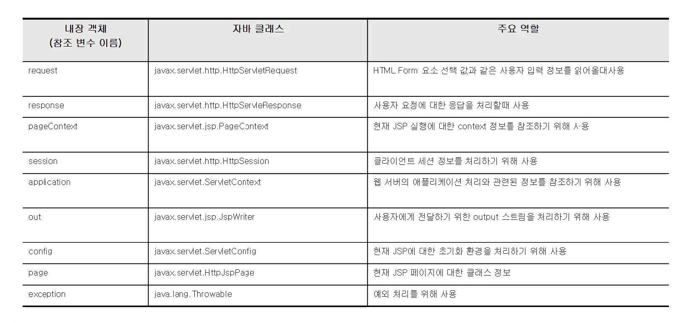

# DB 연결 웹 앱

> 1. JavaScript - FE
> 2. WEB UI 개발 - FE
> 3. JSP - BE
> 4. redirect & forward - BE
> 5. scope - BE
> 6. JSTL & EL - BE
> 7. MySQL - BE
> 8. SQL - BE
> 9. Maven - BE
> 10. JDBC - BE
> 11. WEB API - BE

# JSP - BE

JSP(JavaServer Pages)

html 파일들은 WebContent폴더 안에 있다. 거기서 jsp확장자로 파일을 만들 수가 있다. 그리고 실행되는 것은 jsp가 아니라 **jsp가 서블릿으로 바뀌어서 실행이 된다!!**

```jsp
<%@ page language="java" contentType="text/html; charset=UTF-8"
    pageEncoding="UTF-8"%>
<!DOCTYPE html>
<html>
  <head>
    <meta charset="UTF-8">
    <title>Insert title here</title>
  </head>
  <body>

  <%
    int total = 0;
    for(int i = 1; i<=10; i++){
	    total = total + i;
    }
  %>

  1부터 10까지의 합 : <%=total %>
  </body>
</html>
```

```java
// 위코드가 서블릿으로 변환되어 이렇게 나온다
public void _jspInit() {
  }

  public void _jspDestroy() {
  }

  public void _jspService(final javax.servlet.http.HttpServletRequest request, final javax.servlet.http.HttpServletResponse response)
      throws java.io.IOException, javax.servlet.ServletException {

    .....

    try {
      .....

      out.write("\n");
      out.write("<!DOCTYPE html PUBLIC \"-//W3C//DTD HTML 4.01 Transitional//EN\" \"http://www.w3.org/TR/html4/loose.dtd\">\n");
      out.write("<html>\n");
      out.write("<head>\n");
      out.write("<meta http-equiv=\"Content-Type\" content=\"text/html; charset=UTF-8\">\n");
      out.write("<title>sum10</title>\n");
      out.write("</head>\n");
      out.write("<body>\n");
      out.write("\n");

	int total = 0;
	for(int i = 1; i <= 10; i++){
		total = total + i;
	}

      out.write("\n");
      out.write("\n");
      out.write("1부터 10까지의 합 : ");
      out.print(total );
      out.write("\n");
      out.write("\n");
      out.write("</body>\n");
      out.write("</html>");
    } catch (java.lang.Throwable t) {
      .....
      }
    } finally {
      _jspxFactory.releasePageContext(_jspx_page_context);
    }
  }
```

## 실행 순서

1. 브라우저가 웹서버에 JSP에 대한 요청 정보 전달
2. 브라우저가 요청한 JSP가 최초로 요청했을 경우만
   1. JSP로 작성된 코드가 서블릿으로 변환
   2. 서블릿 코드를 컴파일해서 실행가능한 bytecode로 변환
   3. 서블릿 클래스를 로딩하고 인스턴스를 생성한다.
3. 서블릿이 실행되어 요청을 처리하고 응답 정보를 생성

[JSP lifecycle](https://beginnersbook.com/2013/05/jsp-tutorial-life-cycle/)

[jsp 라이프사이클](https://www.studytonight.com/jsp/lifecycle-of-jsp.php)

SJP 스크립트 요소들

> 선언문 - `<%! %>` 전역변수 선언 및 메소드 선언에 사용
>
> 스크립트릿 - `<% %>` 프로그래밍 코드 기술에 사용
>
> 표현식 - `<%= %>` 화면에 출력할 내용 기술에 사용
>
> 주석 - HTML`<!-- -->`,JAVA`// /* */`,JSP주석`<%-- --%>` 각각 다 이용가능

이걸 응용해서 섞는 것도 가능하다 다음 예제처럼

```jsp
<%@ page language="java" contentType="text/html; charset=UTF-8"
    pageEncoding="UTF-8"%>
<!DOCTYPE html PUBLIC "-//W3C//DTD HTML 4.01 Transitional//EN" "http://www.w3.org/TR/html4/loose.dtd">
<html>
<head>
<meta http-equiv="Content-Type" content="text/html; charset=UTF-8">
<title>Insert title here</title>
</head>
<body>

<%
for(int i = 1; i <= 5; i++){
%>
<H<%=i %>> 아름다운 한글 </H<%=i %>>
<%
}
%>
</body>
</html>
```

위 코드는 아래와 같이 html이 표현된다

```html
<!DOCTYPE html PUBLIC "-//W3C//DTD HTML 4.01 Transitional//EN" "http://www.w3.org/TR/html4/loose.dtd">
<html>
<head>
<meta http-equiv="Content-Type" content="text/html; charset=UTF-8">
<title>Insert title here</title>
</head>
<body>


<H1> 아름다운 한글 </H1>

<H2> 아름다운 한글 </H2>

<H3> 아름다운 한글 </H3>

<H4> 아름다운 한글 </H4>

<H5> 아름다운 한글 </H5>

</body>
</html>
```

## 내장객체

