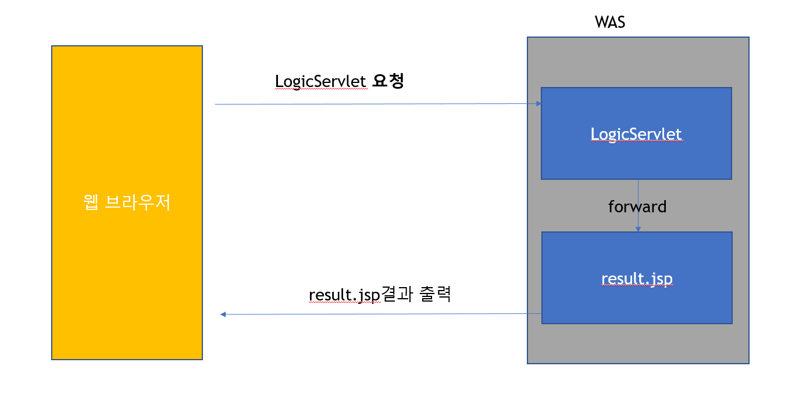

# DB 연결 웹 앱

> 1. JavaScript - FE
> 2. WEB UI 개발 - FE
> 3. JSP - BE
> 4. redirect & forward - BE
> 5. scope - BE
> 6. JSTL & EL - BE
> 7. MySQL - BE
> 8. SQL - BE
> 9. Maven - BE
> 10. JDBC - BE
> 11. WEB API - BE

# redirect & forward - BE

## 리다이렉트란

- https프로토콜로 정해진 규칙이다.
- 서버는 클라이언트로부터 요청을 받은 후, 클라이언트에게 특정 URL로 이동하라고 요청할 수 있다. 이를 리다이렉트라고 한다.
- 서버에서는 클라이언트에게 응답으로 상태코드를 302와 함께 이동할 URL정보를 Location헤더(Header)에 담아 전송한다. 클라이언트는 서버로 부터 받은 상태값이 302이면 Location헤더값으로 재요청을 보내게 된다. 이때 브라우저의 주소창은 전송받은 URL로 바뀌게 된다.
- 서블릿이나 jsp는 redirect하기 위해서 HttpsServletResponse가 가지고 있는 sendRedirect 메소드를 사용한다.
- [장점과 단점](https://ideveloper2.dev/blog/2020-02-09--%EB%A6%AC%EB%8B%A4%EC%9D%B4%EB%A0%89%EC%85%98%EA%B3%BC-%EB%B6%80%ED%95%98%EA%B7%A0%ED%98%95/)

예제를 보자

```jsp
<!-- redirect01.jsp -->
<%@ page language="java" contentType="text/html; charset=UTF-8"
    pageEncoding="UTF-8"%>
<%
    response.sendRedirect("redirect02.jsp");
%>    

<!-- redirect02.jsp -->
<%@ page language="java" contentType="text/html; charset=UTF-8"
    pageEncoding="UTF-8"%>
<!DOCTYPE html PUBLIC "-//W3C//DTD HTML 4.01 Transitional//EN" "http://www.w3.org/TR/html4/loose.dtd">
<html>
<head>
<meta http-equiv="Content-Type" content="text/html; charset=UTF-8">
<title>Insert title here</title>
</head>
<body>
redirect된 페이지 입니다.
</body>
</html>
```

redirect01에 접속시 응답으로 302코드와 redirect02.jsp주소를 넘기게 되고 클라이언트는 302코드로 인해 redirect02.jsp에 다시 요청을 보내게 되어 응답으로 redirect02.jsp를 받게 된다

실제 클라이언트 모습


모습 묘사


## forward

forward란?

1. 웹브라우저에서 Servlet1 에게 요청을 보냄
2. Servlet1은 요청을 처리한 후, 그 결과를 HttpServletRequest에 저장
3. Servlet1은 결과가 저장된 HttpServletRequest와 응답을 위한 HttpServletResponse를 같은 웹 어플리케이션 안에 있는 Servlet2에게 전송(**forward**)
4. Servlet2는 Servlet1으로 부터 받은 HttpServletRequest와 HttpServletResponse를 이용하여 요청을 처리한 후 웹 브라우저에게 결과를 전송


리다이렉트와 포워드의 차이

- 요쳥과 응답 객체가 갯수가 다름

예제 코드

```java
// frontservlet
package examples;

import java.io.IOException;

import javax.servlet.RequestDispatcher;
import javax.servlet.ServletException;
import javax.servlet.annotation.WebServlet;
import javax.servlet.http.HttpServlet;
import javax.servlet.http.HttpServletRequest;
import javax.servlet.http.HttpServletResponse;

/**
 * Servlet implementation class FrontServlet
 */
@WebServlet("/front")
public class FrontServlet extends HttpServlet {
    private static final long serialVersionUID = 1L;
       
    /**
     * @see HttpServlet#HttpServlet()
     */
    public FrontServlet() {
        super();
        // TODO Auto-generated constructor stub
    }

    /**
     * @see HttpServlet#service(HttpServletRequest request, HttpServletResponse response)
     */
    protected void service(HttpServletRequest request, HttpServletResponse response) throws ServletException, IOException {
            
            int diceValue = (int)(Math.random() * 6) + 1; 
            request.setAttribute("dice", diceValue);
            
            RequestDispatcher requestDispatehcer = request.getRequestDispatcher("/next");
            requestDispatehcer.forward(request, response);
    }

}

// nextservlet
package examples;

import java.io.IOException;
import java.io.PrintWriter;
import java.util.Enumeration;

import javax.servlet.ServletException;
import javax.servlet.annotation.WebServlet;
import javax.servlet.http.HttpServlet;
import javax.servlet.http.HttpServletRequest;
import javax.servlet.http.HttpServletResponse;

/**
 * Servlet implementation class ForwardServlet
 */
@WebServlet("/next")
public class NextServlet extends HttpServlet {
    private static final long serialVersionUID = 1L;
       
    /**
     * @see HttpServlet#HttpServlet()
     */
    public NextServlet() {
        super();
        // TODO Auto-generated constructor stub
    }

    /**
     * @see HttpServlet#service(HttpServletRequest request, HttpServletResponse response)
     */
    protected void service(HttpServletRequest request, HttpServletResponse response) throws ServletException, IOException {
        response.setContentType("text/html");
        PrintWriter out = response.getWriter();
        out.println("<html>");
        out.println("<head><title>form</title></head>");
        out.println("<body>");

        int dice = (Integer)request.getAttribute("dice");
        out.println("dice : " + dice);
        for(int i = 0; i < dice; i++) {
            out.print("<br>hello");
        }
        out.println("</body>");
        out.println("</html>");
    }

}
```

그래서 이제 Servlet과 JSP를 **forward**를 통해 연동시킨다

- Servlet은 프로그램 로직이 수행되기에 유리하다. IDE등에서 지원을 좀 더 잘해준다
- JSP는 결과를 출력하기에 Servlet보다 유리하다. 필요한 html문을 그냥 입력하면 된다.
- 프로그램 로직 수행은 Servlet에서, 결과 출력은 JSP에서 하는 것이 유리하다.
- Servlet과 JSP의 장단점을 해결하기 위해서 Servlet에서 프로그램 로직이 수행되고, 그 결과를 JSP에게 포워딩하는 방법이 사용되게 되었다. 이를 Servlet과 JSP연동이라고 한다.
- 아래 그림과 같은 로직으로 이행 예제코드를 보며 이해하자



```java
package examples;

import java.io.IOException;

import javax.servlet.RequestDispatcher;
import javax.servlet.ServletException;
import javax.servlet.annotation.WebServlet;
import javax.servlet.http.HttpServlet;
import javax.servlet.http.HttpServletRequest;
import javax.servlet.http.HttpServletResponse;

/**
 * Servlet implementation class LogicServlet
 */
@WebServlet("/logic")
public class LogicServlet extends HttpServlet {
	private static final long serialVersionUID = 1L;
       
    /**
     * @see HttpServlet#HttpServlet()
     */
    public LogicServlet() {
        super();
        // TODO Auto-generated constructor stub
    }

	/**
	 * @see HttpServlet#service(HttpServletRequest request, HttpServletResponse response)
	 */
	protected void service(HttpServletRequest request, HttpServletResponse response) throws ServletException, IOException {
		// TODO Auto-generated method stub
		int v1 = (int)(Math.random() * 100) + 1;
		int v2 = (int)(Math.random() * 100) + 1;
		int result = v1 + v2;
		
		request.setAttribute("v1", v1);
		request.setAttribute("v2", v2);
		request.setAttribute("result", result);
		
		RequestDispatcher rd = request.getRequestDispatcher("/result.jsp"); // 파일을 입력할경우 WebContent폴더 위치를 기준으로
		rd.forward(request, response);
	}

}
```

```jsp
<%@ page language="java" contentType="text/html; charset=UTF-8"
    pageEncoding="UTF-8"%>
<!DOCTYPE html>
<html>
<head>
<meta charset="UTF-8">
<title>Insert title here</title>
</head>
<body>
<!-- ${v1} + ${v2} = ${result} 아래와 같은 효과를 보여준다 -->
<%
	int v1 = (int)request.getAttribute("v1");
	int v2 = (int)request.getAttribute("v2");
	int result = (int)request.getAttribute("result");
%>

<%=v1 %> + <%=v2 %> = <%=result %>
</body>
</html>
```

[url 패턴](https://help.perforce.com/hydraexpress/3.5.0/html/rwsfservletug/4-3.html)

