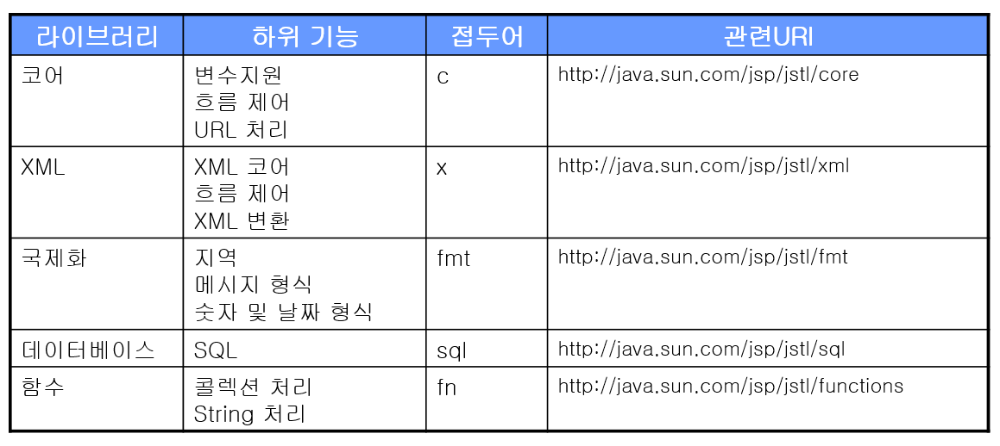
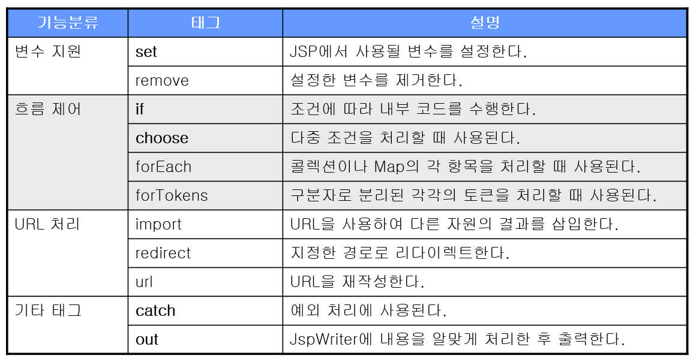

# DB 연결 웹 앱

> 1. JavaScript - FE
> 2. WEB UI 개발 - FE
> 3. JSP - BE
> 4. redirect & forward - BE
> 5. scope - BE
> 6. JSTL & EL - BE
> 7. MySQL - BE
> 8. SQL - BE
> 9. Maven - BE
> 10. JDBC - BE
> 11. WEB API - BE

# JSTL & EL - BE

## EL

[공식문서](https://www.javatpoint.com/EL-expression-in-jsp)

표현 언어(Expression Language)는 값을 표현하는 데 사용되는 스크립트 언어로서 JSP의 기본 문법을 보완하는 역할을 한다. 제공하는 기능은 다음과 같다

- JSP의 스코프에 맞는 속성 사용
- 집합 객체에 대한 접근 방법 제공
- 수치 연산, 관계 연산, 논리 연산자 제공
- 자바 클래스 메소드 호출 기능 제공
- 표현언어만의 기본 객체 제공

#### 기본 객체

| 기본 객체        | 설명                                                         |
| ---------------- | ------------------------------------------------------------ |
| pageContext      | JSP의 page 기본 객체와 동일하다                              |
| pageScope        | pageContext 기본 객체에 저장된 속성의 <속성, 값> 매핑을 저장한 Map객체 |
| requestScope     | request 기본 객체에 저장된 속성의 <속성,값> 매핑을 저장한 Map 객체 |
| sessionScope     | session 기본....                                             |
| applicationScope | application 기본...                                          |
| param            | 요청 파라미터의 <파라미터이름, 값> 매핑을 저장한 Map객체, 파라미터 값의 타입은 String으로서, request.getParameter의 결과와 동일 |
| paramValues      | 요청 파라미터의 <파라미터이름, 값배열> 매핑을 저장한 Map 객체. 값의 타입은 String[] 으로서, request.getParameterValues(이름)의 결과와 동일하다. |
| header           | 요청 정보의 <헤더이름, 값> 매핑을 저장한 Map 객체. request.getHeader(이름)의 결과와 동일하다 |
| headerValues     | 요청 정보의 <헤더이름, 값 배열> 매핑을 저장한 Map 객체. request.getHeaders(이름)의 결과와 동일하다 |
| cookie           | <쿠키 이름, Cookie>매핑을 저장한 Map 객체. request.getCookies()로 구한 Cookie배열로부터 매핑을 생성 |
| initParam        | 초기화 파라미터의 <이름, 값> 매핑을 저장한 Map 객체. application.getInitParameter(이름)의 결과와 동일하다. |

#### 문법

`${}`의 형태를 이용한다 예) `<b>${sessionScope.member.id}</b>님 환영합니다`

1. `${<표현1>.<표현2>}`
   - 표현1이나 표현2가 null이면 null반환
   - 표현1이 Map일 경우 표현2는 key로한 값을 반환
   - 표현1이 List나 배열이면 표현2가 정수일 경우 해당 정수번째 index에 해당하는 값을 반환
   - 만약 정수가 아니면 오류 발생
   - 표현1이 객체일 경우 표현2에 해당하는 getter메소드에 해당하는 메소들 호출한 결과를 반환
2. 수치 연산자
   - +,-,*,/ or div, % or mod
3. 비교 연산자
   - == or eq
   - != or ne
   - < or lt
   - `>` or gt
   - <= or le
   - `>=` or ge
4. 논리 연산자 똑같이 사용가능
5.  empty연산자
   - <값> 형태로 null이면 true
   - 빈 문자열이면 true
   - 길이가 0인 배열 true
   - 빈 Map이면 true
   - 빈 Collection이면 true
   - 이외의 경우 false

#### 표현 언어 비활성화: JSP에 명시하기

`<%@ page isElIgnored = "true" %>`

```jsp
<%@ page language="java" contentType="text/html; charset=UTF-8"
    pageEncoding="UTF-8"%>
<%
    pageContext.setAttribute("p1", "page scope value");
    request.setAttribute("r1", "request scope value");
    session.setAttribute("s1", "session scope value");
    application.setAttribute("a1", "application scope value");
%>    
<!DOCTYPE html PUBLIC "-//W3C//DTD HTML 4.01 Transitional//EN" "http://www.w3.org/TR/html4/loose.dtd">
<html>
<head>
<meta http-equiv="Content-Type" content="text/html; charset=UTF-8">
<title>Insert title here</title>
</head>
<body>
pageContext.getAttribute("p1") : <%=pageContext.getAttribute("p1") %><br>
request.getAttribute("r1") : <%=request.getAttribute("r1") %><br>
session.getAttribute("s1") : <%=session.getAttribute("s1") %><br>
application.getAttribute("a1") : <%=application.getAttribute("a1") %><br>
<br><br>
pageContext.getAttribute("p1") : ${pageScope.p1 }<br>
request.getAttribute("r1") : ${requestScope.r1 }<br>
session.getAttribute("s1") : ${sessionScope.s1 }<br>
application.getAttribute("a1") : ${applicationScope.a1 }<br>
<br><br>
pageContext.getAttribute("p1") : ${p1 }<br>  <!-- 겹치지 않으면 그냥 이렇게 불러도 아무 이상없다 -->
request.getAttribute("r1") : ${r1 }<br>
session.getAttribute("s1") : ${s1 }<br>
application.getAttribute("a1") : ${a1 }<br>

</body>
</html>
```


## JSTL

### JSTL(JSP Standard Tag Library)은 JSP 페이지에서 조건문 처리, 반복문 처리 등을 html tag 형태로 작성할 수 있게 도와줍니다.

[레퍼런스](http://cs.roosevelt.edu/eric/books/JSP/jstl-quick-reference.pdf)

사용하려면 설치해서 사용해야함

- http://tomcat.apache.org/download-taglibs.cgi
- 위의 사이트에서 3가지 jar파일을 다운로드 한 후 WEB-INF/lib/ 폴더에 복사를 한다.
- `<%@ taglib prefix="c" uri="http://java.sun.com/jsp/jstl/해당 URI" %> ` 꼭 추가해야함 해당 uri는 바로 밑 표를 참고





예제

```jsp
<%@ page language="java" contentType="text/html; charset=UTF-8"
    pageEncoding="UTF-8"%>
<%@ taglib prefix="c" uri="http://java.sun.com/jsp/jstl/core" %>
<c:set var="value1" scope="request" value="kang"></c:set>
<!DOCTYPE html>
<html>
<head>
<meta charset="UTF-8">
<title>Insert title here</title>
</head>
<body>
성 : ${value1} <br>
<c:remove var="value1" scope="request" />
성 : ${value1} <br>
</body>
</html>
```

### 조건문

예제

```jsp
<%@ page language="java" contentType="text/html; charset=UTF-8"
pageEncoding="UTF-8"%>
<%@ taglib prefix="c" uri="http://java.sun.com/jsp/jstl/core" %> 
<%
request.setAttribute("n", 10);
%>

<!DOCTYPE html PUBLIC "-//W3C//DTD HTML 4.01 Transitional//EN" "http://www.w3.org/TR/html4/loose.dtd">
<html>
<head>
<meta http-equiv="Content-Type" content="text/html; charset=UTF-8">
<title>Insert title here</title>
</head>
<body>
<c:if test="${n == 0}">
n은 과 0과 같습니다.
</c:if>

<c:if test="${n == 10}">
n은 과 10과 같습니다.
</c:if>
</body>
</html>

<%@ page language="java" contentType="text/html; charset=UTF-8"
    pageEncoding="UTF-8"%>
<%@ taglib prefix="c" uri="http://java.sun.com/jsp/jstl/core" %> 
<%@ page import="java.util.*" %>
<%
    request.setAttribute("score", 83);
%>

<!DOCTYPE html PUBLIC "-//W3C//DTD HTML 4.01 Transitional//EN" "http://www.w3.org/TR/html4/loose.dtd">
<html>
<head>
<meta http-equiv="Content-Type" content="text/html; charset=UTF-8">
<title>Insert title here</title>
</head>
<body>
<c:choose>
    <c:when test="${score >=90 }">
    A학점입니다.
    </c:when>
    <c:when test="${score >=80 }">
    B학점입니다.
    </c:when>
    <c:when test="${score >=70 }">
    C학점입니다.
    </c:when>
    <c:when test="${score >=60 }">
    D학점입니다.
    </c:when>
    <c:otherwise>
    F학점입니다.
    </c:otherwise>            
</c:choose>
</body>
</html>
```

### 흐름제어 - forEach

일반적인 for문 생각해도 괜찮다

```jsp
<%@ page language="java" contentType="text/html; charset=UTF-8"
    pageEncoding="UTF-8"%>
<%@ taglib prefix="c" uri="http://java.sun.com/jsp/jstl/core" %> 
<%@ page import="java.util.*" %>
<%
    List<String> list = new ArrayList<>();
    list.add("hello");
    list.add("world");
    list.add("!!!");
    request.setAttribute("list", list);
%>

<!DOCTYPE html PUBLIC "-//W3C//DTD HTML 4.01 Transitional//EN" "http://www.w3.org/TR/html4/loose.dtd">
<html>
<head>
<meta http-equiv="Content-Type" content="text/html; charset=UTF-8">
<title>Insert title here</title>
</head>
<body>
<c:forEach items="${list}" var="item">
${item } <br>
</c:forEach>
</body>
</html>
```

### 흐름제어 - import

지정한 url에 연결하여 결과를 지정한 변수에 저장한다. 해당 url의 모든 요소를 가져온다고 생각하면 된다

```jsp
<!-- jstlValue.jsp -->
<%@ page language="java" contentType="text/html; charset=UTF-8"
    pageEncoding="UTF-8"%>
Kang kyungmi

<!-- jstl05.jsp -->
<%@ page language="java" contentType="text/html; charset=UTF-8"
    pageEncoding="UTF-8"%>
<%@ taglib prefix="c" uri="http://java.sun.com/jsp/jstl/core" %> 
<%@ page import="java.util.*" %>
<c:import url="http://localhost:8080/webapp/jstlValue.jsp" var="urlValue" scope="request"></c:import>

<!DOCTYPE html PUBLIC "-//W3C//DTD HTML 4.01 Transitional//EN" "http://www.w3.org/TR/html4/loose.dtd">
<html>
<head>
<meta http-equiv="Content-Type" content="text/html; charset=UTF-8">
<title>Insert title here</title>
</head>
<body>
읽어들인 값 : ${urlValue} <!-- 결과 값으로 Kang kyungmi 이것을 출력함 -->
</body>
</html>
```

### redirect

말그대로 리다이렉트 시키는 태그

```jsp
<%@ page language="java" contentType="text/html; charset=UTF-8"
    pageEncoding="UTF-8"%>
<%@ taglib prefix="c" uri="http://java.sun.com/jsp/jstl/core" %> 
<c:redirect url="jstlRedirectPage.jsp"></c:redirect>
```

### out 태그

데이터를 출력하게 만드는 것

```jsp
<%@ page language="java" contentType="text/html; charset=UTF-8"
    pageEncoding="UTF-8"%>
<%@ taglib prefix="c" uri="http://java.sun.com/jsp/jstl/core" %>
<%@ taglib prefix="fn" uri="http://java.sun.com/jsp/jstl/functions"%> 
<!DOCTYPE html PUBLIC "-//W3C//DTD HTML 4.01 Transitional//EN" "http://www.w3.org/TR/html4/loose.dtd">
<html>
<head>
<meta http-equiv="Content-Type" content="text/html; charset=UTF-8">
<title>Insert title here</title>
</head>
<body>
<c:set var="t" value="<script type='text/javascript'>alert(1);</script>" />
${t}
<c:out value="${t}" escapeXml="true" /> <!-- c:set의 value를 그냥 text로 인쇄하게 함 -->
<c:out value="${t}" escapeXml="false" /> <!-- c:set의 value를 작동하게 해줌 없으면 이게 default -->
</body>
</html>
```

