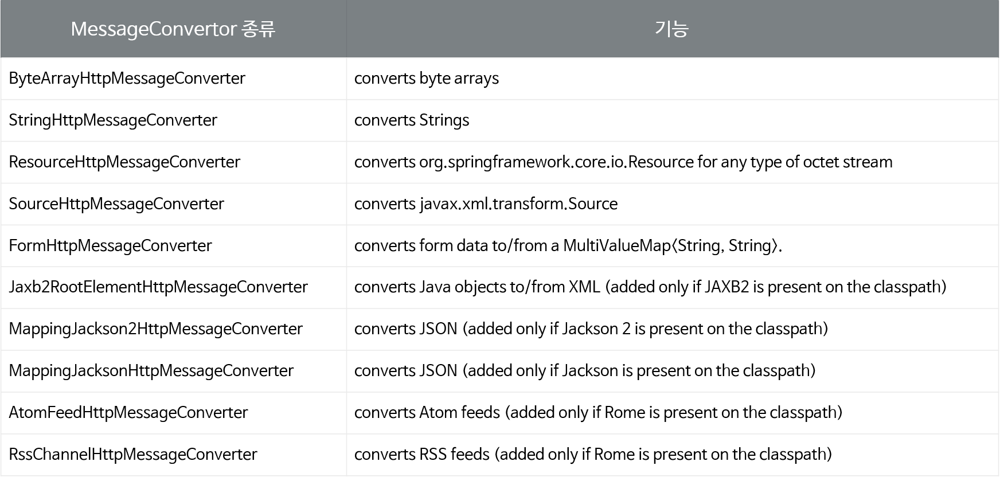

# 웹 앱 개발 1/4

> 1. JavaScript 배열 - FE
> 2. DOM API 활용 - FE
> 3. Ajax - FE
> 4. Web Animation - FE
> 5. WEB UI - FE
> 6. Tab UI - FE
> 7. Spring Core - BE
> 8. Spring JDBC - BE
> 9. Spring MVC - BE
> 10. 레이어드 아키텍처 - BE
> 11. Controller - BE

# 레이어드 아키텍처

**웹 페이지는 중복 개발되는 요소가 존재한다**

그렇다면 **Controller에서 중복되는 부분을 처리하려면?**

1. 별도의 객체로 분리한다
2. 별도의 메소드로 분리한다

- 예를 들어 쇼핑몰에서 게시판에서도 회원 정보를 보여죽, 상품 목록 보기에서도 회원 정보를 보여줘야 한다면 회원 정보를 읽어오는 코드는 어떻게 해야할까?

## 컨트롤러와 서비스

- 비지니스 메소드를 별도의 Service객체에서 구현하도록 하고 컨트롤러는 Service객체를 사용하도록 한다.

- 

- ### 서비스 객체란?

  - 비지니스 로직을 수행하는 메소드를 가지고 있는 객체를 서비스 객체라고 한다.

  - 보통 하나의 비지니스 로직은 하나의 **트랜잭션**으로 동작한다

  - #### 트랜잭션

    - 트랜잭션은 하나의 논리적인 작업을 의미한다

    - 트랜잭션의 특징은 크게 4가지로 구분된다

      1. 원자성
         - 전체가 성공하거나 전체가 실패하는 것을 의미한다
         - 출금이라는 예로 생각하자
           1. 잔액이 얼마인지 조회한다.
           2. 출금하려는 금액이 잔액보다 작은지 검사한다.
           3. 출금하려는 금액이 잔액보다 작다면 (잔액-출금액) 으로 수정한다
           4. 언제 어디서 출금했는지 정보를 기록한다
           5. 사용자에게 출금한다
         - 위의 작업이 4번에서 오류가 발생했다면 어떻게 될까? 4번에서 오류가 발생했다면, 앞의 작업들을 모두 원래대로 복원을 시켜야 한다. 이를 rollback이라고 한다. 5번까지 모두 성공했을 때만 정보를 모두 반영해야한다. 이를 commit한다고 한다. 이렇게 rollback하거나 commit을 하게 되면 하나의 트랜잭션 처리가 완료된다.
      2. 일관성
         - 일관성은 **트랜잭션의 작업 처리 결과가 항상 일관성이 있어야 한다는 것**이다. 트랜잭션이 진행되는 동안에 데이터가 변경 되더라도 업데이트된 데이터로 트랜잭션이 진행되는 것이 아니라, 처음에 트랜잭션을 진행하기 위해 참조한 데이터로 진행된다. 이렇게 함으로써 각 사용자는 일관성있는 데이터를 볼 수 있는 것이다.
      3. 독립성
         - 독립성은 둘 이상의 트랜잭션이 동시에 병행 실행되고 있을 경우에 **어느 하나의 트랜잭션이라도 다른 트랜잭션의 연산을 끼어들 수 없다** 하나의 특정 트랜잭션이 완료될때까지, 다른 트랜잭션이 특정 트랜잭션의 결과를 참조할 수 없다
      4. 지속성
         - 지속성은 **트랜잭션이 성공적으로 완료되었을 겨웅, 결과는 영구적으로 반영되어야 한다는 점**이다.

    - ### JDBC 프로그래밍에서 트랜잭션 처리방법

      - DB에 연결된 후Connection 객체의 setAutoCommit메소드에 false를 파라미터로 지정한다. (디폴트는 setAutoCommit이 true라 변경사항을 바로 저장했었다)
      - 입력, 수정, 삭제 SQL이 실행을 한 후 모두 성공했을 경우 Connection이 가지고 있는 commit()메소드를 호출한다.
      - @EnableTransactionManagement
        - Spring Java Config파일에서 트랜잭션을 활성화 할 때 사용하는 애노테이션
        - Java Config를 사용하게 되면 PlatformTransactionManager 구현체를 모두 찾아서 그 중에 하나를 매핑해 사용한다.
        - 특정 트랜잭션 메니저를 사용하고자 한다면 TransactionManagementConfigurer를 Java Config파일에서 구현하고 원하는 트랜잭션 메니저를 리턴하도록 한다.
        - 아니면, 특정 트랜잭션 메니저 객체를 생성시 @Primary 애노테이션을 지정한다.

- ## 서비스 객체에서 중복으로 호출되는 코드의 처리

  - 데이터 엑세스 메소드를 별도의 Repository(Dao) 객체에서 구현하도록 하고 서비스는 Repository객체를 사용하도록 한다.

위를 구현한다면 다음과 같은 상황이 될 것이다

### 설정의 분리

Spring 설정 파일을 프리젠테이션 레이어쪽과 나머지를 분리할 수 있습니다.

web.xml 파일에서 프리젠테이션 레이어에 대한 스프링 설정은 DispathcerServlet이 읽도록 하고, 그 외의 설정은 ContextLoaderListener를 통해서 읽도록 합니다.

DispatcherServlet을 경우에 따라서 2개 이상 설정할 수 있는데 이 경우에는 각각의 DispathcerServlet의 ApplicationContext가 각각 독립적이기 때문에 각각의 설정 파일에서 생성한 빈을 서로 사용할 수 없습니다.

위의 경우와 같이 동시에 필요한 빈은 ContextLoaderListener를 사용함으로써 공통으로 사용하게 할 수 있습니다.

ContextLoaderListener와 DispatcherServlet은 각각 ApplicationContext를 생성하는데, ContextLoaderListener가 생성하는 ApplicationContext가 root컨텍스트가 되고 DispatcherServlet이 생성한 인스턴스는 root컨텍스트를 부모로 하는 자식 컨텍스트가 됩니다.

참고로, 자식 컨텍스트들은 root컨텍스트의 설정 빈을 사용할 수 있습니다.

## 방명록 만들기 실습

[스프링 mvc 튜토리얼](https://www.javatpoint.com/spring-mvc-tutorial)

[스프링 웹 콘텐트를 mvc와 함께](https://spring.io/guides/gs/serving-web-content/)

[서블릿 스택을 이용한 웹](https://docs.spring.io/spring-framework/docs/current/reference/html/web.html)

[트랜잭셔널](https://mommoo.tistory.com/92)

- Spring JDBC를 이용한 Dao작성
- controller + service + dao
- 트랜잭션 처리
- mvc에서 폼값입력받기
- mvc에서 redirect하기
- controller에서 jsp에게 전달한 값을 jstl과 el을 이용해 출력하기

### 방명록 요구사항

- 방명록 정보는 guestbook테이블에 저장
- id는 자동으로 입력
- id, 이름,내용, 등록일을 저장
- /guestbook/을 요청하면 자동으로 /guestbook/list로 리다렉팅
- 방명록이 없으면 건수는 0이 나오고 아래에 방명록을 입력하는 폼이 보여진다
- 이름과 내용을 입력하고, 등록버튼을 누르면 /guestbook/writeURL로 입력한 값을 전달하여 저장한다.
- 값이 저장된 이후에는 /guestbook/list로 리다렉팅
- 입력한 한건의 정보가 보여진다.
- 방명록 내용과 폼 사이의 숫자는 방명록 페이지 링크. 방명록 5건당 1페이지로 설정한다.
- 방명록이 6건이 입력되자 아래 페이지 수가 2건이 보여진다. 1페이지를 누르면 /guestbook/list?start=0을 요청하고. 2페이지를 누르면 /guestbook/list?start=5를 요청하게 된다.
- /guestbook/list는 /guestbook/list?start=0과 결과가 같다
- 방명록에 글을 쓰거나, 방명록의 글을 삭제할 때는Log테이블에 클라이언트에 ip주소, 등록(삭제) 시간, 등록/삭제 정보를 데이터베이스에 저장한다
- 사용하는 테이블은 log이다
- id는 자동으로 입력되도록 한다.

### 방명록 클래스 다이어그램

- 웹 레이어 설정 파일: web.xml, WebMvcContextConfiguration.java
- 비지니스, 레파지토리 레이어 설정 파일 : ApplicationConfig.java, DbConfig.java

# RestController

[참고자료](https://spring.io/guides/gs/rest-service/)

## @RestController

- spring 4 에서 Rest API또는 Web API를 개발하기 위해 등장한 애노테이션
- 이전 버전의 @Controller와 @ResponseBody를 포함

## MessageConvertor

- 자바 객체와 HTTP 요청 / 응답 바디를 변환하는 역할
- @ResponseBody, @RequestBody
- @EnableWebMvc 로 인한 기본 설정
- WebMvcConfigurationSupport 를 사용하여 Spring MVC 구현
- Default MessageConvertor 를 제공
- [링크 바로가기](https://github.com/spring-projects/spring-framework/blob/master/spring-webmvc/src/main/java/org/springframework/web/servlet/config/annotation/WebMvcConfigurationSupport.java) 의 addDefaultHttpMessageConverters메소드 항목 참조
- 

## JSON 응답하기

- 컨트롤러의 메소드에서는 JSON으로 변환될 객체를 반환합니다.
- jackson라이브러리를 추가할 경우 객체를 JSON으로 변환하는 메시지 컨버터가 사용되도록 @EnableWebMvc에서 기본으로 설정되어 있습니다.
- jackson라이브러리를 추가하지 않으면 JSON메시지로 변환할 수 없어 500오류가 발생합니다.
- 사용자가 임의의 메시지 컨버터(MessageConverter)를 사용하도록 하려면 WebMvcConfigurerAdapter의 configureMessageConverters메소드를 오버라이딩 하도록 합니다.

