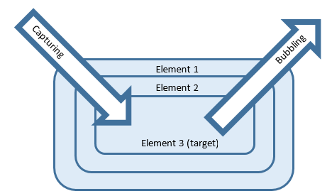

# 웹 앱 개발 1/4

> 1. JavaScript 배열 - FE
> 2. DOM API 활용 - FE
> 3. Ajax - FE
> 4. Web Animation - FE
> 5. WEB UI - FE
> 6. Tab UI - FE
> 7. Spring Core - BE
> 8. Spring JDBC - BE
> 9. Spring MVC - BE
> 10. 레이어드 아키텍처 - BE
> 11. Controller - BE

# WEB UI

## 파일구성

1. JavaScript파일 구성

   간단한 내용의 JavaScript라면 한페이지에 모두 표현하는 것도 좋습니다. 그렇지 않다면 의미에 맞게 구분하는 방법이 더 좋스빈다.

2. HTML안에 JavaScript구성하기

   CSS는 head태그안에 상단에 위치합니다. JavaScript는 body태그 닫히기 전에 소스파일간 의존성을 이해해서 순서대로 배치합니다.

```html
<!-- 간단하다면 이런 식으로 해도 괜찮기는 하다-->
<html>
    <head>
        <style>
            h1 {color: aquamarine}
        </style>
        <script>
            console.log('hello my web site!')
        </script>
    </head>
    <body>
        <h1>hello, boostcourse web!</h1>
        <p>Lorem ipsum dolor sit amet consectetur adipisicing elit. Mollitia, ut totam nam quibusdam fuga officiis vel provident doloremque, aspernatur ipsum distinctio iste id quos adipisci voluptas nisi. Eum, doloribus molestias!</p>
    </body>
</html>
<!-- 하지만 이 경우에는 script부분에서 dom을 찾으면 찾을 수가 없다 왜냐하면 body를 구성하기전에 script를 읽기 때문이다 -->
<!-- 그래서 아래와 같이 수정 -->
<html>
    <head>
        <style>
            h1 {color: aquamarine}
        </style>
    </head>
    <body>
        <h1>hello, boostcourse web!</h1>
        <p>Lorem ipsum dolor sit amet consectetur adipisicing elit. Mollitia, ut totam nam quibusdam fuga officiis vel provident doloremque, aspernatur ipsum distinctio iste id quos adipisci voluptas nisi. Eum, doloribus molestias!</p>
    </body>
        <script>
            console.log('hello my web site!')
            var elHeading = document.querySelector("h1")
            console.log(elHeading)
        </script>
</html>
```

하지만 이제 많아지면 복잡하니 파일 구성을 조금 수정한다. 그래서 보통은 css,js폴더를 따로 구비해둔다

아래와 같이 구성하는 경우가 많다 (js파일을 선언 순서대로 하면 서로간의 함수나 변수가 공유가 가능)

```html
<!-- ./main.html -->
<html>
    <head>
        <link rel="stylesheet" href="./css/main.css">
    </head>
    <body>
        <h1>hello, boostcourse web!</h1>
        <p>Lorem ipsum dolor sit amet consectetur adipisicing elit. Mollitia, ut totam nam quibusdam fuga officiis vel provident doloremque, aspernatur ipsum distinctio iste id quos adipisci voluptas nisi. Eum, doloribus molestias!</p>
    </body>
        <script src="./js/main.js"></script>
</html>
```

```css
1./css/main.css
h1 {color: aquamarine}
```

```javascript
// ./js/main.js
console.log('hello my web site!')
var elHeading = document.querySelector("h1")
console.log(elHeading)
```

## **load와 DOMContentLoaded의 차이 확인**

웹사이트에 접속해서 크롬 개발자도구로 이를 확인할 수 있습니다.

크롬 개발자도구의 Network panel을 열어서 하단에 **DOMContentLoaded, load**를 확인해보세요. 

두 개의 시간이 조금 다릅니다.

DOM Tree 분석이 끝나면 DOMContentLoaded 이벤트가 발생하며, 그 외 모든 자원이 다 받아져서 브라우저에 렌더링(화면 표시)까지 다 끝난 시점에는 Load가 발생합니다.

이를 이해하고, 필요한 시점에 두 개의 이벤트를 사용해서 자바스크립트 실행을 할 수 있습니다. 

**보통 DOM tree가 다 만들어지면 DOM APIs를 통해서 DOM에 접근할 수 있기 때문에, 실제로 실무에서는 대부분의 자바스크립트코드는 DOMContentLoaded 이후에 동작하도록 구현합니다.**

그 방법이 로딩속도 성능에 유리하다고 생각하기 때문입니다.

[참고자료](https://mygumi.tistory.com/281)


## Event delegation

`firstchild`같은 경우 그냥 택스트를 가져올 수도 있다. 그러니 `firstelementchild`를 이용하자.

필요한 같은 태그들에 이벤트를 넣는 것은 for문을 돌리면 간단하게 할 수 있지만 더 좋은 방법들도 있다.

```html
<ul>
  <li>
        </li>
  <li>
        </li>
  <li>
      </li>
 <li>
    
 </li>
</ul>
```

```javascript
var log = document.querySelector(".log")
var lists = document.querySelectorAll("ul > li")
var ul = document.querySelector("ul")

for(var i=0, len=lists.length; i < list.length; i++) {
    lists[i].addEventListener("click", function(evt) {
        log.innerHTML = "IMG URL IS" + evt.currentTarget.firstElementChild.src
    })
}
// 위함수와 아래 함수는 비슷한 상황을 발생시킬 수 있다
ul.addEventListener("click", function(evt) {
    // IMG, UL
    // 즉 클릭이벤트를 전체에 넣고 target으로 진짜 이벤트가 발생한 테크만 고를수도 있다
    // 데이터가 필요하다면 각 태그에 데이터를 저장시킨후 이벤트에서 데이터를 뽑아낼 수도 있다는 소리이다!
    console.log(evt.target.tagName, evt.currentTarget.tagName)
})
```



[이벤트 버블링 & 캡쳐링](https://javascript.info/bubbling-and-capturing)


## HTML Templating

```javascript
var data = {  title : "hello",
              content : "lorem dkfief",
              price : 2000
           };
var html = "<li><h4>{title}</h4><p>{content}</p><div>{price}</div></li>";

html.replace("{title}", data.title)
    .replace("{content}", data.content)
    .replace("{price}", data.price)
```

[라이브러리 없이 탬플레이팅 하기](https://jonsuh.com/blog/javascript-templating-without-a-library/)

### 실습

```html
<script id="template-list-item" type="text/template">
  <li>
      <h4>{title}</h4><p>{content}</p><div>{price}</div>
  </li>
</script>
<!-- 이런 식으로 탬플릿을 렌더링하지 않고 이용할 수가 있다 -->
```

```javascript
var data = [
        {title : "hello",content : "lorem dkfief",price : 2000},
        {title : "hello",content : "lorem dkfief",price : 2000}
];

//html 에 script에서 가져온 html template.
var html = document.querySelector("#template-list-item").innerHTML;

var resultHTML = "";

for(var i=0; i<data.length; i++) {
    resultHTML += html.replace("{title}", data[i].title)
                      .replace("{content}", data[i].content)
                      .replace("{price}", data[i].price);
}

document.querySelector(".content").innerHTML = resultHTML;
```

