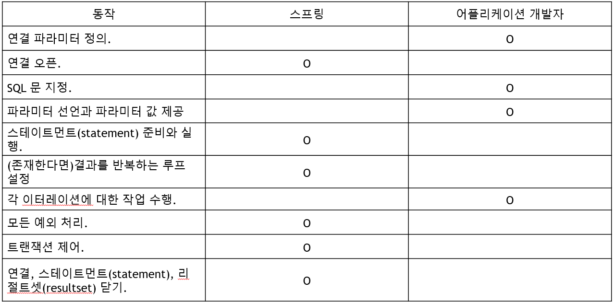

# 웹 앱 개발 1/4

> 1. JavaScript 배열 - FE
> 2. DOM API 활용 - FE
> 3. Ajax - FE
> 4. Web Animation - FE
> 5. WEB UI - FE
> 6. Tab UI - FE
> 7. Spring Core - BE
> 8. Spring JDBC - BE
> 9. Spring MVC - BE
> 10. 레이어드 아키텍처 - BE
> 11. Controller - BE

# Spring JDBC

- JDBC 프로그래밍을 보면 반복되는 개발 요소가 있다.
- 이러한 반복적인 요소는 개발자를 지루하게 만든다.
- 개발하기 지루한 JDBC의 모든 저수준 세부사항을 스프링 프레임워크가 처리해준다.
- 개발자는 필요한 부분만 개발하면 된다

그렇다면 **Spring JDBC** 개발자가 해야할 일은?



Spring JDBC 패키지

- org.springframework.jdbc.core
  - jdbc 템플릿 클래스와 콜백 인터페이스 포함
- org.springframework.jdbc.datasource
  - 데이터소스에 접근을 쉽게 해주는 유틸리티클래스와 JAVA EE에서 수정되지 않은 코드와 테스트에서 사용가능한 코드들을 포함
- org.springframework.jdbc.object
  - rdbms 조회하고 재사용 가능한 클래스 포함
- org.springframework.jdbc.support
  - sql injection 클래스들을 포함

## JDBC Template

[jdbc sql관련 참고 자료](https://docs.spring.io/spring-framework/docs/current/reference/html/data-access.html#jdbc)

- org.sprinframework.jdbc.core에서 가장 중요한 클래스
- 리소스 생성, 해지를 처리해서 연결을 닫는 것을 잊어 발생하는 문제등을 피할 수 있도록 한다.
- 스테이먼트(statement)의 생성과 실행을 처리한다.
- SQL조회, 업데이트, 저장 프로시저 호출, ResultSet 반복 호출 등을 실행한다.
- JDBC예외가 발생할 경우 org.springframework.dao패키지에 정의되어 있는 일반적인 예외로 변환시킨다.

#### jdbc template select예제

row수 카운팅 하기

```java
int rowCount = this.jdbcTemplate.quertForInt("select count(*) from t_actor");
```

변수 바인딩

```java
int countOfActorsNamedJoe = this.jdbcTemplate.queryForInt("select count(*) from t_actor where first_name = ?","Joe");
```

String값으로 결과 받기

```java
String lastName = this.jdbcTemplate.queryForObject("select last_name from t_actor where id = ?", new Object[]{1212L}, String.class); 
```

한 건 조회하기

```java
Actor actor = this.jdbcTemplate.queryForObject(
  "select first_name, last_name from t_actor where id = ?",
  new Object[]{1212L},
  new RowMapper<Actor>() {
    public Actor mapRow(ResultSet rs, int rowNum) throws SQLException {
      Actor actor = new Actor();
      actor.setFirstName(rs.getString("first_name"));
      actor.setLastName(rs.getString("last_name"));
      return actor;
    }
  });
```

여러 건 조회하기

```java
List<Actor> actors = this.jdbcTemplate.query(
  "select first_name, last_name from t_actor",
  new RowMapper<Actor>() {
    public Actor mapRow(ResultSet rs, int rowNum) throws SQLException {
      Actor actor = new Actor();
      actor.setFirstName(rs.getString("first_name"));
      actor.setLastName(rs.getString("last_name"));
      return actor;
    }
  });
```

중복 코드 제거 (1건 구하기와 여러 건 구하기가 같은 코드에 있을 경우)

```java
public List<Actor> findAllActors() {
  return this.jdbcTemplate.query( "select first_name, last_name from t_actor", new ActorMapper());
}
private static final class ActorMapper implements RowMapper<Actor> {
  public Actor mapRow(ResultSet rs, int rowNum) throws SQLException {
    Actor actor = new Actor();
    actor.setFirstName(rs.getString("first_name"));
    actor.setLastName(rs.getString("last_name"));
    return actor;
  }
}
```

update, delete

```java
this.jdbcTemplate.update("update t_actor set = ? where id = ?",  "Banjo", 5276L);

this.jdbcTemplate.update("delete from actor where id = ?", Long.valueOf(actorId));
```

### JdbcTemplate외의 접근 방법

- NamedParameterJdbcTemplate
  - JdbcTemplate에서 JDBC statement 인자를 ?를 사용하는 대신 파라미터명을 사용하여 작성하는 것을 지원
  - [NamedParameterJdbcTemplate 예제](https://docs.spring.io/spring/docs/current/spring-framework-reference/data-access.html#jdbc-NamedParameterJdbcTemplate)
- SimpleJdbcTemplate
  - JdbcTemplate과 NamedParameterJdbcTemplate 합쳐 놓은 템플릿 클래스
  - 이제 JdbcTemplate과 NamedParameterJdbcTemplate에 모든 기능을 제공하기 때문에 삭제 예정될 예정(deprecated)
  - [SimpleJdbcTemplate 예제](https://www.concretepage.com/spring/simplejdbctemplate-spring-example)
- SimpleJdbcInsert
  - 테이블에 쉽게 데이터 insert 기능을 제공
  - [SimpleJdbcInsert 예제](https://www.tutorialspoint.com/springjdbc/springjdbc_simplejdbcinsert.htm)

## DAO DTO

[참고자료 1 db 커넥션](https://ejbvn.wordpress.com/category/week-2-entity-beans-and-message-driven-beans/day-09-using-jdbc-to-connect-to-a-database/)

[참고자료 2 DAO 패턴](https://www.tutorialspoint.com/design_pattern/data_access_object_pattern.htm)

- DTO
  - data tramsfer object의 약자이다
  - 계층간 데이터 교환을 위한 자바빈즈이다
  - 여기서의 계층이란 컨트롤러 뷰, 비지니스 계층, 퍼시스턴스 계층을 의미한다
  - 보통 로직이 없고 순수한 데이터 객체이다!
- DAO
  - Data Access Object의 약자로 데이터를 조회하거나 조작하는 기능을 전담하도록 만든 객체이다
  - 보통 데이터베이스를 조작하는 기능을 전담하는 목적으로 만들어진다.
- ConnectionPool
  - DB연결은 비용이 많이 든다
  - 커넥션 풀은 미리 커넥션을 여러 개 맺어 둔다.
  - 커넥션이 필요하면 커넥션 풀에게 빌려서 사용한 후 반납한다.
  - 커넥션을 반납하지 않으면 어떻게 될까?
    - 커넥션 풀에서 사용가능한 커넥션이 없어져 반응이 늦어지거나 에러가 유발될 수 있다
  - 
- DataSource란?
  - DataSource는 커넥션 풀을 관리하는 목적으로 사용되는 객체이다.
  - DataSource를 이용해 커넥션을 얻어오고 반납하는 등의 작업을 수행한다.
  - close메소드로 반납한다.
- 실습 예제
  -  
  - 위와 같은 구성을 만들려고 한다.
  - 코드를 보면서 참고하면 될 거 같다. 언제나 이 흐름구조를 생각하고 코드를 짜면 편할 것이다.