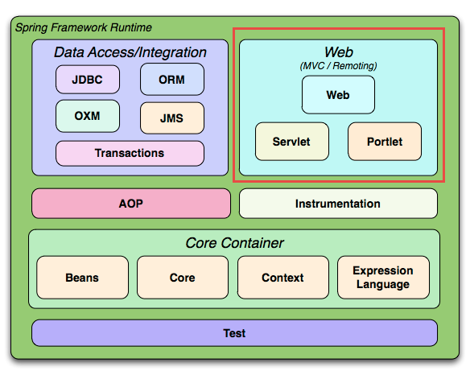
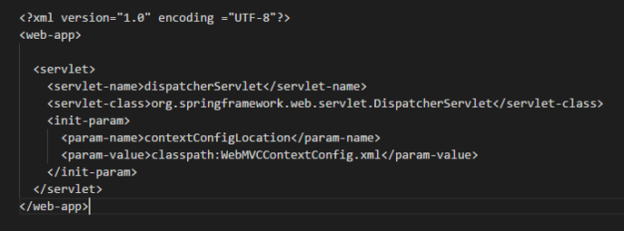
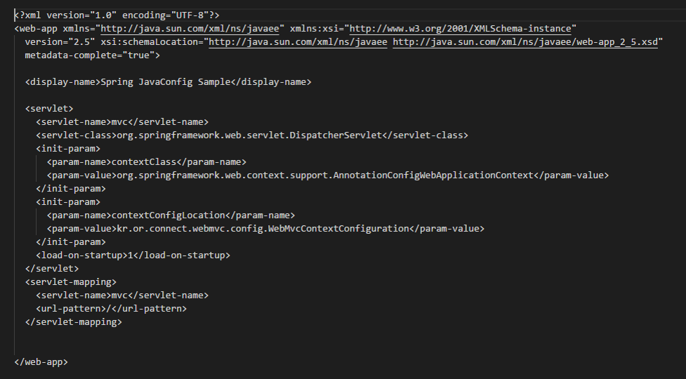
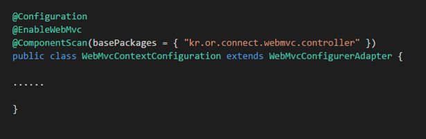
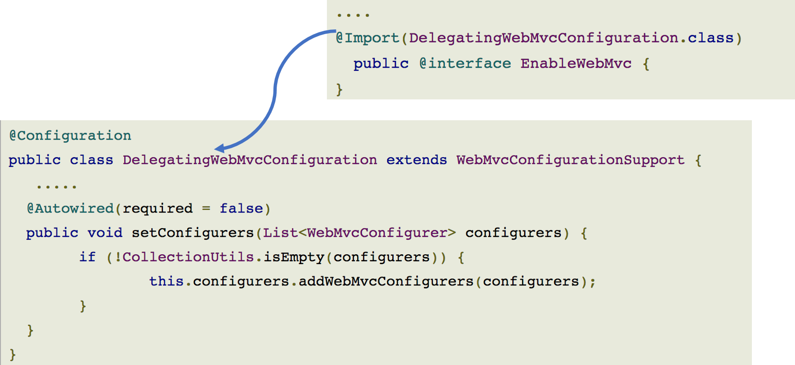

# 웹 앱 개발 1/4

> 1. JavaScript 배열 - FE
> 2. DOM API 활용 - FE
> 3. Ajax - FE
> 4. Web Animation - FE
> 5. WEB UI - FE
> 6. Tab UI - FE
> 7. Spring Core - BE
> 8. Spring JDBC - BE
> 9. Spring MVC - BE
> 10. 레이어드 아키텍처 - BE
> 11. Controller - BE

# Spring MVC

## MVC란?

- MVC는 Model-View-Controller의 약자이다
- 데스크톱 어플리케이션용으로 고안되었다
- Model: 모델은 뷰가 렌더링하는 필요한 데이터이다. 예를 들어 사용자가 요청한 상품 목록이나, 주문 내역이 이에 해당한다
- View: 웹 애플리케이션에서 뷰는 실제로 보이는 부분이며, 모델을 사용해 렌더링을 한다.
- Controller: 컨트롤러는 사용자의 액션에 응답하는 컴포넌트다.컨트롤러는 모델을 업데이트하고, 다른액션을 수행합니다.

이런 방식은 JSP에 자바코드도 있고 해서 복잡해지기 쉽다 -> 유지보수의 어려움 그래서 아래와 같이 다른 아키텍처로 변화

로직과 뷰를 분리해서 이쪽이 더 유지보수의 이점을 가지기 쉽다. 밑의 그림과 같이 좀 더 진화하게 된다

서블릿은 딱 하나만 존재. 프론트 컨트롤러는 논리적인 것을 하지 않는다. 오른쪽 컨트롤러가 일을 진행함(핸드 컨트롤러라고도 부름). 사용자의 모든 요청은 프론트 컨트롤러가 받고 논리적인 것은 오른쪽 컨트롤러가 실행하게 함

스프링 웹 모듈로 진화한 형태를 보여주는 것이고 웹 모듈이 MVC형태를 지닌다는 것을 볼 수가 있다.

## 동작흐름

파란 부분은 spring mvc가 제공함

보라색 부분은 개발자가 만들어야하는 부분

초록색은 spring mvc가 제공하는걸로 개발자가 만들어야 하는 부분

1. 요청을 받으면 dispatcher servlet이 일을 시작한다
2. dispatcher servlet이 요청을 처리할 컨트롤러와 필요한 메소드가 무엇인지 handler mapping에게 물어본다. handler mapping은 controller를 참고해서 관리를 하게 된다.
3. handler mapping에 의해 무엇이 필요한지 알게 되고 handler adapter에게 실행요청을 보낸다
4. 컨트롤러에게 실행 요청을 보냄 컨트롤러는 맞게 실행해서 뷰 네임에게 결과를 보냄
5. 뷰 네임이 요청을 받고 handler adapter에게 결과를 보여줌
6. view resolver가 view name을 가지고 적절한 뷰를 보여줌
7. view에서 response를 보내줌

[위 그림 원본](https://terasolunaorg.github.io/guideline/1.0.1.RELEASE/en/Overview/SpringMVCOverview.html) 

[모듈에 관해서](https://docs.spring.io/spring-framework/docs/3.0.0.M4/reference/html/ch01s02.html)

[스프링 mvc의 동작 원리](https://jess-m.tistory.com/15)

[dispatcher의 전략](https://kimddochi.tistory.com/86)

[spring mvc 동작 설명 각 노드들의 동작 자료](https://tte-yeong.tistory.com/70)

## DispatcherServlet 

[바로 위랑 같은 링크인데 이거랑 같이 보면서 읽자](https://tte-yeong.tistory.com/70)

- 프론트 컨트롤러(Front Controller)

- 클라이언트의 모든 요청을 받은 후 이를 처리할 핸들러에게 넘기고 핸들러가 처리한 결과를 받아 사용자에게 응답 결과를 보여준다

- DispatcherServlet은 여러 컴포넌트를 이용해 작업을 처리한다

- 이론적으로 한개 이상 만들 수가 있지만 보통은 한개만 만든다

- 내부 동작 흐름

  

- 요청 선처리 작업

  

  **요청 선처리 작업시 사용된 컴포넌트**

  **org.springframework.web.servlet.LocaleResolver**

  - 지역 정보를 결정해주는 전략 오브젝트이다.
  - 디폴트인 AcceptHeaderLocalResolver는 HTTP 헤더의 정보를 보고 지역정보를 설정해준다.

  **org.springframework.web.servlet.FlashMapManager**

  - FlashMap객체를 조회(retrieve) & 저장을 위한 인터페이스
  - RedirectAttributes의 addFlashAttribute메소드를 이용해서 저장한다.
  - 리다이렉트 후 조회를 하면 바로 정보는 삭제된다.

  **org.springframework.web.context.request.RequestContextHolder**

  - 일반 빈에서 HttpServletRequest, HttpServletResponse, HttpSession 등을 사용할 수 있도록 한다.
  - 해당 객체를 일반 빈에서 사용하게 되면, Web에 종속적이 될 수 있다.

  **org.springframework.web.multipart.MultipartResolver**

  - 멀티파트 파일 업로드를 처리하는 전략

- 요청 전달시 사용되는 컴포넌트

  - 

  - **요청 전달시 사용된 컴포넌트**

    org.springframework.web.servlet.HandlerMapping

    - HandlerMapping구현체는 어떤 핸들러가 요청을 처리할지에 대한 정보를 알고 있다.
    - 디폴트로 설정되는 있는 핸들러매핑은 BeanNameHandlerMapping과 DefaultAnnotationHandlerMapping 2가지가 설정되어 있다.

    org.springframework.web.servlet.HandlerExecutionChain

    - HandlerExecutionChain구현체는 실제로 호출된 핸들러에 대한 참조를 가지고 있다.
    - 즉, 무엇이 실행되어야 될지 알고 있는 객체라고 말할 수 있으며, 핸들러 실행전과 실행후에 수행될 HandlerInterceptor도 참조하고 있다.

    org.springframework.web.servlet.HandlerAdapter

    - 실제 핸들러를 실행하는 역할을 담당한다.
    - 핸들러 어댑터는 선택된 핸들러를 실행하는 방법과 응답을 ModelAndView로 변화하는 방법에 대해 알고 있다.
    - 디폴트로 설정되어 있는 핸들러어댑터는 HttpRequestHandlerAdapter, SimpleControllerHandlerAdapter, AnnotationMethodHanlderAdapter 3가지이다.
    - @RequestMapping과 @Controller 애노테이션을 통해 정의되는 컨트롤러의 경우 DefaultAnnotationHandlerMapping에 의해 핸들러가 결정되고, 그에 대응되는 AnnotationMethodHandlerAdapter에 의해 호출이 일어난다.

- 요청 처리시 사용되는 컴포넌트

  - 

  - 

  - **요청 처리시 사용된 컴포넌트**

    **org.springframework.web.servlet.ModelAndView**

    - ModelAndView는 Controller의 처리 결과를 보여줄 view와 view에서 사용할 값을 전달하는 클래스이다.

    **org.springframework.web.servlet.RequestToViewNameTranslator**

    - 컨트롤러에서 뷰 이름이나 뷰 오브젝트를 제공해주지 않았을 경우 URL과 같은 요청정보를 참고해서 자동으로 뷰 이름을 생성해주는 전략 오브젝트이다. 디폴트는 DefaultRequestToViewNameTranslator이다.

- 예외 처리시 사용되는 컴포넌트

  - 

  - **예외 처리시 사용된 컴포넌트**

    **org.springframework.web.servlet.handlerexceptionresolver**

    - 기본적으로 DispatcherServlet이 DefaultHandlerExceptionResolver를 등록한다.
    - HandlerExceptionResolver는 예외가 던져졌을 때 어떤 핸들러를 실행할 것인지에 대한 정보를 제공한다.

- 뷰 렌더링시 사용되는 컴포넌트

  - 

  - **뷰 렌더링 과정시 사용된 컴포넌트**

    **org.springframework.web.servlet.ViewResolver**

    - 컨트롤러가 리턴한 뷰 이름을 참고해서 적절한 뷰 오브젝트를 찾아주는 로직을 가진 전략 오프젝트이다.
    - 뷰의 종류에 따라 적절한 뷰 리졸버를 추가로 설정해줄 수 있다.

- 요청 처리 종료

  - 

## 작성실습

[참고 자료 스프링 문서](https://docs.spring.io/spring-framework/docs/current/reference/html/web.html)

서버 404에러가 pom.xml에 공백이 없어서 일어나는 경우도 있다. 간격 잘 맞춰주자

1. 웹 브라우저에서 `http://localhost:8080/mvcexam/plusform`이라고 요청을 보내면 서버는 웹 브라우저에게 2개의 값을 입력받을 수 있는 입력창과 버튼이 있는 화면을 출력한다
2. 웹 브라우정에 2개의 값을 입력하고 버튼을 클릭하면 `https://localhost:8080/mvcexam/plusURL`로 2개의 입력값이 POST방식으로 서버에게 전달한다. 서버는 2개의 값을 더한 후, 그 결과 값을 JSP에게 request scope으로 전달하여 출력한다.

### DispatcherServlet을 FrontController로 설정하기

- 설정안하면 프론트 컨트롤러의 역할을 하지 못한다
- web.xml 파일에 설정 (자주 사용)
- javax.servlet.ServletContainerInitializer 사용
  - 서블릿 3.0 스펙 이상에서 web.xml 파일을 대신해서 사용할 수 있다
- org.springframework.web.WebApplicationInitallizer 인터페이스를 구현해서 사용 (자주 사용)

**web.xml파일에서 설정하기**

- xml spring 설정 읽어들이도록 DispatcherServlet설정
  - 
- Java config spring 설정 읽어들이도록 DispatcherServlet설정 (수업에서는 이 방법 사용)
  - 
  - url-pattern에서 보면 `/`로 설정되어 있다. 모든 요청을 여기서 처리하게 되는 것으로 설정하는 것

**WebApplicationInitializer를 구현해서 설정하기**

- Spring MVC는 ServletContainerInitializer를 구현하고 있는 SpringServletContainerInitializer를 제공한다
- SpringServletContainerInitializer는 WebApplicationInitializer구현체를 찾아 인스턴스를 만드록 해당 인스턴스의 onStartup메소드를 호출하여 초기화 한다.
- 단점
  - 처음 웹 어플리케이션이 구동되는 시간이 오래 걸릴 수도 있다 <- 구현체를 찾고 초기화를 하기 때문에 발생하는 단점이다
- 구현 방법
  - 

**Spring MVC** 설정

- kr.or.connect.webmvc.config.WebMvcContextConfiguration

  - 

  - @Configuration

    - org.springframework.context.annotation의 Configuration 애노테이션과 Bean 애노테이션 코드를 이용하여 스프링 컨테이너에 새로운 빈 객체를 제공할 수 있다.

  - @EnableWebMvc

    - DispatcherServlet의 RequestMappingHandlerMapping, RequestMappingHandlerAdapter, ExceptionHandlerExceptionResolver, MessageConverter 등 Web에 필요한 빈들을 대부분 자동으로 설정해준다
    - xml로 설정의 `<mvc:annotation-driven/>`와 동일하다
    - 기본 설정 이외의 설정이 필요하다면 WebMvcConfigrereAdapter를 상속받도록 Java config class를 작성한 후, 필요한 메소드를 오버라이딩 하도록 한다
    - 
    - [위 코드 깃헙](https://github.com/spring-projects/spring-framework/blob/master/spring-webmvc/src/main/java/org/springframework/web/servlet/config/annotation/WebMvcConfigurationSupport.java)

  - @ComponentScan

    - ComponentScan애노테이션을 이용하면 Controller, Service, Repository, Component애노테이션이 붙은 클래스를 찾아 스프링 컨테이너가 관리하게 된다.
    - DefaultAnnotaionHandlerMapping과 RequestMappingHandlerMapping구현체는 다른 핸드러 매핑보다 훨씬 더 정교한 작업을 수행한다. 이 두 개의 구현체는 애노테이션을 사용해 매핑 관계를 찾는 매우 강력한 기능을 가지고 있다. 이들 구현체는 스프링 컨테이너 즉 애플리케이션 컨텍스트에 있는 요청 처리빈에서 ReqiestMapping애노테이션을 클래스나 메소드에서 찾아 HandlerMapping객체를 생성하게 된다.
      - HandlerMapping은 서버로 들어온 요청을 어느 핸들러로 전달할지 결정하는 역할을 수행한다.
    - DefaultAnnotationHandlerMapping은 DispatcherServlet이 기본으로 등록하는 기본 핸들러 맵핑 객체이고, RequestMappingHandlerMapping은 더 강력하고 유연하지만 사용하려면 명시적으로 설정해야 한다.

  - WebMvcConfigurerAdapter

    - org.springframework.web.servlet.config.annotation. WebMvcConfigurerAdapter
    - @EnableWebMvc 를 이용하면 기본적인 설정이 모두 자동으로 되지만, 기본 설정 이외의 설정이 필요할 경우 해당 클래스를 상속 받은 후, 메소드를 오버라이딩 하여 구현한다.

  - Controller(Handler) 클래스 작성하기

    - @Controller 애노테이션을 클래스 위에 붙인다.
    - 맵핑을 위해 @RequestMapping 애노테이션을 클래스나 메소드에서 사용한다.

  - @RequestMapping

    - Http 요청과 이를 다루기 위한 Controller 의 메소드를 연결하는 어노테이션
    - Http Method 와 연결하는 방법
       \- @RequestMapping(value="/users", method=RequestMethod.POST)
       \- From Spring 4.3 version (@GetMapping, @PostMapping, @PutMapping, @DeleteMapping, @PatchMapping)
    - Http 특정 해더와 연결하는 방법
       \- @RequestMapping(method = RequestMethod.GET, headers = "content-type=application/json")
    - Http Parameter 와 연결하는 방법
       \- @RequestMapping(method = RequestMethod.GET, params = "type=raw")
    - Content-Type Header 와 연결하는 방법
       \- @RequestMapping(method = RequestMethod.GET, consumes = "application/json")
    - Accept Header 와 연결하는 방법
       \- @RequestMapping(method = RequestMethod.GET, produces = "application/json")

    

  - **Spring MVC가 지원하는 Controller메소드 인수 타입**

    - javax.servlet.ServletRequest
    - **javax.servlet.http.HttpServletRequest**
    - org.springframework.web.multipart.MultipartRequest
    - org.springframework.web.multipart.MultipartHttpServletRequest
    - javax.servlet.ServletResponse
    - **javax.servlet.http.HttpServletResponse**
    - **javax.servlet.http.HttpSession**
    - org.springframework.web.context.request.WebRequest
    - org.springframework.web.context.request.NativeWebRequest
    - java.util.Locale
    - java.io.InputStream
    - java.io.Reader
    - java.io.OutputStream
    - java.io.Writer
    - javax.security.Principal
    - java.util.Map
    - org.springframework.ui.Model
    - org.springframework.ui.ModelMap
    - **org.springframework.web.multipart.MultipartFile**
    - javax.servlet.http.Part
    - org.springframework.web.servlet.mvc.support.RedirectAttributes
    - org.springframework.validation.Errors
    - org.springframework.validation.BindingResult
    - org.springframework.web.bind.support.SessionStatus
    - org.springframework.web.util.UriComponentsBuilder
    - org.springframework.http.HttpEntity<?>
    - Command 또는 Form 객체

     

    **Spring MVC가 지원하는 메소드 인수 애노테이션**

    - **@RequestParam**
    - **@RequestHeader**
    - **@RequestBody**
    - @RequestPart
    - **@ModelAttribute**
    - **@PathVariable**
    - @CookieValue

     

    **@RequestParam**

    - Mapping된 메소드의 Argument에 붙일 수 있는 어노테이션
    - @RequestParam의 name에는 http parameter의 name과 멥핑
    - @RequestParam의 required는 필수인지 아닌지 판단

     

    **@PathVariable**

    - @RequestMapping의 path에 변수명을 입력받기 위한 place holder가 필요함
    - place holder의 이름과 PathVariable의 name 값과 같으면 mapping 됨
    - required 속성은 default true 임

     

    **@RequestHeader**

    - 요청 정보의 헤더 정보를 읽어들 일 때 사용
    - @RequestHeader(name="헤더명") String 변수명

     

    **Spring MVC가 지원하는 메소드 리턴 값**

    - **org.springframework.web.servlet.ModelAndView**
    - org.springframework.ui.Model
    - java.util.Map
    - org.springframework.ui.ModelMap
    - org.springframework.web.servlet.View
    - **java.lang.String**
    - java.lang.Void
    - org.springframework.http.HttpEntity<?>
    - org.springframework.http.ResponseEntity<?>
    - **기타 리턴 타입**

## 실습 2

1. http://localhost:8080/mvcexam/userform 으로 요청을 보내면 이름, email, 나이를 물어보는 폼이 보여진다.
2. 폼에서 값을 입력하고 확인을 누르면 post방식으로 http://localhost:8080/mvcexam/regist 에 정보를 전달하게 된다.
3. regist에서는 입력받은 결과를 콘솔 화면에 출력한다.

## 실습3

1. http://localhost:8080/mvcexam/goods/{id} 으로 요청을 보낸다.
2. 서버는 id를 콘솔에 출력하고, 사용자의 브라우저 정보를 콘솔에 출력한다.
3. 서버는 HttpServletRequest를 이용해서 사용자가 요청한 PATH정보를 콘솔에 출력한다.

mvcexam참고하면 된다!