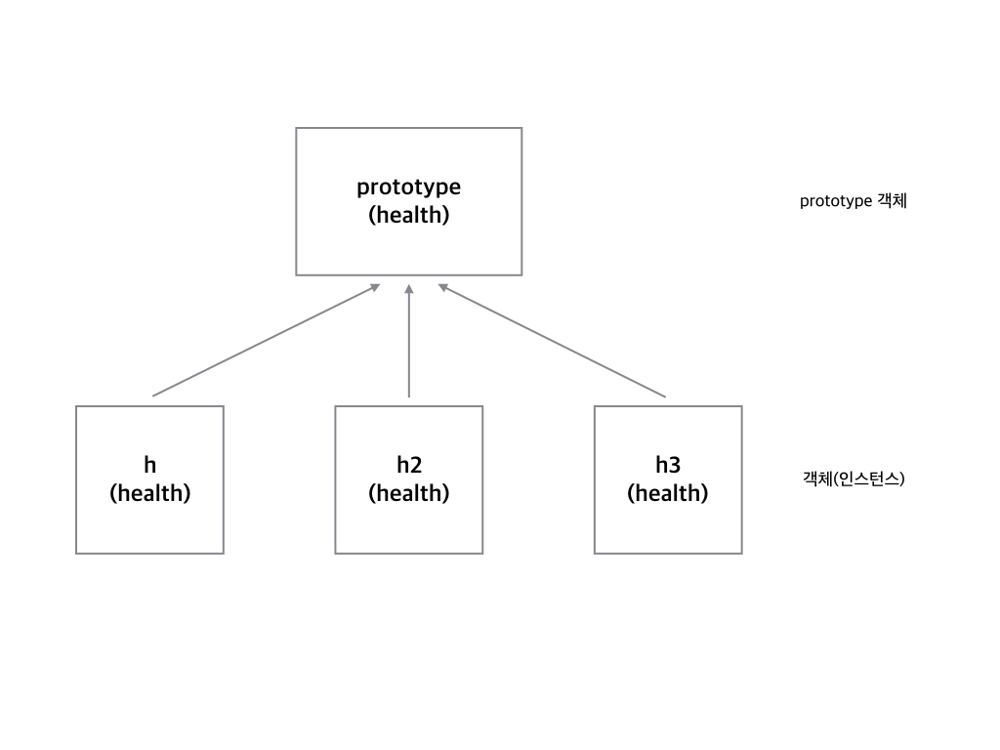

# 웹 앱 개발 3

> 1. UI Component module -FE
> 2. JavaScript Regular expression - FE
> 3. form 데이터 보내기 - FE
> 4. 상태유지기술 - BE
> 5. Spring 에서의 Session 사용법 - BE
> 6. 인터셉터 - BE
> 7. 아규먼트 리졸버 - BE

# UI Component module

## 자바 스크립트 객체

```javascript
var healthObj = {
  name : "달리기",
  lastTime : "PM10:12",
  showHealth : function() {
    console.log(this.name + "님, 오늘은 " + this.lastTime + "에 운동을 하셨네요");
  }
}

healthObj.showHealth();
```

그런데 healthObj의 형태를 가진 여러개의 객체가 필요하다면 어떻게 할까요?

healthObj2, healthObj3... 이런 식으로 계속 더 만들면 되기야 하겠지만 좀 상황이 이상할 듯함. 그렇다면 함수로 생성해보고 싶다!

## 자바스크립트 객체 동적으로 생성

```javascript
function Health(name, lastTime) {
  this.name = name;
  this.lastTime = lastTime;
    this.showHealth = function(){...}
}
const h = new Health("달리기", "10:12");
```

h는 객체입니다. h안을 들여다보면 어떻게 구성되어 있는지 알 수 있습니다.

Health함수를 한 번 더 불러서 h2객체를 만듭니다.

```javascript
h2 = new Health("걷기", "20:11"); 
```

이런 방식으로 계속 동적으로 생성이 가능하다. 그런데 이런식으로 하면 showHealth가 계속 중복이 되는 문제가 조금 있다(같은 동작이지만 생성할 수록 메모리를 더 차지하게 됨)

어떻게 해결을 해야할까?

## prototype으로 메서드를 생성하자



위와같은 생성 원리를 가진다. 그렇다면 prototype 에만 메소드를 지정시켜두면 메모리 증가를 막을 수 있지 않을까? 정답이다 연금술사!

```javascript
function Health(name, lastTime) {
  this.name = name;
  this.lastTime = lastTime;

}

Health.prototype.showHealth = function() {
    console.log(this.name + "," + this.lastTime);
}
// 아니면 아래처럼 써도 괜찮다
Health.prototype = {
    showHealth: function() {
    	console.log(this.name + "," + this.lastTime);
	}
}

const h = new Health("달리기", "10:12");
console.log(h);  //크롬개발자도구를 열고 이 부분이 어떻게 출력되는지 확인해보세요
h.showHealth();
```

그럼 아래처럼 여러 인스턴스를 만들어도 prototype안의 showHealth는 같은 참조점을 바라보고 있는 것을 알 수 있습니다.

```javascript
const h = new Health("달리기", "10:12");
const h2 = new Health("걷기", "14:20");
console.log(h.showHealth === h2.showHealth); //true
```

이러한 패턴으로 ui를 생성해보자