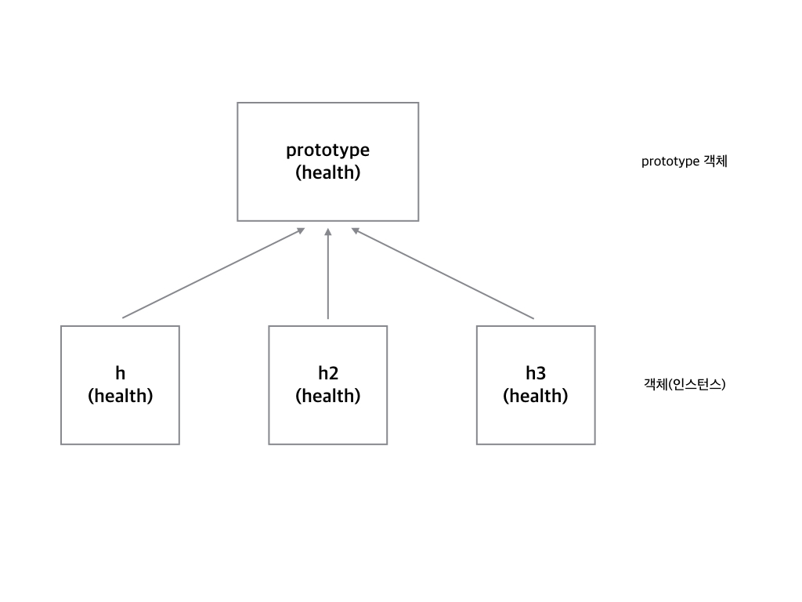

# 웹 앱 개발 3

> 1. UI Component module -FE
> 2. JavaScript Regular expression - FE
> 3. form 데이터 보내기 - FE
> 4. 상태유지기술 - BE
> 5. Spring 에서의 Session 사용법 - BE
> 6. 인터셉터 - BE
> 7. 아규먼트 리졸버 - BE

# UI Component module

## 자바 스크립트 객체

```javascript
var healthObj = {
  name : "달리기",
  lastTime : "PM10:12",
  showHealth : function() {
    console.log(this.name + "님, 오늘은 " + this.lastTime + "에 운동을 하셨네요");
  }
}

healthObj.showHealth();
```

그런데 healthObj의 형태를 가진 여러개의 객체가 필요하다면 어떻게 할까요?

healthObj2, healthObj3... 이런 식으로 계속 더 만들면 되기야 하겠지만 좀 상황이 이상할 듯함. 그렇다면 함수로 생성해보고 싶다!

## 자바스크립트 객체 동적으로 생성

```javascript
function Health(name, lastTime) {
  this.name = name;
  this.lastTime = lastTime;
    this.showHealth = function(){...}
}
const h = new Health("달리기", "10:12");
```

h는 객체입니다. h안을 들여다보면 어떻게 구성되어 있는지 알 수 있습니다.

Health함수를 한 번 더 불러서 h2객체를 만듭니다.

```javascript
h2 = new Health("걷기", "20:11"); 
```

이런 방식으로 계속 동적으로 생성이 가능하다. 그런데 이런식으로 하면 showHealth가 계속 중복이 되는 문제가 조금 있다(같은 동작이지만 생성할 수록 메모리를 더 차지하게 됨)

어떻게 해결을 해야할까?

## prototype으로 메서드를 생성하자



위와같은 생성 원리를 가진다. 그렇다면 prototype 에만 메소드를 지정시켜두면 메모리 증가를 막을 수 있지 않을까? 정답이다 연금술사!

```javascript
function Health(name, lastTime) {
  this.name = name;
  this.lastTime = lastTime;

}

Health.prototype.showHealth = function() {
    console.log(this.name + "," + this.lastTime);
}
// 아니면 아래처럼 써도 괜찮다
Health.prototype = {
    showHealth: function() {
    	console.log(this.name + "," + this.lastTime);
	}
}

const h = new Health("달리기", "10:12");
console.log(h);  //크롬개발자도구를 열고 이 부분이 어떻게 출력되는지 확인해보세요
h.showHealth();
```

그럼 아래처럼 여러 인스턴스를 만들어도 prototype안의 showHealth는 같은 참조점을 바라보고 있는 것을 알 수 있습니다.

```javascript
const h = new Health("달리기", "10:12");
const h2 = new Health("걷기", "14:20");
console.log(h.showHealth === h2.showHealth); //true
```

이러한 패턴으로 ui를 생성해보자

```javascript
function makeTemplate(data, clickedName) {
            var html = document.getElementById("tabcontent").innerHTML;
            var resultHTML = "";
            for (var i = 0; i < data.length; i++) {
                if (data[i].name === clickedName) {
                    resultHTML = html.replace("{name}", data[i].name)
                        .replace("{favorites}", data[i].favorites.join(" "));
                    break;
                }
            }
            document.querySelector(".content").innerHTML = resultHTML;
        }
        function sendAjax(url, clickedName) {
            var oReq = new XMLHttpRequest();
            oReq.addEventListener("load", function () {
                var data = JSON.parse(oReq.responseText);
                makeTemplate(data, clickedName);
            });
            oReq.open("GET", url);
            oReq.send();
        }
        var tabmenu = document.querySelector(".tabmenu");
        tabmenu.addEventListener("click", function (evt) {
            sendAjax("./json.txt", evt.target.innerText);
        });
```

 전역공간에 구현된 코드를 prototype기반의 클래스로 구현해볼 겁니다.

### prototype 기반 클래스 코드

prototype기반 코드는 하나의 클래스(모듈)로 만드는 것으로, 기존코드의 큰 수정 없이 변경할 수 있습니다.

우리는 지금처럼 비슷한 기능 덩어리를 하나의 객체, 즉 클래스 형태로 만들 수가 있습니다.

영상에 노출된 코드는 아래에서도 확인할 수 있습니다.

[코드](https://gist.github.com/crongro/7f2f2aa8f4a4c93593797734322a7cb6)

# 자바스크립트 정규 표현식

## 정규표현식

[정규 표현식 문서](https://developer.mozilla.org/ko/docs/Web/JavaScript/Reference/Global_Objects/RegExp)

[정규 표현식 정리해둔 문서](http://www.devholic.net/1000238)

문자열의 특정 패턴을 찾을 수 있는 문법입니다. 패턴을 찾아서 추출, 삭제, 치환 등의 문자열 조작을 할 수 있습니다.

**실무에서의 사용**

- 이메일, 주소, 전화번호 규칙 검증
- textarea에 입력된 것 중 불필요한 입력값 추출
- 트랜스파일링
- 개발 도구에서의 문자열 치환

**간단한 사용법**

- 숫자 하나 찾기

```javascript
var result = "abc3zzz".match(/\d/)[0];
console.log(result);
```

- 숫자 두 개 찾기

```javascript
var result = "abc32zzz".match(/\d\d/)[0];
console.log(result);
```

## 정규 표현식 공부방법

- javascript regex cheat sheet
- 패턴들을 테스트 해보면서 구현해보기

우편번호를 생각해보자

```javascript
var result = "123-123".match(/\d\d\d-\d\d\d/)[0]
하지만 비효율적인 반복을 쓰는 듯 하다
var result = "123-123".match(/\d{3}-\d{3}/)[0]
이런 식으로 중복을 지울 수가 있다.
```

or도 가능 현대 우편번호는 12345처럼 다섯자리니 다음과 같이 표현이 가능하다

```javascript
"12345".match(/(\d{5}|\d{3}-\d{3})/)[0]
|기준으로 d{5}가 연속 5자리 숫자를 포착
아니면 특정 숫자가 포함되어야 한다면 다음과 같이 가능
"12345".match(/[0-8]\d{4}/)[0]
[0-8]이것이 0~8까지 숫자가 있는 것을 포착하고 그다음으로 숫자가 네개가 연속으로 있는지 본다
특정 숫자만 원하거나 특정 범위만 원한다면 자르는 것이 가능 [123] or [1-47-8] 이러면 앞에건 1,2,3을 포착 뒤에건 1,2,3,4,7,8을 포착
```

자릿수를 또 따로 또는(or)이 가능하다

```javascript
"011-1234-1234".match(/\d{3}-\d{3,4}-\d{4}/)
이러면 가운데 숫자는 3자리 or 4자리를 포착
```

()같은 정규표현식에서 쓰이는 특정 문자를 찾고 싶으면 `\`을 이용하면 된다 ex) `\(` 아니면 `[]` 를 이용해도 괜찮다 ex) `[(]` 이런식으로 이용 가능

정규표현식을 이용한다면 이런 식의 치환이 가능하다

```javascript
var result = "011-021-0011".replace(/(\d{2})\d/, "$10");;
console.log(result);
```

**탐욕적(greedy), 게으른(lazy) 수량자**

뒤에서부터 찾거나, 앞에서부터 찾거나 (lazy를 써서 앞에서부터 찾도록 합니다.)

- greedy : *, +, {n,}
- lazy : *?, +?, {n,}?

# form 데이터 보내기

[method 관련 정보](https://www.w3schools.com/tags/ref_httpmethods.asp)

[html 폼 태그에 대해](https://www.w3schools.com/html/html_forms.asp)

```html
<form action="/join" method="post">
    <div class="inputWrap">
        <div class="email">
            <span> Email </span> <input type="text" name="email"><br/>
        </div>
        <div class="password">
            <span> Password </span> <input type="password" name="password"><br/>
        </div>
    </div>
    <input class="sendbtn" type="submit">
</form>
```

- action: 보내는 주소
- method: 보내는 메소드
- input에서 name속성 json형태를 생각하면 키값이라고 생각하면 편안

검증은 어떻게 처리할까? 보내서 백엔드에서 처리하는것은 서버가 괜한일을 처리하는 것이다. 하지만 프론트에서는 버튼을 누르거나 엔터를 누르면 자동으로 요청을 보내게 되는데 어떻게 해결해야 하지?

## preventDefault()

이것을 이용하자. form태그에 관련해서 submit이 일어나서 요청을 보내는 행동에 디폴트를 초기화시키는 방법이다.

이것을 이용하면 submit이 발생되도 바로 데이터를 보내지 않는다. 아래와 같은 예를 확인하자

```html
<!doctype html>
<html>
    <head>
        <meta charset="utf-8">
        <meta name="description" content="">
        <meta name="viewport" content="width=device-width, initial-scale=1">
        <title> Join !</title>
        <link rel="stylesheet" href="/css/ui.css">
    </head>
    <body>
        <h1>Join my website!</h1>
        <div class="formWrap">
            <form action="/join" method="post" id="myform">
                <div class="inputWrap">
                    <div class="email">
                        <span> Email </span> <input type="text" name="email"><br/>
                    </div>
                    <div class="password">
                        <span> Password </span> <input type="password" name="password"><br/>
                    </div>
                </div>
                <input class="sendbtn" type="submit">
           </form>
        </div>

        <section class="result"></section>
        <script>
		var btn = document.querySelector(".sendbtn");
		var result = document.querySelector(".result");
		btn.addEventListener("click", function(evt) {
		    evt.preventDefault();
		    var emailValue = document.querySelector("[name='email']").value;
		    var bValid = (/^[\w+_]\w+@\w+\.\w+$/).test(emailValue);
		    if(!bValid)  { 
  		      result.innerHTML = "올바르지 않은 이메일입니다";
		    } else {
        		result.innerHTML = "이메일정보가 좋아요~";
        		document.querySelector("#myform").submit();
 		   }
		});
        </script>
    </body>
</html>
```

위코드는 버튼 클릭에 대해서 만든 것이니 form태그에 대해서 `addEventListener`를 이용해서 submit 이벤트를 만들어주면 될 것 같다!

[회원 정보 관련 정규 표현식](https://epthffh.tistory.com/entry/%EB%B9%84%EB%B0%80%EB%B2%88%ED%98%B8-%EC%A0%95%EA%B7%9C%EC%8B%9D)

[input자체에 패턴을 주는 방법](https://www.w3schools.com/tags/att_input_pattern.asp)

