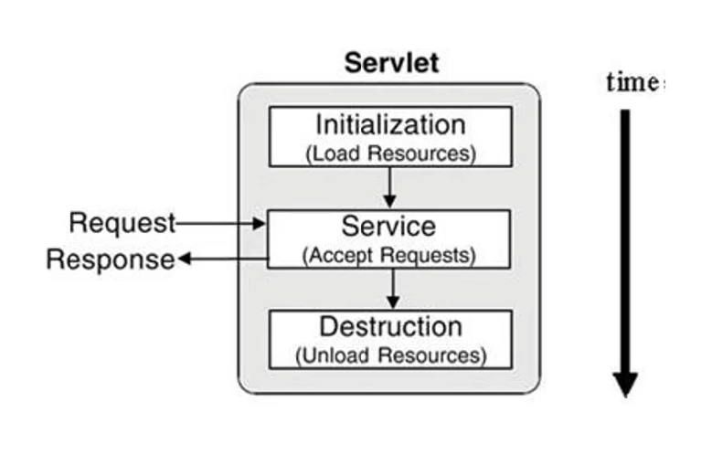

# 웹 프로그래밍 기초

> 1. web개발의 이해 - FE/BE 
> 2. HTML - FE
> 3. CSS - FE
> 4. 개발환경 설정 - BE (이 파일)
> 5. Servlet - BE (이 파일)

## 4. 개발환경 설정 - BE

아파치 톰캣 은 실행시키면 localhost8080으로 연다

9버전은 아직 불안정한듯

helloworld.java

```java
package examples;

import java.io.IOException;
import java.io.PrintWriter;

import javax.servlet.ServletException;
import javax.servlet.annotation.WebServlet;
import javax.servlet.http.HttpServlet;
import javax.servlet.http.HttpServletRequest;
import javax.servlet.http.HttpServletResponse;

/**
 * Servlet implementation class HelloServlet
 */
@WebServlet("/HelloServlet")
public class HelloServlet extends HttpServlet {
	private static final long serialVersionUID = 1L;
       
    /**
     * @see HttpServlet#HttpServlet()
     */
    public HelloServlet() {
        super();
        // TODO Auto-generated constructor stub
    }

	/**
	 * @see HttpServlet#doGet(HttpServletRequest request, HttpServletResponse response)
	 */
	protected void doGet(HttpServletRequest request, HttpServletResponse response) throws ServletException, IOException {
		response.setContentType("text/html;charset=UTF-8");
		PrintWriter out = response.getWriter();
		out.print("<h1>Hello servlet</h1>");
	}
}
```


## 5. Servlet이란?

- 자바 웹 어플리케이션의 구성요소 중 동적인 처리를 하는 프로그램의 역할
- 서블릿을 정의 해보면
  - 서블릿은 WAS에서 동작하는 Java클래스이다
  - 서블릿은 HttpServlet 클래스를 상속받아야 한다
  - 서블릿과 JSP로부터 최상의 결과를 얻으려면, 웹 페이지를 개발할 때 이 두가지(JSP,서블릿)를 조화롭게 사용해야 한다.
  - 화면(HTML)은 JSP로, 복잡한 프로그래밍은 서블릿으로 표현하자


### Servlet 작성방법은 2가지로 나뉨

1. Servlet 3.0 이상에서 사용하는 방법
   - web.xml파일을 사용하지 않음
   - 자바 어노테이션을 사용
   - 앞에서 실습했던 firestweb에서 사용
2. Servlet 3.0 spec 미만에서 사용하는 방법
   - Servlet을 등록할 때 web.xml파일에 등록

```java
protected void doGet(HttpServletRequest request, HttpServletResponse response) throws ServletException, IOException {
    	/* 여기서 HttpServletRequest는 요청 객체, HttpServletResponse는 응답 객체 */
		response.getContentType("text/html");
	}
```


### Servlet 생명주기

가라 설명

1. 접속 연결
2. 해당 Servlet을 생성
3. init을 호출
4. service에 접속할때마다 service가 계속 호출됨
5. 수정이 있거나 끊나면 destory를 호출해서 잠시 닫아버린다 요청이 다시 오면 1번으로 돌아감

약간 진짜 설명

1. WAS는 서블릿 요청을 받으면 해당 서블릿이 메모리에 있는지 확인
2. if(메모리에 없음) {해당 서블릿 클래스를 메모리에 올림, init()메소드를 실행}
3. service()메소드를 실행
4. was가 종료되거나, 웹 어플리케이션이 새롭게 갱신될 경우 destroy()메소드가 실행됨



### service(request,response) 메소드

- HttpServlet의 service메소드는 템플릿 메소드 패턴으로 구현
  - 없으면 부모를 요청하겠지?

### 요청과 응답

- WAS는 웹 브라우저로부터 Servlet요청을 받으면,
  - 요청할 때 가지고 있는 정보를 HttpsServletRequest객체를 생성하여 저장
  - 웹 브라우저에게 응답을 보낼 때 사용하기 위하여 HttpServletResponse객체를 생성
  - 생성된 HttpsServletRequest, HttpServletResponse 객체를 서블릿에게 전달


```java
package examples;

import java.io.IOException;
import java.io.PrintWriter;
import java.util.Enumeration;

import javax.servlet.ServletException;
import javax.servlet.annotation.WebServlet;
import javax.servlet.http.HttpServlet;
import javax.servlet.http.HttpServletRequest;
import javax.servlet.http.HttpServletResponse;

/**
 * Servlet implementation class HeaderServlet
 */
@WebServlet("/header")
public class HeaderServlet extends HttpServlet {
	private static final long serialVersionUID = 1L;
       
    /**
     * @see HttpServlet#HttpServlet()
     */
    public HeaderServlet() {
        super();
        // TODO Auto-generated constructor stub
    }

	/**
	 * @see HttpServlet#doGet(HttpServletRequest request, HttpServletResponse response)
	 */
	protected void doGet(HttpServletRequest request, HttpServletResponse response) throws ServletException, IOException {
		response.setContentType("text/html");
		PrintWriter out = response.getWriter();
		out.println("<html>");
		out.println("<head><title>form</title></head>");
		out.println("<body>");

		Enumeration<String> headerNames = request.getHeaderNames();
		while(headerNames.hasMoreElements()) {
			String headerName = headerNames.nextElement();
			String headerValue = request.getHeader(headerName);
			out.println(headerName + " : " + headerValue + " <br> ");
		}		
		
		out.println("</body>");
		out.println("</html>");
	}

	/**
	 * @see HttpServlet#doPost(HttpServletRequest request, HttpServletResponse response)
	 */
	protected void doPost(HttpServletRequest request, HttpServletResponse response) throws ServletException, IOException {
		// TODO Auto-generated method stub
		doGet(request, response);
	}

}
```

### 파라미터 읽기

그냥 getParameter를 이용하면 된다!

```java
package examples;

import java.io.IOException;
import java.io.PrintWriter;

import javax.servlet.ServletException;
import javax.servlet.annotation.WebServlet;
import javax.servlet.http.HttpServlet;
import javax.servlet.http.HttpServletRequest;
import javax.servlet.http.HttpServletResponse;

/**
 * Servlet implementation class ParameterServlet
 */
@WebServlet("/param")
public class ParamServlet extends HttpServlet {
	private static final long serialVersionUID = 1L;
       
    /**
     * @see HttpServlet#HttpServlet()
     */
    public ParamServlet() {
        super();
        // TODO Auto-generated constructor stub
    }

	/**
	 * @see HttpServlet#doGet(HttpServletRequest request, HttpServletResponse response)
	 */
	protected void doGet(HttpServletRequest request, HttpServletResponse response) throws ServletException, IOException {
		response.setContentType("text/html");
		PrintWriter out = response.getWriter();
		out.println("<html>");
		out.println("<head><title>form</title></head>");
		out.println("<body>");

		String name = request.getParameter("name");
		String age = request.getParameter("age");
		
		out.println("name : " + name + "<br>");
		out.println("age : " +age + "<br>");
		
		out.println("</body>");
		out.println("</html>");
	}

}
```

