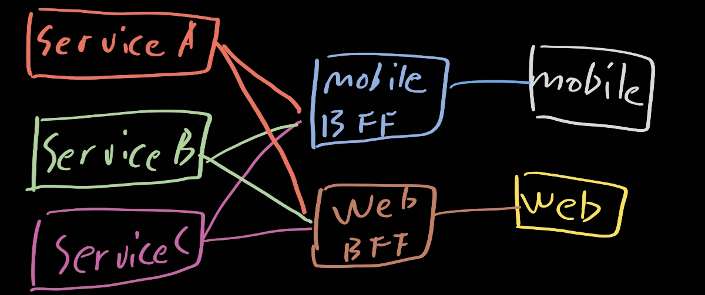

# BFF (Backend For Frontend)

[참고영상](https://www.youtube.com/watch?v=zazeGmFmUxg) [참고칼람](https://seungdols.tistory.com/865)

현대 시점에 들어오면서 사람들은 다양한 기기를 쓰기 시작했다. 즉, 사람들의 엔드포인트가 너무 다양해졌고 하나의 서버로만 제공해주기에는 호환성이나 단일 장애 포인트가 생길 가능성이 매우 높아졌다

그리하여 새로운 상황의 도입으로 각 엔드포인트를 위한 백엔드가 중간 매개로 등장하게 되었고 이것이 BFF (Backend For Frontend)이다.

간단하게 그려보면 위와 같겠지만 사실 어떠한 아키텍처가 정답이라고는 할 수가 없다. 이것이 ios bff, aos bff식으로 나뉠 수도 있고 이 패턴에는 정답이 없다.

하지만 그렇다고 의미가 없는 것이 아니다. 우리에게 중요한 것은 각각의 엔드포인트를 위한 백엔드 서버가 다 따로 있다는 것이 중요한 것이다.