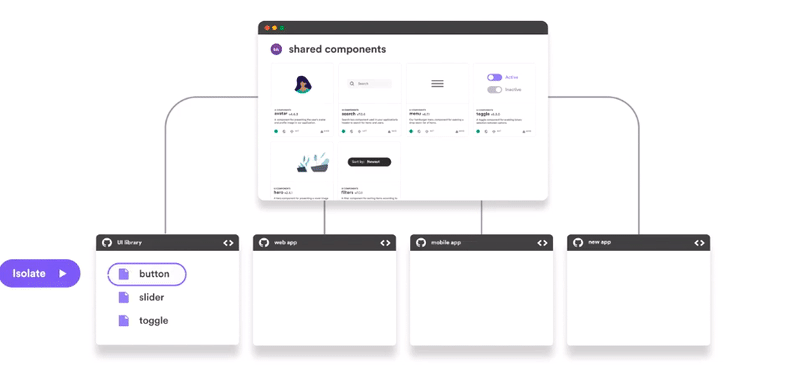

# Building a UI Component Library for Your Staratup

[칼럼 링크](https://blog.bitsrc.io/building-a-ui-component-library-for-your-startup-d7de5ce5a652)

컴포넌트 라이브러리들은 큰 회사들을 위한 좋은 툴이다. 하지만 스타트업과 같은 작은 형태의 비지니스에서는 조금 낭비적이다. 스타트업의 일을 부스트해줄 수 있는 UI 컴포넌트를 만드는 방법을 공유해보도록 하자.

> (benefit X chance-of-full-adoption) - cost

한정된 자원과 적은 인원으로 인해 작은 또는 적은 프로젝트를 진행하는 스타트업을 위해 디자인 시스템을 만드는 것은 꽤 비싸보인다. 팀에게 이것은 필요해질 것이다. 모든 프로젝트의 디자인 결정을 하기 위하거나 UI 라이브러리를 추가적으로 가져와서 구축하거나 UI 컴포넌트 패키징을 설정하거나 카탈로그 사이트를 만들거나 등등

너의 스타트업은 빠르게 크고 진화한다. 변화는 엄청 자주 있다. 불가능하거나 엄청나게 비생산적인 UI를 강요당할 수도 있다.

## UI컴포넌트를 가치있게 만들기

- 점진적으로 빌드해라

  UI 라이브러리들은 `all-or-nothing`에 대한 결정권을 가지고 있지 않다. 너의 라이브러리를 점진적으로 만들어라 불필요한 자원낭비의 리스크를 낮추기 위해 그리고 너의 메인 프로젝트에 집중을 유지하기 위해. 컴포넌트를 export해라. 라이브러리를 만드는 것을 주 목적으로 전가하지 말아라. 새 재사용한 컴포넌트가 이용가능해질 때 마다, 너의 라이브러리로 푸시해라. 컴포넌트를 즉시 빌드하지 말고

- 협동적으로 빌드해라

  UI라이브러리르 팀 작업으로 만들어라. 재사용 가능한 UI 컴포넌트들은 협업이 되어야만 한다. 만약 너의 팀이 재사용 가능한 컴포넌트들을 포함하는 것이 강제된다면 재사용한 컴포넌트들은 너가 희망하는 것만큼 완벽한 체택을 받지 못할 것이다. 재사용한 컴포넌트들은 환경을 호스팅하기 위한 적절한 것을 만들기 위한 작은 트윅을 필요로 할 것이다. 팀이 재사용 가능한 구성 요소를 수정하지 못하게 되면 거의 동일한 구성 요소를 반복적으로 다시 작성하게 됩니다. 이는 버그, UI의 불일치 및 느린 개발의 확실한 해결책입니다.

- 진실의 단일 소스로 코드를 만들어라

  UI 컴포넌트들을 빌딩하는 과정은 보편적으로 이미지, 스케치 파일같은 코드가 아닌 작업에서 시작된다. 이 디자인 아티팩트들은 종종 진짜 코드 대신 디자인 시스템의 진실된 소스로 다루어진다. 가능한한 명확성과 효율성을 위해 이것들은 유지될 것이고 코드가 이것들을 반영하는데에 확실하게 해줄 것이다. 개발자가 컴포넌트들을 이용할때마다 컴퍼니의 디자인 가이드라인을 대표한다는 것을 개발자들은 알아야 한다

## 툴을 한번 써보자

[Bit](https://bit.dev/)는 스타트업의 UI컴포넌트 라이브러리를 만들기 위한 대단한 툴이다. 비트는 컴포넌트들을 어떠한 프로젝트에서든 나누는 것을 쉽게 만든다. 그것이 점진적으로 성장할때도 그렇다.



비트는 너를 위해 컴포넌트들을 고립화 시킨다. 그리고 다른 유저들이 그것을 쉽게 이용할 수 있게 쉽게 푸시해준다. 패키지를 만들거나 추가적인 레포지터리를 유지하거나할 필요가 없다

비트에서 컴포넌트들은 리랜더된다 예제와 함꼐 실시간으로 그리고 쉽게 찾을 수 있도록 해준다. 겔러리 웹사이트도 필요없고 문서 포탈도 필요없고 추가적인 컴포넌트 플레이그라운드도 필요없다

## 간단한 예제를 살펴보자

1. ```bash
   git clone https://github.com/giteden/basic-todo-app.git
   ```

2. 워크스페이스를 시작하고 로그인을 하자

   ```bash
   $ cd basic-todo-app 
   $ bit init
   $ bit login
   ```

3. 모든 컴포넌트들을 추가하자

   ```bash
   $ bit add src/components/*
   ```

4. 리액트 컴파일러를 설정하자

   ```bash
   $ bit import bit.envs/compilers/react --compiler
   ```

5. tag하고 나눌 컬렉션을 export하자

   ```bash
   $ bit tag --all 1.0.0
   $ bit export username.collection
   ```

6. 와우 완성!

한번쯤 고려해볼 만하다. 한번 살펴보고 이용해볼 수 있도록 해보자!