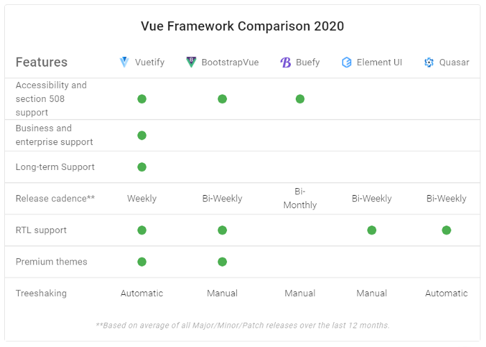
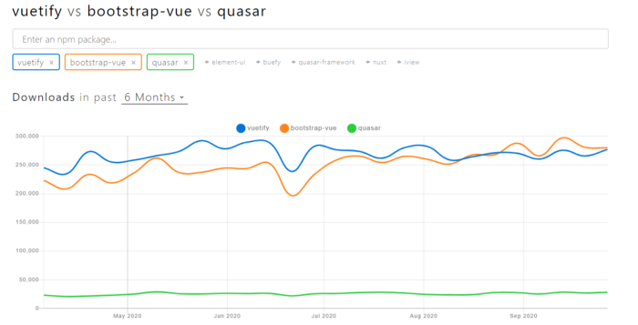
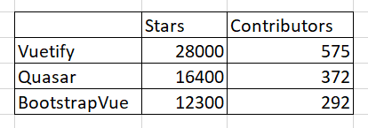

# Quasar vs Vuetify vs bootstrap-vue

[해당 컬럼 링크(영어주의)](https://blog.bitsrc.io/quasar-vs-vutify-vs-bootstrap-vue-choosing-the-right-vuejs-ui-library-cf566f61bc4) [비슷한 느낌의 간단하게 한글로 되어있는 컬럼](https://toritosystem.tistory.com/10)

- 이 글의 정리 계기
  - 어떤 큰 기업의 2차 면접을 준비하게 되었다
  - 1차 면접 당시 이런 프레임워크에 대한 질문이 들어왔는데 그냥 어떻게 대답하며 넘어감
  - 추후에 찾아보니 의외로 좀 차이가 크다는 것을 해당 글을 읽고 깨달음
  - 작년 글인 것도 감안하여 나름 트랜디한 글이라고 생각하여 이번 기회에 정리해본다

몇 년이 지난 지금 Vue.js는 견고해져왔고 앵귤러와 리액트의 강력한 경쟁상대가 되었습니다. 뷰의 발달 과정을 본다면 이것이 프레임워크의 간편성, 라이브러리의 가능성, 컴포넌트, 생태계를 단단히 만드는 러닝 머테리얼과 연관이 있다는 것을 알 수 있다. 뷰는 항상 UI컴포넌트 라이브러리를 선택하기 좋은 상황이다. 이 글에서는 3개의 훌륭한 ui component 라이브러리를 살펴볼것이다

## 1. Quasar

> Quasar emphasizes a single code base for all web, mobile, and desktop solutions while providing powerful CLI and UI components

vue 개발자를 위한 UI 라이브러리/프레임워크 오픈소스인 퀘이사부터 살펴보자. 이것은 우리가 빠르게 반응형 싱글 페이지 어플리케이션, 프로그래시브 웹 앱, 서버사이드 랜더 앱을 개발할 수 있게 허락해준다. 그것에 떨어지더라도 당신은 퀘이사를 이용해 모바일과 데스크탑 어플리케이션을 만들 수가 있다

퀘이사는 코딩에서의 최고의 관행을 따르는 프레임워크로도 알려져있다. 사실은 퀘이사는 몇가지 모범사례를 내장하고 있고 당신은 추가적으로 해야할 것은 없다. 이것들은 아래의 것들에 대한 모범사례를 포함한다

- HTML/CSS/JS minification
- Cache busting
- Tree shaking
- Source-mapping
- Code-splitting with lazy loading
- Linting code

퀘이사 스탯을 살펴본다면 16000개가 넘는 start과 350명이 넘는 기여자가 있다! (해당 글을 리뷰하는 시점인 21/08/04에서는 19.1k의 별이 존재중 포크만 해도 2.3k이다) 이 스탯은 급격하게 최근에 증가하고 있으며 다양한 회사들이 지금 이용중에 있다

- 장점
  - 고 성능과 반응형과 함께하는 웹 컴포넌트
  - 통합 모범 사례
  - 거대한 커뮤니티와 공식 문서
  - 2.0 머테리얼을 따름
  - RTL을 지원
  - 고 보안성
  - 쉽게 마이그레이트 할 수 있음
- 단점
  - 퀘이사는 개인에 의해 개발되는 프레임워크로 알려져 있다, 미래에 이슈가 생길 가능성이 존재한다

## Vuetify

> Vuetify follows the standards of material design

뷰티파이는 Vue.js에 기반을 둔 또다른 UI 프레임워크이다. 그리고 이것은 유저들에게 좋은 경험에 대한 솔루션을 만들고 싶어하는 개발자들을 위해 재사용성있고 깨끗한 컴포넌트 세트를 제공한다. 퀘이사와 비슷하게 뷰티파이는 대부분의 웹 브라우저를 지원하며 웹 개발, 프로그래시브 웹 앱, 모바일 개발, 데스크톱 앱 개발(일렉트론) 템플릿을 제공한다.

그러나 몇 기준은 엄격하다고 느낄 수도 있다. 게다가, 머테리얼 디자인을 연습하는 것은 유저를 위한 재사용성과 스텐다드한 스타일같은 이점을 가져온다. 그것에서 떨어져서라도 뷰티파이는 너의 어플리케이션을 커스터마이즈 할 수 있도록 동적 레이아웃을 제공한다 그리고 컴포넌트를 커스터마이즈할 수 있는 SASS 또한 제공한다

깃허브 스텟을 보면 뷰티파이는 27900스타 이상이 있고 550명 이상의 기여자들이 있으며 퀘이사와는 다른 회사들이 많이들 이용하고 있다. (이 글을 작성하는 시점에서는 31.6k의 스타가 존재)

- 장점
  - 재사용가능한 컴포넌트들
  - (나같은) 그래픽에 어려움을 가지는 개발자들에게 아름다움을 줄 수가 있다
  - 다양한 버라이어티한 컴포넌트들
  - 브라우저에 맞춤
  - 머티리얼 디자인
  - 큰 커뮤니티와 좋은 공식 문서
  - 지속적인 업데이트
- 단점
  - 머티리얼 디자인을 좋아하지 않는다면 최고의 선택은 아니다
  - 커스터마이징을 하는데 꽤나 도전적이다

## Bootstrap Vue

> Being a part of the Bootstrap family has enabled BootstrapVue to use regular bootstrap elements as Vue components.

부트스트랩은 웹사이트와 웹 어플리케이션에서 사용되는 가장 유명한 프론트엔드 프레임워크로 알려져있다. 부트스트랩뷰는 VueJs 개발자들을 위해 커스터마이징 된 프레임워크이다. 부트스트랩뷰는 85개 이상의 컴포넌트를 포함하며 사용가능한 45개이상의 플러그인, 디랙티브, 테마 그리고 1100개 이상의 아이콘을 제공한다. 부트스트랩뷰는 또한 그리드 시스템과 부트스랩4의 디테일한 실행을 포함한다

만약 당신이 부트스트랩에 친근하다면 이것을 배우는데에 대한 러닝 커브는 매우 짧고 당신은 금방 시작할 수 있다. 이것또한 다양한 회사가 이용하고 있으며 12000개 이상의 스타와 300명 이상의 기여자가 존재한다. (이 글을 작성하는 시점에서는 13.3k의 스타를 가지고 있다)

- 장점
  - 반응형 레이아웃 제작에 쉬움
  - 쉽고 빠른 스타일링
  - 단지 필요한 것만 임포팅하면 된다
  - 자동으로 마크업해준다
  - 부트스트랩으로부터의 현대적인 기능을 포함한다
  - SCSS 가능한 테마와 글로벌 옵션을 만들 수 있다
  - 큰 커뮤니티와 공식문서
- 단점
  - 커스터마이징을 하는데 꽤나 도전적이다

## 재사용 가능한 컴포넌트를 연습을 통해 만들어보자

당신이 만약 퀘이사, 뷰티파이, 부트스트랩뷰를 이용한다면, ui 엘리먼트들을 이용해 디자인 시스탬을 만드는데에 연습이 필요할 것이다. 이 연습을 통해 당신은 점진적으로 새 컴포넌트를 디자인 시스템에 추가하고 디자이너와 협업을 하고 커스터마이즈하고 다른 개발자와 나누는데에 성장할 것이다.

게다가, 디자인 시스템을 정한 때에 당신은 당신의 컴포넌트의 추상적인 정도를 결정할 수 있다. 이것은 당신이 원하는 것에 따라서 보여지는 컴포넌트 또는 비즈니스 컴포넌트 가 될 수 있다.

그러나 당신은 메뉴얼에 따라 하는 것이 꽤나 고된 일인 것을 발견할 것이다. 그때가 당신이 [비트](https://github.com/teambit/bit)를 이용해 당신의 디자인 시스템 컴포넌트의 라이프사이클을 관리하는 때이다. [참고 자료](https://blog.bitsrc.io/building-a-ui-component-library-for-your-startup-d7de5ce5a652)

## 라이브러리들을 비교해보자

3가지 라이브러리들을 살펴보고 이 라이브러리들이 일반적이고 비슷한 일반적 사용의 서비스 세트를 제공하는 것을 알게되었을 것이다. 너가 개인프로젝트 또는 작은 스케일의 프로젝트를 준비할 때 ui 라이브러리들을 살펴본다면 어떤 것이든 어울릴 것 같다. 게다가, 이것들은 우리가 고려한 것들보다 큰 스케일의 프로젝트를 할 때 진보된 형태이다.

위 조사에 따르면 우리는 뷰티파이가 큰 스케일의 프로젝트 또는 엔터프라이즈 수준의 어플리케이션에서 최고의 옵션인 것을 알 수가 있다 부트스트랩 뷰가 두번째에 위치한 것도 확인이 가능하다

위 그래프는 npm 트랜드를 보여준다. 다운로드 회수를 보면 부트스탭뷰와 뷰티파이가 지속적으로 퀘이사보단 높다는 것을 확인할 수가 있다. 그 밑의 깃허브 상태를 보자. npm트랜드와ㅏ는 사뭇 다르다. 뷰티파이는 언제나 최고를 위치하고 있지만 부트스트랩뷰의 스타와 기여자는 퀘이사보다는 조금 떨어진다.

결론적으로 뷰티파이가 아마 무난하게 최고의 옵션으로서 다가올 것이다. 머티리얼 ui를 원한다면 말이지. 하지만 다른 선택지들도 그렇게 꾸리는 상황이 아니니 당신의 프로젝트 규모와 수준과 협업과정을 통해 좋은 선택을 하기 바란다!