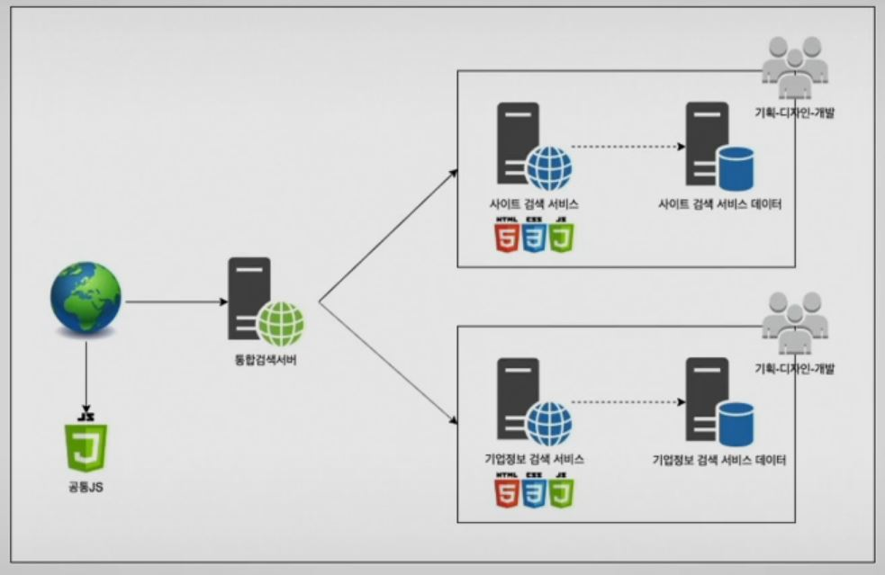
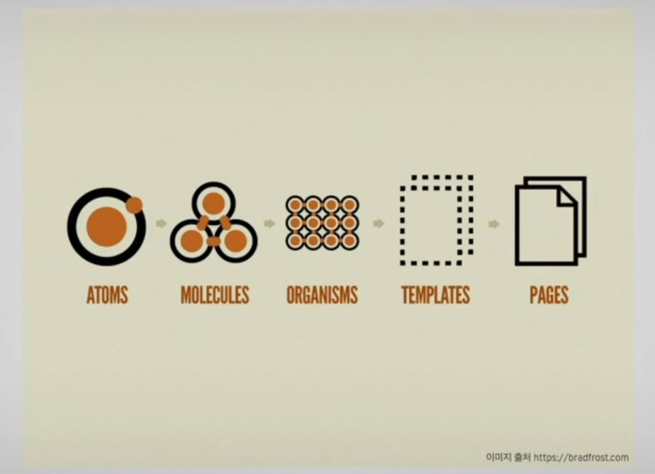

# 디자인 시스템 개발기

> 1. 시스템이 커지면서 생기는 문제점들
> 2. 문제의 원인 찾아보기
> 3. KST프로젝트
> 4. 경험

## 1. 시스템이 커지면서 생기는 문제점들

유지보수에 따른 오류처리부터 다양한 문제점과 관리 노력이 커진다.

간단할 때는 위와같은 상황이 간단하지만 서비스가 점점 커지면서 연결되는 검색서비스도 많아지며 `#` 검색, 카카오톡 자체 검색, 네이트까지 추가 되면서 시스템이 엄청나게 늘어나고 기존 컴포넌트가 다양한 곳에서 이용되고 기존 시스템에 검색을 붙이는 등 다양한 문제가 생긴다.

UI컴포넌트 파편화, 추가 - 변경 - 삭제 그리고 협업이 힘들어진다. 예를 아래처럼 나열해보자

1. 같은 tooltip인데 디자인이 다름
2. 음ㅁ악 서비스 개편중인데 동그라미 썸네일이 문제가 안될 것인가
3. ThumbList 쓰는 곳이 없다면 삭제해도 되나? 사용중인 서비스가 있나?
4. 특정 서비스 UI를 합쳐 프로토타이핑을 하고 싶으면 협업에 대해 문제점이 생긴다
5. 용어에 대한 문제점도 발생 (carousel? swiper? flicker?)

## 2. 문제의 원인을 찾아보자

> 5 WHYS?
>
> 왜 라는 질문을 반복적으로해서 문제의 원인을 찾아가는 방식이다.
>
> 재퍼슨 기념관 건물 부식 사례를 보자. 건물 부식이 심하다 => 건물을 자주 청소한다 => 비둘기 배설물이 많다 => 거미가 많다 => 나방이 많이 모인다 => 조명을 일찍 켜고 있다
>
> 오! 그러면 조명을 늦게 키자!

UI 추가 변경 삭제가 힘들다! => 어느 서비스에서 사용중인지 알 수 없다 => 서비스별로 기획-개발이 가이드와 다르게 진행된다. => 컴포넌트 공통 가이드가 관리되지 않고 있다 => 관리 시스템이 없다 => 컴포넌트를 관리 & 재활용을 활용하자!

## 3. KST

KAKAO SEARCH TEMPLATE, (템플릿 가이드, 로깅&검색, 프로토타이핑 빌더, 마크업 산출물)

UI/UX 최신화 + 구조화

Brick, Block, Carrier로 컴포넌트들을 나누어서 생각을 했다.

### 템플릿 가이드

스토리북이라는 오픈소스로 제공중

### 로깅 & 검색

다양한 조건으로 검색해서 로그를 볼 수 있다

### 프로토타이핑 빌더

컴포넌트들을 직접 넣고 어떻게 돌아가는지 확인이 가능

### 마크업 프리뷰

ux루트라던가 페이지 공유를 통해 의견을 듣는 것도 가능

기술 스택

- FE
  - react, mobx
  - materialui, styled component
  - react beautiful dnd
  - story book
- 서비스
  - nginx
  - puppeteer
- api서버
  - node express, pm2
  - TypeScript
  - Passport.js
  - mysql
- 로깅
  - 사내 시스템
  - elk

시스템 구축을 통해 위에 나왔던 문제들을 금방 해결할 수가 있었다

## 4. 경험

### MOBX

- 간단하고 사용해본 적이 없어서 실험적으로 도입하고 싶었다.

### PUPPETEER

- NO USABLE SANDBOX
  - PUPPETEER에서 신뢰할 수 있으면 샌드박스 옵션을 끄고 써라
    - PUPPETEER에서 권하지 않음
  - OS에서 커널값 수정
    - 이게 권장되었다고 한다
  - npm 모듈을 다운받아서 나온 샌드박스를 직접 수정함
    - 위 두가지 다 끌리지 않아 이 방법을 선택

## STORYBOOK - COMPONENT

- 리엑트로 옮기는 와중 다양한 이슈가 발생