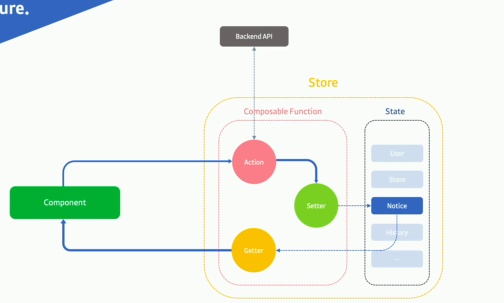
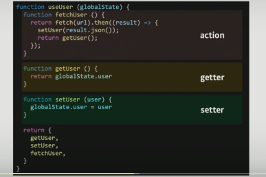
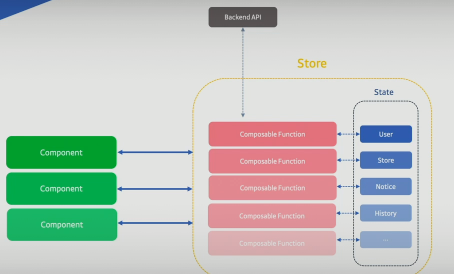
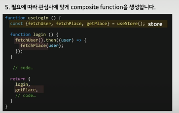

# 야생의 전역상태 길들이기

vue는 vuex, react는 redux나 mobx 등 다양한 상태 유지를 위한 프레임워크가 있다.

이 칼럼에서 react hook을 통한 상태관리를 하려고 했다. 하지만 다양한 이유와 redux에 대한 이해가 떨어져 실패를 했다. 특별한 기준이 없이 짠 코드는 스파게티를 양산해 서비스 개발에 어려움이 난리가 났다. 그리고 실패로 깨달은 것들은 아래와 같다고 한다

- 일정한 패턴은 상태를 보다 쉽게 예측 가능하게 한다
- 개별 상태는 격리되어 관리되어야 한다.
- 사용 방법은 간단해야 한다

## 전역상태 관리 패턴

위와 같은 상황때문에 이것에 대해 고민하게 되었다. 그리고 아래와 같은 상황을 생각해보았다



아래와 같은 순서로 생각해보자

1. 먼저 전역 상태로 사용할 State 변수를 만들어 준다

   ```javascript
   const state = {
       user: {},
   }
   ```

2. 특정 상태를 제어하는 composable function을 생성합니다.

   

3. composable function을 wrapping할 store모듈을 만들어준다

   ```javascript
   const state = {
       user: {},
   }
   
   function useStore() {
       return {
           ...useUser(state)
       }
   }
   ```

두번째 고려 대상은 상태별 격리이다.



그렇다면 위 상태를 많은 상태로 묶는다면 아래와 같아질 것이다

```javascript
const state = {
    user: {},
    place: {},
    history: {},
    notice: {},
}

function useStore() {
    // code...
    
    return {
        ...useUser(state),
        ...useNotice(state),
        ...usePlace(state),
        ...useHistory(state)
    }
} 
```

마지막 고려는 확장방안이다. 여러 상태를 동시에 변경할 경우도 생길 것이다. 관심사에 맞게 설정해준다고 생각하자.



그리고 이 상태들을 페이지와 연결하면 적당하게 연결될 것이다. 즉, 페이지의 상태를 관리할 수 있다면 그 이후에 따른 페이지 이동을 조절할 수가 있다! 라우터가드로 막을 생각을 한다면 이게 얼마나 획기적일지 이해가 될 수 있다.

