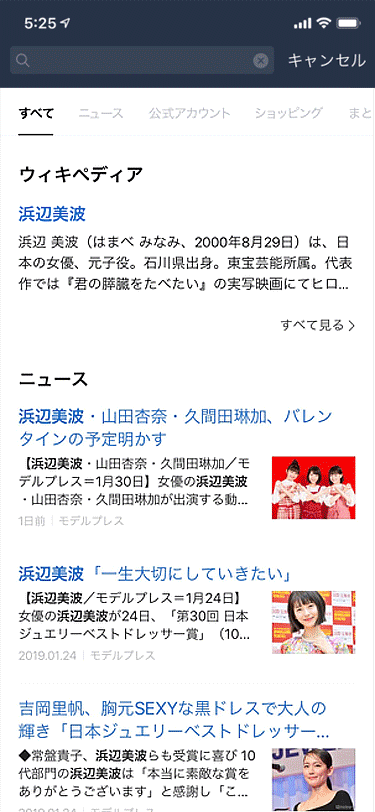

# LINE Search UI 개선기

[해당 칼럼 링크](https://engineering.linecorp.com/ko/blog/improve-line-search-ui/)

해당 칼럼에서의 시작 배경은 `이미지 뷰어를 실행하 ㄹ때 화면 상단에 위치한 검색 바(bar)를 가리는 기능이 추가` 되었을 때라고 한다. 해당 팀의 문제는 이미지를 클릭시 검색바가 먼저 사라진다는 것이었다. 순서가 아래와 같은 상황이었던 것이다

1. 콘텐츠 영역을 가립니다
2. 검색 바를 없앱니다
3. 웹 뷰 영역 크기 변경이 완료되길 기다립니다.
4. 이미지 뷰어를 실행합니다.



해당 팀과 QA 팀에서는 이 상황을 좋지 않게 생각했다고 한다. 부드러운 전환을 위해 해당팀은 Vue.js의 [transition](https://vuejs.org/v2/guide/transitions.html)기능을 이용해보기로 했다고 한다.

```vue
<transition name="layer" @after-enter="afterEnter">
	<v-image-viewer />
</transition>

<script type="text/javascript">
export default {
    methods: {
        afterEnter() {
            // call api: close search bar
        }
    }
}
</script>

<style>
.layer-enter-active, .layer-leave-active {
    transition: all ease 0.2s;
}

.layer-enter, .layer-leave-to {
    opacity: 0;
}

.layer-leave-to {
    transition: all linear 0.1s;
}
</style>
```

이 글을 읽다 놀라운 점이 여기였다. QA중에 코드를 추가하지 말아라. 어찌보면 당연한 것인데 현업에서는 이러한 것을 제대로 지키고 있다는 것이다. 그리고 QA쪽의 요청과 팀이 수정할 여지가 있다면 QA중 코드 수정이 가능한 모양이다.

그리고 문제점이 발견되었다고 한다 문제점들은 아래와 같았다고 한다

- 이미지 뷰어를 종료할 때 애니메이션이 정상 동작하지 않는다
  - DOM 객체가 너무 많은 경우에 애니메이션 동작이 제대로 작동하지 않는 상황을 발견
  - DOM객체를 최소화하고 간소화하여 해결
- 이미지 뷰어를 실행할 때 화면 하단에 콘텐츠 영역이 잠시 보인 뒤 사라진다
  - 샘플 코드의 조건은 아래와 같다고 한다
    - 버튼을 눌러 검색 바를 가리거나 다시 나타나게 조작할 수 있어야 합니다.
    - 첫 번째 DOM 객체는 z-index값이 없어야 합니다.
    - 두 번째 DOM 객체는 `position: fixed` 값과 `z-index` 값을 갖고 첫 번쨰 DOM 객체 안에 존재해야 함
  - 위 조건을 가지고 문제를 파악하니 아래와 같은 문제가 파악 되었다고 한다
    - 검색 바가 사라지며 웹 뷰의 크기를 변경합니다.
    - window => resize 이벤트 발생
      - 이때 이미 렌더링된 첫 번째 DOM 객체는 repaint이벤트 이전에도 하단이 노출
    - 두 번째 DOM 객체에 적용된 `height: 100%`가 두 번째 DOM 객체의 크기를 변경하여 repaint 발생
  - `min-height` 속성을 이용해 해결

