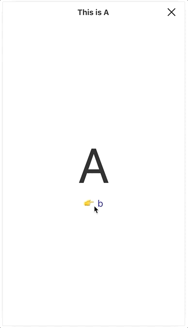

# 개선된 페이지 스택으로 LINE 증권의 웹 페이지 전환 처리하기

[해당 칼럼 링크](https://engineering.linecorp.com/ko/blog/line-securities-frontend-2/)

이 글에서 가장 놀라운 점은 최적화와 UX의 중심에서 페이지를 스택으로 저장하는 기법을 쓰는 것이다. 개인적으로 이 경우에는 페이지에 대한 축적이 너무 많아져서 최적화가 많이 떨어지지 않을까 했다. 그런 상황도 일어날 수 있다고 충분히 설명하며 그 상황을 피하기 위해 어떤 기법을 이용하는지 설명을 잘해주는 좋은 글이라고 생각한다

## 개선된 점

- 헤더 parallax 전환

  페이지 스택은 페이지 전환을 해도 DOM을 삭제하지 않고 순서대로 쌓아 놓는 구조이다. 즉, 삭제하지 않기 때문에 이전 페이지로 돌아갈 때 순식간에 넘어가므로 새로고침 마냥 깜빡거리는 문제가 없어진다.

  

- 스와이프 제스처 개선

  페이지 스택은 처음부터 스와이프 제스처를 지원. 구현은 간단하니 스스로 구현해보자

- componentCanSwipe

  한가지 문제에 직면한다. 모든 페이지에서 스와이프를 사용하는 것은 아니다. 오히려 사용하지 말아야하는 페이지들도 많이 생기게 되었다. 그래서 이 칼럼에서는 해당 페이지가 스와이프를 써도 되는 지 안되는지에 관한 트리거 함수를 제작했다.

- componentWillExit

  위 함수로 스와이프 제스처 block은 가능하다. 하지만 화면 이탈 확인 다이얼로그가 없다. 해당 문제는 SPA냐 아니냐에 따라 나뉜다

  - SPA

    간단하게 `onveforeunload`를 사용하면 대응이 가능하다

  - Non SPA

    복잡해진다. window.confirm과 같은 것밖에 지원하지 않는다. 해당 칼럼은 깔끔한 UI를 포기할 수 없었고 다른 방법을 찾기 시작했고 페이지 스택은 유일하게 히스토리 변화를 관찰하는 컴포넌트이다. 그래서 자체적으로 확인 UI를 내보내는 방식을 취했다

    ```javascript
    // PageStack
    async componentDidUpdate(prevProps: Props) {
        if (this.props === prevProps) return
        
        // POP의 경우
        if (this.props.history.action === 'POP') {
            const lastPoppedLocation = {
            	...prevProps.location
            }
            
            // 가장 상위 페이지의 exit 허용 여부
            if (await topComponent.componentnWillExit()) {
                // 허용하는 경우에는 아무것도 하지 않고 그대로 둬도 됨
            } else {
                // 혹시 허용하지 않는 경우에는 전에 pop된 히스토리를 재구축할 필요가 있음
                // history.push는 호출됨
                // history.push 일련의 동작을 중단하기 위해 이 플래그를 설치함
                this.isPreventingGoBack = true
                prevProps.history.push(lastPoppedLocation)
                return
            }
            
            this.popStack()
        } else {
            // 혹시 이 플래그가 설치된 경우에는
            // 페이지 스택이 넣은 히스토리이므로 무시함
            if (this.isPreventingGoBack) {
                this.isPreventingGoBack = false
                return
            }
            this.pushStack(...)
        }
    }
    ```

    비동기로 동작하므로 어떤 UI에서도 내보낼 수 있습니다.

## 의문점

- 페이지 스택이 방대해지나?

  방대해질 수 있다! maxDepth와 componentShouldSleep혹은 componentShouldAwake 사이의 훅 처리를 지원해주면 된다

- 네이티브 스와이프 제스처와 충돌

  실제로 충돌한다. css코드를 통해 비활성화 하는 것이 가장 괜찮은 해결법인듯하다

- 브라우저에서는 의미가 있는가?

  큰 변화가 없어보이지만 장점은 분명히 존재한다

  - 뒤로 가기가 순식간에 실행된다.
  - 깜빡임이 없다
  - 네이티브 앱과 개념이 유사하다


