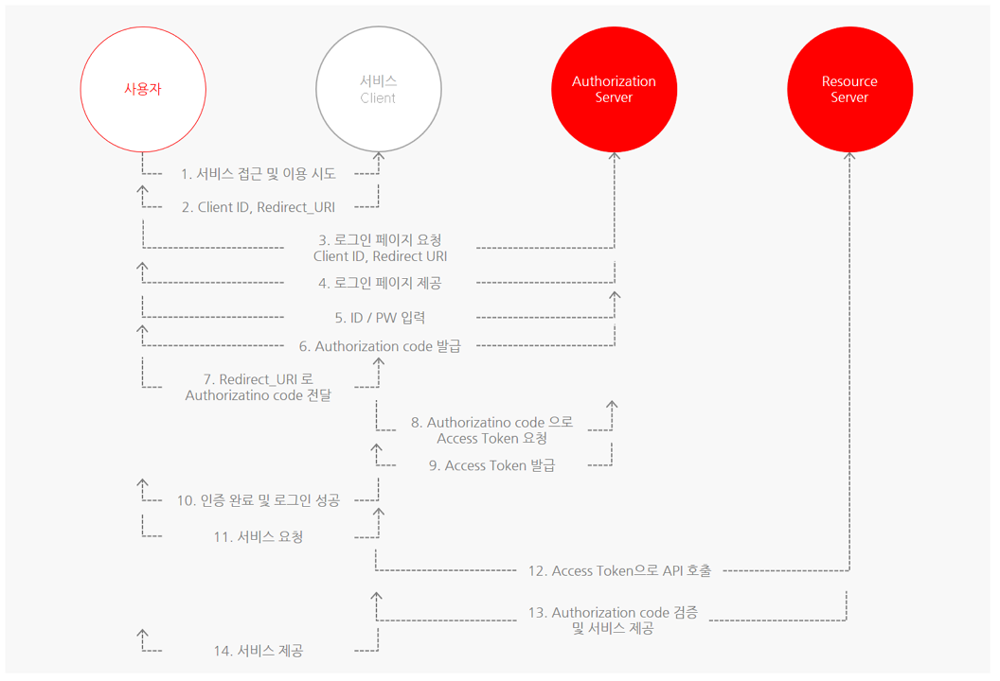
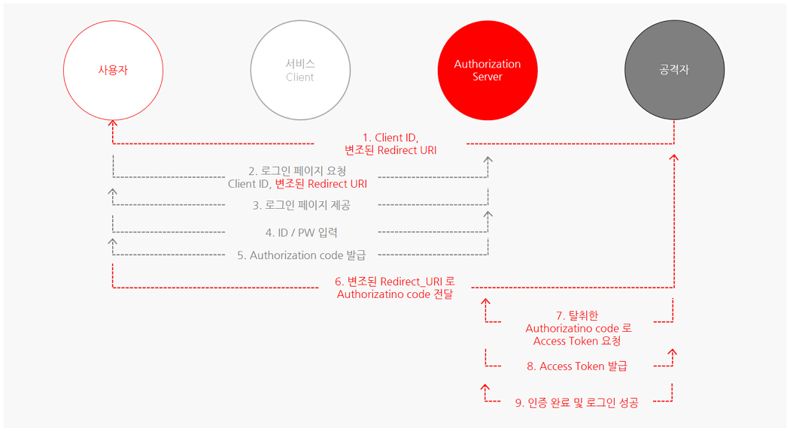
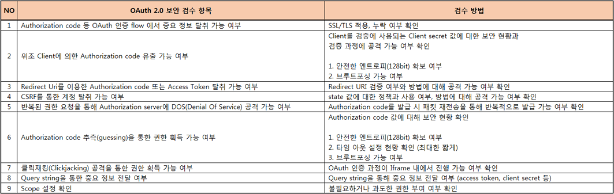

# OAuth 2.0 대표 취약점과 보안 고려 사항 알아보기

> 1. OAuth 2.0이란?
> 2. 대표 보안 취약점 - CSRF, Covert Redirect
> 3. 보안 검수 항목
> 4. 마무리

[글 링크](https://meetup.toast.com/posts/105)

## 1. OAuth 2.0이란?

시작전 용어를 정리하고 가자

- 사용자: Resource Owner ex) 일반 사용자
- 클라이언트: Client ex) 구글, 페이스북 아이디로 로그인이 가능한 서비스. 제 3의 서비스
- API 서버: Resource Server ex) 이름, 나이 등 아이디 관련 정보를 제공하는 서버. 구글, 페이스북 등
- 권한 부여 서버: Authorization Server ex) 로그인을 통해 인증 후 권한을 부여하는 서버. 구글, 페이스북 등
- 인증 서버: Authentication Server ex) 실제로 로그인 서비스를 제공하는 서버. 구글, 페이스북 등

`Authorization Code Grant 방식`은 OAuth 2.0의 네가지 인증 방식 중 비교적 안전한 방식이다. 흐름은 아래 그림과 같다

## 2. 대표 보안 취약점 - CSRF, Cover Redirect

1. CSRF 공격을 통한 계정 탈취

   서비스의 계정 연동은 아래와 같은 경우가 많다

   1. 기존 계정과 SNS 계정 연동 요청
   2. 요청 SNS 로그인 페이지 출력 (Client ID 값이 포함된 로그인 페이지)
   3. ID/PW를 통해 SNS 계정에 로그인
   4. 로그인 성공 시 인증 서버로부터 Authorization code를 발급 받음 (Authentication Server => 사용자)
   5. 발급 받은 code 값과 state 값을 client 서버로 전송 (사용자 => Client Server)
   6. code 값과 state 값 검증 후 Client 서버에 로그인 되어있는 계정과 SNS 계정이 연동됨\

   여기서 state 값은 CSRF token 역할을 한다. 만약 state값에 대해 검증이 누락되어 있거나 미흡할 경우 계정 탈취가 가능하다! 5번 과정에서 csfr공격 페이지에 사용자가 접근하면, 사용자 계정과 공격자 계정이 연동 => 공격자의 sns 계정을 통해 사용자 로그인이 된다

2. Covert Redirect

   OAuth 2.0 인증 flow 중 `redirect_uri`파라미터 값에 대해 검증이 누락되거나 미흡할 경우 발생하는 취약점

   아래 그림과 같은 공격이 일어날 수 있다.

   

   Full Path 검증을 진행하면 대응할 수가 있다.

## 3. 보안 검수 항목

## 4. 마무리

생각보다 보안상의 문제로 신경써야할 점은 많지가 않다. 하지만 구현이 매우 복잡하다. 구현을 제대로 하고 위 문제를 보안한다면 안정성을 제시할 수가 있다. 아래 도표와 같은 방식이 보통 이용된다

.png)