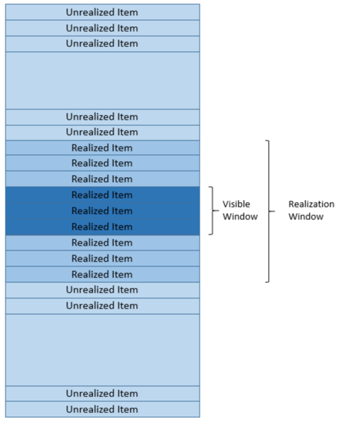

# 웹 최적화 방식 모음 Layout 및 렌더링

> 0. 전반적 원칙과 원리
> 1. 다운로드
> 2. 파싱 및 렌더링 트리
> 3. Layout 및 렌더링
> 4. UX 트릭
> 5. 로드 후

Layout 발생 빈도 최소화 및 비용 최소화와 cpu 처리 효율화, UX트릭으로 나뉜다.

## 1. 발생 빈도 최소화

1. CSS 속성

   리플로우에 영향을 미치는 유명한 css 요소들을 뽑아보자면

   - 창 크기 조정
   - 폰트 변경
   - css 추가와 삭제
   - input에 입력시 내용 변경
   - css 가상 클래스 활성화
   - 클래스 속성, 스타일 속성과 dom조작
   - offsetWidth, offsetHeight 계산

   재 계산을 유발하는 속성은 아래와 같다. 즉, 아래 속성들은 불필요하게 수정하지는 말자

   - border-radius
   - box-shadow
   - opacity
   - transform
   - filter
   - position: fixed

2. DOM 액세스 최소화

   자바스크립트로 DOM요소에 액세스하는 속도가 느리다. 아래와 같은 영향을 고려하자

   - 부모 - 자식 관계: 부모 엘리멈ㄴ트가 가변적인 크기를 가질 때 자식의 크기를 수정하면 부모에게도 영향
   - 같은 위치: 여러 앨리먼트가 인라인일때 첫 번째 앨리먼트의 크기 수정으로 나머지도 영향을 받음
   - 숨겨진 앨리먼트: 숨겨진 스타일(display:none)이면 돔 조작이나 스타일 변경시에도 레이아웃, 리페인트가 생기지 않는다. visibility: hidden일 경우 리페인트는 일어나지 않짐만 레이아웃은 계산

   어떤 방법으로 해결을 해볼까?

   - DOM 연산 결과 캐싱

     스타일 적용시에는 그때그때 그 DOM요소를 가져오지 말고 미리 만들어둔 요소로 활용하자

     근데 JS에서 스타일 수정을 하는 것은 사실 좋지는 않다

   - 개별노드 변경보다 배칭 작업

     반복 변경보단 Batching을 하는 것이 좋다

     - CSS 활용

       클래스를 붙여주는 형태의 작업을 이용해 맞추기

     - DocumentFragment활용

     - DOM노드 변경은 오프라인으로

       - 돔 조작을 줄이는 것이 가장 좋다 그러니 생각해볼 만한 사항은 아래와 같다
         - DOM에서 때어냄
         - 연산
         - 다시 붙임ㅁ

     - 강제 동기 레이아웃 및 스래싱 피하기

     - 변수로 선언

       - offsetWidth같은 것은 호출시마다 성능을 줄이는 범인이다. 이런 것들은 한번 호출할때 변수로 지정해두자

     - innerHTML

       - 이것은 좋은 성능을 보여주지 않는다 줄일 수 있도록 하자

     - 라이브러리 활용

       [다양한 라이브러리와 프레임워크](https://medium.com/dailyjs/a-realworld-comparison-of-front-end-frameworks-2020-4e50655fe4c1)들이 존재한다.

3. 이벤트 핸들러를 잘 개발하기 with API

   이벤트 위임을 사용하는 것은 언제나 메모리적이나 다양한 방면에서 이득을 볼 수가 있다.

   onload와 domcontentload와 다름을 인지하고 쓸 수 있도록 하자

   requestAnimationFrame(), requestIdleCallback() 으로 작은 작업 조각으로 나눌 수가 있기도 하다

   [pointer](https://developers.google.com/web/fundamentals/design-and-ux/input/touch?hl=ko)에 관해서도 다양한 이벤트가 있으니 잘 확인해보자.

4. 로드 후 구성요소

    JavaScript는 onload 이벤트 전후에 분할하기에 이상적인 후보이다. 즉, 드래그 앤 드롭 및 애니메이션 수행하는 코드 및 라이브러리는 초기 렌더링 후 페이지 드래깅 요소가 오기 때문에 대기가 가능하다!

5. Flexbox, Grid 활용

   최신ㅇ늬 CSS 방식이다. 레거시한 방법은 많은 DOM, 마진, 패딩을 요구한다

6. [Contain속성](https://developer.mozilla.org/en-US/docs/Web/CSS/contain)

   웹페이지에서 선택된 하위 트리를 문서의 나머지 영역과 분리하는 기능을 가진 속성이다.

   분리하면 당연하지만 성능이 향상된다

   공부해볼 수 있도록 하자

7. 대형/연속적 리스트 최적화

   리사이클 뷰를 활용하는 방식이다. 그림으로 보는게 더 이해가 될 것이다.

   

   아이템을 매번 재생성하는 것이 아니라 메모리에 올려두고 보여줄 부분과 구현해둘 부분을 나눠서 유저에게 보여주는 것이다

8. react 최적화

   리액트 최적화 방법에 다룰려고 한다.

   일단 리액트를 알고 하는 것이 좋아 추후에 수정하고 몇 참고 자료만 남겨두도록 한다

   [리액트 훅](https://medium.com/vingle-tech-blog/react-hook-ec3f25c2d8fa)  [리액트 퍼포먼스](https://medium.com/myheritage-engineering/how-to-greatly-improve-your-react-app-performance-e70f7cbbb5f6)

## 2. 처리 효율화

1. 워커나 워클릿 활용하기

   웹워커는 무거운 연산들을 메인 쓰레드와 분리시켜 백그라운드에서 처리할 수 있도록 도와준다. 일종의 멀티쓰레딩 프로그래밍을 생각하면 된다. [웹워커 정리](https://pks2974.medium.com/web-worker-%EA%B0%84%EB%8B%A8-%EC%A0%95%EB%A6%AC%ED%95%98%EA%B8%B0-4ec90055aa4d)

   - 전용 워커: 처음 생성한 스크립트에서만 사용 가능, 보통 웹워커라 함은 전용 원커를 뜻함
   - 공유 워커: 워커간 데이터를 공유하는 목적, 동일한 도메인 내의 여러 스크립트나 컨텍스트에서 접근 가능
   - 서비스 워커: 프록시의 역할을 하며, 네트워크 요청과 캐싱, 푸시알람,ㅁ 백그라운드 동기화등에 사용
   - 크롬 워커: 파이어폭스 독점 API로 확장기능에서 사용

   워커는 초기 비용이 큰 문제가 있어서 그 단점을 해결하기 위한 [worklets](https://developer.mozilla.org/en-US/docs/Web/API/Worklet)가 존재한다

   웹워커와 워클릿을 이용하기 쉽게 만든 라이브러리도 많다

   - [Comlink](https://github.com/GoogleChromeLabs/comlink): 구글이 만든 것으로 잘 추상화 시켜놨다. [[comlink-loader](https://github.com/GoogleChromeLabs/comlink-loader)]
   - [Greenlet](https://github.com/developit/greenlet): async 함수를 웹워커로 처리
   - [Workerize](https://github.com/developit/workerize): 모듈을 웹워커로 처리
   - [Workly](https://github.com/pshihn/workly): 역시 함수나 클래스를 워커로 처리도록 만든 것
   - [Operative](https://github.com/padolsey/operative): 콜백 형식으로 처리하도록 만듦
   - [extra css](https://extra-css.netlify.com/): 웹사이트 꾸미기에 좋은 Paint API 라이러리

2. 그래픽 최적화

   그래픽 최적화의 핵심은 GPU를 어떻게 써먹는가이다!! [하드웨어 가속](https://d2.naver.com/helloworld/2061385), [애니메이션 퍼포먼스](https://developer.mozilla.org/en-US/docs/Web/Performance/Animation_performance_and_frame_rate)

   가속 대상 부터 알아보자

   - CSS 3D Transform이나 perspective 속성
   - `<video>` `<canvas>` 요소
   - css3 애니메이션 함수, 필터 함수
   - 자식 요소가 레이어로 구성
   - z-index값이 낮은 형제 요소가 레이어로 구성된 경우

   하지만 역시 조심해야 하는 상황도 많다. 메모리, 깜박임, 글씨 렌더링이다.

   가속 대상을 이용하여 gpu자원을 이용해 빠르게 최적화 하는 방식을 많이 이용해보자

3. [웹 어셈블리](https://developer.mozilla.org/ko/docs/WebAssembly)

   웹 어셈블리는 네이티브에 가까운 성능으로 동작하는 바이너리 포맷을 제공하는 프로젝트이다. 성능이 되게 좋다 이유는 아래와 같다

   - 코드의 크기가 작음
   - 디코딩 시간이 자바스크립트 파싱 시간보다 적음
   - 이미 컴파일되어 있는 상태라 최적화가 잘되어 있다
   - 타입이나 기타 정보가 있어 최적화에 유리
   - ㅁ명령어셋을 사용할 수 있음
   - 직접 메모리를 관리해 GC가 필요 없음

4. 전용 페이지

   컨텐츠를 전용 페이지로 만들어 제공하면 빠르고 로드 할 수 있다.

5. 자바 스크립트 코딩 스타일

   코딩 스타일 변경으로 성능 향상을 노릴 수도 있다. 

   스코프 체인, 객체 초기화와 인라인 캐싱 등 자바스크립트 코어에 대한 이해도를 높여둔 상태여야한다.

   

