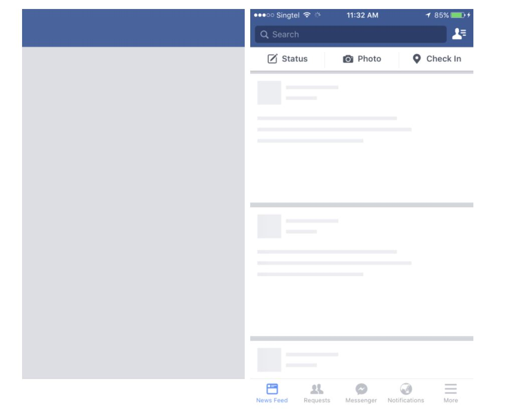

# 웹 최적화 방식 모음 UX 트릭

> 0. 전반적 원칙과 원리
> 1. 다운로드
> 2. 파싱 및 렌더링 트리
> 3. Layout 및 렌더링
> 4. UX 트릭
> 5. 로드 후

객관적인 성능을 올리는 것은 아니고 사용자가 빠르다고 느낄 수 있게 만드는 트릭들이다.

1. 웹폰트 로드

   저번에도 한번 살펴본 방식이다. FOUT방식을 통해 글자를 미리 랜더링 해두고 웹 폰트가 오면 해당 폰트를 적용시키는 방식이다.

   - font-display속성

     요즘 브라우저들은 해당 속성이 있어서 FOUT처럼 이용이 가능하다. 해당 속성에 대한 값은 아래와 같다

     - auto: block과 비슷
     - block: FOIT처럼 작동, 로딩되지 않을 때는 텍스트를 렌더링하지 않으며(최대 3초) 웹폰트가 로딩되면 적용
     - swap: FOUT처럼 작동, 우선 Fallback으로 렌더링하고 웹폰트가 로딩되면 적용
     - fallback: 100ms 동안 렌더링하지 않다가 Fallback으로 렌더링, 3초안에 로딩이 완료되면 완료된 폰트로 아니라면 Fallback 폰트 유지
     - optional: 100ms 동안 렌더링 하지 않다가 Fallback으로 렌더링, 브라우저가 네트워크 상태를 파악해 웹폰트로 전환여부를 결정

   - 자바스크립트 라이브러리

     폰트를 위한 라이브러리 역시 존재한다. 그리고 FOUT방식을 도와주는 라이브러리도 많다. [Font Face Observer](https://github.com/bramstein/fontfaceobserver) [Web Font Loader](https://github.com/typekit/webfontloader)

   - Font Loading API

     아예 API마저 생겼다

   하지만 FOUT이라고 부작용이 없는 것은 아니다.

   - 레이아웃 변경

     폰트 적용 전 후가 레이아웃이 달라지는 경우이다.

     - 비슷하게 만들기

       [Font Style matcher](https://sangziii.github.io/fontStyleMatcher/) 를 사용해 비슷하게 보이게 ㅁ맞춰보자

     - 깜빡임

       로딩 속도에 의해서 깜빡임이 나타날 수도 있다. 로드를 최적화 시킬 수 있도록 하자

2. 스켈레톤 스크린

   컨텐츠가 로딩 될 때 스켈레톤 ui를 보여주는 것이다. 아예 빈 페이지보다 이게 더 유저 입장에서 빠르다고 느껴지기 때문이다. 아래 그림에서도 왼쪽보단 오른쪽이 더 빠르다고 느껴지기 마련이다.

   

   이를 위한 css 가이드도 있고 라이브러리도 있고 리액트용 라이브러리도 존재한다.

   - [Building Skeleton Screens with CSS Custom Properties](https://css-tricks.com/building-skeleton-screens-css-custom-properties/)
   - [Creating a Loading Placeholder with Sass](https://leerob.io/blog/loading-placeholder-with-sass)
   - [Design and code responsive Skeleton Screens](https://marinaaisa.com/blog/design-and-code-skeletons-screens/)

   CSS로 만들 때 참고할만한 라이브러리, 생성기

   - [Placeholder loading](https://github.com/zalog/placeholder-loading)
   - [CSS Skeleton Screen Generator](http://www.andy-howard.com/css-skeleton-screen-generator/)
   - [심플한 예제](https://codepen.io/oslego/pen/XdvWmd)([설명](https://wit.nts-corp.com/2018/11/19/5371))

   리엑트 용 라이브러리들

   - [React Content Loader](https://github.com/danilowoz/react-content-loader)
   - [React Placeholder](https://github.com/buildo/react-placeholder)
   - [React Loding Skeleton](https://github.com/dvtng/react-loading-skeleton)

3. 이미지 자리 표시자

   Lazy Load시 생기는 빈공간에 쓸 방법이 몇가지가 있다.

   - 빈공간: 자리를 채우지 않고, 그대로 둠

   - 자리 표시자: 빈자리를 채울 때 사용할 만한 아이콘

     이미지 요청을 실패했거나, 기본 아이콘으로도 사용할 수 있어 데이터가 더 필요하지 않으면서 UX향상가능

   - 색 채우기: 이미지를 대표하는 색을 이용해 채우기

     전환이 부드럽고, 직관적이며 작기 때문에 비용도 크지 않다는 장점 [참고 깃](https://github.com/fraser-hemp/gradify)

   - 가벼운 이미지: 가볍게 만들어진 이미지로 채우기

     추정할 수 있는 이미지를 까는 방식이다. [참고 깃](https://github.com/zouhir/lqip) [다른 참고 깃](https://github.com/axe312ger/sqip)

   비디오의 경우는? [poster 속성](https://developer.mozilla.org/ko/docs/Web/HTML/Element/Video#attr-poster)을 사용해 재생 전까지 이미지를 보여줄 수가 있다

4. 로딩 인디케이터와 인터렉션

   로딩바를 만들어서 애니메이션을 보여주는 것이다. 이것은 4초 이상일 경우에만 쓸 수 있도록 하자.

   로딩 인디케이터가 존재함으로 느리다고 생각할 수 있지만 사용자에게 정보를 제공하여 왜 느린지 설명이 가능하며 유저에게 다른 경험을 선사하여 인식을 분산시킬 수가 있다..

   - 왜 로딩 인디케이터가 표시되고 있는지
   - 오래 걸린다면 얼마나 걸리는지
     - 인식되는 값을 대기 시간과 일치 시켜야 함
   - 어떤 작업을 하고 있는지

   재미있거나 창의적인 인디케이터를 보여주자

   - 눈에 띄는 색상 조합
   - 흥미롭거나 귀여운 아이디어
   - 브랜드 이미지 부여
   - 각종 팁이나 정보 보여주기

   [다음 웹툰의 ux 개편](https://brunch.co.kr/@kakao-it/279) 이 글을 읽어볼 수 있도록 하자

5. 낙관적 UI

   작동하는 척 하는 일종의 사기 라고 생각하자. 프로세스를 이해해보자

   1. 이벤트 발생
   2. 성공한 것처럼 상태 업데이트
   3. 요청 시작
   4. 오류가 생겼는지 파악
      1. 오류가 없다면 그대로 업데이트
      2. 오류가 생겼다면 롤백

   스켈레톤 스크린도 이에 해당한다. 카톡을 생각해보자 카톡은 보내고 로딩바가 화면에 뜨는 상황이 아니라 일단 채팅화면에 올라가는 것을 볼 수가 있다. 그리고 에러가 나면 그에따른 반응이 온다.

   이런식으로 미리 그 상태에 대해 업데이트 => 로딩중이라는 효과를 살짝 보여주는 편이 요즘 방식이다

6. 피츠의 법칙과 UI/UX 개선

   목표지점으로 빠르게 이동하는데 시간이 거리와 목표 폭 사이의 비율에 관한 법칙이다.

   이 부분에 대해선 내가 뭐라 정리를 해야할 지 모르겠다. 관련글과 해당글을 계속 와서 종종 읽어주는게 가장 도움이 될 거 같다.

7. 기타 응답성 개선

   다양한 응답성을 개선해야할 것들이 많다

   - 터치 응답성

     우선 중복된 부분으로는 이벤트와 API에서 다루었던 버튼에 터치 상태를 추가하여 지연속도를 없애버리는 것

   - 스크롤링 응답성

     입력을 받는 쓰레드를 따로 분리해 컴포지터 쓰레드로 전달이 되도록 하여 병목이 일어나더라도 비동기적으로 스크롤 하게 하는 방식

   - css 우선 가져오기

   - 이벤트 위임

     동적으로 추가되지 않아 메모리도 이득을 보며 점진적으로 로딩이 되더라도 각 이벤트가 이미 붙어있게 할 수 있다

