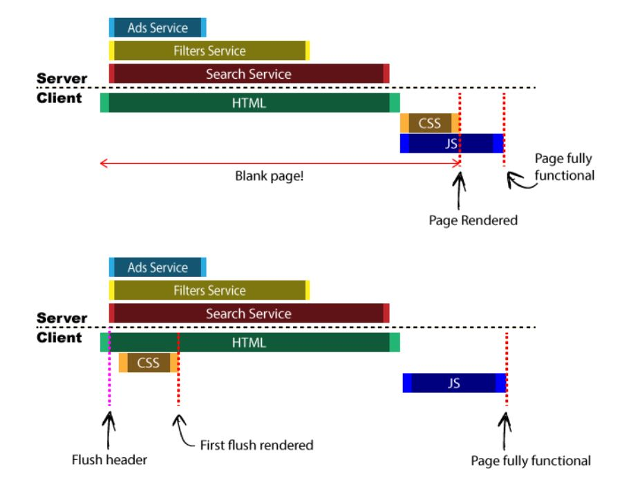

# 웹 최적화 방식 모음 파싱 및 렌더링 트리

> 0. 전반적 원칙과 원리
> 1. 다운로드
> 2. 파싱 및 렌더링 트리
> 3. Layout 및 렌더링
> 4. UX 트릭
> 5. 로드 후

[글 링크](https://black7375.tistory.com/74)

## 1. 배치 순서

1. CSS를 상단에 배치

   CSSOM트리는 CSS를 모두 해석해야 구성되고, 구성되지 않으면 렌더링이 차단된다. 반면 DOM트리는 순차적으로 구성될 수 있어 점진적 렌더링이 가능하다.

   즉, CSS를 HEAD부분에 넣으면 이러한 특성때문에 점진적으로 렌더링 시킬 수 있다는 장점이 있다.

2. script를 하단에 배치

   어떠한 상황이냐에 따라 다르긴 하다. 일반적인 경우는 하단에 배치해주는 것이 좋다

   하지만 일부 기능에 의해 상단에서 불러와야할 경우도 당연히 있을 것이다. 그런 경우에는 `async`나 `defer`을 이용해보자

3. 우선순위에 대한 힌트 제공

   - Preload

     브라우저에게 페이지에서 필요한 자원을 일찍이 fetch하라는 솏성이다.

     현재 페이지에서 빠르게 가져와야 하는 리소스에 사용되는 속성이며 반드시 해야함

   - Prefetch

     미래에 필요할 수 있는 리소스를 가져와야 할 때 사용되는 속성

     다운 받을 여유가 생겼을 때 가장 낮은 우선순위로 리소스를 가져옴

   - DNS-Prefetch

     다른 출처의 DNS 조회를 처리해 놓는다.

   - Preconnect

     DNS조회 뿐ㅁ만 아니라 TCP 핸드 쉐이킹까지 해결한다

4. 스크롤 없이 볼 수 있는 영역 우선

   레이아웃 구성을 나누어서 먼저 로드하게 하는 것이 좋다

   그리고 주요 컨텐츠를 먼저 로드하게 하고 CSS를 분리 그리고 비동기 로드시키면 적당히 할 수 있을 것이다

5. Lazy Load

   이미지 및 동영상을 지연 로딩 시킬 수가 있다. 아래와 같은 주의 사항이 있다

   - 처음 보이는 화면은 하지 맘ㄹ아라
   - 스크롤을 내려야 이미지 로드를 시작해 느려보일 수도 있음
   - 자리 표시자가 없으면 레이아웃 변경이 생길 수 있음
   - JS로 대형 이미지를 로딩시 잠시 반응하지 않을 수 있음
   - 로드가 실패할 수 있음
   - JS를 사용하지 못할 수도 있음

   [다양한 이미지 로딩 최적화 기법](https://www.smashingmagazine.com/2021/04/humble-img-element-core-web-vitals/)

6. 버퍼를 일찍 비우기 (flush)

   서버가 html페이지를 연결하고 여유가 있을때 나멈지 파일을 보내주는 방식을 이용해보는 것이다.

   

   Marko라는 템플릿 엔진은 여기서 자바스크립트 마저 플러시가 리랜더하는 때에 가져온다

## 2. 제한

1. 유효성

   Validation을 지키지 않으면 파싱시 느려질 수도 있다.

   - 닫힌 태그

     몇 태그는 닫힌태그`</태그>`없이도 잘 렌더링 된다. 하지만 끝나는 위치를 미리 결정할 필요 없기 때문에 상태 파싱이 더 빠르다

   - 크기 지정

     이미지의 width와 height 속성을 생략시 크기를 정확히 모르기 때문에 placeholder를 할당하고, 리플로우시 레이아웃이 업데이트되야 하기 때문에 성능에 영향을 미친다.

   - 빈 문자열 src

     이것은 조금 문제가 있다 `` 이 형태는 추후에 JS에서 쓰겠다는 것은 이해가 된다.

     하지만 여러 문제점이 있다

     1. 특히 하루에 수백만 페이지를 보는 페이지에 대해 대량의 예기치 않은 트래픽
     2. 서버는 절대 보여지지 않을 페이지를 생성하는 사이클을 컴퓨팅 하는 것으로 낭비
     3. 사용자 데이터는 오류가 생길 수 있음
     4. 상대 주소로 생각할시 루트페이지로 갈 가능성이 있음

   [W3C검사기](https://validator.w3.org/unicorn/?ucn_lang=ko)

   [W3C Markup](https://validator.w3.org/)

   [CSS validation](https://validator.w3.org/)

   위 세가지로 검사를 해볼 수도 있다

2. `@import`는 추천하지 않는다

   @import를 사용하면 css를 병렬로 다운 받을 수가 없다. 그러니 `<link>` 태그를 이용해서 css를 가져올 수 있도록 하자

3. 미디어 쿼리 사용

   특정 조건에 필요한 css가 있으면 [미디어 쿼리](https://developer.mozilla.org/en-US/docs/Web/CSS/Media_Queries/Using_media_queries)를 활용하는 것도 좋다.

   - 미디어 유형
     - all: 모든, 기본값
     - print: 인쇄 결과물이나 미리보기시 사용
     - screen: 화면
     - speech: 음성합성장치
   - 주요 미디어 특성
     - width/height: 뷰포트 너비/높이
     - aspect-ratio: 뷰포트 가로세로비
     - orientation: 뷰포트 방향
     - resolution: 출력장치의 해상도
     - scan: 출력 장치의 스캔 방법
     - color: 출력장치의 색상 채널별 비트수, 흑백은 0
     - 고대비, 다크모드 등 선호도를 조절할 수도 있음
   - 논리연산자
     - `,`: 논리합, or
     - and: 논리곱
     - not: 부정, 개별의 쿼리가 아니라 전체에만 적용
     - only: 미디어 쿼리를 미지원하는 낡은 브라우저에 대응하여 특정 스타일 적용

4. 리다이렉션 방지

   재전송(리다이렉션)은 301, 302에서 수행한다. 의외로 좀 자주 일어나는데 제일 기본적으로 trailing slash가 누락된 경우이다. `http://example.com`요청시 `http://example.com/`을 포함한 리디렉션응답을 받기 때문이다. 아래 상황들로 해결을 보자

   - trailing slash 를 잊지 말자
   - 리다이렉션 성능을 개선
   - 반응형 디자인

5. iframe 수를 최소화

   ifram을 사용하면 html문서를 부모 문서에 삽입 할 수 있다. iframe이 효과적으로 사용되도록 작동하는 방식을 이해하는 것이 중요하다.

   단점을 살펴보자

   - 비어있어도 비쌈 [참고자료](https://www.stevesouders.com/blog/2009/06/03/using-iframes-sparingly/)
   - page onload를 차단
   - 대역폭을 메인 페이지와 경쟁
   - Non-semaantic 비 의미론적
   - 기타 보안에 취약

   Ajax를 이용해 데이터를 로드하고 div에 결합하는 방식을 쓰는것이 제일 우선시 될 것이다. [참고 스택오버플로](https://stackoverflow.com/questions/43103646/best-approach-to-replace-iframes)

   object, embed 태그가 있다. 이것들로 대체할 수는 없긴 하지만 고려대상이 될 수는 있다.

   html5의 [audio](https://developer.mozilla.org/en-US/docs/Web/HTML/Element/audio), [video](https://developer.mozilla.org/en-US/docs/Web/HTML/Element/video), [web components](https://developer.mozilla.org/en-US/docs/Web/Web_Components)가 대안이 될 수도 있다.

6. document.write() 쓰지 않기

   이것은 꽤나 느린 로직이다. 왜냐 html파싱을 중단하고, 리소스가 로드되어 실행될때까지 기다려야하기 때문이다.

   defer,async로 이용하면 덜하지만 역시 사용자체를 덜하기를 권하고 굳이 해야겠다면 DOM조작을 통해서 하자

7. textContent 사용

   자바스크립트에서 텍스트를 다룰때는 아래와 같이 세가지가 있다 표를 보고 비교해보자

   | 프로퍼티 | textContent    | innerText                  | innerHTML                 |
   | -------- | -------------- | -------------------------- | ------------------------- |
   | 값       | raw text       | rendered text              | HTML parsed text          |
   | 성능     | 좋음           | 보통                       | 나쁨                      |
   | 보안     | -              | -                          | 취약                      |
   | 과정     | raw한 text삽입 | css를 고려해 리플로우 발생 | html로 분석하는 과정 필요 |

8. css 선택자

   css작성을 효율적으로 하면 스타일 계산을 줄일 수 있다. 특히 스타일 계산시 50%는 선택자를 매칭하는데 사용하기 때문에 크게 줄일 수 있다. 구조적으로 선택할 수 있도록 하자. 약간의 계륵이긴 하지만 선택자별로 성능도 조금씩 다르긴 하다. 아래와 같은 순위로 성능차가 존재한다.

   1. id (#id)
   2. class (.class)
   3. tag (div, h1)
   4. aadjacent sibling (h1 + p)
   5. child (ul > li)
   6. descendent (li a)
   7. universal (*)
   8. attribute (a[rel="external"])
   9. pseudo-class and pseudo element (a:hover, li:first)

## 3. 효율적 활용

1. [Streams](https://developer.mozilla.org/ko/docs/Web/API/Streams_API)

   Streams를 이용하면 성능 향상의 여지가 있다. 리소스를 덩어리로 한번에 받는 것이 아니라 쪼개서 가져오는 방식을 취하는 것이다.

2. iframe 활용

   위에서는 단점이 많다고 했다. 하지만 장점도 많아서 적절하게 이용한다면 역으로 성능향상도 엿볼수 있다

   - badges나 광고와 같이 느린 third-party content를 원활하게 함
   - security sandbox
   - scripts를 병렬로 다운로드 한다

   그러면 적절하게 이용할 수 있는 방안은 무엇이 있을까?

   - Non-Blocking 로드

     ifram의 단점은 전에도 살펴봤다 싶이 여러개가 있다. 그리고 이 방안에서는 두가지 단점에 대해 알아보자

     - onload 이벤트가 발생하기 전에 iframe로드
     - src 속성은 다운로드 받아야 하는 리소스

     따라서 onload전에 ifram이 오는것을 막거나 src속성없이 iframe을 사용한다면 성능상 불이익은 없다!

   - iframe + document.write() 을 이용한 스트리밍

     구 브라우저를 위한 트릭이다. 최신 브라우저에서는 이런거 말고 서비스 워커를 이용하자.

3. 웹 컴포넌트의 최적화 가능성

   웹 컴포넌트의 구성은 아래와 같다

   - Custom elements: HTML 요소 및 해당 동작을 정의 및 확장 [[Custom Elements](https://www.html5rocks.com/ko/tutorials/webcomponents/customelements/)]
   - Shadow DOM: 컴포넌트의 스코프를 분리 [[Shadow DOM 101](https://www.html5rocks.com/ko/tutorials/webcomponents/shadowdom/)]
   - HTML Templete: 렌더링된 페이지에 나타나지 않은 마크업으로, 커스텀 엘리먼트 구조를 기반으로 재사용 가능 [[HTML's New Template Tag](https://www.html5rocks.com/ko/tutorials/webcomponents/template/)]
   - HTML Import: 다른 HTML 파일에서 템플릿을 가져올 수 있음 [[HTML Imports](https://www.html5rocks.com/ko/tutorials/webcomponents/imports/), [Stackoverflow](https://stackoverflow.com/questions/51236699/fast-webpage-loading-using-the-all-new-html-import-draft-in-2018-replacing-re)]
     단, 현재 분위기상 HTML Import는 제외되는 것 같다.

   어디까지 최적화할 수 있을까?

   - custeom elements + HTML Templete: 재사용에 특화가 있기에 최적화 가능성이 있을 듯 하다
   - Shadow DOM: 스코프를 분리하기 때문에 css규칙을 간단하게 만들 수 있다
   - HTML Import: async 속성을 통해 비동기적으로 가져오며 파싱을 차단하지 않을 수가 있다.