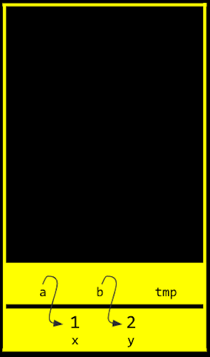

# 메모리

> 1. 메모리 주소
> 2. 포인터
> 3. 문자열
> 4. 문자열 비교
> 5. 문자열 복사
> 6. 메모리 할당과 해제
> 7. 메모리 교환, 스택, 힙
> 8. 파일 쓰기
> 9. 파일 읽기

# 1. 메모리 주소

**16진수**

컴퓨터과학에서는 숫자를 10진수나 2진수 대신 **16** **진수** **(Hexadecimal)**로 표현하는 경우가 많습니다. 컴퓨터에서 데이터를 처리하기 위해 16진수를 사용할 때 장점이 있기 때문입니다. 16진수와 일상생활에서 우리가 사용하는 10진수와 비교하면 그 차이를 알 수 있습니다. 16진수를 사용하면 10진수보다 2진수를 간단하게 나타낼 수 있습니다. 16진수로 값을 표현하는 방법을 이해하고 나면 16진수, 2진수, 10진수를 변환하는 프로그램을 만들어볼 수 있습니다.

**10진수를 16진수로 바꾸어보기**

JPG 이미지 파일은 항상 255 216 255 로 시작되고 이것은 10진수입니다. 하지만 실제 컴퓨터 내에서는 10진수를 사용하지 않습니다. 컴퓨터는 0과 1만을 이해할 수 있기 때문입니다.


- **그림 1**

먼저 255 216 255를 2진수로 나타내보면 <그림 1>과 같습니다. 2진수로 모든 데이터를 표현하기에는 너무 길어지기 때문에 16진수로 바꾸어 보겠습니다. 2^4 이**16**이기 때문에 **4bits**씩 두 덩어리로 나누어 보면 0000 부터 1111까지는 16진수로 표현할 수 있다는 것을 알 수 있습니다.

그렇다면 16진수에서 10부터 15까지는 어떻게 표기할까요? 10은 a, 11은 b, …, 15는 f를 대입하여 사용합니다. 4bits씩 16진수로 변환 후 **0x**를 붙혀 뒤에 오는 문자들이 16진수임을 알려줍니다.

**16진수의 유용성**

ASCII 코드에 의해 “A, B, C”는 10진수로 65, 66, 67에 해당합니다. 컴퓨터는 10진수를 이해할 수 없으므로 2진수로 표현해보면 "01000001 01000010 01000011＂이 됩니다. 컴퓨터가 처리할 수 있어야 하기 때문에 어쩔 수 없지만 그 길이가 너무 긴 것을 알 수 있습니다.

하지만 16진수로 표현하면 2진수로 표현했을 때 보다 훨씬 간단해집니다. 또한 컴퓨터는 8개의 비트가 모인 바이트 단위로 정보를 표현합니다. **2**개의 **16**진수는**1byte**의**2**진수로 변환되기 때문에 정보를 표현하기 매우 유용합니다.


**메모리 주소**

정수형 변수 n에 50이라는 값을 저장하고 출력한다고 생각해 봅시다.

이 n 이라는 값은 **int** 타입이므로, 아래 그림과 같이 우리 컴퓨터의 메모리 어딘가에 **4바이트** 만큼의 자리를 차지하며 저장되어 있을 것입니다. 


C에서는 변수의 **메모리상 주소**를 받기 위해 **‘&’**이라는 연산자를 사용할 수 있습니다.

```c
#include <stdio.h>

int main(void)
{
    int n = 50;
    printf("%p\n", &n);
}
```

예를 들어, 위와 같은 코드를 실행하면 ‘0x7ffe00b3adbc’와 같은 값을 얻을 수 있고, 이는 변수 n의 **16진법**으로 표현된 메모리의 주소입니다. 

반대로 **‘\*’**를 사용하면 그 메모리 주소에 있는 **실제 값**을 얻을 수 있습니다.

```c
#include <stdio.h>

int main(void)
{
    int n = 50;
    printf("%i\n", *&n);
}
```

위 코드는 먼저 **n의 주소**를 얻고, 또 다시 **그 주소에 해당하는 값**을 얻어와 출력한 것이므로 결국 ‘50’이라는 값이 출력되겠죠.

# 2. 포인터

포인터 역할을 하는 변수도 설정이 가능하다

```c
#include <stdio.h>

int main(void)
{
    int n = 50;
    int *p = &n;
}
```

이런식으로 주소가 저장이 가능하다. 여기서 실제로는 **주소값 자체**를 저장하지만 우리는 프로그래밍의 이해와 함께 좀더 유동적으로 잘 굴릴 수 있도록 n이 위치한 곳을 가르키는 화살표라고 생각하는 것이 좋다


즉, 위 그림보다 아래 그림으로 인지해 두는 것이 좋을 것이다


# 3. 문자열

지금까지 `string`자료형을 이용하기 위해 `<cs50.h>`라이브러리를 이용해왔다. 하지만 이제 이것을 조금씩 버릴 수 있도록 해보자 `string s = "EMMA"`를 저장할 경우에 이것은 사실 주소값을 저장하는 것이었다! 즉 `<cs50.h>`내부에서는 대충 `typedef char *string`이런식으로 작동하고 있었을 것이다. 그러면 이제 우리는 string대신 `char`를 이용할 수가 있다.

```c
#include <stdio.h>

int main(void)
{
    char *s = "EMMA";
    printf("%p\n", &s[0]);
	printf("%p\n", &s[1]);
	printf("%p\n", &s[2]);
	printf("%p\n", &s[3]);
}
```

이러면 순서대로 주소값이 나온다!

# 4. 문자열 비교

그렇다면 문자열이 변수에 어떻게 저장되는지 우리는 배웠고 `char *`이랑 cs50의 `string`이 어떻게 작동하는지 알았다 그럼 옛날에 비교할려고 만들었던 아래 코드가 왜 작동을 안하는지 이해하기가 쉬워졌을 것이다

```c
#include <cs50.h>
#include <stdio.h>

int main(void)
{
    // 사용자로부터 s와 t 두 개의 문자열 입력받아 저장
    string s = get_string("s: ");
    string t = get_string("t: ");

    // 두 문자열을 비교 (각 문자들을 비교)
    if (s == t)
    {
        printf("Same\n");
    }
    else
    {
        printf("Different\n");
    }
}
```

여기서 `if (s==t)` 이 구문은 주소값을 보기 때문에 서로 다른 EMMA의 주소값을 보게 된다! 그래서 작동을 안하는 것이다!

# 5. 문자열 복사

그렇다면 문자열을 복사할려면 어떻게 해야할까? 간단한 원리를 생각해보자. 그냥 같은거라고 해주면 안될까? 다음과 같은 코드를 실행 시켜보자

```c
#include <cs50.h>
#include <ctype.h>
#include <stdio.h>

int main(void)
{
    string s = get_string("s: ");
    string t = s;

    t[0] = toupper(t[0]);

    printf("s: %s\n", s);
    printf("t: %s\n", t);
}
```

하지만 이 상황은 자연스럽게 우리가 의도한대로 되지 않는다. s에 `emma`를 입력시 출력되는 값 둘 다 `Emma`이다. 왜 이런 상황이 나타날까? `string`과 `char *`은 주소값, 즉 emma를 가르키는 화살표를 값으로 가진다. 이것은 그대로 t에도 저장이 된 것이고 둘 다 같은 emma를 보게 되는 것이다. 그래서 t만을 조작해도 같은 값을 바라보는 s도 값이 변하게 된다.

그렇다면 복사를 어떻게 해야하지? 메모리를 할당시키자!

```c
#include <cs50.h>
#include <ctype.h>
#include <stdio.h>
#include <string.h>

int main(void)
{
    char *s = get_string("s: ");
    char *t = malloc(strlen(s) + 1);

    for (int i = 0, n = strlen(s); i < n + 1; i++)
    {
        t[i] = s[i];
    }

    t[0] = toupper(t[0]);

    printf("s: %s\n", s);
    printf("t: %s\n", t);
}
```

t에 `\0`값도 저장시키기 위해 길이보다 1긴 것을 저장시키고 `\0`값을 저장하기 위해 길이보다 1만큼 더 반복을 시켜서 값 자체를 저장하는 것이다!

# 6. 메모리 할당과 해제

메모리를 할당하고 이용하고 더이상 이용할 예정이 없으면 메모리를 해제해주는 것이 좋다. 왠냐하면 이러한 값은 쓰레기 값으로 메모리 용량이 낭비될 가능성이 생기기 때문이다. 이러한 현상을 `메모리 누수`라고 말한다

C에서는 이러한 메모리분석을 위해 `valgrind`라는 프로그램이 있고 ide에서는 이미 깔려있어 쉽게 이용이 가능하다.

```c
#include <stdlib.h>

void f(void)
{
    int *x = malloc(10 * sizeof(int));
    x[10] = 0;
}

int main(void)
{
    f();
    return 0;
}
```

위 코드는 두가지 문제점이 있다. 메모리를 해제 하지 않은 것, 배열 범위 밖에 변수를 지정해 준 것. 이 두가지를 해결해주고자 다음과 같이 바꿀 수가 있다.

```c
#include <stdlib.h>

void f(void)
{
    int *x = malloc(10 * sizeof(int));
    x[9] = 0;
    free(x);
}

int main(void)
{
    f();
    return 0;
}
```

# 7. 메모리 교환, 스택, 힙

자 우리는 이제 두 변수의 값을 서로 바꾸게 하고 싶다. 그러면 어떻게 하면 될까? 꽤나 간단해 보인다. 임시의 변수 하나에 하나의 변수를 저장하고 다른 하나에 저장하는 식으로 진행하면 될 듯 하다 코드는 생각하면 다음과 같을 것이다.

```c
#include <stdio.h>

void swap(int a, int b);

int main(void)
{
    int x = 1;
    int y = 2;

    printf("x is %i, y is %i\n", x, y);
    swap(x, y);
    printf("x is %i, y is %i\n", x, y);
}

void swap(int a, int b)
{
    int tmp = a;
    a = b;
    b = tmp;
}
```

하지만 이 코드는 작동하지 않는다. 정확히 말하자면 작동은 하는데 의도치 않게 작동한다. a,b의 값은 바뀌지만 x,y의 값은 바뀌지 않는다! 어떻게 진행을 해야할까?

간단할 수도 있다! 바로 주소값 자체의 값을 변환 시켜 버리는 것이다.

```c
#include <stdio.h>

void swap(int *a, int *b);

int main(void)
{
    int x = 1;
    int y = 2;

    printf("x is %i, y is %i\n", x, y);
    swap(&x, &y);
    printf("x is %i, y is %i\n", x, y);
}

void swap(int *a, int *b)
{
    int tmp = *a;
    *a = *b;
    *b = tmp;
}
```

그림으로 보면 아래와 같다



# 8. 파일쓰기

메모리는 언제나 신경쓰도록 하자 메모리는 아래와 같은 그림처럼 되어있다


메모리를 계속 할당하면 힙영역이 증가하고 함수를 계속해서 호출하면 스택 영역이 증가한다. 그리고 이것의 영향으로 힙 오버플로우 또는 스택 오버플로우 현상이 일어난다.

**사용자에게 입력 받기**

스택은 우리가 여태껏 많이 써왔던 get_int나 get_string 과 같은 함수에서도 사용됩니다.

만약 이런 함수들을 직접 구현한다면 아래와 같은 코드가 될 것입니다.

**[get_int 코드]**

```c
#include <stdio.h>

int main(void)
{
    int x;
    printf("x: ");
    scanf("%i", &x);
    printf("x: %i\n", x);
}
```

**[get_string 코드]**

```c
#include <stdio.h>

int main(void)
{
    char s[5];
    printf("s: ");
    scanf("%s", s);
    printf("s: %s\n", s);
}
```

위 코드들에서 **scanf**라는 함수는 사용자로부터 형식 지정자에 해당되는 값을 입력받아 저장하는 함수입니다.

get_int 코드에서 int x를 정의한 후에 scanf에 s가 아닌 **&s**로 그 주소를 입력해주는 부분을 유의하기 바랍니다.

scanf 함수의 변수가 실제로 스택 영역 안에 s가 저장된 주소로 찾아가서 사용자가 입력한 값을 저장하도록 하기 위함입니다.

반면 get_string 코드에서는 scanf에 그대로 s를 입력해줬습니다.

그 이유는 s를 크기가 5인 문자열, 즉 크기가 5인 char 자료형의 배열로 정의하였기 때문입니다.

**clang** 컴파일러는 문자 배열의 이름을 포인터처럼 다룹니다. 즉 scanf에 s라는 배열의 첫 바이트 주소를 넘겨주는 것이죠.

**파일 쓰기**

이제 사용자로부터 입력을 받아 파일에 저장하는 프로그램도 작성할 수 있습니다

```c
#include <cs50.h>
#include <stdio.h>
#include <string.h>

int main(void)
{
    FILE *file = fopen("phonebook.csv", "a");
    char *name = get_string("Name: ");
    char *number = get_string("Number: ");
    fprintf(file, "%s,%s\n", name, number);
    fclose(file);
}
```

**fopen**이라는 함수를 이용하면 파일을 FILE이라는 자료형으로 불러올 수 있습니다.

fopen 함수의 첫번째 인자는 파일의 이름, 두번째 인자는 모드로 r은 읽기, w는 쓰기, a는 덧붙이기를 의미합니다.

사용자에게 name과 number라는 문자열을 입력 받고, 이를 **fprintf** 함수를 이용하여 printf에서처럼 파일에 직접 내용을 출력할 수 있습니다.

작업이 끝난 후에는 **fclose**함수로 파일에 대한 작업을 종료해줘야 합니다.

# 9. 파일 읽기

이전 강의에서 파일에 쓰는 프로그램을 작성 했다면, 이번 강의에서는 파일의 내용을 읽어서 파일의 형식이 JPEG 이미지인지를 검사하는 프로그램을 작성해보겠습니다. 

```c
#include <stdio.h>

int main(int argc, char *argv[])
{
    if (argc != 2)
    {
        return 1;
    }

    FILE *file = fopen(argv[1], "r");

    if (file == NULL)
    {
        return 1;
    }
 
   unsigned char bytes[3];
    fread(bytes, 3, 1, file);

    if (bytes[0] == 0xff && bytes[1] == 0xd8 && bytes[2] == 0xff)
    {
        printf("Maybe\n");
    }
    else
    {
        printf("No\n");
    }
    fclose(file);
}
```

위 코드에서 main 함수를 보면 사용자로부터 입력을 받는 것을 알 수 있습니다.

여기서는 **파일의 이름**을 입력으로 받을 예정입니다. 

만약 argc가 2가 아니라면, 파일명이 입력되지 않았거나 파일명 외의 다른 인자가 입력되었기 때문에 1(오류)을 리턴하고 프로그램을 종료합니다. 

만약 argc가 2라면 프로그램이 그대로 진행됩니다.

입력받은 파일명(argv[1])을 **‘읽기(r)’** 모드로 불러옵니다.

만약 파일이 제대로 열리지 않으면 fopen 함수는 NULL을 리턴하기 때문에 이를 검사해서 file을 제대로 쓸 수 있는지를 검사하고, 아니라면 역시 1(오류)를 리턴하고 프로그램을 종료합니다.

만약 파일이 잘 열렸다면, 프로그램이 계속 진행됩니다.

그 후 크기가 3인 문자 배열을 만들고, fread 함수를 이용해서 파일에서 첫 3바이트를 읽어옵니다.

fread 함수의 각 인자는 (배열, 읽을 바이트 수, 읽을 횟수, 읽을 파일)을 의미합니다.

그리고 마지막으로 읽어들인 각 바이트가 각각 0xFF, 0xD8, 0xFF 인지를 확인합니다.

이는 **JPEG 형식의 파일을 정의할 때 만든 약속**으로, JPEG 파일의 시작점에 꼭 포함되어 있어야 합니다.

따라서 이를 검사하면 JPEG 파일인지를 확인할 수 있습니다.