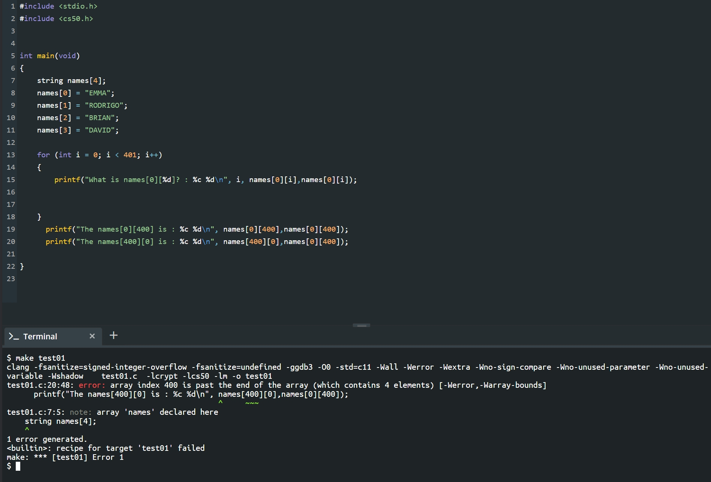
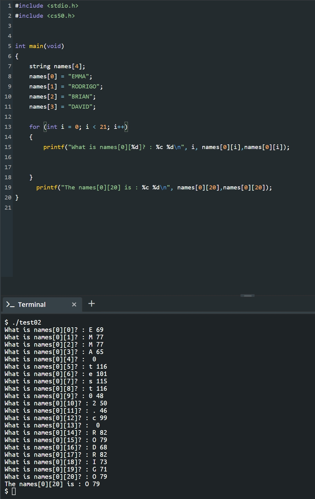

# 배열

> 1. 컴파일링
> 2. 디버깅
> 3. 코드의 디자인
> 4. 배열(1)
> 5. 배열(2)
> 6. 문자열과 배열
> 7. 문자열의 활용
> 8. 명령행 인자

# 1. 컴파일링

처음 코드로 한번 돌아가보자

```c
#include <stdio.h>

int main(void)
{
    printf("hello, world");
}
```

`<stdio.h>`는 헤더파일이다. 라이브러리 비슷한 방식으로 생각해도 괜찮다. 필요한 함수가 저기 있는 것이기 때문이다. 즉, 필요한 라이브러리를 만들거나 받아서 `stdio.h`처럼 가져올 수가 있다.

우리는 이것을 `make file`이나 `clang file` 이런식으로 해서 실행시키는데 다음과 같은 순서로 진행되는 것이다.

1. 전처리
   - `#include` 이부분의 c소스 코드는 전처리기에서 실질적인 컴파일이 이루어지기 전에 무언가를 실행하라고 알려주는 것이다.
2. 컴파일링
   - c코드를 어셈블리어라는 저수준 프로그래밍 언어로 컴파일 해줌
3. 어셈블링
   - 어셈블리 ㅋ코드를 오브젝트 코드로 변환시켜주는 작업(1,0)
4. 링킹
   - 여러개의 파일 (위의 코드 같은 경우는 stdio.h와 내 코드)로 이루어져 있는 것을 하나의 오브젝트 파일로 합치는 단계

이 전체를 통틀어서 컴파일링이라고 한다

# 2. 디버깅

프로그래밍은 언제나 디버그를 하기 마련이다. 하지만 그냥 디버그를 하는 것은 언제나 어렵고 복잡하기 많은 언어가 조금이라도 쉽게 디버깅을 할 수 있도록 준비해둔 것들이 많다

cs50은 이것을 돕기 위해 `help50`과 `debug50`을 만들었다.

# 3. 코드의 디자인

**고무 오리**

때로는 코드에 포함된 오류를 해결할 때 앞서 소개한 help50, debug50, check50과 같은 프로그램들이 존재하지 않거나, 있다 하더라도 디버깅에 큰 도움이 안 될 수 도 있습니다.

이 때는 먼저 한숨 돌리고 직접 곰곰히 생각해보는 수 밖에 없습니다.

한가지 유명한 방법으로 **‘고무 오리’**와 같이 무언가 대상이 되는 물체를 앞에 두고, 내가 작성한 코드를 한 줄 한 줄 말로 설명해주는 과정을 거쳐볼 수 있습니다.

이를 통해 미처 놓치고 있었던 논리적 오류를 찾아낼 수도 있습니다.

# 4. 배열(1)

시작하기에 앞서서 메모리에 대한 이야기를 하고 넘어가자. C에는 아래와 같은 여러 자료형이 있고, 각각의 자료형은 서로 다른 크기의 메모리를 차지합니다.

- bool: 불리언, 1바이트
- char: 문자, 1바이트
- int: 정수, 4바이트
- float: 실수, 4바이트
- long: (더 큰) 정수, 8바이트
- double: (더 큰) 실수, 8바이트
- string: 문자열, ?바이트

c에서 배열을 선언하는 것은 크게 어렵지 않다

```c
#include <cs50.h>
#include <stdio.h>

int main(void)
{
    // Scores
    int scores[3];
    scores[0] = 72;
    scores[1] = 73;
    scores[2] = 33;

    // Print average
    printf("Average: %i\n", (scores[0] + scores[1] + scores[2]) / 3);
}
```

# 5. 배열(2)

위 코드는 문제가 있다. 일단 크기가 고정되어있고 입력되는 값이 하드코딩이 되어있다는 것이다. 그리고 배열의 크기를 정한 3과 평균을 구할 때 3이 같은 3인지 인지도 못할 것이고 문제가 많다! 우리는 동적인 것이 필요할 것이다.

```c
#include <cs50.h>
#include <stdio.h>

float average(int length, int array[]);

int main(void)
{
    // 사용자로부터 점수의 갯수 입력
    int n = get_int("Scores:  ");

    // 점수 배열 선언 및 사용자로부터 값 입력
    int scores[n];
    for (int i = 0; i < n; i++)
    {
        scores[i] = get_int("Score %i: ", i + 1);
    }

    // 평균 출력
    printf("Average: %.1f\n", average(n, scores));
}

//평균을 계산하는 함수
float average(int length, int array[])
{
    int sum = 0;
    for (int i = 0; i < length; i++)
    {
        sum += array[i];
    }
    return (float) sum / (float) length;
}
```

동적인 면을 생각한다면 위와 같은 코드가 정답일 것이다.

# 6. 문자열과 배열

문자열은 약간 배열과 비슷하게 행동을 하긴 한다. 즉 문자열은 최소한 문자열의 길이만큼 메모리를 바이트로 차지한다. 그런데 구분을 위해서 바이트를 하나 더 가져가서 문자열은 문자열길이+1바이트만큼 가져간다. 그리고 추가된 1바이트에는 `\0`가 들어간다


그리고 아래와 같이 접근이 가능하다

```c
string names[4];

names[0] = "EMMA";
names[1] = "RODRIGO";
names[2] = "BRIAN";
names[3] = "DAVID";

printf("%s\n", names[0]);
printf("%c%c%c%c\n", names[0][0], names[0][1], names[0][2], names[0][3]);
```

여기서 `names[0][4]`를 print할려고 하면 0이 나온다 저기서 보듯이 그렇다. 그렇다면 400은? 이상한 숫자가 나온다! 이것은 무엇인가? 바로 메모리에 할당되어 있는 것이다. 데이터의 구조를 크게 본다면 우리는 지금 `names`라는 배열을 이용한다. 그런데 컴퓨터 전체적인 메모리는 다음과 같다고도 할 수 있다.` L = [x,x,x,x,x,{names[0],names[1],names[2],names[3]},x,x,x.......]` 즉, 우리가 `names[0][400]`를 말하면 `names[0]`위치에서 시작하여 거기서부터 400을 찾아간다는 소리가 된다! 자세한 설명은 아래와 같다!

1. 배열 L에 (강의를 잘 보셨으면 눈치 채셨겠지만 배열 L은 메모리 입니다.) 4개의 인덱스를 갖는(크기가 4인) 배열 names[4]를 저장한다. L = [x,x,x,x,x,{names[0],names[1],names[2],names[3]},x,x,x.......] (중괄호 친 부분이 4짜리 names배열)
2. 4개의 인덱스에 각각 EMMA,RODRIGO,BRIAN,DAVID를 저장한다. L = [x,x,x,x,x,{E,M,M,A,\0,R,O,D,R,I,G,O,\0,B,R,I,A,N,\0,D,A,V,I,D,\0},x,x,x......]

3. names 배열은 값이 4개인 배열이기 때문에이 안에서는 자유로운 호출이 가능하다. 
   names[2] (names 배열에서 3번째 값) = BRIAN  names[4] (names 배열에서 5번째 값) = 없음

4. 하지만 우리는 변수의 '길이(크기)'를 지정해 주지 않았다. 그래서 names`[0][y]` 값이 문자열 EMMA 의 길이보다 길어도 컴파일러는 오류인지 검사를 하지 않는다. 그래서 names[0][y]는 names[0][0]에서부터 y만큼 떨어진 위치의 메모리 값을 반환한다. (names[x]는 크기가 고정되어 있지 않은 변수입니다. 그래서 컴파일러는 names[x][y]에서 names[x] 저장된 값의 길이를 무시하고 y값 만큼 떨어져 있는 메모리 값을 반환합니다.) 

그림으로는 다음과 같이 보이는 것이 확인이 가능하다.






# 7. 문자열의 활용

c에도 문자열의 길이를 체크하는 것이 있다. `<string.h>`에서 한번 찾아오긴 해야한다

```c
#include <cs50.h>
#include <stdio.h>
#include <string.h>

int main(void)
{
    string s = get_string("Input: ");
    printf("Output:\n");
    for (int i = 0, n = strlen(s); i < n; i++)
    {
        printf("%c\n", s[i]);
    }
}
```

uppercase로 만드는 함수도 당연히 존재

```c
#include <cs50.h>
#include <ctype.h>
#include <stdio.h>
#include <string.h>

int main(void)
{
    string s = get_string("Before: ");
    printf("After:  ");
    for (int i = 0, n = strlen(s); i < n; i++)
    {
        printf("%c", toupper(s[i]));
    }
    printf("\n");
}
```

# 8. 명령행 인자

main에 보통 void를 넣지만 사실 값을 넣을 수 있다. 그리고 어느쪽이 유용할 지는 프로그램마다 다르다

```c
#include <cs50.h>
#include <stdio.h>

int main(int argc, string argv[])
{
    if (argc == 2)
    {
        printf("hello, %s\n", argv[1]);
    }
    else
    {
        printf("hello, world\n");
    }
}
```